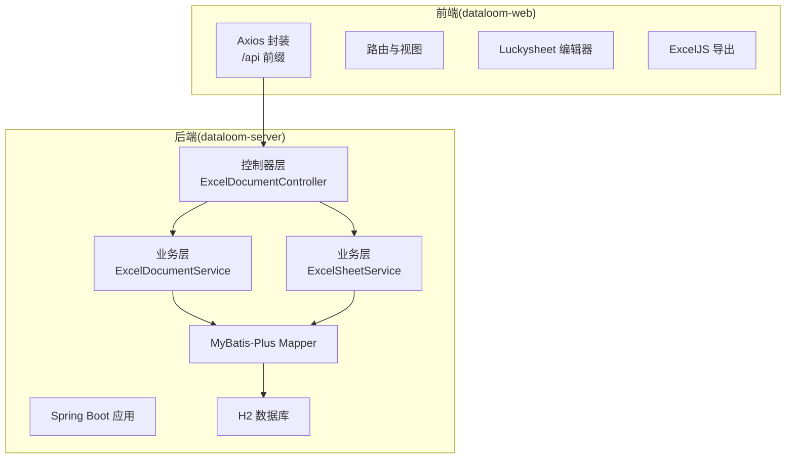
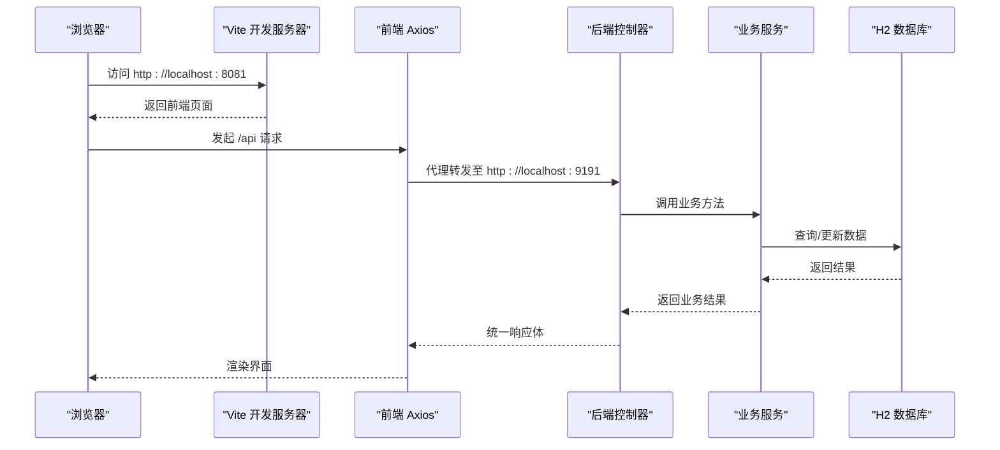
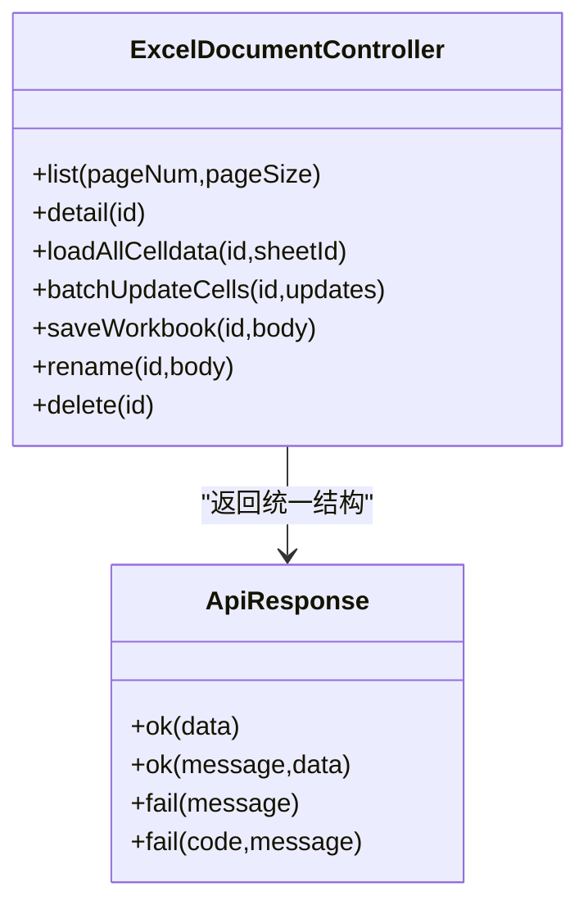
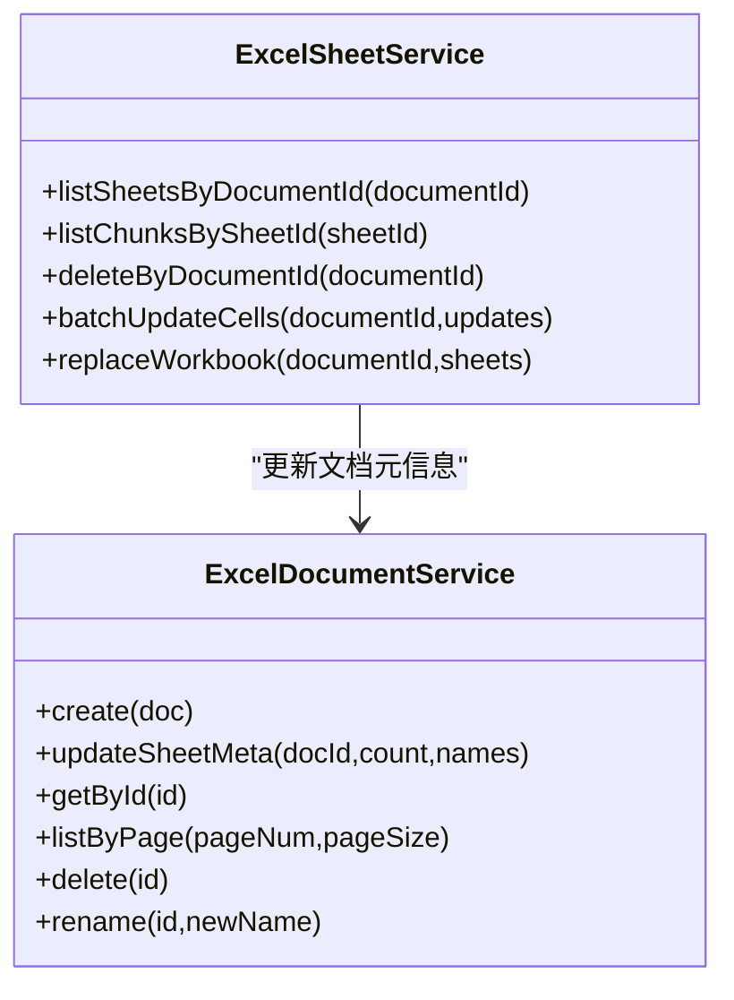
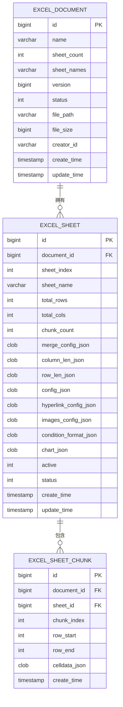
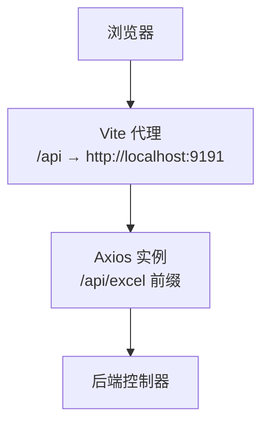
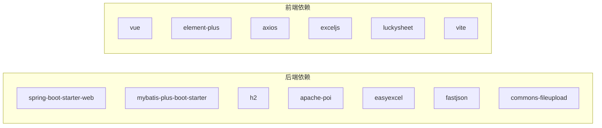
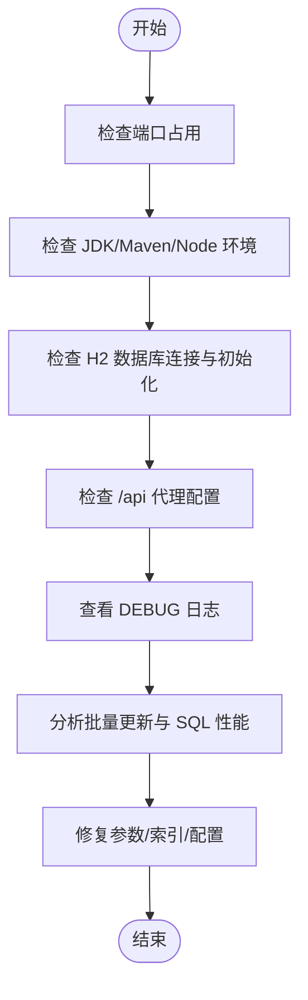

# 调试与问题排查

<cite>
**本文引用的文件**
- [ExcelServiceApplication.java](file://dataloom-server/src/main/java/com/demo/excel/ExcelServiceApplication.java)
- [application.yml](file://dataloom-server/src/main/resources/application.yml)
- [ExcelDocumentController.java](file://dataloom-server/src/main/java/com/demo/excel/controller/ExcelDocumentController.java)
- [ExcelDocumentService.java](file://dataloom-server/src/main/java/com/demo/excel/service/ExcelDocumentService.java)
- [ExcelSheetService.java](file://dataloom-server/src/main/java/com/demo/excel/service/ExcelSheetService.java)
- [ApiResponse.java](file://dataloom-server/src/main/java/com/demo/excel/common/ApiResponse.java)
- [schema.sql](file://dataloom-server/src/main/resources/schema.sql)
- [CorsConfig.java](file://dataloom-server/src/main/java/com/demo/excel/config/CorsConfig.java)
- [pom.xml](file://dataloom-server/pom.xml)
- [package.json](file://dataloom-web/package.json)
- [vite.config.js](file://dataloom-web/vite.config.js)
- [excel.js](file://dataloom-web/src/api/excel.js)
- [docker-compose.yml](file://deplay/docker-compose.yml)
- [README.md](file://README.md)
- [ExcelSheetServiceTest.java](file://dataloom-server/src/test/java/com/demo/excel/service/ExcelSheetServiceTest.java)
</cite>

## 目录
1. [简介](#简介)
2. [项目结构](#项目结构)
3. [核心组件](#核心组件)
4. [架构总览](#架构总览)
5. [详细组件分析](#详细组件分析)
6. [依赖分析](#依赖分析)
7. [性能考虑](#性能考虑)
8. [故障排查指南](#故障排查指南)
9. [结论](#结论)
10. [附录](#附录)

## 简介
本指南面向 DataLoom 项目的开发者与运维人员，聚焦于开发调试技巧、日志系统配置与使用、常见问题诊断（启动失败、数据库连接、API 异常、前端页面加载）、性能问题排查（内存、数据库查询、网络请求）以及生产环境处理流程（错误监控、告警、定位与修复）。同时提供开发工具使用建议（Postman、浏览器开发者工具、数据库客户端）。

## 项目结构
DataLoom 采用前后端分离架构：
- 后端：Spring Boot + MyBatis-Plus，提供 REST API，内置 H2 数据库（开发环境），支持文件上传与 Excel 解析。
- 前端：Vue 3 + Vite，通过 Axios 访问后端 /api 前缀接口，使用 Luckysheet 作为在线编辑器，ExcelJS 导出。

**图表来源**
- [ExcelDocumentController.java:1-296](file://dataloom-server/src/main/java/com/demo/excel/controller/ExcelDocumentController.java#L1-L296)
- [ExcelDocumentService.java:1-119](file://dataloom-server/src/main/java/com/demo/excel/service/ExcelDocumentService.java#L1-L119)
- [ExcelSheetService.java:1-443](file://dataloom-server/src/main/java/com/demo/excel/service/ExcelSheetService.java#L1-L443)
- [vite.config.js:1-26](file://dataloom-web/vite.config.js#L1-L26)
- [excel.js:1-79](file://dataloom-web/src/api/excel.js#L1-L79)

**章节来源**
- [README.md:217-242](file://README.md#L217-L242)
- [pom.xml:1-127](file://dataloom-server/pom.xml#L1-L127)
- [package.json:1-27](file://dataloom-web/package.json#L1-L27)

## 核心组件
- 启动类：负责应用引导与包扫描。
- 配置文件：端口、数据源、MyBatis-Plus、日志级别、文件上传大小、SQL 初始化等。
- 控制器：统一返回体封装、日志记录、业务编排。
- 服务层：文档与分块的读写、事务控制、批量更新策略。
- 前端 API 封装：Axios 实例、超时、进度回调、接口映射。
- CORS 配置：开发阶段允许跨域访问。

**章节来源**
- [ExcelServiceApplication.java:1-21](file://dataloom-server/src/main/java/com/demo/excel/ExcelServiceApplication.java#L1-L21)
- [application.yml:1-51](file://dataloom-server/src/main/resources/application.yml#L1-L51)
- [ApiResponse.java:1-52](file://dataloom-server/src/main/java/com/demo/excel/common/ApiResponse.java#L1-L52)
- [CorsConfig.java:1-22](file://dataloom-server/src/main/java/com/demo/excel/config/CorsConfig.java#L1-L22)
- [vite.config.js:1-26](file://dataloom-web/vite.config.js#L1-L26)
- [excel.js:1-79](file://dataloom-web/src/api/excel.js#L1-L79)

## 架构总览
后端以控制器为中心，向上承接前端请求，向下驱动服务层与数据库。MyBatis-Plus 提供 ORM 能力，H2 作为开发数据库，支持 SQL 初始化与 H2 控制台。

**图表来源**
- [vite.config.js:12-21](file://dataloom-web/vite.config.js#L12-L21)
- [excel.js:1-79](file://dataloom-web/src/api/excel.js#L1-L79)
- [ExcelDocumentController.java:1-296](file://dataloom-server/src/main/java/com/demo/excel/controller/ExcelDocumentController.java#L1-L296)
- [ExcelSheetService.java:1-443](file://dataloom-server/src/main/java/com/demo/excel/service/ExcelSheetService.java#L1-L443)
- [schema.sql:1-124](file://dataloom-server/src/main/resources/schema.sql#L1-L124)

## 详细组件分析

### 控制器层（ExcelDocumentController）
- 职责：提供文档列表、详情、全量加载、批量更新、全量快照保存、重命名、删除等接口。
- 日志：关键操作记录 INFO/WARN/ERROR，便于问题定位。
- 统一返回体： ApiResponse 统一 code/success/message/data 结构。

**图表来源**
- [ExcelDocumentController.java:1-296](file://dataloom-server/src/main/java/com/demo/excel/controller/ExcelDocumentController.java#L1-L296)
- [ApiResponse.java:1-52](file://dataloom-server/src/main/java/com/demo/excel/common/ApiResponse.java#L1-L52)

**章节来源**
- [ExcelDocumentController.java:1-296](file://dataloom-server/src/main/java/com/demo/excel/controller/ExcelDocumentController.java#L1-L296)
- [ApiResponse.java:1-52](file://dataloom-server/src/main/java/com/demo/excel/common/ApiResponse.java#L1-L52)

### 服务层（ExcelDocumentService / ExcelSheetService）
- ExcelDocumentService：文档创建、分页查询、软删除（含物理文件清理）、重命名。
- ExcelSheetService：按文档查询 Sheet、按 Sheet 查询分块、删除级联、批量增量更新、全量替换工作簿（事务保护）。

**图表来源**
- [ExcelDocumentService.java:1-119](file://dataloom-server/src/main/java/com/demo/excel/service/ExcelDocumentService.java#L1-L119)
- [ExcelSheetService.java:1-443](file://dataloom-server/src/main/java/com/demo/excel/service/ExcelSheetService.java#L1-L443)

**章节来源**
- [ExcelDocumentService.java:1-119](file://dataloom-server/src/main/java/com/demo/excel/service/ExcelDocumentService.java#L1-L119)
- [ExcelSheetService.java:1-443](file://dataloom-server/src/main/java/com/demo/excel/service/ExcelSheetService.java#L1-L443)

### 数据模型与建表
- 表结构：excel_document（文档元数据）、excel_sheet（Sheet 元信息）、excel_sheet_chunk（分块数据）。
- 关系：文档 → 多个 Sheet；Sheet → 多个 Chunk；Chunk 存储 celldata_json。

**图表来源**
- [schema.sql:1-124](file://dataloom-server/src/main/resources/schema.sql#L1-L124)

**章节来源**
- [schema.sql:1-124](file://dataloom-server/src/main/resources/schema.sql#L1-L124)

### 前端 API 与代理
- Axios 实例：baseURL 为 /api/excel，超时 300000ms。
- Vite 代理：将 /api 代理到后端 9191 端口，避免跨域。
- 接口映射：上传、文档查询、数据加载、批量更新、全量保存、重命名、删除。

**图表来源**
- [vite.config.js:12-21](file://dataloom-web/vite.config.js#L12-L21)
- [excel.js:1-79](file://dataloom-web/src/api/excel.js#L1-L79)

**章节来源**
- [vite.config.js:1-26](file://dataloom-web/vite.config.js#L1-L26)
- [excel.js:1-79](file://dataloom-web/src/api/excel.js#L1-L79)

## 依赖分析
- 后端依赖：Spring Boot Web、MyBatis-Plus、H2、POI、EasyExcel、FastJSON、文件上传、测试。
- 前端依赖：Vue 3、Element Plus、Axios、ExcelJS、Luckysheet、Vite。
- 配置耦合：后端 application.yml 控制数据源、SQL 初始化、日志级别；前端 vite.config.js 控制代理与端口。

**图表来源**
- [pom.xml:32-106](file://dataloom-server/pom.xml#L32-L106)
- [package.json:12-26](file://dataloom-web/package.json#L12-L26)

**章节来源**
- [pom.xml:1-127](file://dataloom-server/pom.xml#L1-L127)
- [package.json:1-27](file://dataloom-web/package.json#L1-L27)

## 性能考虑
- 分块存储：每块约 1000 行，降低单次查询与写入体积，提升并发与稳定性。
- 批量更新：按 Chunk 分组，减少数据库 I/O，原地更新/延迟删除索引，避免频繁重建。
- 查询优化：按需加载（Sheet 元信息 + 指定分块），避免一次性拉取全量 celldata。
- 日志与监控：开启 DEBUG 级别日志，结合 H2 控制台观察 SQL 执行；必要时引入 APM（如 Micrometer + Prometheus/Grafana）进行指标采集。

**章节来源**
- [ExcelSheetService.java:94-212](file://dataloom-server/src/main/java/com/demo/excel/service/ExcelSheetService.java#L94-L212)
- [application.yml:47-51](file://dataloom-server/src/main/resources/application.yml#L47-L51)

## 故障排查指南

### 开发调试技巧
- 断点调试：在控制器、服务层关键节点设置断点，观察参数、中间结果与异常堆栈。
- 日志分析：根据控制器中的日志记录，定位请求进入、业务处理、异常抛出环节。
- 性能分析：使用 IDE Profiler 或 JVM 参数（-XX:+PrintGCDetails）观察 GC 与内存；关注批量更新时的 JSON 解析与数组操作。
- 前端调试：浏览器开发者工具 Network 面板观察 /api 请求耗时、状态码与响应体；Console 查看错误信息。

**章节来源**
- [ExcelDocumentController.java:1-296](file://dataloom-server/src/main/java/com/demo/excel/controller/ExcelDocumentController.java#L1-L296)
- [application.yml:47-51](file://dataloom-server/src/main/resources/application.yml#L47-L51)

### 启动失败
- 端口冲突：确认 server.port 未被占用；若冲突，修改 application.yml 中的端口号。
- 依赖缺失：确保 JDK 8+、Maven、Node.js 18+ 环境正确；后端使用 spring-boot:run 启动。
- 数据库初始化：确认 SQL 初始化配置与 schema.sql 正确；H2 控制台地址可在配置中找到。

**章节来源**
- [application.yml:1-51](file://dataloom-server/src/main/resources/application.yml#L1-L51)
- [README.md:160-187](file://README.md#L160-L187)

### 数据库连接问题
- H2 驱动与 URL：确认 driver-class-name 与 jdbc:h2:file:./data/excel-demo；首次启动会自动建库。
- H2 控制台：访问 /h2-console，验证连接与表结构。
- 生产迁移：如需切换 MySQL，参考注释依赖与 application.yml 中的 datasource 配置。

**章节来源**
- [application.yml:8-17](file://dataloom-server/src/main/resources/application.yml#L8-L17)
- [schema.sql:1-124](file://dataloom-server/src/main/resources/schema.sql#L1-L124)
- [pom.xml:52-59](file://dataloom-server/pom.xml#L52-L59)

### API 接口异常
- 统一返回体：检查 ApiResponse 的 code/success/message/data，定位业务失败原因。
- 控制器日志：关注 WARN/ERROR 级别的日志，如解析分块失败、批量更新失败等。
- 参数校验：如重命名接口对名称非空的校验；全量保存接口对 sheets 类型的校验。

**章节来源**
- [ApiResponse.java:1-52](file://dataloom-server/src/main/java/com/demo/excel/common/ApiResponse.java#L1-L52)
- [ExcelDocumentController.java:1-296](file://dataloom-server/src/main/java/com/demo/excel/controller/ExcelDocumentController.java#L1-L296)

### 前端页面加载问题
- 代理配置：确认 Vite 代理将 /api 指向后端 9191 端口。
- 跨域：开发阶段 CORS 允许所有来源；生产需按域名白名单配置。
- Axios 超时：默认 300000ms，针对大文件上传可适当调整。

**章节来源**
- [vite.config.js:12-21](file://dataloom-web/vite.config.js#L12-L21)
- [CorsConfig.java:1-22](file://dataloom-server/src/main/java/com/demo/excel/config/CorsConfig.java#L1-L22)
- [excel.js:1-79](file://dataloom-web/src/api/excel.js#L1-L79)

### 日志系统配置与使用
- 日志级别：application.yml 中设置 com.demo.excel 包为 DEBUG，便于跟踪业务链路。
- 日志输出：MyBatis-Plus 配置 StdOutImpl 输出 SQL，辅助定位慢查询与异常。
- 日志文件：默认控制台输出；生产环境建议接入文件输出与轮转（可通过 Spring Boot 日志配置扩展）。

**章节来源**
- [application.yml:47-51](file://dataloom-server/src/main/resources/application.yml#L47-L51)
- [pom.xml:39-44](file://dataloom-server/pom.xml#L39-L44)

### 性能问题排查
- 内存使用：关注批量更新时的 JSON 解析与数组扩容；必要时增加 JVM 堆大小。
- 数据库查询：利用 H2 控制台查看执行计划；对高频查询建立合适索引（如按 document_id、sheet_id、chunk_index）。
- 网络请求：前端 Network 面板观察 /api 请求耗时与重试；后端日志记录请求耗时与异常。

**章节来源**
- [ExcelSheetService.java:94-212](file://dataloom-server/src/main/java/com/demo/excel/service/ExcelSheetService.java#L94-L212)
- [schema.sql:55-66](file://dataloom-server/src/main/resources/schema.sql#L55-L66)

### 生产环境处理流程
- 错误监控：启用 ERROR/WARN 级别日志，结合集中式日志系统收集。
- 告警机制：基于日志与指标（CPU、内存、GC、数据库连接数）设置阈值告警。
- 问题定位：结合请求链路日志、数据库慢查询、前端错误上报进行交叉验证。
- 修复流程：小步快跑，灰度发布，回滚策略与备份恢复预案。

[本节为通用流程说明，不直接分析具体文件]

### 开发工具使用技巧
- Postman：导入接口集合，设置全局变量（基础 URL、认证），批量执行与测试。
- 浏览器开发者工具：Network 观察请求/响应，Console 查看前端错误，Sources 设置断点。
- 数据库客户端：H2 控制台或第三方客户端连接 JDBC URL，执行 SQL 验证数据一致性。

[本节为通用工具说明，不直接分析具体文件]

## 结论
通过统一的日志体系、清晰的控制器与服务层职责划分、合理的分块存储与批量更新策略，DataLoom 在开发与生产环境中均具备良好的可观测性与可维护性。建议在生产环境进一步完善日志轮转、指标监控与告警体系，并持续优化热点路径的数据库与网络性能。

## 附录

### 常见问题诊断流程图（后端）

**图表来源**
- [application.yml:1-51](file://dataloom-server/src/main/resources/application.yml#L1-L51)
- [vite.config.js:12-21](file://dataloom-web/vite.config.js#L12-L21)
- [ExcelSheetService.java:94-212](file://dataloom-server/src/main/java/com/demo/excel/service/ExcelSheetService.java#L94-L212)

### 单元测试要点（参考）
- 全量替换工作簿：验证删除旧数据、插入新 Sheet、分块保存、文档元信息更新。
- 断言点：Sheet 名称、行列数、分块数量、celldata 内容位置与值。

**章节来源**
- [ExcelSheetServiceTest.java:44-107](file://dataloom-server/src/test/java/com/demo/excel/service/ExcelSheetServiceTest.java#L44-L107)