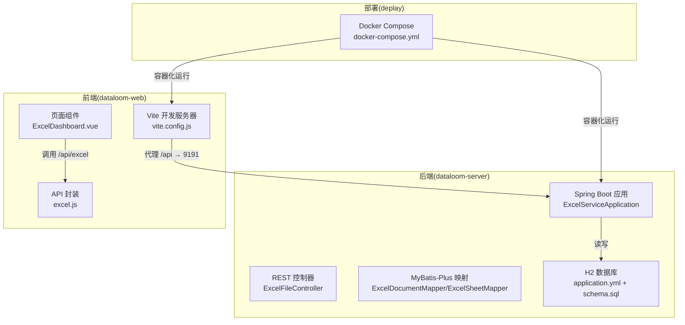
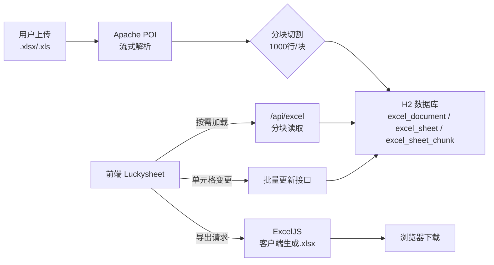
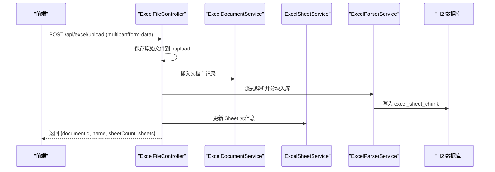
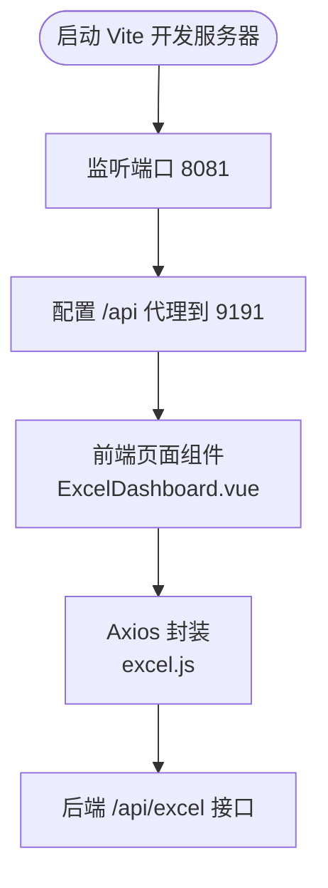
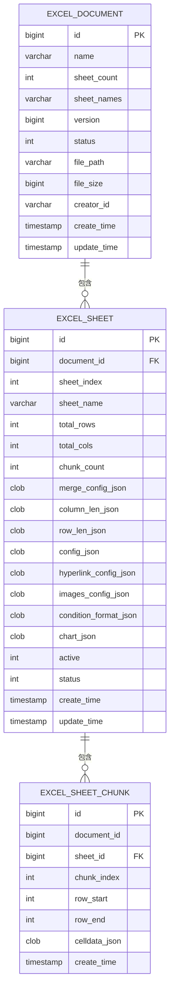
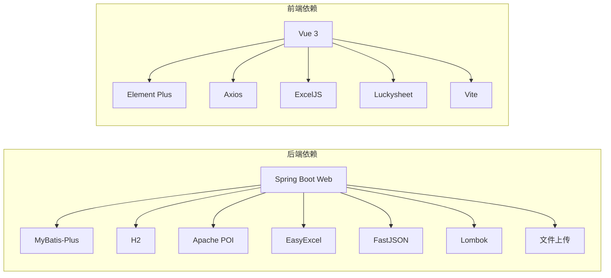

# 快速开始

<cite>
**本文引用的文件**
- [README.md](file://README.md)
- [application.yml](file://dataloom-server/src/main/resources/application.yml)
- [pom.xml](file://dataloom-server/pom.xml)
- [ExcelServiceApplication.java](file://dataloom-server/src/main/java/com/demo/excel/ExcelServiceApplication.java)
- [ExcelFileController.java](file://dataloom-server/src/main/java/com/demo/excel/controller/ExcelFileController.java)
- [CorsConfig.java](file://dataloom-server/src/main/java/com/demo/excel/config/CorsConfig.java)
- [schema.sql](file://dataloom-server/src/main/resources/schema.sql)
- [package.json](file://dataloom-web/package.json)
- [vite.config.js](file://dataloom-web/vite.config.js)
- [excel.js](file://dataloom-web/src/api/excel.js)
- [ExcelDashboard.vue](file://dataloom-web/src/views/ExcelDashboard.vue)
- [docker-compose.yml](file://deplay/docker-compose.yml)
</cite>

## 目录
1. [简介](#简介)
2. [项目结构](#项目结构)
3. [核心组件](#核心组件)
4. [架构概览](#架构概览)
5. [详细组件分析](#详细组件分析)
6. [依赖关系分析](#依赖关系分析)
7. [性能注意事项](#性能注意事项)
8. [故障排查指南](#故障排查指南)
9. [结论](#结论)
10. [附录](#附录)

## 简介
DataLoom 是一个从零构建的在线 Excel 协作系统，支持上传、解析、在线编辑与导出。后端采用 Spring Boot + MyBatis-Plus，前端采用 Vue 3 + Vite + Element Plus + Luckysheet。项目通过“分块存储”（每 1000 行为一个数据块）实现对十万级数据的高效处理，同时保持数据库结构简洁、索引有效。

## 项目结构
项目采用前后端分离架构：
- 后端模块：dataloom-server（Spring Boot）
- 前端模块：dataloom-web（Vue 3 + Vite）
- 部署：deplay（Docker Compose）



**图表来源**
- [ExcelServiceApplication.java:13-20](file://dataloom-server/src/main/java/com/demo/excel/ExcelServiceApplication.java#L13-L20)
- [ExcelFileController.java:35-37](file://dataloom-server/src/main/java/com/demo/excel/controller/ExcelFileController.java#L35-L37)
- [application.yml:1-51](file://dataloom-server/src/main/resources/application.yml#L1-L51)
- [schema.sql:1-124](file://dataloom-server/src/main/resources/schema.sql#L1-L124)
- [vite.config.js:12-21](file://dataloom-web/vite.config.js#L12-L21)
- [excel.js:3-6](file://dataloom-web/src/api/excel.js#L3-L6)
- [ExcelDashboard.vue:106-140](file://dataloom-web/src/views/ExcelDashboard.vue#L106-L140)
- [docker-compose.yml:1-34](file://deplay/docker-compose.yml#L1-L34)

**章节来源**
- [README.md:217-242](file://README.md#L217-L242)

## 核心组件
- 后端应用入口：负责启动 Spring Boot 应用并扫描 Mapper。
- REST 控制器：提供上传、文档管理、数据读写等接口。
- 数据库：H2 嵌入式数据库，默认文件路径为 ./data/excel-demo。
- 前端开发服务器：Vite 默认监听 8081 端口，通过代理将 /api 请求转发至后端 9191 端口。
- API 封装：统一前缀 /api/excel，封装上传、文档列表、数据加载与批量更新等方法。
- 页面组件：仪表盘负责上传、列表展示与路由跳转。

**章节来源**
- [ExcelServiceApplication.java:13-20](file://dataloom-server/src/main/java/com/demo/excel/ExcelServiceApplication.java#L13-L20)
- [ExcelFileController.java:35-37](file://dataloom-server/src/main/java/com/demo/excel/controller/ExcelFileController.java#L35-L37)
- [application.yml:1-51](file://dataloom-server/src/main/resources/application.yml#L1-L51)
- [vite.config.js:12-21](file://dataloom-web/vite.config.js#L12-L21)
- [excel.js:3-6](file://dataloom-web/src/api/excel.js#L3-L6)
- [ExcelDashboard.vue:106-140](file://dataloom-web/src/views/ExcelDashboard.vue#L106-L140)

## 架构概览
后端通过 Apache POI 流式解析 Excel，按 1000 行分块写入数据库；前端按需加载分块数据，编辑器使用 Luckysheet，导出由前端 ExcelJS 完成以保证样式零丢失。



**图表来源**
- [README.md:92-106](file://README.md#L92-L106)
- [schema.sql:8-66](file://dataloom-server/src/main/resources/schema.sql#L8-L66)
- [ExcelFileController.java:57-116](file://dataloom-server/src/main/java/com/demo/excel/controller/ExcelFileController.java#L57-L116)
- [excel.js:47-64](file://dataloom-web/src/api/excel.js#L47-L64)

## 详细组件分析

### 后端服务（Spring Boot）
- 启动类：扫描 Mapper 包并启动应用。
- 配置文件：设置端口 9191、H2 数据库连接、文件上传大小限制、SQL 初始化脚本、MyBatis-Plus 配置与日志级别。
- 控制器：提供上传接口，保存原始文件、流式解析并分块入库，返回文档与 Sheet 元信息。
- CORS：开放 /api/** 跨域访问，便于前端开发调试。



**图表来源**
- [ExcelFileController.java:70-116](file://dataloom-server/src/main/java/com/demo/excel/controller/ExcelFileController.java#L70-L116)
- [application.yml:1-51](file://dataloom-server/src/main/resources/application.yml#L1-L51)
- [schema.sql:8-66](file://dataloom-server/src/main/resources/schema.sql#L8-L66)

**章节来源**
- [ExcelServiceApplication.java:13-20](file://dataloom-server/src/main/java/com/demo/excel/ExcelServiceApplication.java#L13-L20)
- [application.yml:1-51](file://dataloom-server/src/main/resources/application.yml#L1-L51)
- [ExcelFileController.java:35-116](file://dataloom-server/src/main/java/com/demo/excel/controller/ExcelFileController.java#L35-L116)
- [CorsConfig.java:10-21](file://dataloom-server/src/main/java/com/demo/excel/config/CorsConfig.java#L10-L21)

### 前端开发服务器（Vite）
- 开发端口：8081，host 绑定 0.0.0.0。
- API 代理：将 /api 前缀请求代理到 http://localhost:9191。
- 脚本命令：dev、build、preview。
- 页面组件：ExcelDashboard 负责上传、列表展示与路由跳转。



**图表来源**
- [vite.config.js:12-21](file://dataloom-web/vite.config.js#L12-L21)
- [package.json:7-11](file://dataloom-web/package.json#L7-L11)
- [excel.js:3-6](file://dataloom-web/src/api/excel.js#L3-L6)
- [ExcelDashboard.vue:106-140](file://dataloom-web/src/views/ExcelDashboard.vue#L106-L140)

**章节来源**
- [vite.config.js:12-21](file://dataloom-web/vite.config.js#L12-L21)
- [package.json:7-11](file://dataloom-web/package.json#L7-L11)
- [excel.js:3-6](file://dataloom-web/src/api/excel.js#L3-L6)
- [ExcelDashboard.vue:106-140](file://dataloom-web/src/views/ExcelDashboard.vue#L106-L140)

### 数据库与建表
- H2 数据库：文件模式，JDBC URL 指向 ./data/excel-demo。
- 初始化：启动时执行 schema.sql 建表。
- 表结构：excel_document（文档元数据）、excel_sheet（Sheet 元信息）、excel_sheet_chunk（分块数据）。



**图表来源**
- [schema.sql:8-66](file://dataloom-server/src/main/resources/schema.sql#L8-L66)

**章节来源**
- [application.yml:9-29](file://dataloom-server/src/main/resources/application.yml#L9-L29)
- [schema.sql:1-124](file://dataloom-server/src/main/resources/schema.sql#L1-L124)

## 依赖关系分析
- 后端依赖：Spring Boot Web、MyBatis-Plus、H2、Apache POI、EasyExcel、FastJSON、Lombok、文件上传组件。
- 前端依赖：Vue 3、Element Plus、Axios、ExcelJS、Luckysheet、Vite 插件。
- Docker Compose：分别构建后端与前端镜像，映射端口 9191（后端）与 80（前端容器），挂载数据与上传卷。



**图表来源**
- [pom.xml:32-106](file://dataloom-server/pom.xml#L32-L106)
- [package.json:12-25](file://dataloom-web/package.json#L12-L25)

**章节来源**
- [pom.xml:15-106](file://dataloom-server/pom.xml#L15-L106)
- [package.json:12-25](file://dataloom-web/package.json#L12-L25)
- [docker-compose.yml:1-34](file://deplay/docker-compose.yml#L1-L34)

## 性能注意事项
- 分块存储：每 1000 行为一个数据块，按需加载，降低内存占用与网络传输。
- 懒加载：前端仅在需要时请求对应分块，提升大文件打开速度。
- 导出优化：前端直接使用 ExcelJS 导出，避免后端序列化整表带来的性能损耗。
- 数据库索引：建议在生产环境切换 MySQL 时添加合适索引（如 idx_document_id、idx_sheet_id、idx_chunk_index）。

[本节为通用指导，无需列出具体文件来源]

## 故障排查指南
- 环境验证
  - JDK 8+：使用命令验证版本。
  - Maven 3.x：检查 Maven 版本。
  - Node.js 18+：检查 Node 版本。
- 后端端口冲突
  - 若 9191 端口被占用，可在 application.yml 中修改 server.port。
- 前端代理无效
  - 确认 Vite 代理配置指向 9191 端口，且后端已启动。
- 数据库初始化失败
  - 确认 schema.sql 路径正确，H2 文件权限可写。
- 上传文件过大
  - 调整 application.yml 中的 multipart 限制。
- CORS 问题
  - 确认 CORS 配置允许 /api/** 访问。
- Docker 运行
  - 使用 docker-compose 启动后端与前端容器，确认端口映射与卷挂载。

**章节来源**
- [README.md:134-147](file://README.md#L134-L147)
- [application.yml:1-51](file://dataloom-server/src/main/resources/application.yml#L1-L51)
- [vite.config.js:12-21](file://dataloom-web/vite.config.js#L12-L21)
- [CorsConfig.java:10-21](file://dataloom-server/src/main/java/com/demo/excel/config/CorsConfig.java#L10-L21)
- [docker-compose.yml:1-34](file://deplay/docker-compose.yml#L1-L34)

## 结论
通过上述步骤，您可以在本地快速搭建 DataLoom 的开发环境并体验核心功能：上传 Excel 文件、查看解析结果、进入在线编辑器进行协作编辑。项目采用分块存储与前端导出策略，能够稳定支撑十万级数据规模，适合中小团队的本地化协作需求。

[本节为总结性内容，无需列出具体文件来源]

## 附录

### 快速开始三步操作
1) 克隆仓库
```bash
git clone https://github.com/your-username/DataLoom.git
cd DataLoom
```
2) 启动后端
```bash
cd dataloom-server
mvn spring-boot:run
```
后端默认启动在 http://localhost:9191，首次运行会自动创建 H2 数据库文件。H2 控制台地址为 http://localhost:9191/h2-console。
3) 启动前端
```bash
cd dataloom-web
npm install
npm run dev
```
前端默认启动在 http://localhost:8081，Vite 开发服务器会将 /api 请求代理到后端 9191 端口。

**章节来源**
- [README.md:149-186](file://README.md#L149-L186)

### 首次使用操作示例
- 打开浏览器访问 http://localhost:8081。
- 点击“上传 Excel”，选择 .xlsx 或 .xls 文件。
- 上传成功后，页面会显示解析出的文档与 Sheet 列表。
- 点击“编辑”进入在线编辑器，进行单元格编辑与导出。

**章节来源**
- [ExcelDashboard.vue:142-172](file://dataloom-web/src/views/ExcelDashboard.vue#L142-L172)
- [excel.js:12-25](file://dataloom-web/src/api/excel.js#L12-L25)

### API 参考（部分）
- 上传 Excel 文件：POST /api/excel/upload（multipart/form-data）
- 文档列表：GET /api/excel/document/list
- 文档详情：GET /api/excel/document/{id}
- Sheet 全量 celldata：GET /api/excel/document/{id}/sheet/{sheetId}/all
- 批量更新单元格：PUT /api/excel/document/{id}/cells/batch

**章节来源**
- [README.md:190-215](file://README.md#L190-L215)
- [ExcelFileController.java:70-116](file://dataloom-server/src/main/java/com/demo/excel/controller/ExcelFileController.java#L70-L116)
- [excel.js:31-64](file://dataloom-web/src/api/excel.js#L31-L64)