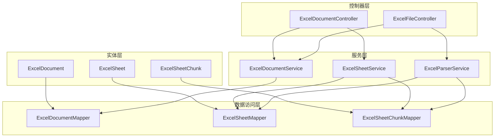
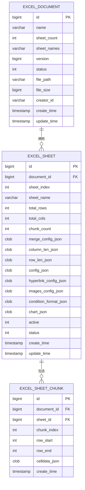
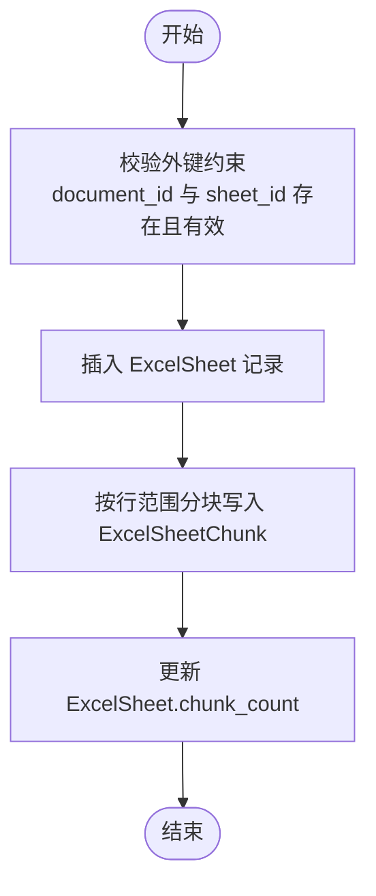
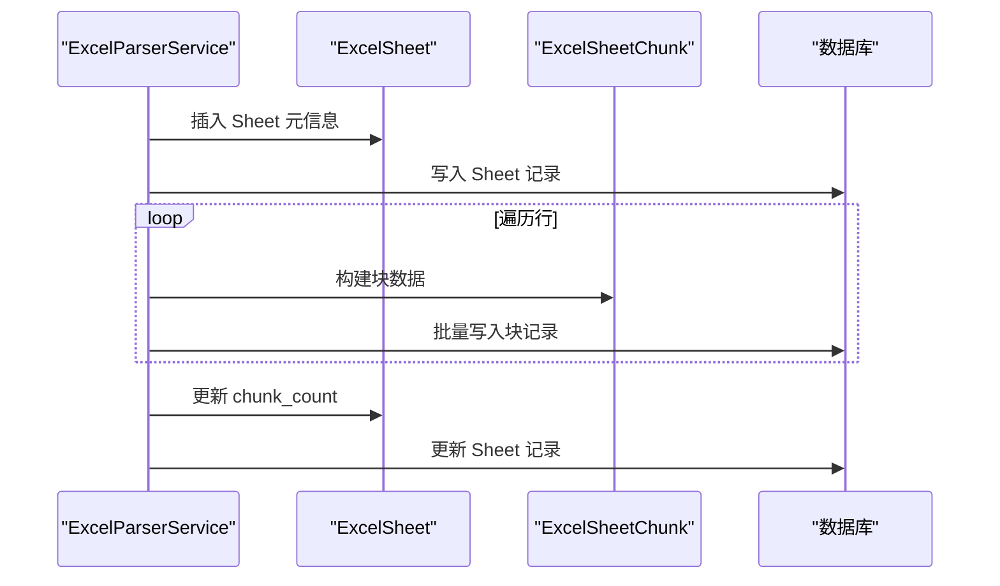
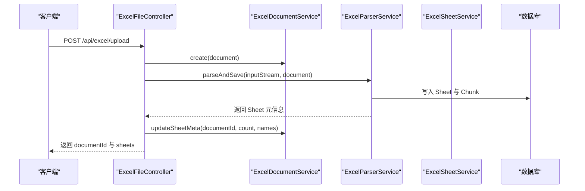

# 关系映射与约束

<cite>
**本文引用的文件**
- [ExcelDocument.java](file://dataloom-server/src/main/java/com/demo/excel/entity/ExcelDocument.java)
- [ExcelSheet.java](file://dataloom-server/src/main/java/com/demo/excel/entity/ExcelSheet.java)
- [ExcelSheetChunk.java](file://dataloom-server/src/main/java/com/demo/excel/entity/ExcelSheetChunk.java)
- [schema.sql](file://dataloom-server/src/main/resources/schema.sql)
- [ExcelDocumentService.java](file://dataloom-server/src/main/java/com/demo/excel/service/ExcelDocumentService.java)
- [ExcelSheetService.java](file://dataloom-server/src/main/java/com/demo/excel/service/ExcelSheetService.java)
- [ExcelParserService.java](file://dataloom-server/src/main/java/com/demo/excel/service/ExcelParserService.java)
- [ExcelDocumentController.java](file://dataloom-server/src/main/java/com/demo/excel/controller/ExcelDocumentController.java)
- [ExcelFileController.java](file://dataloom-server/src/main/java/com/demo/excel/controller/ExcelFileController.java)
- [application.yml](file://dataloom-server/src/main/resources/application.yml)
</cite>

## 目录
1. [简介](#简介)
2. [项目结构](#项目结构)
3. [核心组件](#核心组件)
4. [架构总览](#架构总览)
5. [详细组件分析](#详细组件分析)
6. [依赖分析](#依赖分析)
7. [性能考量](#性能考量)
8. [故障排查指南](#故障排查指南)
9. [结论](#结论)
10. [附录](#附录)

## 简介
本文件聚焦于数据库关系映射与约束设计，围绕三张核心表（excel_document、excel_sheet、excel_sheet_chunk）的关系与约束展开，重点解释：
- 一对一与一对多关系的实现方式
- 分块存储的数据模型如何通过外键关联实现
- document_id 与 sheet_id 的冗余设计目的
- 索引策略的设计考虑（主键、外键、复合索引）
- 数据库约束（唯一性、非空、检查等）的实现
- 提供关系图与 ER 图，帮助开发者理解整体架构

## 项目结构
该项目采用分层架构，后端基于 Spring Boot + MyBatis-Plus，数据库采用 H2（演示）或 MySQL（生产）。核心实体与数据访问层如下：
- 实体层：ExcelDocument、ExcelSheet、ExcelSheetChunk
- Mapper 层：ExcelDocumentMapper、ExcelSheetMapper、ExcelSheetChunkMapper
- Service 层：ExcelDocumentService、ExcelSheetService、ExcelParserService
- 控制器层：ExcelDocumentController、ExcelFileController
- 数据库脚本：schema.sql

**图表来源**
- [ExcelDocument.java:1-55](file://dataloom-server/src/main/java/com/demo/excel/entity/ExcelDocument.java#L1-L55)
- [ExcelSheet.java:1-77](file://dataloom-server/src/main/java/com/demo/excel/entity/ExcelSheet.java#L1-L77)
- [ExcelSheetChunk.java:1-53](file://dataloom-server/src/main/java/com/demo/excel/entity/ExcelSheetChunk.java#L1-L53)
- [ExcelDocumentService.java:1-119](file://dataloom-server/src/main/java/com/demo/excel/service/ExcelDocumentService.java#L1-L119)
- [ExcelSheetService.java:1-443](file://dataloom-server/src/main/java/com/demo/excel/service/ExcelSheetService.java#L1-L443)
- [ExcelParserService.java:1-348](file://dataloom-server/src/main/java/com/demo/excel/service/ExcelParserService.java#L1-L348)
- [ExcelDocumentController.java:1-296](file://dataloom-server/src/main/java/com/demo/excel/controller/ExcelDocumentController.java#L1-L296)
- [ExcelFileController.java:1-141](file://dataloom-server/src/main/java/com/demo/excel/controller/ExcelFileController.java#L1-L141)

**章节来源**
- [ExcelDocument.java:1-55](file://dataloom-server/src/main/java/com/demo/excel/entity/ExcelDocument.java#L1-L55)
- [ExcelSheet.java:1-77](file://dataloom-server/src/main/java/com/demo/excel/entity/ExcelSheet.java#L1-L77)
- [ExcelSheetChunk.java:1-53](file://dataloom-server/src/main/java/com/demo/excel/entity/ExcelSheetChunk.java#L1-L53)
- [schema.sql:1-124](file://dataloom-server/src/main/resources/schema.sql#L1-L124)

## 核心组件
- ExcelDocument：仅存元数据，不包含单元格数据；提供文档级 CRUD 与分页查询。
- ExcelSheet：描述一个文档中的 Sheet 元信息（含合并单元格、列宽、行高等配置），不直接存储单元格数据。
- ExcelSheetChunk：按行范围切片存储单元格数据，解决大规模数据单行过大问题。

这些实体通过 MyBatis-Plus 注解映射到数据库表，并在 Service 层通过 QueryWrapper 组合查询条件。

**章节来源**
- [ExcelDocument.java:8-14](file://dataloom-server/src/main/java/com/demo/excel/entity/ExcelDocument.java#L8-L14)
- [ExcelSheet.java:8-13](file://dataloom-server/src/main/java/com/demo/excel/entity/ExcelSheet.java#L8-L13)
- [ExcelSheetChunk.java:9-17](file://dataloom-server/src/main/java/com/demo/excel/entity/ExcelSheetChunk.java#L9-L17)

## 架构总览
三张表之间的关系为典型的“文档-工作表-分块”三层结构：
- 一对一：ExcelDocument 与 ExcelSheet（通过 document_id 关联）
- 一对多：ExcelSheet → ExcelSheetChunk（通过 sheet_id 关联）

**图表来源**
- [schema.sql:8-66](file://dataloom-server/src/main/resources/schema.sql#L8-L66)
- [ExcelDocument.java:19-52](file://dataloom-server/src/main/java/com/demo/excel/entity/ExcelDocument.java#L19-L52)
- [ExcelSheet.java:18-74](file://dataloom-server/src/main/java/com/demo/excel/entity/ExcelSheet.java#L18-L74)
- [ExcelSheetChunk.java:22-51](file://dataloom-server/src/main/java/com/demo/excel/entity/ExcelSheetChunk.java#L22-L51)

## 详细组件分析

### 关系映射与约束设计
- 外键关系
  - excel_sheet.document_id → excel_document.id（一对多）
  - excel_sheet_chunk.sheet_id → excel_sheet.id（一对多）
  - excel_sheet_chunk.document_id → excel_document.id（冗余字段，便于按文档删除）
- 约束与默认值
  - 主键：三表均使用自增主键
  - 非空：excel_document.name、excel_sheet.sheet_name、excel_sheet_chunk.celldata_json 等字段在建表脚本中体现非空或默认值
  - 默认值：版本号、状态、计数等字段均有合理默认值
  - 乐观锁：excel_document.version 使用注解进行乐观锁控制
- 索引策略
  - 主键索引：三表主键自动建立
  - 外键索引：MySQL 版脚本中为 excel_sheet.document_id、excel_sheet_chunk.sheet_id、excel_sheet_chunk.document_id 建立索引
  - 复合索引：excel_sheet_chunk 上为 (sheet_id, chunk_index) 建立复合索引，用于按块快速定位
- 冗余设计
  - excel_sheet_chunk.document_id 冗余字段：便于按文档维度进行级联删除与查询，避免跨表 JOIN
  - excel_sheet.chunk_count：缓存分块数量，减少统计查询成本

**图表来源**
- [ExcelParserService.java:142-200](file://dataloom-server/src/main/java/com/demo/excel/service/ExcelParserService.java#L142-L200)
- [ExcelSheetService.java:318-346](file://dataloom-server/src/main/java/com/demo/excel/service/ExcelSheetService.java#L318-L346)

**章节来源**
- [schema.sql:8-66](file://dataloom-server/src/main/resources/schema.sql#L8-L66)
- [ExcelDocument.java:32-34](file://dataloom-server/src/main/java/com/demo/excel/entity/ExcelDocument.java#L32-L34)
- [ExcelSheet.java:37-38](file://dataloom-server/src/main/java/com/demo/excel/entity/ExcelSheet.java#L37-L38)
- [ExcelSheetChunk.java:26-27](file://dataloom-server/src/main/java/com/demo/excel/entity/ExcelSheetChunk.java#L26-L27)

### 分块存储的数据模型与外键关联
- 分块策略
  - 每块约 1000 行，通过 row_start / row_end 标识块范围
  - chunk_index 由行号整除确定，确保与增量更新时的定位逻辑一致
- 外键关联
  - excel_sheet_chunk.sheet_id → excel_sheet.id，保证块归属唯一
  - excel_sheet_chunk.document_id 冗余，便于按文档删除与查询
- 读写流程
  - 解析阶段：POI 流式读取，按 chunkIndex 分组，批量写入
  - 增量更新：按 (sheetId_chunkIndex) 分组，逐块更新，避免全量重建
  - 全量替换：先删除旧块与软删除旧 Sheet，再重建

**图表来源**
- [ExcelParserService.java:66-87](file://dataloom-server/src/main/java/com/demo/excel/service/ExcelParserService.java#L66-L87)
- [ExcelParserService.java:142-200](file://dataloom-server/src/main/java/com/demo/excel/service/ExcelParserService.java#L142-L200)

**章节来源**
- [ExcelParserService.java:43-44](file://dataloom-server/src/main/java/com/demo/excel/service/ExcelParserService.java#L43-L44)
- [ExcelParserService.java:142-200](file://dataloom-server/src/main/java/com/demo/excel/service/ExcelParserService.java#L142-L200)
- [ExcelSheetService.java:103-212](file://dataloom-server/src/main/java/com/demo/excel/service/ExcelSheetService.java#L103-L212)

### 索引策略设计考虑
- 主键索引：三表主键自动建立，保证唯一性与快速定位
- 外键索引（MySQL 版）
  - excel_sheet(document_id)：加速按文档查询 Sheet
  - excel_sheet_chunk(sheet_id)：加速按 Sheet 查询块
  - excel_sheet_chunk(document_id)：加速按文档查询块
- 复合索引
  - excel_sheet_chunk(sheet_id, chunk_index)：按块快速定位，提升分块读取效率
- 选择与优化
  - 选择性：document_id 与 sheet_id 具备较高选择性，适合建立索引
  - 查询模式：按文档维度与按 Sheet 维度查询频繁，因此外键字段必须建立索引
  - 写入成本：索引会增加写入开销，但通过批量写入与分块策略降低影响

**章节来源**
- [schema.sql:87-123](file://dataloom-server/src/main/resources/schema.sql#L87-L123)

### 数据库约束实现
- 唯一性约束
  - 主键唯一：三表主键唯一，保证记录唯一
  - 业务层面：未显式声明唯一索引，可通过应用层保证业务唯一性（如文档名称、Sheet 名称等）
- 非空约束
  - 建表脚本中对关键字段设置 NOT NULL 或默认值，确保数据完整性
- 检查约束
  - 未使用显式 CHECK 约束；通过应用层校验与默认值保障数据有效性
- 乐观锁
  - excel_document.version 使用注解实现乐观锁，避免并发覆盖

**章节来源**
- [ExcelDocument.java:32-34](file://dataloom-server/src/main/java/com/demo/excel/entity/ExcelDocument.java#L32-L34)
- [schema.sql:10-19](file://dataloom-server/src/main/resources/schema.sql#L10-L19)
- [schema.sql:27-44](file://dataloom-server/src/main/resources/schema.sql#L27-L44)
- [schema.sql:59-65](file://dataloom-server/src/main/resources/schema.sql#L59-L65)

### 控制器与服务交互（读写流程）
- 上传流程
  - 保存原始文件 → 创建文档记录 → 流式解析并分块写入 → 更新文档元信息
- 读取流程
  - 获取文档详情 → 查询 Sheet 元信息 → 按需加载全量或分块数据
- 写入流程
  - 增量更新：按块分组，逐块更新
  - 全量替换：删除旧块与软删除旧 Sheet，重建新结构

**图表来源**
- [ExcelFileController.java:70-116](file://dataloom-server/src/main/java/com/demo/excel/controller/ExcelFileController.java#L70-L116)
- [ExcelDocumentService.java:31-53](file://dataloom-server/src/main/java/com/demo/excel/service/ExcelDocumentService.java#L31-L53)
- [ExcelParserService.java:66-87](file://dataloom-server/src/main/java/com/demo/excel/service/ExcelParserService.java#L66-L87)

**章节来源**
- [ExcelFileController.java:70-116](file://dataloom-server/src/main/java/com/demo/excel/controller/ExcelFileController.java#L70-L116)
- [ExcelDocumentController.java:176-226](file://dataloom-server/src/main/java/com/demo/excel/controller/ExcelDocumentController.java#L176-L226)
- [ExcelSheetService.java:103-212](file://dataloom-server/src/main/java/com/demo/excel/service/ExcelSheetService.java#L103-L212)

## 依赖分析
- 实体依赖：三实体之间无直接 Java 依赖，通过数据库外键约束实现关系
- Mapper 依赖：三个 Mapper 均继承 MyBatis-Plus 基础 CRUD 接口
- Service 依赖：ExcelSheetService 依赖 ExcelSheetMapper 与 ExcelSheetChunkMapper；ExcelParserService 依赖两者进行分块写入
- 控制器依赖：ExcelDocumentController 与 ExcelFileController 分别依赖对应 Service

**图表来源**
- [ExcelDocumentService.java:22-23](file://dataloom-server/src/main/java/com/demo/excel/service/ExcelDocumentService.java#L22-L23)
- [ExcelSheetService.java:36-43](file://dataloom-server/src/main/java/com/demo/excel/service/ExcelSheetService.java#L36-L43)
- [ExcelParserService.java:46-50](file://dataloom-server/src/main/java/com/demo/excel/service/ExcelParserService.java#L46-L50)
- [ExcelDocumentController.java:28-32](file://dataloom-server/src/main/java/com/demo/excel/controller/ExcelDocumentController.java#L28-L32)
- [ExcelFileController.java:41-48](file://dataloom-server/src/main/java/com/demo/excel/controller/ExcelFileController.java#L41-L48)

**章节来源**
- [ExcelDocumentService.java:1-119](file://dataloom-server/src/main/java/com/demo/excel/service/ExcelDocumentService.java#L1-L119)
- [ExcelSheetService.java:1-443](file://dataloom-server/src/main/java/com/demo/excel/service/ExcelSheetService.java#L1-L443)
- [ExcelParserService.java:1-348](file://dataloom-server/src/main/java/com/demo/excel/service/ExcelParserService.java#L1-L348)
- [ExcelDocumentController.java:1-296](file://dataloom-server/src/main/java/com/demo/excel/controller/ExcelDocumentController.java#L1-L296)
- [ExcelFileController.java:1-141](file://dataloom-server/src/main/java/com/demo/excel/controller/ExcelFileController.java#L1-L141)

## 性能考量
- 分块策略
  - 每块约 1000 行，单块 JSON 通常在几百 KB 以内，可按需加载，避免单行过大导致内存与网络压力
- 索引优化
  - 外键字段建立索引，提升按文档与按 Sheet 的查询性能
  - 复合索引 (sheet_id, chunk_index) 提升分块定位效率
- 批量写入
  - 解析阶段按块批量写入，减少往返次数
  - 增量更新按块分组，减少重复 I/O
- 事务与一致性
  - 全量替换与增量更新均在事务内执行，保证一致性

[本节为通用性能讨论，不直接分析具体文件]

## 故障排查指南
- 常见问题
  - 外键约束错误：确认 excel_sheet.document_id 与 excel_sheet_chunk.sheet_id 引用的有效性
  - 分块缺失：检查 chunk_index 与 row_start / row_end 的一致性
  - 并发写入冲突：乐观锁版本号不匹配导致更新失败
- 排查步骤
  - 核对建表脚本与实际表结构
  - 检查 Service 层查询条件与事务边界
  - 查看日志输出，定位具体失败环节

**章节来源**
- [ExcelParserService.java:142-200](file://dataloom-server/src/main/java/com/demo/excel/service/ExcelParserService.java#L142-L200)
- [ExcelSheetService.java:103-212](file://dataloom-server/src/main/java/com/demo/excel/service/ExcelSheetService.java#L103-L212)
- [ExcelDocument.java:32-34](file://dataloom-server/src/main/java/com/demo/excel/entity/ExcelDocument.java#L32-L34)

## 结论
该数据模型通过“文档-工作表-分块”的三层结构，结合外键约束与冗余设计，实现了对大规模单元格数据的高效存储与访问。合理的索引策略与分块写入机制显著提升了读写性能，同时通过事务与乐观锁保障了数据一致性。整体设计兼顾了扩展性与性能，适用于十万级数据规模的在线 Excel 场景。

[本节为总结性内容，不直接分析具体文件]

## 附录
- 配置参考
  - 数据源与初始化：application.yml 中配置 H2 或 MySQL，以及 schema.sql 初始化
  - MyBatis-Plus：驼峰映射、日志输出、逻辑删除值等全局配置

**章节来源**
- [application.yml:9-29](file://dataloom-server/src/main/resources/application.yml#L9-L29)
- [application.yml:32-40](file://dataloom-server/src/main/resources/application.yml#L32-L40)