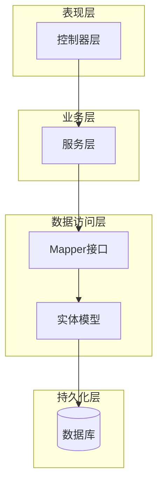
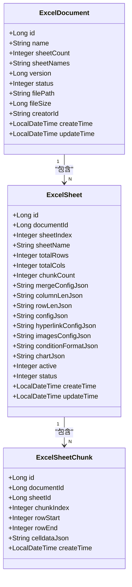
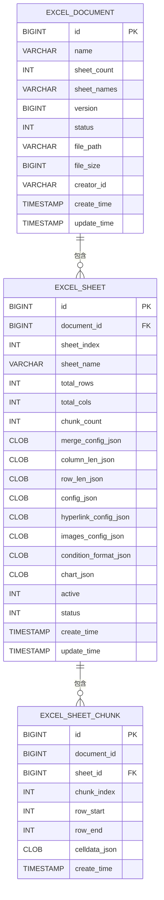
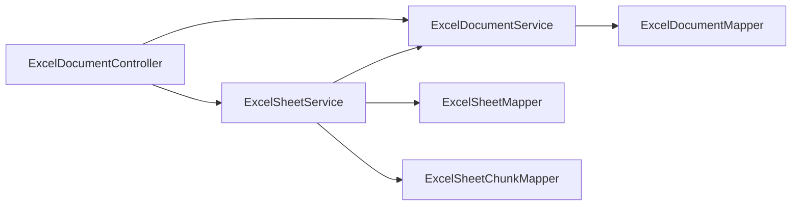

# 实体模型设计

<cite>
**本文引用的文件**
- [ExcelDocument.java](file://dataloom-server/src/main/java/com/demo/excel/entity/ExcelDocument.java)
- [ExcelSheet.java](file://dataloom-server/src/main/java/com/demo/excel/entity/ExcelSheet.java)
- [ExcelSheetChunk.java](file://dataloom-server/src/main/java/com/demo/excel/entity/ExcelSheetChunk.java)
- [ExcelDocumentMapper.java](file://dataloom-server/src/main/java/com/demo/excel/mapper/ExcelDocumentMapper.java)
- [ExcelSheetMapper.java](file://dataloom-server/src/main/java/com/demo/excel/mapper/ExcelSheetMapper.java)
- [ExcelSheetChunkMapper.java](file://dataloom-server/src/main/java/com/demo/excel/mapper/ExcelSheetChunkMapper.java)
- [ExcelDocumentService.java](file://dataloom-server/src/main/java/com/demo/excel/service/ExcelDocumentService.java)
- [ExcelSheetService.java](file://dataloom-server/src/main/java/com/demo/excel/service/ExcelSheetService.java)
- [ExcelDocumentController.java](file://dataloom-server/src/main/java/com/demo/excel/controller/ExcelDocumentController.java)
- [ExcelFileController.java](file://dataloom-server/src/main/java/com/demo/excel/controller/ExcelFileController.java)
- [MybatisPlusMetaHandler.java](file://dataloom-server/src/main/java/com/demo/excel/config/MybatisPlusMetaHandler.java)
- [application.yml](file://dataloom-server/src/main/resources/application.yml)
- [schema.sql](file://dataloom-server/src/main/resources/schema.sql)
- [ExcelSheetServiceTest.java](file://dataloom-server/src/test/java/com/demo/excel/service/ExcelSheetServiceTest.java)
</cite>

## 目录
1. [简介](#简介)
2. [项目结构](#项目结构)
3. [核心组件](#核心组件)
4. [架构概览](#架构概览)
5. [详细组件分析](#详细组件分析)
6. [依赖分析](#依赖分析)
7. [性能考虑](#性能考虑)
8. [故障排除指南](#故障排除指南)
9. [结论](#结论)
10. [附录](#附录)

## 简介
本项目采用三层实体模型设计，专门针对在线Excel编辑器的海量数据存储需求。通过将单元格数据进行分块存储，有效解决了十万级数据下单行存储过大的问题。该设计实现了文档元数据、工作表元信息和数据分块的清晰分离，提供了高性能的数据访问和管理能力。

## 项目结构
项目采用标准的Spring Boot分层架构，核心实体模型位于entity包中，配合对应的Mapper、Service和Controller层实现完整的CRUD操作。

**图表来源**
- [ExcelDocumentController.java:22-296](file://dataloom-server/src/main/java/com/demo/excel/controller/ExcelDocumentController.java#L22-L296)
- [ExcelDocumentService.java:19-119](file://dataloom-server/src/main/java/com/demo/excel/service/ExcelDocumentService.java#L19-L119)
- [ExcelDocumentMapper.java:9-10](file://dataloom-server/src/main/java/com/demo/excel/mapper/ExcelDocumentMapper.java#L9-L10)

**章节来源**
- [ExcelDocumentController.java:22-296](file://dataloom-server/src/main/java/com/demo/excel/controller/ExcelDocumentController.java#L22-L296)
- [ExcelDocumentService.java:19-119](file://dataloom-server/src/main/java/com/demo/excel/service/ExcelDocumentService.java#L19-L119)
- [ExcelDocumentMapper.java:9-10](file://dataloom-server/src/main/java/com/demo/excel/mapper/ExcelDocumentMapper.java#L9-L10)

## 核心组件
本系统的核心实体模型包含三个关键类：ExcelDocument、ExcelSheet和ExcelSheetChunk，它们构成了完整的Excel数据存储体系。

**章节来源**
- [ExcelDocument.java:15-55](file://dataloom-server/src/main/java/com/demo/excel/entity/ExcelDocument.java#L15-L55)
- [ExcelSheet.java:14-77](file://dataloom-server/src/main/java/com/demo/excel/entity/ExcelSheet.java#L14-L77)
- [ExcelSheetChunk.java:18-53](file://dataloom-server/src/main/java/com/demo/excel/entity/ExcelSheetChunk.java#L18-L53)

## 架构概览
系统采用三层架构设计，通过实体模型实现数据的完整封装和高效管理。

**图表来源**
- [ExcelDocument.java:17-55](file://dataloom-server/src/main/java/com/demo/excel/entity/ExcelDocument.java#L17-L55)
- [ExcelSheet.java:16-77](file://dataloom-server/src/main/java/com/demo/excel/entity/ExcelSheet.java#L16-L77)
- [ExcelSheetChunk.java:20-53](file://dataloom-server/src/main/java/com/demo/excel/entity/ExcelSheetChunk.java#L20-L53)

## 详细组件分析

### ExcelDocument 实体设计
ExcelDocument作为文档主表，仅存储元数据信息，彻底解决大规模数据存储问题。

#### 核心属性设计
- **主键设计**: 使用AUTO自增策略，确保唯一性
- **版本控制**: 采用乐观锁机制，通过@Version注解实现并发控制
- **状态管理**: 1正常、2回收站、3已删除的状态枚举设计
- **文件元信息**: 存储原始文件路径和大小，便于备份和重新解析

#### ORM映射细节
- **表名映射**: @TableName("excel_document")明确数据库表关联
- **自动填充**: 通过@MybatisPlusMetaHandler实现createTime和updateTime的自动维护
- **字段注解**: 使用@TableId和@TableField注解精确控制ORM行为

#### 业务规则约束
- **非空约束**: name字段必须填写，确保文档可识别性
- **默认值策略**: sheetCount默认0，fileSize默认0，status默认1
- **逻辑删除**: 通过状态字段实现软删除，保护数据完整性

**章节来源**
- [ExcelDocument.java:15-55](file://dataloom-server/src/main/java/com/demo/excel/entity/ExcelDocument.java#L15-L55)
- [ExcelDocumentService.java:31-53](file://dataloom-server/src/main/java/com/demo/excel/service/ExcelDocumentService.java#L31-L53)

### ExcelSheet 实体设计
ExcelSheet代表文档中的单个工作表，存储工作表的元信息和配置数据。

#### 设计理念
- **元信息分离**: 将单元格数据与工作表配置分离，提高查询效率
- **配置集中存储**: 合并单元格、列宽、行高等配置以JSON形式存储
- **状态管理**: 支持工作表的激活状态和删除状态管理

#### 关键属性说明
- **索引管理**: sheetIndex记录工作表在工作簿中的原始顺序
- **尺寸信息**: totalRows和totalCols记录工作表的基本尺寸信息
- **分块统计**: chunkCount记录数据分块数量，便于性能监控
- **配置存储**: 多个JSON字段存储Luckysheet的各种配置信息

#### 配置字段设计
- **mergeConfigJson**: 合并单元格配置，通常较小，适合直接存储
- **columnLenJson**: 列宽配置，支持动态列宽调整
- **rowLenJson**: 行高配置，维护行高一致性
- **configJson**: Luckysheet完整配置，包含基础布局信息
- **其他配置**: hyperlink、images、conditionFormat、chart等专业配置

**章节来源**
- [ExcelSheet.java:14-77](file://dataloom-server/src/main/java/com/demo/excel/entity/ExcelSheet.java#L14-L77)
- [ExcelSheetService.java:51-72](file://dataloom-server/src/main/java/com/demo/excel/service/ExcelSheetService.java#L51-L72)

### ExcelSheetChunk 实体设计
ExcelSheetChunk是数据分块存储的核心，解决大规模数据的存储和访问问题。

#### 分块策略设计
- **分块大小**: 采用1000行的标准分块大小，平衡内存使用和I/O效率
- **行范围管理**: rowStart和rowEnd精确标识每块包含的行范围
- **索引管理**: chunkIndex按行范围升序排列，便于快速定位

#### 数据格式规范
- **CELDDATA格式**: 严格遵循Luckysheet的celldata格式标准
- **JSON存储**: 使用字符串存储celldata数组，保持格式兼容性
- **稀疏存储**: 仅存储非空单元格，节省存储空间

#### 性能优化特性
- **按需加载**: 支持按块分页加载，避免全量数据传输
- **缓存友好**: 固定大小的块便于内存缓存管理
- **并行处理**: 支持多块并行读写，提升吞吐量

**章节来源**
- [ExcelSheetChunk.java:18-53](file://dataloom-server/src/main/java/com/demo/excel/entity/ExcelSheetChunk.java#L18-L53)
- [ExcelSheetService.java:104-212](file://dataloom-server/src/main/java/com/demo/excel/service/ExcelSheetService.java#L104-L212)

## 依赖分析

### 数据库表关系
系统通过三张核心表实现完整的数据存储，采用外键约束保证数据一致性。

**图表来源**
- [schema.sql:8-66](file://dataloom-server/src/main/resources/schema.sql#L8-L66)

### 服务层依赖关系
服务层通过依赖注入实现松耦合的设计，便于单元测试和维护。

**图表来源**
- [ExcelDocumentController.java:28-33](file://dataloom-server/src/main/java/com/demo/excel/controller/ExcelDocumentController.java#L28-L33)
- [ExcelDocumentService.java:22-23](file://dataloom-server/src/main/java/com/demo/excel/service/ExcelDocumentService.java#L22-L23)
- [ExcelSheetService.java:36-43](file://dataloom-server/src/main/java/com/demo/excel/service/ExcelSheetService.java#L36-L43)

**章节来源**
- [ExcelDocumentController.java:28-33](file://dataloom-server/src/main/java/com/demo/excel/controller/ExcelDocumentController.java#L28-L33)
- [ExcelDocumentService.java:22-23](file://dataloom-server/src/main/java/com/demo/excel/service/ExcelDocumentService.java#L22-L23)
- [ExcelSheetService.java:36-43](file://dataloom-server/src/main/java/com/demo/excel/service/ExcelSheetService.java#L36-L43)

## 性能考虑

### 存储优化策略
1. **分块存储**: 将10万级数据按1000行分块，避免单行过大
2. **JSON压缩**: 使用紧凑的JSON格式存储配置信息
3. **索引优化**: 在关键字段上建立索引提升查询性能

### 访问模式优化
1. **懒加载**: 默认只加载元数据，需要时再加载具体数据
2. **批量操作**: 支持批量更新和批量保存，减少数据库交互
3. **缓存策略**: 利用分块的固定大小特性实现高效的内存缓存

### 并发控制
1. **乐观锁**: 通过version字段实现无锁并发控制
2. **事务管理**: 关键操作使用@Transactional注解保证数据一致性
3. **批量处理**: 通过分组批量处理提升性能

## 故障排除指南

### 常见问题诊断
1. **分块数据损坏**: 检查celldataJson格式是否符合Luckysheet标准
2. **索引不一致**: 验证chunkIndex与rowStart/rowEnd的对应关系
3. **内存溢出**: 确认分块大小设置合理，避免过大或过小

### 调试技巧
1. **日志监控**: 利用SLF4J日志记录关键操作
2. **单元测试**: 通过ExcelSheetServiceTest验证核心逻辑
3. **数据库检查**: 直接查询数据库验证数据完整性

**章节来源**
- [ExcelSheetServiceTest.java:44-107](file://dataloom-server/src/test/java/com/demo/excel/service/ExcelSheetServiceTest.java#L44-L107)

## 结论
本实体模型设计通过三层分离的架构，有效解决了在线Excel编辑器的大规模数据存储挑战。ExcelDocument、ExcelSheet和ExcelSheetChunk三个实体各司其职，既保证了数据的完整性，又提供了优秀的性能表现。分块存储策略和JSON配置存储方案使得系统能够轻松处理十万级数据规模，同时保持良好的扩展性和维护性。

## 附录

### 数据库配置
系统支持H2内存数据库和MySQL数据库，通过application.yml配置实现无缝切换。

### 序列化配置
- **驼峰命名**: 开启map-underscore-to-camel-case实现Java字段与数据库字段的自动映射
- **自动填充**: 通过MybatisPlusMetaHandler实现createTime和updateTime的自动维护

### 最佳实践
1. **分块大小选择**: 根据实际数据规模调整CHUNK_SIZE参数
2. **索引策略**: 在高频查询字段上建立适当索引
3. **缓存策略**: 利用分块的固定大小特性实现高效的缓存管理
4. **错误处理**: 建立完善的异常处理和数据校验机制