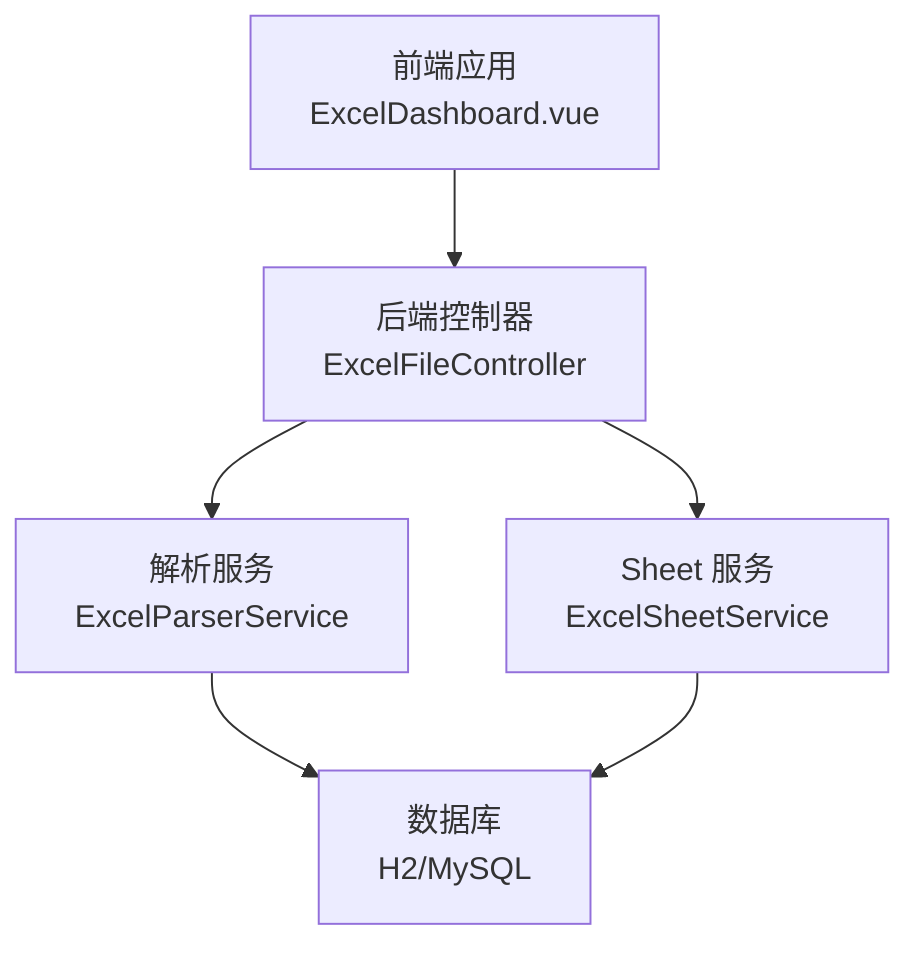
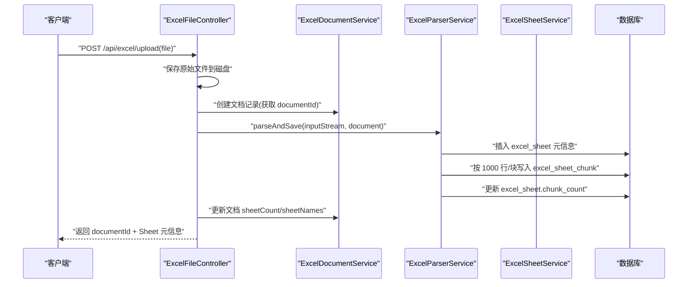
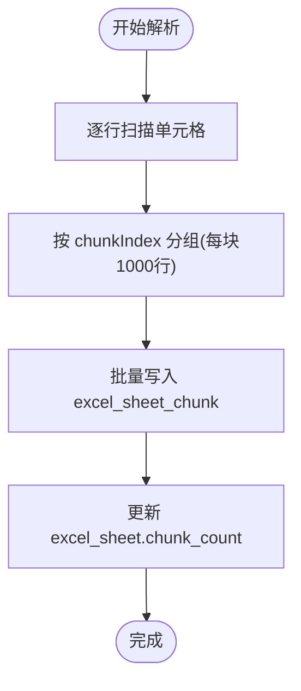
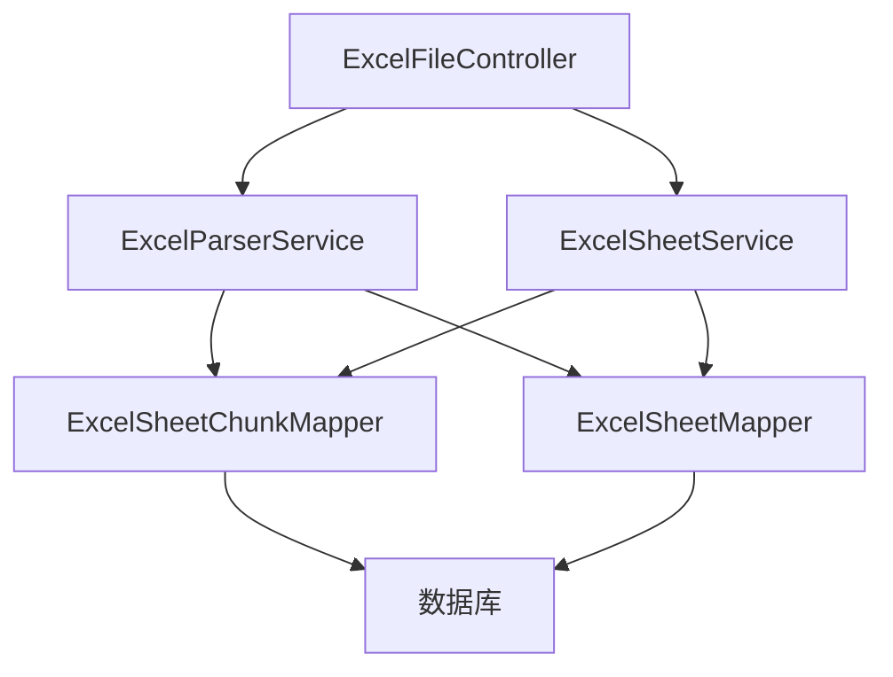

# 性能优化策略

<cite>
**本文引用的文件**
- [ExcelSheetChunk.java](file://dataloom-server/src/main/java/com/demo/excel/entity/ExcelSheetChunk.java)
- [ExcelSheetChunkMapper.java](file://dataloom-server/src/main/java/com/demo/excel/mapper/ExcelSheetChunkMapper.java)
- [ExcelSheetService.java](file://dataloom-server/src/main/java/com/demo/excel/service/ExcelSheetService.java)
- [ExcelParserService.java](file://dataloom-server/src/main/java/com/demo/excel/service/ExcelParserService.java)
- [ExcelFileController.java](file://dataloom-server/src/main/java/com/demo/excel/controller/ExcelFileController.java)
- [application.yml](file://dataloom-server/src/main/resources/application.yml)
- [schema.sql](file://dataloom-server/src/main/resources/schema.sql)
- [pom.xml](file://dataloom-server/pom.xml)
- [ExcelSheetServiceTest.java](file://dataloom-server/src/test/java/com/demo/excel/service/ExcelSheetServiceTest.java)
</cite>

## 目录
1. [简介](#简介)
2. [项目结构](#项目结构)
3. [核心组件](#核心组件)
4. [架构总览](#架构总览)
5. [详细组件分析](#详细组件分析)
6. [依赖分析](#依赖分析)
7. [性能考量](#性能考量)
8. [故障排查指南](#故障排查指南)
9. [结论](#结论)
10. [附录](#附录)

## 简介
本文件面向数据库性能优化，围绕“分块存储设计”“索引设计策略”“查询优化技巧”“连接池配置与连接管理最佳实践”以及“性能监控与调优方法”展开，结合代码库中的分块存储实现与现有配置，给出可落地的优化建议与实操要点，帮助在高并发场景下稳定提升数据库性能表现。

## 项目结构
该项目采用前后端分离架构，后端基于 Spring Boot + MyBatis-Plus，数据库使用 H2（开发演示），并通过 SQL 初始化脚本创建三张核心表：文档主表、Sheet 元信息表、Sheet 数据分块表。上传流程通过控制器接收文件，解析器使用 POI 流式解析并按固定行数进行分块持久化，服务层负责分块读取、批量更新与重建工作簿等操作。

图表来源
- [ExcelFileController.java:1-141](file://dataloom-server/src/main/java/com/demo/excel/controller/ExcelFileController.java#L1-L141)
- [ExcelParserService.java:1-348](file://dataloom-server/src/main/java/com/demo/excel/service/ExcelParserService.java#L1-L348)
- [ExcelSheetService.java:1-443](file://dataloom-server/src/main/java/com/demo/excel/service/ExcelSheetService.java#L1-L443)
- [application.yml:1-51](file://dataloom-server/src/main/resources/application.yml#L1-L51)

章节来源
- [ExcelFileController.java:56-116](file://dataloom-server/src/main/java/com/demo/excel/controller/ExcelFileController.java#L56-L116)
- [ExcelParserService.java:66-87](file://dataloom-server/src/main/java/com/demo/excel/service/ExcelParserService.java#L66-L87)
- [ExcelSheetService.java:45-91](file://dataloom-server/src/main/java/com/demo/excel/service/ExcelSheetService.java#L45-L91)
- [application.yml:8-29](file://dataloom-server/src/main/resources/application.yml#L8-L29)

## 核心组件
- 分块实体与映射
  - ExcelSheetChunk 实体承载每块的元信息与 JSON 数据，采用 MyBatis-Plus 注解映射到 excel_sheet_chunk 表。
  - ExcelSheetChunkMapper 继承基础 CRUD，查询条件在 Service 层通过 QueryWrapper 组装。
- 解析与分块持久化
  - ExcelParserService 使用 POI 流式解析，按固定行数（默认 1000 行/块）将单元格数据分块写入数据库，并维护 Sheet 的 chunk_count。
- Sheet 服务与查询
  - ExcelSheetService 提供按文档查询 Sheet 列表、按 Sheet 查询全部分块、按文档删除级联清理、批量增量更新单元格、全量替换工作簿等能力。
- 控制器与上传流程
  - ExcelFileController 接收上传文件，保存原始文件，调用解析与服务层，返回文档与 Sheet 元信息，避免返回大量 celldata。

章节来源
- [ExcelSheetChunk.java:18-52](file://dataloom-server/src/main/java/com/demo/excel/entity/ExcelSheetChunk.java#L18-L52)
- [ExcelSheetChunkMapper.java:11](file://dataloom-server/src/main/java/com/demo/excel/mapper/ExcelSheetChunkMapper.java#L11)
- [ExcelParserService.java:43-44](file://dataloom-server/src/main/java/com/demo/excel/service/ExcelParserService.java#L43-L44)
- [ExcelSheetService.java:67-72](file://dataloom-server/src/main/java/com/demo/excel/service/ExcelSheetService.java#L67-L72)
- [ExcelFileController.java:70-116](file://dataloom-server/src/main/java/com/demo/excel/controller/ExcelFileController.java#L70-L116)

## 架构总览
下图展示了上传与分块存储的关键交互序列，体现分块策略如何降低单次写入与读取压力，并支撑后续的按需加载与增量更新。

图表来源
- [ExcelFileController.java:70-116](file://dataloom-server/src/main/java/com/demo/excel/controller/ExcelFileController.java#L70-L116)
- [ExcelParserService.java:66-87](file://dataloom-server/src/main/java/com/demo/excel/service/ExcelParserService.java#L66-L87)
- [ExcelSheetService.java:221-316](file://dataloom-server/src/main/java/com/demo/excel/service/ExcelSheetService.java#L221-L316)

## 详细组件分析

### 分块存储设计与技术原理
- 设计动机
  - 将单条 CLOB/TEXT 的超大数据拆分为多个小块，避免单行过大导致读写性能差、HTTP 响应体膨胀、内存溢出等问题。
- 分块策略
  - 固定行数：默认每块 1000 行，块内 JSON 通常在数百 KB 级，便于按需加载与增量更新。
  - 边界计算：chunkIndex = floor(row / 1000)，确保与批量更新时的定位逻辑一致，避免空行导致的边界偏移。
- 读写路径
  - 写入：解析器按行扫描，按 chunkIndex 聚合后批量写入 excel_sheet_chunk。
  - 读取：按 sheet_id + chunk_index 查询，或按 sheet_id 顺序读取全部分块。
  - 更新：按 (sheet_id, chunk_index) 分组，逐块读取、内存中合并、最后写回，减少 I/O 次数。

图表来源
- [ExcelParserService.java:142-200](file://dataloom-server/src/main/java/com/demo/excel/service/ExcelParserService.java#L142-L200)
- [ExcelSheetService.java:103-212](file://dataloom-server/src/main/java/com/demo/excel/service/ExcelSheetService.java#L103-L212)

章节来源
- [ExcelSheetChunk.java:10-16](file://dataloom-server/src/main/java/com/demo/excel/entity/ExcelSheetChunk.java#L10-L16)
- [ExcelParserService.java:43-44](file://dataloom-server/src/main/java/com/demo/excel/service/ExcelParserService.java#L43-L44)
- [ExcelParserService.java:142-200](file://dataloom-server/src/main/java/com/demo/excel/service/ExcelParserService.java#L142-L200)
- [ExcelSheetService.java:103-212](file://dataloom-server/src/main/java/com/demo/excel/service/ExcelSheetService.java#L103-L212)

### 索引设计策略
- 当前索引现状
  - H2 初始化脚本未显式创建索引，但 MySQL 参考建表脚本提供了以下索引建议：
    - excel_sheet：document_id
    - excel_sheet_chunk：sheet_id、document_id、(sheet_id, chunk_index)
- 索引使用场景与性能影响
  - 主键索引：三张表均以自增主键作为主键，具备唯一性与聚簇特性，适合大多数等值查询。
  - 外键索引：excel_sheet.document_id、excel_sheet_chunk.sheet_id、excel_sheet_chunk.document_id，用于 JOIN 与级联删除。
  - 复合索引：excel_sheet_chunk(sheet_id, chunk_index) 用于按块定位，避免全表扫描。
- 建议
  - 在生产环境（MySQL）启用上述索引，确保高频查询命中索引。
  - 避免在大字段（如 celldata_json）上建立索引，防止索引膨胀与写入放大。

章节来源
- [schema.sql:57-66](file://dataloom-server/src/main/resources/schema.sql#L57-L66)
- [schema.sql:111-123](file://dataloom-server/src/main/resources/schema.sql#L111-L123)

### 查询优化技巧
- 常见查询模式与执行计划
  - 按文档查询 Sheet 列表：WHERE document_id = ? AND status = 1 ORDER BY sheet_index ASC
  - 按 Sheet 查询全部分块：WHERE sheet_id = ? ORDER BY chunk_index ASC
  - 按 (sheet_id, chunk_index) 查单块：WHERE sheet_id = ? AND chunk_index = ?
- 索引使用策略
  - 上述查询应利用 excel_sheet(document_id)、excel_sheet_chunk(sheet_id)、excel_sheet_chunk(sheet_id, chunk_index)。
- 查询重写建议
  - 读取时避免 SELECT *，仅选择必要字段，减少网络与反序列化开销。
  - 分页读取：当需要全量分块时，建议按 chunk_index 分页，避免一次性拉取过多数据。
  - 懒加载：前端仅在切换 Sheet 或滚动到可视区域时按块请求，降低峰值流量。

章节来源
- [ExcelSheetService.java:51-72](file://dataloom-server/src/main/java/com/demo/excel/service/ExcelSheetService.java#L51-L72)
- [ExcelSheetService.java:123-125](file://dataloom-server/src/main/java/com/demo/excel/service/ExcelSheetService.java#L123-L125)

### 数据库连接池配置与连接管理最佳实践
- 当前配置
  - 应用使用 Spring Boot 默认数据源配置，未显式设置连接池参数。
- 连接池参数建议（以 MySQL 为例）
  - 连接数：根据 CPU 核心数与 QPS 估算，建议初始连接数为 CPU×2，最大连接数为 CPU×4。
  - 超时配置：连接超时（如 30s）、查询超时（如 60s）、空闲回收（如 600s）。
  - 连接复用策略：开启连接池预热，避免频繁创建销毁；合理设置最小空闲连接，保障突发流量。
- 连接管理
  - 事务粒度：批量更新按块进行，单事务内尽量减少跨表写入，避免长事务锁竞争。
  - 并发控制：在服务层对同一文档/工作簿的操作进行排队或限流，避免热点冲突。

章节来源
- [application.yml:9-13](file://dataloom-server/src/main/resources/application.yml#L9-L13)
- [application.yml:32-40](file://dataloom-server/src/main/resources/application.yml#L32-L40)

### 性能监控指标与调优方法
- 关键指标
  - 数据库层面：连接数、活跃连接、等待队列长度、慢查询数、缓冲池命中率、磁盘 IO。
  - 应用层面：请求延迟 P50/P95/P99、吞吐量、错误率、线程池排队长度、GC 时间占比。
- 调优方法
  - 指标采集：使用数据库自带监控（如 MySQL Performance Schema）与应用埋点（如 Micrometer）。
  - 压测：模拟高并发场景，逐步提升并发数，观察数据库与应用的瓶颈点。
  - 优化手段：增加合适索引、调整连接池参数、优化查询与事务、引入缓存（如 Redis）分片存储热数据。

章节来源
- [ExcelParserService.java:43-44](file://dataloom-server/src/main/java/com/demo/excel/service/ExcelParserService.java#L43-L44)
- [ExcelSheetService.java:103-212](file://dataloom-server/src/main/java/com/demo/excel/service/ExcelSheetService.java#L103-L212)

## 依赖分析
- 组件耦合
  - ExcelFileController 依赖 ExcelParserService 与 ExcelSheetService，二者均依赖 MyBatis-Plus Mapper 与实体。
  - ExcelParserService 与 ExcelSheetService 通过 Mapper 访问数据库，遵循“服务层组装查询条件”的约定。
- 外部依赖
  - H2（开发演示）与 MySQL（生产建议），通过 application.yml 切换。
  - MyBatis-Plus 提供通用 CRUD 与逻辑删除配置。
  - POI 用于 Excel 解析，FastJSON 用于 JSON 序列化与反序列化。

图表来源
- [ExcelFileController.java:42-48](file://dataloom-server/src/main/java/com/demo/excel/controller/ExcelFileController.java#L42-L48)
- [ExcelParserService.java:46-50](file://dataloom-server/src/main/java/com/demo/excel/service/ExcelParserService.java#L46-L50)
- [ExcelSheetService.java:36-43](file://dataloom-server/src/main/java/com/demo/excel/service/ExcelSheetService.java#L36-L43)

章节来源
- [pom.xml:40-51](file://dataloom-server/pom.xml#L40-L51)
- [application.yml:9-13](file://dataloom-server/src/main/resources/application.yml#L9-L13)

## 性能考量
- 分块存储对查询性能的影响
  - 优点：按块读取与更新，避免全量 JSON 传输与解析；支持懒加载，显著降低首屏与滚动时延。
  - 影响：需要在业务层维护 chunkIndex 与行号映射，确保定位准确。
- 索引对查询性能的影响
  - 合理索引可将等值/范围查询从全表扫描降至索引扫描，极大降低 RT 与吞吐波动。
- 连接池与并发
  - 过小连接池会导致排队与超时；过大则带来上下文切换与资源争用。
- I/O 与内存
  - 分块写入减少单次 I/O 与内存占用；批量更新时的内存合并可降低多次往返。

章节来源
- [ExcelSheetChunk.java:10-16](file://dataloom-server/src/main/java/com/demo/excel/entity/ExcelSheetChunk.java#L10-L16)
- [ExcelParserService.java:142-200](file://dataloom-server/src/main/java/com/demo/excel/service/ExcelParserService.java#L142-L200)
- [ExcelSheetService.java:103-212](file://dataloom-server/src/main/java/com/demo/excel/service/ExcelSheetService.java#L103-L212)

## 故障排查指南
- 常见问题
  - 查询慢：检查是否命中索引，确认 WHERE 条件与 ORDER BY 是否可走索引。
  - 写入慢：检查是否存在长事务、批量更新是否按块聚合、是否遗漏必要的索引。
  - 内存溢出：确认 celldata_json 字段未被误索引，且前端未一次性请求过多分块。
- 排查步骤
  - 开启慢查询日志与执行计划分析，定位热点 SQL。
  - 观察连接池指标，确认是否存在连接不足或连接泄漏。
  - 使用单元测试验证分块边界与增量更新逻辑，确保 chunkIndex 计算正确。

章节来源
- [ExcelSheetServiceTest.java:44-107](file://dataloom-server/src/test/java/com/demo/excel/service/ExcelSheetServiceTest.java#L44-L107)
- [ExcelSheetService.java:103-212](file://dataloom-server/src/main/java/com/demo/excel/service/ExcelSheetService.java#L103-L212)

## 结论
通过“1000 行分块存储”与“按块定位”的设计，项目在高并发与大数据场景下实现了更稳健的读写与加载体验。配合合理的索引策略、连接池参数与监控体系，可在生产环境中进一步提升稳定性与吞吐。建议尽快在 MySQL 环境启用参考索引，并持续进行压测与指标观测，形成闭环优化。

## 附录
- 1000 行分块策略的技术要点
  - 固定行数：每块约 1000 行，JSON 控制在数百 KB，便于按需加载。
  - 边界一致性：chunkIndex = floor(row / 1000)，与批量更新定位逻辑保持一致。
  - 读写分离：解析写入与业务读取/更新分别优化，减少相互干扰。
- 索引清单（建议）
  - excel_sheet(document_id)
  - excel_sheet_chunk(sheet_id)
  - excel_sheet_chunk(sheet_id, chunk_index)

章节来源
- [ExcelParserService.java:43-44](file://dataloom-server/src/main/java/com/demo/excel/service/ExcelParserService.java#L43-L44)
- [ExcelSheetService.java:103-212](file://dataloom-server/src/main/java/com/demo/excel/service/ExcelSheetService.java#L103-L212)
- [schema.sql:111-123](file://dataloom-server/src/main/resources/schema.sql#L111-L123)