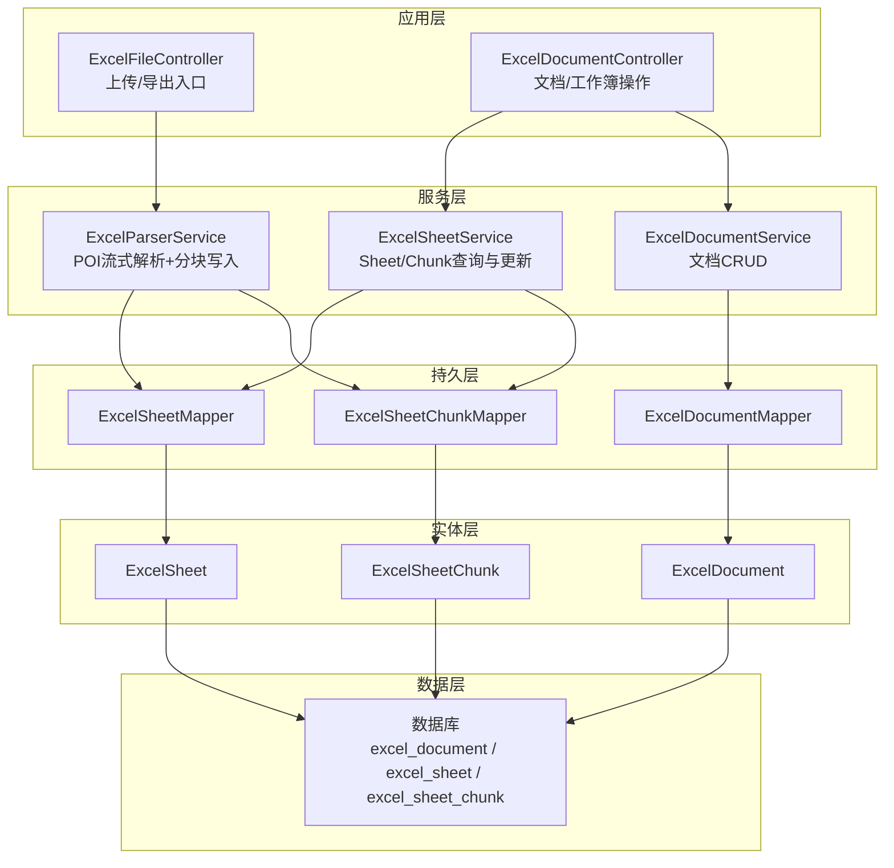
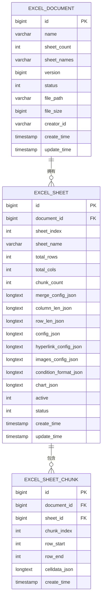
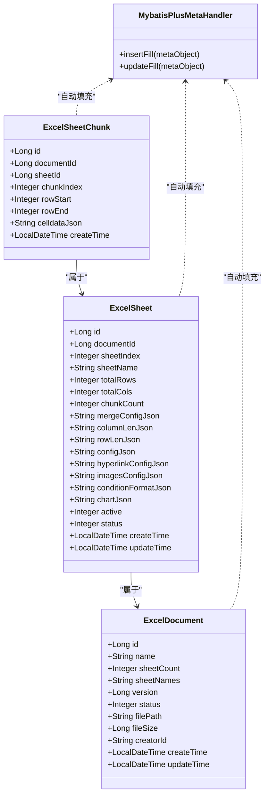
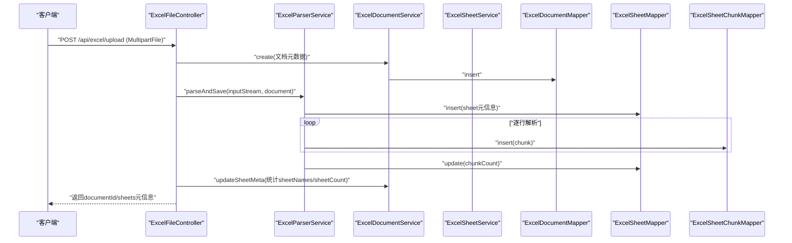
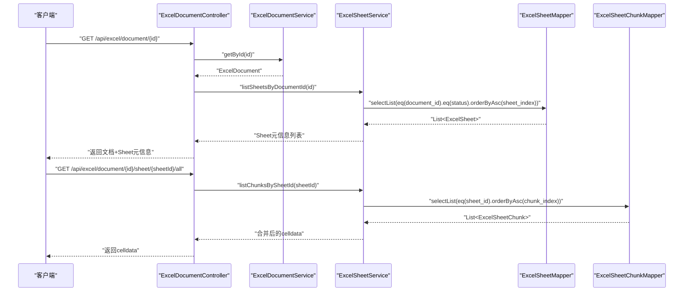
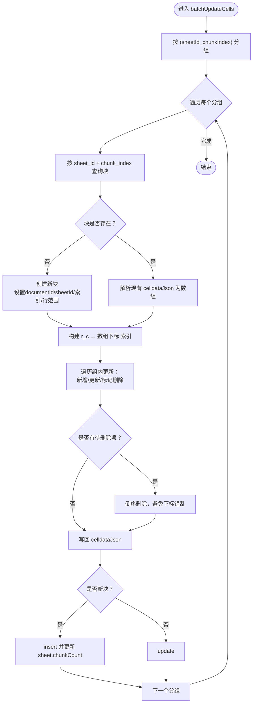
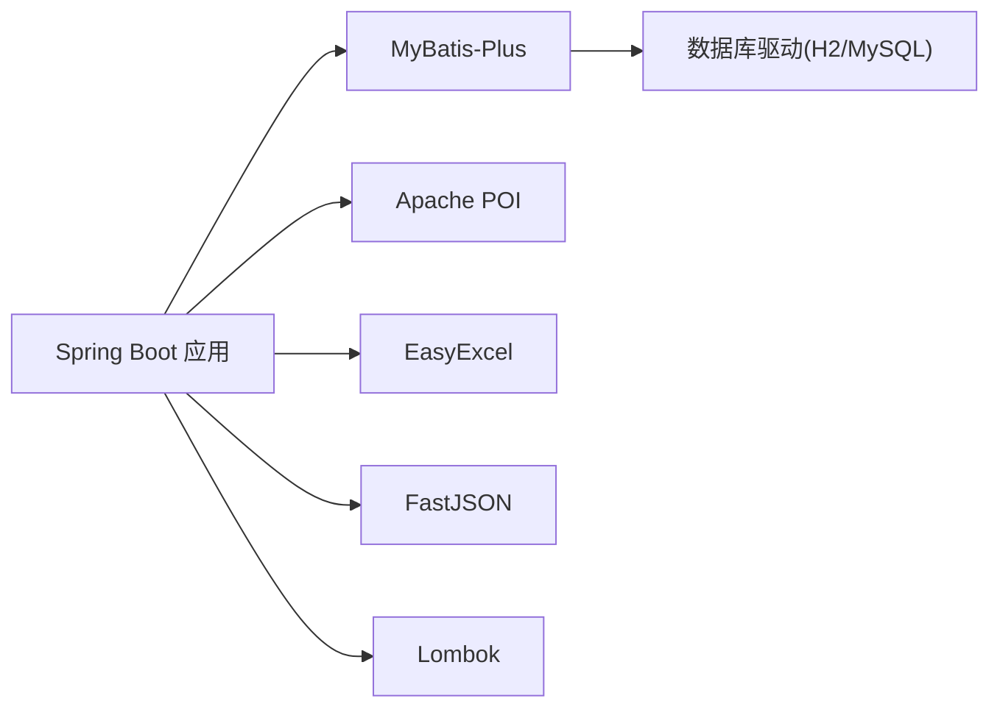

# 数据库设计

<cite>
**本文引用的文件**
- [ExcelDocument.java](file://dataloom-server/src/main/java/com/demo/excel/entity/ExcelDocument.java)
- [ExcelSheet.java](file://dataloom-server/src/main/java/com/demo/excel/entity/ExcelSheet.java)
- [ExcelSheetChunk.java](file://dataloom-server/src/main/java/com/demo/excel/entity/ExcelSheetChunk.java)
- [ExcelDocumentMapper.java](file://dataloom-server/src/main/java/com/demo/excel/mapper/ExcelDocumentMapper.java)
- [ExcelSheetMapper.java](file://dataloom-server/src/main/java/com/demo/excel/mapper/ExcelSheetMapper.java)
- [ExcelSheetChunkMapper.java](file://dataloom-server/src/main/java/com/demo/excel/mapper/ExcelSheetChunkMapper.java)
- [ExcelDocumentService.java](file://dataloom-server/src/main/java/com/demo/excel/service/ExcelDocumentService.java)
- [ExcelSheetService.java](file://dataloom-server/src/main/java/com/demo/excel/service/ExcelSheetService.java)
- [ExcelParserService.java](file://dataloom-server/src/main/java/com/demo/excel/service/ExcelParserService.java)
- [ExcelDocumentController.java](file://dataloom-server/src/main/java/com/demo/excel/controller/ExcelDocumentController.java)
- [ExcelFileController.java](file://dataloom-server/src/main/java/com/demo/excel/controller/ExcelFileController.java)
- [MybatisPlusMetaHandler.java](file://dataloom-server/src/main/java/com/demo/excel/config/MybatisPlusMetaHandler.java)
- [application.yml](file://dataloom-server/src/main/resources/application.yml)
- [schema.sql](file://dataloom-server/src/main/resources/schema.sql)
- [pom.xml](file://dataloom-server/pom.xml)
</cite>

## 目录
1. [简介](#简介)
2. [项目结构](#项目结构)
3. [核心组件](#核心组件)
4. [架构总览](#架构总览)
5. [详细组件分析](#详细组件分析)
6. [依赖分析](#依赖分析)
7. [性能考量](#性能考量)
8. [故障排查指南](#故障排查指南)
9. [结论](#结论)
10. [附录](#附录)

## 简介
本文件面向 DataLoom 的数据库设计，围绕 ExcelDocument、ExcelSheet、ExcelSheetChunk 三大核心实体，系统阐述其表结构设计、分块存储模型、主外键关系、索引与优化策略、ORM 映射配置、查询与写入流程、迁移与版本管理思路，以及连接与连接池最佳实践。目标是帮助开发者全面理解数据存储的设计理念与实现细节。

## 项目结构
- 后端采用 Spring Boot + MyBatis-Plus，数据库初始脚本位于 resources/schema.sql，应用配置位于 resources/application.yml。
- 控制器负责对外暴露 REST 接口，服务层封装业务逻辑（解析、分块写入、增量更新、全量替换等），实体与 Mapper 负责 ORM 映射与基础 CRUD。

图示来源
- [ExcelFileController.java:70-116](file://dataloom-server/src/main/java/com/demo/excel/controller/ExcelFileController.java#L70-L116)
- [ExcelDocumentController.java:38-131](file://dataloom-server/src/main/java/com/demo/excel/controller/ExcelDocumentController.java#L38-L131)
- [ExcelParserService.java:66-87](file://dataloom-server/src/main/java/com/demo/excel/service/ExcelParserService.java#L66-L87)
- [ExcelSheetService.java:51-72](file://dataloom-server/src/main/java/com/demo/excel/service/ExcelSheetService.java#L51-L72)
- [ExcelDocumentService.java:31-37](file://dataloom-server/src/main/java/com/demo/excel/service/ExcelDocumentService.java#L31-L37)
- [ExcelDocumentMapper.java](file://dataloom-server/src/main/java/com/demo/excel/mapper/ExcelDocumentMapper.java#L9)
- [ExcelSheetMapper.java](file://dataloom-server/src/main/java/com/demo/excel/mapper/ExcelSheetMapper.java#L11)
- [ExcelSheetChunkMapper.java](file://dataloom-server/src/main/java/com/demo/excel/mapper/ExcelSheetChunkMapper.java#L11)
- [ExcelDocument.java:15-54](file://dataloom-server/src/main/java/com/demo/excel/entity/ExcelDocument.java#L15-L54)
- [ExcelSheet.java:14-76](file://dataloom-server/src/main/java/com/demo/excel/entity/ExcelSheet.java#L14-L76)
- [ExcelSheetChunk.java:18-52](file://dataloom-server/src/main/java/com/demo/excel/entity/ExcelSheetChunk.java#L18-L52)

章节来源
- [application.yml:1-51](file://dataloom-server/src/main/resources/application.yml#L1-L51)
- [schema.sql:1-124](file://dataloom-server/src/main/resources/schema.sql#L1-L124)

## 核心组件
- ExcelDocument：仅存元数据（名称、Sheet 数量、Sheet 名称列表、版本、状态、文件路径、大小、创建者、时间戳）。主键自增，乐观锁版本号，状态用于软删除控制。
- ExcelSheet：文档下的 Sheet 元信息（所属文档、索引、名称、行列总数、分块数量、配置 JSON、激活状态、状态、时间戳）。主键自增，状态用于软删除。
- ExcelSheetChunk：按行范围切片的单元格数据块（所属文档、所属 Sheet、块序号、起止行号、celldata JSON）。主键自增，按块序号有序存储。

章节来源
- [ExcelDocument.java:15-54](file://dataloom-server/src/main/java/com/demo/excel/entity/ExcelDocument.java#L15-L54)
- [ExcelSheet.java:14-76](file://dataloom-server/src/main/java/com/demo/excel/entity/ExcelSheet.java#L14-L76)
- [ExcelSheetChunk.java:18-52](file://dataloom-server/src/main/java/com/demo/excel/entity/ExcelSheetChunk.java#L18-L52)

## 架构总览
数据库三层模型（文档-工作表-分块）将“单元格数据”从单行大字段拆分为可按需加载的小块，显著降低单次读写压力与内存占用，并通过索引与查询策略提升性能。

图示来源
- [schema.sql:8-66](file://dataloom-server/src/main/resources/schema.sql#L8-L66)
- [ExcelDocument.java:15-54](file://dataloom-server/src/main/java/com/demo/excel/entity/ExcelDocument.java#L15-L54)
- [ExcelSheet.java:14-76](file://dataloom-server/src/main/java/com/demo/excel/entity/ExcelSheet.java#L14-L76)
- [ExcelSheetChunk.java:18-52](file://dataloom-server/src/main/java/com/demo/excel/entity/ExcelSheetChunk.java#L18-L52)

## 详细组件分析

### 表结构与主外键设计
- 主键策略
  - 三表主键均采用数据库自增（AUTO_INCREMENT），实体中以 IdType.AUTO 映射。
- 外键约束
  - excel_sheet.document_id 引用 excel_document.id。
  - excel_sheet_chunk.sheet_id 引用 excel_sheet.id；同时保留冗余 document_id 便于按文档级联删除。
- 索引设计（H2 脚本）
  - excel_document：索引 idx_status(status)、idx_creator(creator_id)。
  - excel_sheet：索引 idx_document_id(document_id)。
  - excel_sheet_chunk：索引 idx_sheet_id(sheet_id)、idx_document_id(document_id)、idx_chunk_index(sheet_id, chunk_index)。
- 字段类型与约束
  - 使用 VARCHAR/INT/BIGINT/SMALLINT/TINYINT/TEXT/CLOB/LONGTEXT 等适配不同数据规模与用途。
  - 默认值与非空约束用于保障一致性（如 sheet_count、status、file_size 等）。

章节来源
- [schema.sql:8-66](file://dataloom-server/src/main/resources/schema.sql#L8-L66)
- [ExcelDocument.java:19-52](file://dataloom-server/src/main/java/com/demo/excel/entity/ExcelDocument.java#L19-L52)
- [ExcelSheet.java:18-74](file://dataloom-server/src/main/java/com/demo/excel/entity/ExcelSheet.java#L18-L74)
- [ExcelSheetChunk.java:22-50](file://dataloom-server/src/main/java/com/demo/excel/entity/ExcelSheetChunk.java#L22-L50)

### ORM 映射与自动填充
- 注解映射
  - @TableName 指定表名；@TableId 指定主键；@TableField(fill=...) 用于自动填充 create_time/update_time。
  - @Version 用于乐观锁。
- 自动填充
  - MybatisPlusMetaHandler 在插入/更新时自动填充时间字段，避免业务层重复 set。

图示来源
- [ExcelDocument.java:15-54](file://dataloom-server/src/main/java/com/demo/excel/entity/ExcelDocument.java#L15-L54)
- [ExcelSheet.java:14-76](file://dataloom-server/src/main/java/com/demo/excel/entity/ExcelSheet.java#L14-L76)
- [ExcelSheetChunk.java:18-52](file://dataloom-server/src/main/java/com/demo/excel/entity/ExcelSheetChunk.java#L18-L52)
- [MybatisPlusMetaHandler.java:17-36](file://dataloom-server/src/main/java/com/demo/excel/config/MybatisPlusMetaHandler.java#L17-L36)

章节来源
- [MybatisPlusMetaHandler.java:17-36](file://dataloom-server/src/main/java/com/demo/excel/config/MybatisPlusMetaHandler.java#L17-L36)
- [application.yml:32-41](file://dataloom-server/src/main/resources/application.yml#L32-L41)

### 分块存储模型与数据流
- 分块策略
  - 每块约 1000 行（CHUNK_SIZE=1000），chunkIndex = floor(row / 1000)，确保与增量更新时的定位逻辑一致。
- 写入流程
  - 解析阶段：逐 Sheet 写入 excel_sheet，再按块写入 excel_sheet_chunk，并更新 chunk_count。
  - 增量更新：按 (sheetId_chunkIndex) 分组，逐块读取/合并/落库，避免全量重建。
- 读取流程
  - 列表：按 sheet_index 升序返回 Sheet 元信息（不含 celldata）。
  - 全量：按 chunk_index 升序合并所有块返回 celldata。

图示来源
- [ExcelFileController.java:70-116](file://dataloom-server/src/main/java/com/demo/excel/controller/ExcelFileController.java#L70-L116)
- [ExcelParserService.java:66-87](file://dataloom-server/src/main/java/com/demo/excel/service/ExcelParserService.java#L66-L87)
- [ExcelParserService.java:142-200](file://dataloom-server/src/main/java/com/demo/excel/service/ExcelParserService.java#L142-L200)
- [ExcelDocumentService.java:31-53](file://dataloom-server/src/main/java/com/demo/excel/service/ExcelDocumentService.java#L31-L53)
- [ExcelSheetService.java:51-72](file://dataloom-server/src/main/java/com/demo/excel/service/ExcelSheetService.java#L51-L72)

章节来源
- [ExcelParserService.java:44-44](file://dataloom-server/src/main/java/com/demo/excel/service/ExcelParserService.java#L44-L44)
- [ExcelParserService.java:142-200](file://dataloom-server/src/main/java/com/demo/excel/service/ExcelParserService.java#L142-L200)
- [ExcelSheetService.java:103-212](file://dataloom-server/src/main/java/com/demo/excel/service/ExcelSheetService.java#L103-L212)

### 查询与写入流程（序列图）
- 查询文档详情：先查文档元数据，再按 document_id + status + sheet_index 升序查 Sheet 元信息。
- 加载全量 celldata：按 sheet_id + chunk_index 升序查所有块并合并。
- 批量增量更新：按 (sheetId_chunkIndex) 分组，逐块读取/合并/更新，必要时新建块并更新 chunk_count。

图示来源
- [ExcelDocumentController.java:77-131](file://dataloom-server/src/main/java/com/demo/excel/controller/ExcelDocumentController.java#L77-L131)
- [ExcelDocumentController.java:139-161](file://dataloom-server/src/main/java/com/demo/excel/controller/ExcelDocumentController.java#L139-L161)
- [ExcelDocumentService.java:61-78](file://dataloom-server/src/main/java/com/demo/excel/service/ExcelDocumentService.java#L61-L78)
- [ExcelSheetService.java:51-72](file://dataloom-server/src/main/java/com/demo/excel/service/ExcelSheetService.java#L51-L72)

章节来源
- [ExcelDocumentController.java:77-161](file://dataloom-server/src/main/java/com/demo/excel/controller/ExcelDocumentController.java#L77-L161)
- [ExcelSheetService.java:67-72](file://dataloom-server/src/main/java/com/demo/excel/service/ExcelSheetService.java#L67-L72)

### 增量更新算法（流程图）

图示来源
- [ExcelSheetService.java:103-212](file://dataloom-server/src/main/java/com/demo/excel/service/ExcelSheetService.java#L103-L212)

章节来源
- [ExcelSheetService.java:103-212](file://dataloom-server/src/main/java/com/demo/excel/service/ExcelSheetService.java#L103-L212)

### 删除与软删除策略
- 文档删除：软删除文档记录（status=3），同时尝试删除磁盘原始文件；Sheet 软删除（status=3），Chunk 物理删除。
- Sheet 级联删除：按 document_id 执行软删除 Sheet + 物理删除 Chunk。

章节来源
- [ExcelDocumentService.java:86-103](file://dataloom-server/src/main/java/com/demo/excel/service/ExcelDocumentService.java#L86-L103)
- [ExcelSheetService.java:79-91](file://dataloom-server/src/main/java/com/demo/excel/service/ExcelSheetService.java#L79-L91)

### 数据迁移与版本管理
- 版本字段：ExcelDocument 使用 @Version 实现乐观锁，避免并发覆盖。
- 建表脚本：schema.sql 提供 H2 与 MySQL 双版本建表参考，生产环境仅需切换 datasource。
- 迁移建议：
  - 新增列：使用 ALTER TABLE 添加列（脚本已示范）。
  - 索引演进：根据查询模式增加复合索引（如 document_id + status）。
  - 数据清理：定期清理软删除记录与历史 Chunk（结合业务策略）。

章节来源
- [ExcelDocument.java:32-34](file://dataloom-server/src/main/java/com/demo/excel/entity/ExcelDocument.java#L32-L34)
- [schema.sql:47-52](file://dataloom-server/src/main/resources/schema.sql#L47-L52)
- [schema.sql:70-123](file://dataloom-server/src/main/resources/schema.sql#L70-L123)

## 依赖分析
- 技术栈
  - Spring Boot、MyBatis-Plus、H2（开发）/MySQL（生产）、Apache POI、EasyExcel、FastJSON、Lombok。
- 关键依赖
  - MyBatis-Plus 提供通用 Mapper 与自动填充；POI 用于流式解析；EasyExcel 用于导出（前端接管）；FastJSON 用于 JSON 序列化。

图示来源
- [pom.xml:32-106](file://dataloom-server/pom.xml#L32-L106)

章节来源
- [pom.xml:21-106](file://dataloom-server/pom.xml#L21-L106)

## 性能考量
- 分块读写
  - 每块约 1000 行，单块 JSON 控制在数百 KB，按需加载，避免单行超大字段导致的网络与内存压力。
- 索引策略
  - 按查询模式建立索引：document_id、sheet_id、(sheet_id, chunk_index) 等，减少全表扫描。
- 查询优化
  - 列表查询：按 status + update_time 降序分页，配合索引 idx_status。
  - Sheet 查询：按 document_id + status + sheet_index 升序，配合索引 idx_document_id。
  - Chunk 查询：按 sheet_id + chunk_index 升序，配合索引 idx_chunk_index。
- 写入优化
  - 增量更新按块分组，减少 I/O；原地更新/延迟删除，降低数组重建成本。
- 连接与连接池
  - 开发默认使用 H2；生产建议使用 MySQL，并在 application.yml 中配置连接池参数（如最大连接数、空闲连接、超时等）。

章节来源
- [ExcelParserService.java:44-44](file://dataloom-server/src/main/java/com/demo/excel/service/ExcelParserService.java#L44-L44)
- [ExcelSheetService.java:103-212](file://dataloom-server/src/main/java/com/demo/excel/service/ExcelSheetService.java#L103-L212)
- [schema.sql:84-123](file://dataloom-server/src/main/resources/schema.sql#L84-L123)
- [application.yml:9-17](file://dataloom-server/src/main/resources/application.yml#L9-L17)

## 故障排查指南
- 常见问题
  - 单元格数据为空或解析异常：检查 celldata JSON 格式与 cellIndex 索引构建逻辑。
  - 增量更新未生效：确认 chunkIndex 计算与定位一致（r / CHUNK_SIZE）。
  - 删除后仍可见：确认软删除状态与查询过滤条件。
- 日志与监控
  - 启用 MyBatis 日志输出，观察 SQL 执行计划与索引使用情况。
  - 关注分块数量与行范围一致性，避免越界或重复。

章节来源
- [ExcelSheetService.java:146-195](file://dataloom-server/src/main/java/com/demo/excel/service/ExcelSheetService.java#L146-L195)
- [application.yml:48-50](file://dataloom-server/src/main/resources/application.yml#L48-L50)

## 结论
通过“文档-工作表-分块”的三层模型，DataLoom 将海量单元格数据拆分为可控的小块，结合合理的索引与查询策略，在保证功能完整性的同时显著提升了性能与可维护性。ORM 层通过注解与自动填充简化了开发，配合乐观锁与软删除策略，满足生产环境的可靠性要求。

## 附录
- 数据库连接与连接池最佳实践
  - 开发：H2 内存数据库，自动建表，便于快速验证。
  - 生产：切换 MySQL，配置连接池（如 HikariCP），设置合理超时与连接上限。
  - 配置参考：在 application.yml 中调整 spring.datasource.* 与 mybatis-plus.global-config.db-config.*。
- 建表与迁移
  - 使用 schema.sql 初始化表结构；新增列使用 ALTER TABLE；索引随查询需求演进。

章节来源
- [application.yml:9-41](file://dataloom-server/src/main/resources/application.yml#L9-L41)
- [schema.sql:1-124](file://dataloom-server/src/main/resources/schema.sql#L1-L124)