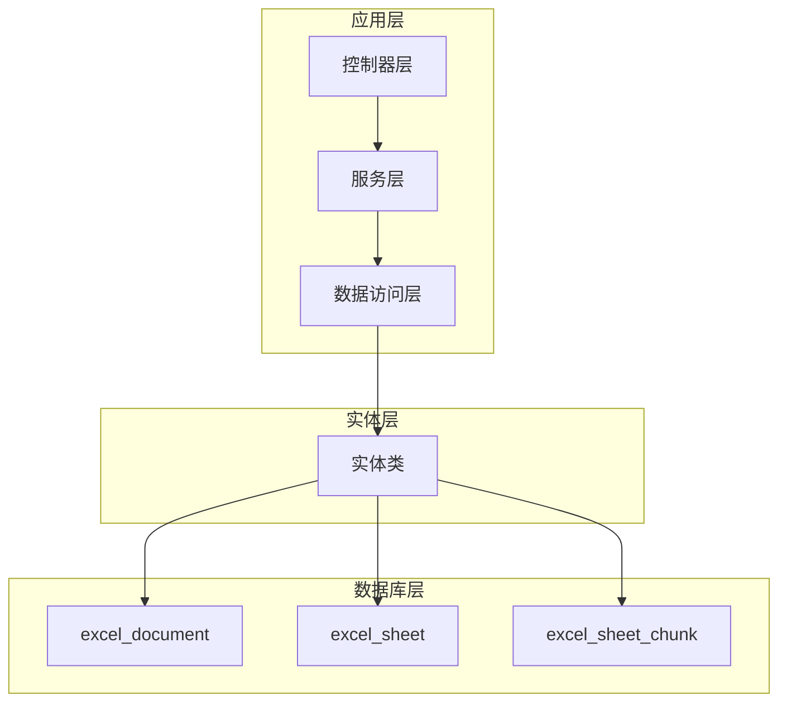
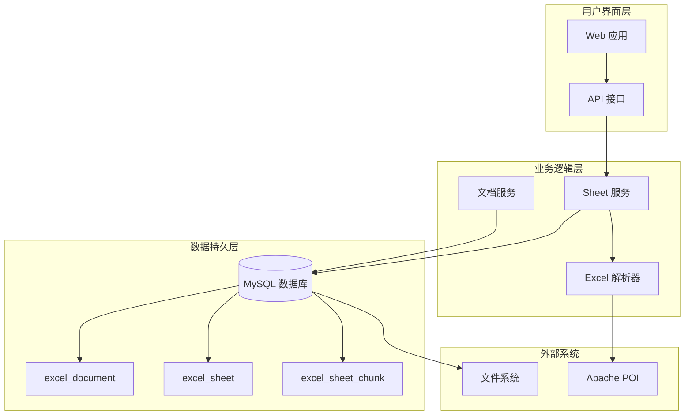
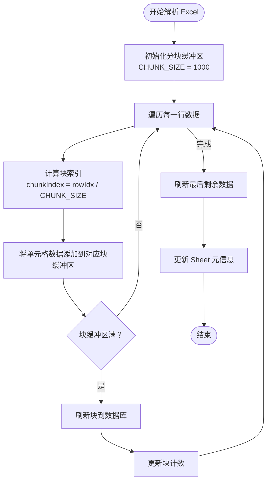
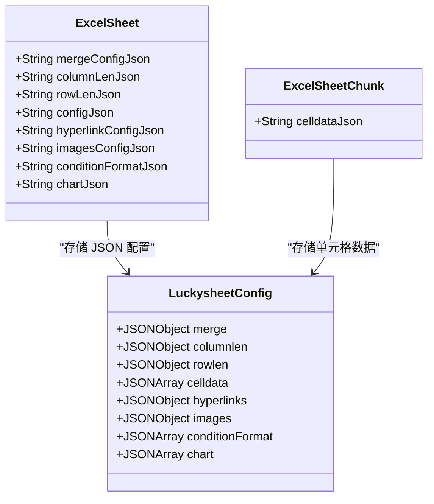
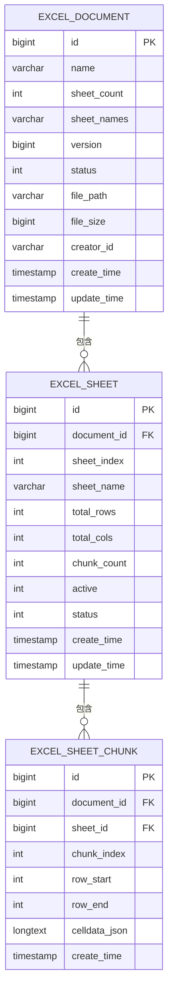
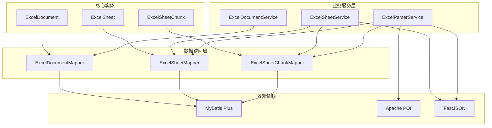
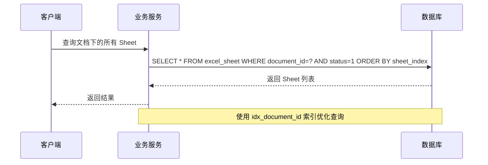
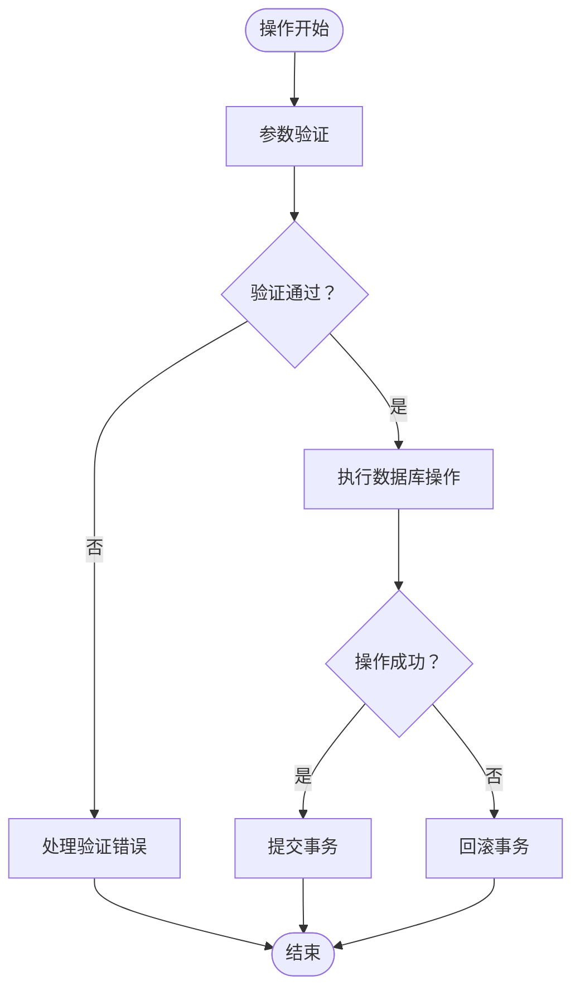

# 表结构设计

<cite>
**本文档引用的文件**
- [ExcelDocument.java](file://dataloom-server/src/main/java/com/demo/excel/entity/ExcelDocument.java)
- [ExcelSheet.java](file://dataloom-server/src/main/java/com/demo/excel/entity/ExcelSheet.java)
- [ExcelSheetChunk.java](file://dataloom-server/src/main/java/com/demo/excel/entity/ExcelSheetChunk.java)
- [schema.sql](file://dataloom-server/src/main/resources/schema.sql)
- [ExcelDocumentService.java](file://dataloom-server/src/main/java/com/demo/excel/service/ExcelDocumentService.java)
- [ExcelSheetService.java](file://dataloom-server/src/main/java/com/demo/excel/service/ExcelSheetService.java)
- [ExcelParserService.java](file://dataloom-server/src/main/java/com/demo/excel/service/ExcelParserService.java)
- [ExcelDocumentMapper.java](file://dataloom-server/src/main/java/com/demo/excel/mapper/ExcelDocumentMapper.java)
- [ExcelSheetMapper.java](file://dataloom-server/src/main/java/com/demo/excel/mapper/ExcelSheetMapper.java)
- [ExcelSheetChunkMapper.java](file://dataloom-server/src/main/java/com/demo/excel/mapper/ExcelSheetChunkMapper.java)
</cite>

## 目录
1. [简介](#简介)
2. [项目结构](#项目结构)
3. [核心组件](#核心组件)
4. [架构概览](#架构概览)
5. [详细组件分析](#详细组件分析)
6. [依赖分析](#依赖分析)
7. [性能考虑](#性能考虑)
8. [故障排除指南](#故障排除指南)
9. [结论](#结论)
10. [附录](#附录)

## 简介

本文档详细说明了 DataLoom 项目中 Excel 文档存储系统的三张核心表结构设计：excel_document、excel_sheet、excel_sheet_chunk。该设计采用分块存储策略，有效解决了十万级数据下单行存储过大的问题，确保了系统的高性能和可扩展性。

## 项目结构

DataLoom 项目采用标准的 Spring Boot 分层架构，数据库表结构设计贯穿整个应用层：



**图表来源**
- [ExcelDocument.java:1-55](file://dataloom-server/src/main/java/com/demo/excel/entity/ExcelDocument.java#L1-L55)
- [ExcelSheet.java:1-77](file://dataloom-server/src/main/java/com/demo/excel/entity/ExcelSheet.java#L1-L77)
- [ExcelSheetChunk.java:1-53](file://dataloom-server/src/main/java/com/demo/excel/entity/ExcelSheetChunk.java#L1-L53)

**章节来源**
- [ExcelDocument.java:1-55](file://dataloom-server/src/main/java/com/demo/excel/entity/ExcelDocument.java#L1-L55)
- [ExcelSheet.java:1-77](file://dataloom-server/src/main/java/com/demo/excel/entity/ExcelSheet.java#L1-L77)
- [ExcelSheetChunk.java:1-53](file://dataloom-server/src/main/java/com/demo/excel/entity/ExcelSheetChunk.java#L1-L53)

## 核心组件

### Excel 文档主表 (excel_document)

excel_document 表作为文档的元数据存储中心，采用精简设计原则，仅存储必要的文档基本信息：

| 字段名 | 数据类型 | 长度限制 | 默认值 | 说明 |
|--------|----------|----------|--------|------|
| id | BIGINT | - | - | 主键，自增标识符 |
| name | VARCHAR | 255 | - | 文档名称 |
| sheet_count | INT | - | 0 | Sheet 数量 |
| sheet_names | VARCHAR | 2000 | - | Sheet 名称列表（JSON 数组） |
| version | BIGINT | - | 1 | 乐观锁版本号 |
| status | INT | - | 1 | 状态：1正常 2回收站 3已删除 |
| file_path | VARCHAR | 500 | - | 原始文件本地路径 |
| file_size | BIGINT | - | 0 | 原始文件大小（字节） |
| creator_id | VARCHAR | 64 | 'demo-user' | 创建者标识 |
| create_time | TIMESTAMP | - | CURRENT_TIMESTAMP | 创建时间 |
| update_time | TIMESTAMP | - | CURRENT_TIMESTAMP | 更新时间 |

### Excel Sheet 元信息表 (excel_sheet)

excel_sheet 表存储每个 Sheet 的元信息和配置数据，采用 JSON 字段存储各种配置：

| 字段名 | 数据类型 | 长度限制 | 默认值 | 说明 |
|--------|----------|----------|--------|------|
| id | BIGINT | - | - | 主键，自增标识符 |
| document_id | BIGINT | - | - | 所属文档 ID（外键） |
| sheet_index | INT | - | 0 | Sheet 在 Workbook 中的原始下标（0起始） |
| sheet_name | VARCHAR | 255 | - | Sheet 名称 |
| total_rows | INT | - | 0 | 该 Sheet 总行数（含表头） |
| total_cols | INT | - | 0 | 该 Sheet 总列数 |
| chunk_count | INT | - | 0 | 分块数量 |
| merge_config_json | CLOB/LONGTEXT | - | - | 合并单元格配置 JSON |
| column_len_json | CLOB/LONGTEXT | - | - | 列宽配置 JSON |
| row_len_json | CLOB/LONGTEXT | - | - | 行高配置 JSON |
| config_json | CLOB/LONGTEXT | - | - | Luckysheet 完整 config JSON |
| hyperlink_config_json | CLOB/LONGTEXT | - | - | 超链接配置 JSON |
| images_config_json | CLOB/LONGTEXT | - | - | 图片配置 JSON |
| condition_format_json | CLOB/LONGTEXT | - | - | 条件格式配置 JSON |
| chart_json | CLOB/LONGTEXT | - | - | 图表配置 JSON |
| active | INT | - | 0 | 是否为活动 Sheet：1=是，0=否 |
| status | INT | - | 1 | 状态：1正常，3已删除 |
| create_time | TIMESTAMP/DATETIME | - | CURRENT_TIMESTAMP | 创建时间 |
| update_time | TIMESTAMP/DATETIME | - | CURRENT_TIMESTAMP | 更新时间 |

### Excel Sheet 数据分块表 (excel_sheet_chunk)

excel_sheet_chunk 表采用分块存储策略，将单元格数据按行范围切片存储：

| 字段名 | 数据类型 | 长度限制 | 默认值 | 说明 |
|--------|----------|----------|--------|------|
| id | BIGINT | - | - | 主键，自增标识符 |
| document_id | BIGINT | - | - | 所属文档 ID（冗余字段） |
| sheet_id | BIGINT | - | - | 所属 Sheet ID（外键） |
| chunk_index | INT | - | 0 | 块序号（0起始，按行范围升序） |
| row_start | INT | - | 0 | 该块包含的起始行号（含，0起始） |
| row_end | INT | - | 0 | 该块包含的结束行号（含，0起始） |
| celldata_json | CLOB/LONGTEXT | - | - | 单元格数据 JSON（Luckysheet celldata 格式） |
| create_time | TIMESTAMP/DATETIME | - | CURRENT_TIMESTAMP | 创建时间 |

**章节来源**
- [ExcelDocument.java:19-52](file://dataloom-server/src/main/java/com/demo/excel/entity/ExcelDocument.java#L19-L52)
- [ExcelSheet.java:18-74](file://dataloom-server/src/main/java/com/demo/excel/entity/ExcelSheet.java#L18-L74)
- [ExcelSheetChunk.java:22-51](file://dataloom-server/src/main/java/com/demo/excel/entity/ExcelSheetChunk.java#L22-L51)

## 架构概览

系统采用三层架构设计，通过分块存储策略实现高性能的 Excel 数据管理：



**图表来源**
- [ExcelParserService.java:25-87](file://dataloom-server/src/main/java/com/demo/excel/service/ExcelParserService.java#L25-L87)
- [ExcelSheetService.java:23-32](file://dataloom-server/src/main/java/com/demo/excel/service/ExcelSheetService.java#L23-L32)
- [ExcelDocumentService.java:13-18](file://dataloom-server/src/main/java/com/demo/excel/service/ExcelDocumentService.java#L13-L18)

## 详细组件分析

### 分块存储策略设计

系统采用基于行号的分块存储策略，每块包含固定数量的行数据：



**图表来源**
- [ExcelParserService.java:142-200](file://dataloom-server/src/main/java/com/demo/excel/service/ExcelParserService.java#L142-L200)
- [ExcelSheetService.java:318-346](file://dataloom-server/src/main/java/com/demo/excel/service/ExcelSheetService.java#L318-L346)

### JSON 字段存储方案

系统采用 JSON 字段存储各种配置信息，确保数据的完整性和灵活性：



**图表来源**
- [ExcelSheet.java:40-62](file://dataloom-server/src/main/java/com/demo/excel/entity/ExcelSheet.java#L40-L62)
- [ExcelSheetChunk.java:41-47](file://dataloom-server/src/main/java/com/demo/excel/entity/ExcelSheetChunk.java#L41-L47)

### 外键约束与关系映射

系统采用外键约束确保数据完整性，同时支持灵活的查询操作：



**图表来源**
- [schema.sql:8-66](file://dataloom-server/src/main/resources/schema.sql#L8-L66)
- [ExcelDocument.java:22](file://dataloom-server/src/main/java/com/demo/excel/entity/ExcelDocument.java#L22)
- [ExcelSheet.java:23](file://dataloom-server/src/main/java/com/demo/excel/entity/ExcelSheet.java#L23)
- [ExcelSheetChunk.java:27](file://dataloom-server/src/main/java/com/demo/excel/entity/ExcelSheetChunk.java#L27)

### 索引设计策略

系统采用多维度索引策略，优化不同场景下的查询性能：

| 索引类型 | 索引名称 | 字段组合 | 使用场景 | 设计考量 |
|----------|----------|----------|----------|----------|
| 主键索引 | PK_excel_document | id | 主键查询 | 必需，唯一标识 |
| 普通索引 | idx_status | status | 状态过滤 | 支持软删除查询 |
| 普通索引 | idx_creator | creator_id | 用户筛选 | 支持按创建者查询 |
| 主键索引 | PK_excel_sheet | id | 主键查询 | 必需，唯一标识 |
| 普通索引 | idx_document_id | document_id | 文档关联查询 | 支持文档级操作 |
| 主键索引 | PK_excel_sheet_chunk | id | 主键查询 | 必需，唯一标识 |
| 普通索引 | idx_sheet_id | sheet_id | Sheet 数据查询 | 支持按 Sheet 查询 |
| 普通索引 | idx_document_id | document_id | 文档级清理 | 支持级联删除 |
| 复合索引 | idx_sheet_chunk | sheet_id, chunk_index | 分块查询 | 优化分块定位 |

**章节来源**
- [schema.sql:84-123](file://dataloom-server/src/main/resources/schema.sql#L84-L123)
- [ExcelSheetService.java:67-72](file://dataloom-server/src/main/java/com/demo/excel/service/ExcelSheetService.java#L67-L72)

## 依赖分析

系统各组件间存在清晰的依赖关系，遵循单一职责原则：



**图表来源**
- [ExcelDocumentMapper.java:1-11](file://dataloom-server/src/main/java/com/demo/excel/mapper/ExcelDocumentMapper.java#L1-L11)
- [ExcelSheetMapper.java:1-13](file://dataloom-server/src/main/java/com/demo/excel/mapper/ExcelSheetMapper.java#L1-L13)
- [ExcelSheetChunkMapper.java:1-13](file://dataloom-server/src/main/java/com/demo/excel/mapper/ExcelSheetChunkMapper.java#L1-L13)
- [ExcelDocumentService.java:22-23](file://dataloom-server/src/main/java/com/demo/excel/service/ExcelDocumentService.java#L22-L23)
- [ExcelSheetService.java:36-43](file://dataloom-server/src/main/java/com/demo/excel/service/ExcelSheetService.java#L36-L43)
- [ExcelParserService.java:46-50](file://dataloom-server/src/main/java/com/demo/excel/service/ExcelParserService.java#L46-L50)

**章节来源**
- [ExcelDocumentService.java:13-119](file://dataloom-server/src/main/java/com/demo/excel/service/ExcelDocumentService.java#L13-L119)
- [ExcelSheetService.java:23-443](file://dataloom-server/src/main/java/com/demo/excel/service/ExcelSheetService.java#L23-L443)
- [ExcelParserService.java:25-348](file://dataloom-server/src/main/java/com/demo/excel/service/ExcelParserService.java#L25-L348)

## 性能考虑

### 分块存储性能优化

系统采用 1000 行为单位的分块策略，有效平衡了内存使用和查询性能：

- **内存效率**：每块约 1000 行数据，单块 JSON 通常在几百 KB 以内
- **查询性能**：支持按需加载，避免一次性加载大量数据
- **并发处理**：分块设计便于并行处理和缓存管理

### 索引优化策略

针对不同查询模式设计了专门的索引策略：



**图表来源**
- [ExcelSheetService.java:51-57](file://dataloom-server/src/main/java/com/demo/excel/service/ExcelSheetService.java#L51-L57)

### 缓存策略

系统采用多层缓存策略：

1. **应用层缓存**：热点 Sheet 元信息缓存
2. **数据库层缓存**：MySQL 查询缓存
3. **文件系统缓存**：原始 Excel 文件缓存

## 故障排除指南

### 常见问题及解决方案

| 问题类型 | 症状描述 | 可能原因 | 解决方案 |
|----------|----------|----------|----------|
| 分块数据丢失 | 查询到的单元格数据不完整 | 分块索引计算错误 | 检查 chunkIndex 计算逻辑 |
| 性能问题 | 查询响应时间过长 | 缺少必要索引 | 添加或优化相关索引 |
| 内存溢出 | 处理大文件时内存不足 | 单次加载过多数据 | 调整 CHUNK_SIZE 参数 |
| 数据不一致 | 不同查询结果不一致 | 并发更新导致 | 使用事务和乐观锁 |

### 错误处理机制

系统实现了完善的错误处理机制：



**图表来源**
- [ExcelSheetService.java:103-212](file://dataloom-server/src/main/java/com/demo/excel/service/ExcelSheetService.java#L103-L212)

**章节来源**
- [ExcelSheetService.java:86-103](file://dataloom-server/src/main/java/com/demo/excel/service/ExcelSheetService.java#L86-L103)
- [ExcelParserService.java:274-277](file://dataloom-server/src/main/java/com/demo/excel/service/ExcelParserService.java#L274-L277)

## 结论

DataLoom 项目的数据库表结构设计体现了现代数据存储的最佳实践：

1. **分块存储策略**：有效解决了大规模数据存储的性能瓶颈
2. **JSON 字段设计**：提供了灵活的数据存储方案
3. **索引优化策略**：针对不同查询场景进行了专门优化
4. **外键约束设计**：确保了数据的完整性和一致性
5. **多数据库兼容**：提供了 MySQL 和 H2 的兼容方案

该设计在保证功能完整性的同时，最大化地提升了系统的性能和可维护性，为大规模 Excel 数据处理提供了可靠的基础设施。

## 附录

### MySQL 兼容建表语句

```sql
-- Excel 文档主表（只存元数据）
CREATE TABLE IF NOT EXISTS excel_document (
    id              BIGINT AUTO_INCREMENT PRIMARY KEY COMMENT '主键',
    name            VARCHAR(255)   NOT NULL COMMENT '文档名称',
    sheet_count     INT            DEFAULT 0 COMMENT 'Sheet 数量',
    sheet_names     VARCHAR(2000)  COMMENT 'Sheet 名称列表 JSON',
    version         BIGINT         DEFAULT 1 COMMENT '乐观锁版本号',
    status          TINYINT        DEFAULT 1 COMMENT '1正常 2回收站 3已删除',
    file_path       VARCHAR(500)   COMMENT '原始文件路径',
    file_size       BIGINT         DEFAULT 0 COMMENT '文件大小(字节)',
    creator_id      VARCHAR(64)    DEFAULT 'demo-user' COMMENT '创建者',
    create_time     DATETIME       DEFAULT CURRENT_TIMESTAMP COMMENT '创建时间',
    update_time     DATETIME       DEFAULT CURRENT_TIMESTAMP ON UPDATE CURRENT_TIMESTAMP COMMENT '更新时间',
    INDEX idx_status (status),
    INDEX idx_creator (creator_id)
) ENGINE=InnoDB DEFAULT CHARSET=utf8mb4 COMMENT='Excel 文档主表（只存元数据）';

-- Excel Sheet 元信息表
CREATE TABLE IF NOT EXISTS excel_sheet (
    id                  BIGINT AUTO_INCREMENT PRIMARY KEY COMMENT '主键',
    document_id         BIGINT         NOT NULL COMMENT '所属文档 ID',
    sheet_index         INT            DEFAULT 0 COMMENT 'Sheet 下标（0起始）',
    sheet_name          VARCHAR(255)   NOT NULL COMMENT 'Sheet 名称',
    total_rows          INT            DEFAULT 0 COMMENT '总行数',
    total_cols          INT            DEFAULT 0 COMMENT '总列数',
    chunk_count         INT            DEFAULT 0 COMMENT '分块数量',
    merge_config_json   LONGTEXT       COMMENT '合并单元格配置 JSON',
    column_len_json     LONGTEXT       COMMENT '列宽配置 JSON',
    row_len_json        LONGTEXT       COMMENT '行高配置 JSON',
    config_json         LONGTEXT       COMMENT 'Luckysheet 完整 config JSON',
    hyperlink_config_json LONGTEXT     COMMENT 'Luckysheet 超链接配置 JSON',
    images_config_json  LONGTEXT       COMMENT 'Luckysheet 图片配置 JSON',
    condition_format_json LONGTEXT     COMMENT 'Luckysheet 条件格式配置 JSON',
    chart_json          LONGTEXT       COMMENT 'Luckysheet 图表配置 JSON',
    active              TINYINT        DEFAULT 0 COMMENT '是否激活：1是 0否',
    status              TINYINT        DEFAULT 1 COMMENT '1正常 3已删除',
    create_time         DATETIME       DEFAULT CURRENT_TIMESTAMP COMMENT '创建时间',
    update_time         DATETIME       DEFAULT CURRENT_TIMESTAMP ON UPDATE CURRENT_TIMESTAMP COMMENT '更新时间',
    INDEX idx_document_id (document_id)
) ENGINE=InnoDB DEFAULT CHARSET=utf8mb4 COMMENT='Excel Sheet 元信息表';

-- Excel Sheet 数据分块表（每块约1000行）
CREATE TABLE IF NOT EXISTS excel_sheet_chunk (
    id              BIGINT AUTO_INCREMENT PRIMARY KEY COMMENT '主键',
    document_id     BIGINT         NOT NULL COMMENT '所属文档 ID（冗余，方便级联删除）',
    sheet_id        BIGINT         NOT NULL COMMENT '所属 Sheet ID',
    chunk_index     INT            DEFAULT 0 COMMENT '块序号（0起始）',
    row_start       INT            DEFAULT 0 COMMENT '起始行号（含）',
    row_end         INT            DEFAULT 0 COMMENT '结束行号（含）',
    celldata_json   LONGTEXT       COMMENT '单元格数据 JSON（Luckysheet celldata 格式）',
    create_time     DATETIME       DEFAULT CURRENT_TIMESTAMP,
    INDEX idx_sheet_id (sheet_id),
    INDEX idx_document_id (document_id),
    INDEX idx_chunk_index (sheet_id, chunk_index)
) ENGINE=InnoDB DEFAULT CHARSET=utf8mb4 COMMENT='Excel Sheet 数据分块表（每块约1000行）';
```

**章节来源**
- [schema.sql:70-124](file://dataloom-server/src/main/resources/schema.sql#L70-L124)