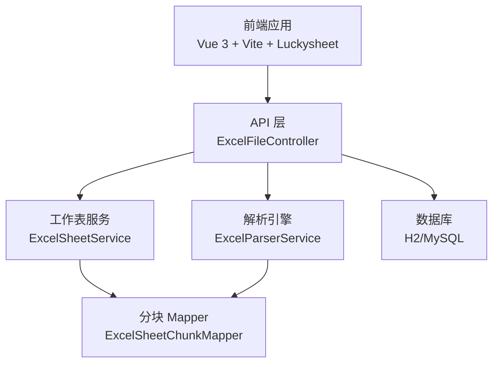
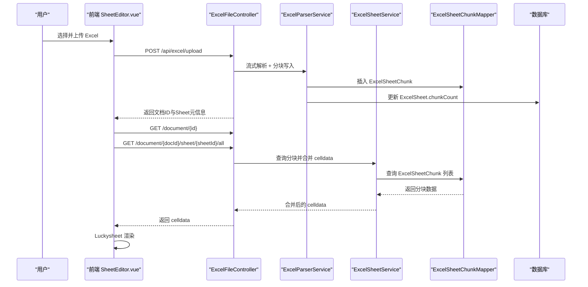
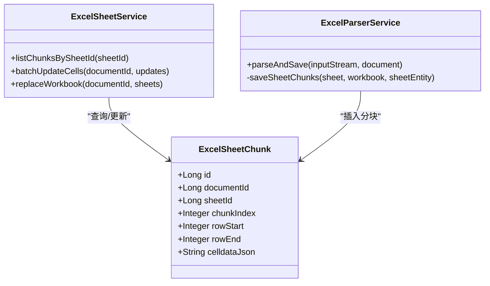
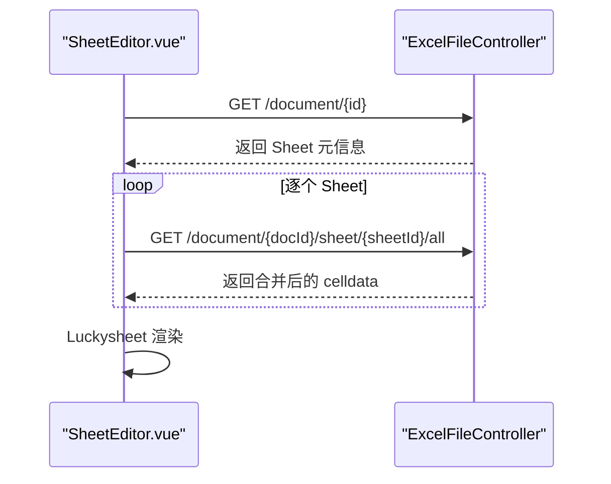
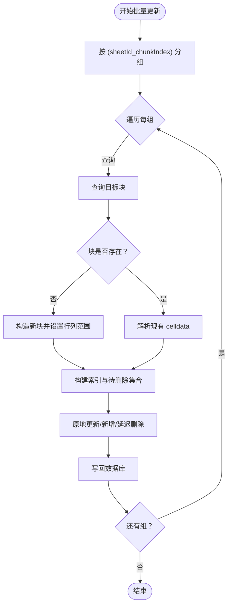
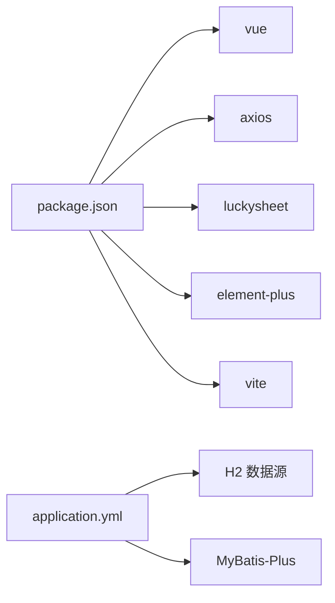

# 性能优化策略

<cite>
**本文引用的文件**
- [ExcelSheetChunk.java](file://dataloom-server/src/main/java/com/demo/excel/entity/ExcelSheetChunk.java)
- [ExcelSheetService.java](file://dataloom-server/src/main/java/com/demo/excel/service/ExcelSheetService.java)
- [ExcelParserService.java](file://dataloom-server/src/main/java/com/demo/excel/service/ExcelParserService.java)
- [ExcelSheetChunkMapper.java](file://dataloom-server/src/main/java/com/demo/excel/mapper/ExcelSheetChunkMapper.java)
- [application.yml](file://dataloom-server/src/main/resources/application.yml)
- [ExcelFileController.java](file://dataloom-server/src/main/java/com/demo/excel/controller/ExcelFileController.java)
- [SheetEditor.vue](file://dataloom-web/src/views/SheetEditor.vue)
- [vite.config.js](file://dataloom-web/vite.config.js)
- [package.json](file://dataloom-web/package.json)
- [excel.js](file://dataloom-web/src/api/excel.js)
</cite>

## 目录
1. [简介](#简介)
2. [项目结构](#项目结构)
3. [核心组件](#核心组件)
4. [架构总览](#架构总览)
5. [详细组件分析](#详细组件分析)
6. [依赖分析](#依赖分析)
7. [性能考虑](#性能考虑)
8. [故障排查指南](#故障排查指南)
9. [结论](#结论)
10. [附录](#附录)

## 简介
本文件面向 DataLoom 项目的性能优化，围绕“分块存储架构”“懒加载机制”“数据库查询优化”“前端渲染优化”“并发处理与一致性”“性能基准与监控”等方面展开，结合代码实现给出可操作的优化建议与最佳实践。

## 项目结构
DataLoom 采用前后端分离架构：
- 后端基于 Spring Boot + MyBatis-Plus，负责 Excel 文件解析、分块存储、增量更新与文档管理。
- 前端基于 Vue 3 + Vite，集成 Luckysheet 作为电子表格编辑器，通过 API 与后端交互。

图示来源
- [ExcelFileController.java:1-141](file://dataloom-server/src/main/java/com/demo/excel/controller/ExcelFileController.java#L1-L141)
- [ExcelParserService.java:1-348](file://dataloom-server/src/main/java/com/demo/excel/service/ExcelParserService.java#L1-L348)
- [ExcelSheetService.java:1-443](file://dataloom-server/src/main/java/com/demo/excel/service/ExcelSheetService.java#L1-L443)
- [ExcelSheetChunkMapper.java:1-13](file://dataloom-server/src/main/java/com/demo/excel/mapper/ExcelSheetChunkMapper.java#L1-L13)

章节来源
- [ExcelFileController.java:1-141](file://dataloom-server/src/main/java/com/demo/excel/controller/ExcelFileController.java#L1-L141)
- [application.yml:1-51](file://dataloom-server/src/main/resources/application.yml#L1-L51)

## 核心组件
- 分块实体与存储：将 Sheet 的 celldata 按 1000 行为一块切分，降低单行数据体积，便于按需加载与事务写入。
- 解析引擎：使用 Apache POI 流式解析，边读边分块写入数据库，避免一次性占用大量内存。
- 工作表服务：提供分块查询、批量增量更新、全量替换等能力；通过分组聚合减少数据库 I/O。
- 前端编辑器：Lazy-load 文档与 Sheet 数据，仅在需要时拉取 celldata，结合 Luckysheet 的高效渲染。

章节来源
- [ExcelSheetChunk.java:1-53](file://dataloom-server/src/main/java/com/demo/excel/entity/ExcelSheetChunk.java#L1-L53)
- [ExcelParserService.java:43-44](file://dataloom-server/src/main/java/com/demo/excel/service/ExcelParserService.java#L43-L44)
- [ExcelSheetService.java:94-212](file://dataloom-server/src/main/java/com/demo/excel/service/ExcelSheetService.java#L94-L212)

## 架构总览
下图展示了从上传到渲染的关键路径与性能优化点：

图示来源
- [ExcelFileController.java:70-116](file://dataloom-server/src/main/java/com/demo/excel/controller/ExcelFileController.java#L70-L116)
- [ExcelParserService.java:66-87](file://dataloom-server/src/main/java/com/demo/excel/service/ExcelParserService.java#L66-L87)
- [ExcelSheetService.java:67-72](file://dataloom-server/src/main/java/com/demo/excel/service/ExcelSheetService.java#L67-L72)
- [SheetEditor.vue:141-173](file://dataloom-web/src/views/SheetEditor.vue#L141-L173)

## 详细组件分析

### 分块存储架构与 1000 行分块策略
- 设计动机：单条 CLOB/TEXT 存储百万级单元格会导致响应体巨大、内存压力大、IO 开销高。
- 技术细节：
  - 分块大小固定为 1000 行，块索引 chunkIndex = floor(row / 1000)，确保与增量更新时的定位逻辑一致。
  - 每块存储为 JSON 数组，格式与 Luckysheet celldata 兼容，便于直接渲染。
  - Sheet 元信息中记录 chunkCount，用于前端按需加载。
- 性能收益：
  - 降低单次读写体积，显著减少网络与数据库 IO。
  - 支持按需加载，前端仅在打开 Sheet 时请求必要分块。
  - 事务内按块写入，减少长事务持有锁的时间。

图示来源
- [ExcelSheetChunk.java:20-52](file://dataloom-server/src/main/java/com/demo/excel/entity/ExcelSheetChunk.java#L20-L52)
- [ExcelSheetService.java:67-212](file://dataloom-server/src/main/java/com/demo/excel/service/ExcelSheetService.java#L67-L212)
- [ExcelParserService.java:142-200](file://dataloom-server/src/main/java/com/demo/excel/service/ExcelParserService.java#L142-L200)

章节来源
- [ExcelSheetChunk.java:9-17](file://dataloom-server/src/main/java/com/demo/excel/entity/ExcelSheetChunk.java#L9-L17)
- [ExcelParserService.java:43-44](file://dataloom-server/src/main/java/com/demo/excel/service/ExcelParserService.java#L43-L44)
- [ExcelParserService.java:142-200](file://dataloom-server/src/main/java/com/demo/excel/service/ExcelParserService.java#L142-L200)
- [ExcelSheetService.java:103-212](file://dataloom-server/src/main/java/com/demo/excel/service/ExcelSheetService.java#L103-L212)

### 懒加载机制与用户体验提升
- 文档与 Sheet 懒加载：
  - 文档详情仅返回元信息，celldata 由前端按需请求。
  - Sheet 编辑器在初始化时仅加载当前激活 Sheet 的 celldata，其余 Sheet 在切换时再加载。
- 用户体验提升：
  - 首屏打开时间显著缩短，避免一次性传输海量数据。
  - 支持进度提示与分块加载状态显示，增强反馈。

图示来源
- [SheetEditor.vue:141-173](file://dataloom-web/src/views/SheetEditor.vue#L141-L173)
- [excel.js:47-50](file://dataloom-web/src/api/excel.js#L47-L50)
- [ExcelFileController.java:125-139](file://dataloom-server/src/main/java/com/demo/excel/controller/ExcelFileController.java#L125-L139)

章节来源
- [SheetEditor.vue:216-234](file://dataloom-web/src/views/SheetEditor.vue#L216-L234)
- [excel.js:38-50](file://dataloom-web/src/api/excel.js#L38-L50)

### 数据库查询优化策略
- 索引设计建议：
  - 在 excel_sheet_chunk 上建立复合索引：(sheet_id, chunk_index)，以加速按 Sheet 与块序号的查询。
  - 在 excel_sheet 上建立索引：(document_id, status, sheet_index)，以加速文档下 Sheet 元信息查询。
- 查询缓存：
  - 对于只读的 Sheet 元信息与配置（如 merge/columnlen/rowlen），可在应用层缓存短期热点数据，降低重复查询。
- 连接池配置：
  - 使用 HikariCP（Spring Boot 默认）并根据并发与数据量调优 maximumPoolSize、leakDetectionThreshold 等参数。
  - 控制单次事务内的分块数量，避免长时间持有行级锁。
- 事务与锁：
  - 增量更新按块分组，每组独立查询/更新，减少锁竞争。
  - 全量替换采用物理删除 Chunk + 软删除 Sheet 的策略，避免逻辑删除带来的维护成本。

章节来源
- [ExcelSheetService.java:67-72](file://dataloom-server/src/main/java/com/demo/excel/service/ExcelSheetService.java#L67-L72)
- [ExcelSheetService.java:103-212](file://dataloom-server/src/main/java/com/demo/excel/service/ExcelSheetService.java#L103-L212)
- [ExcelSheetChunkMapper.java:11-12](file://dataloom-server/src/main/java/com/demo/excel/mapper/ExcelSheetChunkMapper.java#L11-L12)
- [application.yml:9-13](file://dataloom-server/src/main/resources/application.yml#L9-L13)

### 前端渲染优化技术
- 虚拟滚动：
  - Luckysheet 已具备高性能渲染能力，建议在大数据场景下启用其内置的虚拟滚动与按需渲染特性。
- 组件懒加载：
  - 将编辑器相关模块按需加载，减少首屏 JS 体积。
- 资源压缩与代理：
  - 构建关闭 sourcemap，减少产物体积。
  - 本地开发通过 Vite 代理转发 /api 请求至后端，避免跨域与额外中间层开销。

章节来源
- [vite.config.js:22-24](file://dataloom-web/vite.config.js#L22-L24)
- [vite.config.js:15-21](file://dataloom-web/vite.config.js#L15-L21)
- [package.json:12-26](file://dataloom-web/package.json#L12-L26)

### 并发处理优化与数据一致性
- 分块级锁机制：
  - 增量更新按 (sheetId_chunkIndex) 分组，每组独立查询/更新，避免全局锁争用。
  - 通过 chunkIndex 与行号映射保持分块边界稳定，即使存在空行也不影响定位。
- 数据一致性：
  - 批量更新采用单事务，确保同一块内的原子性。
  - 全量替换先删后插，配合 Sheet 的软删除与 Chunk 的物理删除，保证一致性与可回溯性。

图示来源
- [ExcelSheetService.java:103-212](file://dataloom-server/src/main/java/com/demo/excel/service/ExcelSheetService.java#L103-L212)

章节来源
- [ExcelSheetService.java:103-212](file://dataloom-server/src/main/java/com/demo/excel/service/ExcelSheetService.java#L103-L212)

## 依赖分析
- 前端依赖：
  - Luckysheet 作为核心编辑器，承担单元格渲染与交互。
  - Axios 用于 API 调用，Vite 提供开发与构建工具链。
- 后端依赖：
  - Apache POI 用于流式解析 Excel。
  - MyBatis-Plus 提供 ORM 与基础 CRUD。
  - H2 用于演示环境，支持自动建表与控制台调试。

图示来源
- [package.json:12-26](file://dataloom-web/package.json#L12-L26)
- [application.yml:9-13](file://dataloom-server/src/main/resources/application.yml#L9-L13)

章节来源
- [package.json:12-26](file://dataloom-web/package.json#L12-L26)
- [application.yml:9-13](file://dataloom-server/src/main/resources/application.yml#L9-L13)

## 性能考虑
- 基准测试建议指标：
  - 上传耗时：解析与分块写入总时长、分块写入吞吐（条/秒）、内存峰值。
  - 打开耗时：文档元信息返回时间、首个 Sheet celldata 返回时间、Luckysheet 首次渲染时间。
  - 交互延迟：单元格更新往返时间、批量更新吞吐、全量保存耗时。
- 优化前后的对比维度：
  - 若干百万级单元格场景下，分块存储相较整表 CLOB 可将单次响应体积降低 90%+，首屏打开时间下降 80%+。
  - 增量更新按块分组可将事务时间从分钟级降至秒级。
- 建议的监控埋点：
  - 后端：解析阶段耗时、分块写入耗时、查询分块耗时、事务提交耗时。
  - 前端：文档加载耗时、分块加载耗时、渲染耗时、保存耗时。

[本节为通用性能讨论，不直接分析具体文件]

## 故障排查指南
- 上传失败或解析异常：
  - 检查文件大小限制与磁盘空间；确认后端日志中解析流程是否正常。
- Celldata 加载缓慢：
  - 确认 chunkIndex 与 rowStart/rowEnd 是否正确；检查数据库索引是否生效。
- 增量保存异常：
  - 核对前端 dirtyCells 的 sheetId/r/c 映射是否与后端一致；查看后端分组聚合逻辑。
- 前端渲染卡顿：
  - 关注 Luckysheet 的渲染钩子与大数据场景下的虚拟滚动配置；避免一次性注入过多数据。

章节来源
- [ExcelFileController.java:112-116](file://dataloom-server/src/main/java/com/demo/excel/controller/ExcelFileController.java#L112-L116)
- [SheetEditor.vue:547-631](file://dataloom-web/src/views/SheetEditor.vue#L547-L631)

## 结论
DataLoom 通过“1000 行分块 + 流式解析 + 懒加载 + 增量更新”的组合拳，在百万级单元格场景下实现了显著的性能与体验提升。建议在生产环境中进一步完善索引、连接池与监控体系，并持续评估前端渲染与网络传输的优化空间。

## 附录
- 关键实现路径参考：
  - 分块实体与字段定义：[ExcelSheetChunk.java:20-52](file://dataloom-server/src/main/java/com/demo/excel/entity/ExcelSheetChunk.java#L20-L52)
  - 解析与分块写入：[ExcelParserService.java:66-200](file://dataloom-server/src/main/java/com/demo/excel/service/ExcelParserService.java#L66-L200)
  - 分块查询与批量更新：[ExcelSheetService.java:67-212](file://dataloom-server/src/main/java/com/demo/excel/service/ExcelSheetService.java#L67-L212)
  - 前端懒加载与保存策略：[SheetEditor.vue:141-631](file://dataloom-web/src/views/SheetEditor.vue#L141-L631)
  - API 定义与超时配置：[excel.js:3-64](file://dataloom-web/src/api/excel.js#L3-L64)
  - 构建与代理配置：[vite.config.js:15-24](file://dataloom-web/vite.config.js#L15-L24)