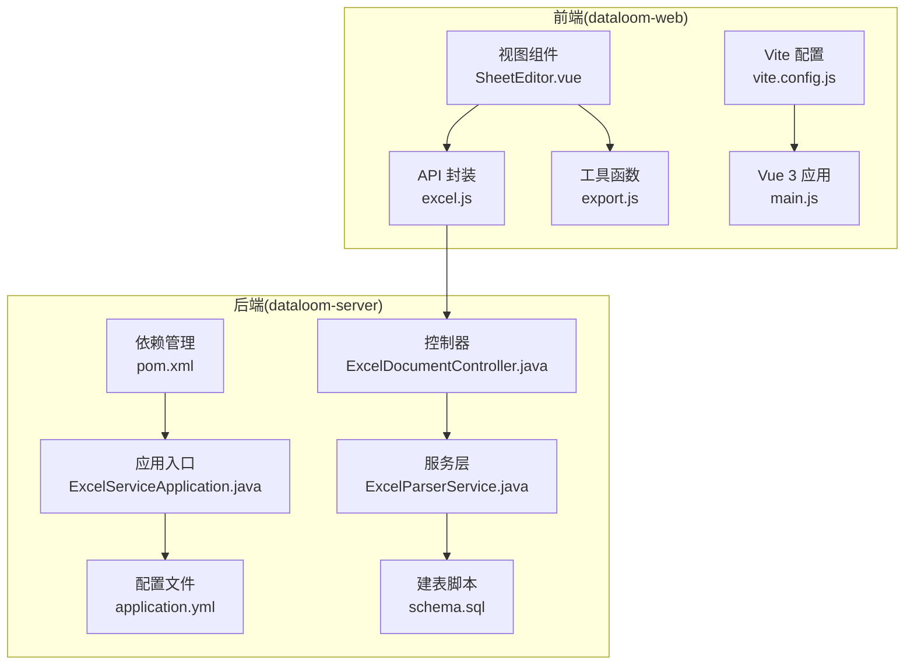
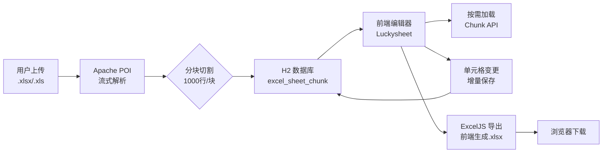
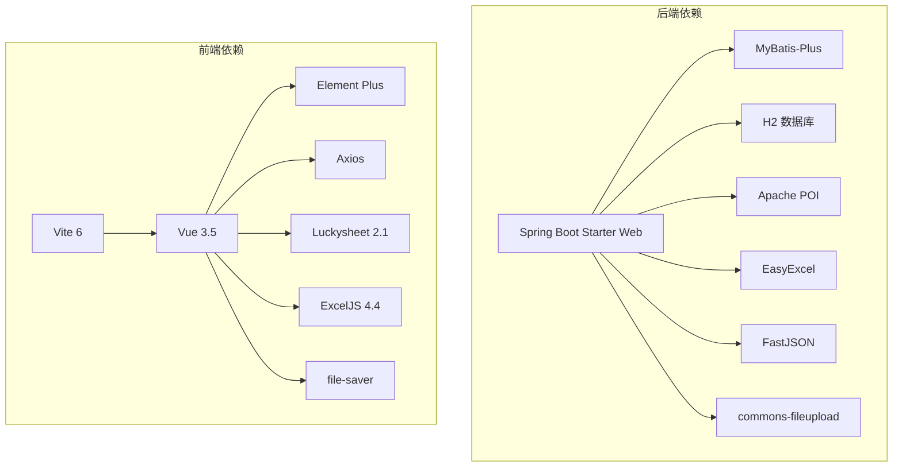

# 技术选型说明

<cite>
**本文档引用的文件**
- [pom.xml](file://dataloom-server/pom.xml)
- [package.json](file://dataloom-web/package.json)
- [ExcelServiceApplication.java](file://dataloom-server/src/main/java/com/demo/excel/ExcelServiceApplication.java)
- [vite.config.js](file://dataloom-web/vite.config.js)
- [README.md](file://README.md)
- [ExcelDocumentController.java](file://dataloom-server/src/main/java/com/demo/excel/controller/ExcelDocumentController.java)
- [ExcelParserService.java](file://dataloom-server/src/main/java/com/demo/excel/service/ExcelParserService.java)
- [SheetEditor.vue](file://dataloom-web/src/views/SheetEditor.vue)
- [export.js](file://dataloom-web/src/utils/export.js)
- [application.yml](file://dataloom-server/src/main/resources/application.yml)
- [schema.sql](file://dataloom-server/src/main/resources/schema.sql)
- [excel.js](file://dataloom-web/src/api/excel.js)
</cite>

## 目录
1. [简介](#简介)
2. [项目结构](#项目结构)
3. [核心组件](#核心组件)
4. [架构概览](#架构概览)
5. [关键技术选型分析](#关键技术选型分析)
6. [依赖关系分析](#依赖关系分析)
7. [性能考量](#性能考量)
8. [故障排查指南](#故障排查指南)
9. [结论](#结论)

## 简介
DataLoom 是一个从零构建的在线 Excel 协作编辑系统，旨在实现“上传、编辑、导出”的全流程体验，并在十万级数据规模下保持流畅性能。项目采用前后端分离架构：
- 后端：Spring Boot 2.1 + MyBatis-Plus 3.3，负责 Excel 文件解析、分块存储、REST API 提供
- 前端：Vue 3.5 + Vite 6，负责 Luckysheet 在线编辑器集成、ExcelJS 导出、UI 交互
- 数据库：H2（开发环境）或可平滑迁移到 MySQL/PostgreSQL
- 解析与导出：Apache POI 4.1（服务端解析）、ExcelJS 4.4（前端导出）

## 项目结构
项目分为两个主要模块：
- dataloom-server：Spring Boot 后端，包含控制器、服务、Mapper、实体、资源文件
- dataloom-web：Vue 3 前端，包含路由、API 封装、工具函数、视图组件

**图表来源**
- [ExcelServiceApplication.java:13-20](file://dataloom-server/src/main/java/com/demo/excel/ExcelServiceApplication.java#L13-L20)
- [application.yml:1-51](file://dataloom-server/src/main/resources/application.yml#L1-L51)
- [schema.sql:1-124](file://dataloom-server/src/main/resources/schema.sql#L1-L124)
- [ExcelDocumentController.java:22-24](file://dataloom-server/src/main/java/com/demo/excel/controller/ExcelDocumentController.java#L22-L24)
- [ExcelParserService.java:38-39](file://dataloom-server/src/main/java/com/demo/excel/service/ExcelParserService.java#L38-L39)
- [excel.js:1-79](file://dataloom-web/src/api/excel.js#L1-L79)
- [SheetEditor.vue:1-80](file://dataloom-web/src/views/SheetEditor.vue#L1-L80)
- [export.js:1-239](file://dataloom-web/src/utils/export.js#L1-L239)
- [vite.config.js:1-26](file://dataloom-web/vite.config.js#L1-L26)
- [pom.xml:1-127](file://dataloom-server/pom.xml#L1-L127)

**章节来源**
- [README.md:217-242](file://README.md#L217-L242)

## 核心组件
- 后端应用入口：扫描 Mapper 包，启动 Spring Boot 应用
- 配置中心：H2 数据源、MyBatis-Plus 全局配置、文件上传大小限制、日志级别
- 数据模型：文档、工作表、分块三层结构，解决大文件 JSON 字段膨胀问题
- 控制器：提供文档 CRUD、单元格读写、工作簿全量保存等接口
- 服务层：基于 Apache POI 流式解析 Excel，按 1000 行分块存储，支持公式、日期、布尔、合并单元格等

**章节来源**
- [ExcelServiceApplication.java:13-20](file://dataloom-server/src/main/java/com/demo/excel/ExcelServiceApplication.java#L13-L20)
- [application.yml:1-51](file://dataloom-server/src/main/resources/application.yml#L1-L51)
- [schema.sql:8-66](file://dataloom-server/src/main/resources/schema.sql#L8-L66)
- [ExcelDocumentController.java:22-24](file://dataloom-server/src/main/java/com/demo/excel/controller/ExcelDocumentController.java#L22-L24)
- [ExcelParserService.java:38-39](file://dataloom-server/src/main/java/com/demo/excel/service/ExcelParserService.java#L38-L39)

## 架构概览
DataLoom 的数据流遵循“上传解析 → 分块存储 → 懒加载 → 增量保存 → 前端导出”的闭环。

**图表来源**
- [README.md:88-106](file://README.md#L88-L106)
- [ExcelParserService.java:66-87](file://dataloom-server/src/main/java/com/demo/excel/service/ExcelParserService.java#L66-L87)
- [ExcelDocumentController.java:139-161](file://dataloom-server/src/main/java/com/demo/excel/controller/ExcelDocumentController.java#L139-L161)
- [SheetEditor.vue:547-631](file://dataloom-web/src/views/SheetEditor.vue#L547-L631)
- [export.js:4-28](file://dataloom-web/src/utils/export.js#L4-L28)

## 关键技术选型分析

### Spring Boot 2.1 + MyBatis-Plus 3.3 组合优势
- 开发效率
  - Spring Boot 自动装配简化配置，快速启动与调试
  - MyBatis-Plus 提供通用 Mapper 与分页插件，减少样板代码
  - 事务注解与全局异常处理降低重复代码
- ORM 功能
  - 逻辑删除、自动 ID、驼峰映射等全局配置提升一致性
  - 分块存储模型天然契合 MyBatis-Plus 的批量插入与条件查询
- 与项目契合点
  - H2 嵌入式数据库零配置，便于演示与测试
  - 事务包裹解析过程，保证数据一致性

**章节来源**
- [pom.xml:15-44](file://dataloom-server/pom.xml#L15-L44)
- [application.yml:32-41](file://dataloom-server/src/main/resources/application.yml#L32-L41)
- [ExcelParserService.java:66-87](file://dataloom-server/src/main/java/com/demo/excel/service/ExcelParserService.java#L66-L87)

### Vue 3.5 + Vite 6 现代化前端技术栈
- Composition API 的优势
  - 更强的逻辑复用与模块化组织，便于维护大型编辑器状态
  - 响应式组合与生命周期钩子清晰，利于复杂交互（如 Luckysheet 集成）
- ESM 模块化特性
  - Vite 原生支持 ES 模块，热更新与按需打包性能优异
  - 与现代浏览器原生生态无缝衔接
- 与项目契合点
  - 与后端 API 约定清晰，Axios 封装统一错误处理
  - 导出工具函数独立封装，职责单一

**章节来源**
- [package.json:12-25](file://dataloom-web/package.json#L12-L25)
- [vite.config.js:1-26](file://dataloom-web/vite.config.js#L1-L26)
- [excel.js:1-79](file://dataloom-web/src/api/excel.js#L1-L79)

### Apache POI 4.1 在 Excel 解析方面的技术优势
- 流式解析与内存友好
  - 使用 WorkbookFactory 逐行读取，避免一次性加载整表导致内存溢出
- 复杂格式支持
  - 公式计算、日期格式、布尔值、合并单元格、列宽/行高等配置完整保留
  - 通过 FormulaEvaluator 计算单元格值，兼容多种数据类型
- 与分块存储的契合
  - 按行号直接确定分块索引，保证与前端增量更新逻辑一致

**章节来源**
- [pom.xml:61-71](file://dataloom-server/pom.xml#L61-L71)
- [ExcelParserService.java:70-87](file://dataloom-server/src/main/java/com/demo/excel/service/ExcelParserService.java#L70-L87)
- [ExcelParserService.java:142-200](file://dataloom-server/src/main/java/com/demo/excel/service/ExcelParserService.java#L142-L200)

### Luckysheet 2.1 作为在线编辑器的技术特点与适用场景
- 技术特点
  - 类 Excel 的编辑体验，支持公式、合并单元格、格式刷、筛选排序
  - 内置图表插件，支持 ECharts 集成，具备较完整的可视化能力
  - 事件钩子丰富，便于追踪单元格变更与结构变化
- 适用场景
  - 面向业务用户的在线表格编辑，强调易用性与兼容性
  - 与后端配合实现“结构变更全量保存、单元格变更增量保存”的混合策略
- 与前端导出的边界
  - 样式信息（字体、颜色、边框等）存在于前端编辑器状态中，后端无法直接获取，因此导出由前端 ExcelJS 完成

**章节来源**
- [package.json:16-18](file://dataloom-web/package.json#L16-L18)
- [SheetEditor.vue:247-416](file://dataloom-web/src/views/SheetEditor.vue#L247-L416)
- [README.md:213-213](file://README.md#L213-L213)

### ExcelJS 4.4 在前端导出方面的独特价值
- 样式零丢失
  - 基于前端 Luckysheet 的数据矩阵与配置，完整还原字体、颜色、边框、合并单元格等
- 性能与可控性
  - 在浏览器端直接生成 .xlsx，避免后端二次处理带来的额外开销
  - 可控的文件名清洗与下载行为
- 与编辑器的深度集成
  - 通过导出工具函数将 celldata 与 config 转换为 ExcelJS 的 Worksheet，保证导出质量

**章节来源**
- [package.json:16-18](file://dataloom-web/package.json#L16-L18)
- [export.js:1-239](file://dataloom-web/src/utils/export.js#L1-L239)
- [README.md:67-67](file://README.md#L67-L67)

### 技术方案对比与权衡
- 后端存整表 JSON vs 分块存储
  - 整表 JSON：查询与修改成本高，数据库压力大，不适合大规模数据
  - 分块存储：按需加载、增量更新、数据库压力小，适合十万级数据
- 前端导出 vs 后端导出
  - 前端导出：样式零丢失，适合 Luckysheet 的复杂样式
  - 后端导出：可统一处理，但样式信息缺失，不如前端导出直观
- 数据库选型
  - H2：零配置，开发友好；MySQL/PostgreSQL：生产稳定，迁移简单

**章节来源**
- [README.md:108-129](file://README.md#L108-L129)
- [schema.sql:8-66](file://dataloom-server/src/main/resources/schema.sql#L8-L66)

## 依赖关系分析

**图表来源**
- [pom.xml:32-106](file://dataloom-server/pom.xml#L32-L106)
- [package.json:12-25](file://dataloom-web/package.json#L12-L25)

**章节来源**
- [pom.xml:32-106](file://dataloom-server/pom.xml#L32-L106)
- [package.json:12-25](file://dataloom-web/package.json#L12-L25)

## 性能考量
- 解析阶段
  - Apache POI 流式解析避免内存峰值，结合分块存储降低数据库写入压力
- 传输阶段
  - 前端按需加载分块，避免一次性传输大量数据
- 保存阶段
  - 纯单元格变更走增量保存，结构变更走全量快照，兼顾性能与一致性
- 导出阶段
  - ExcelJS 在浏览器端生成 .xlsx，避免后端二次处理

[本节为通用性能讨论，无需列出具体文件来源]

## 故障排查指南
- 启动与连接
  - 后端端口与数据库配置：确认 application.yml 中 server.port 与 H2 URL
  - 数据库初始化：确认 schema.sql 已执行，H2 控制台可用
- 文件上传
  - 上传大小限制：确认 application.yml 中 multipart 配置
  - 前端进度回调：检查 excel.js 中 onUploadProgress
- 编辑与保存
  - 结构变更检测：查看 SheetEditor.vue 中 detectStructuralChange 的日志
  - 增量保存：确认 batchUpdateCells 的请求参数与响应
- 导出
  - ExcelJS 导出：确认 export.js 中 applyCells/applyMerges 等转换逻辑
  - 下载失败：检查浏览器下载权限与 MIME 类型设置

**章节来源**
- [application.yml:1-51](file://dataloom-server/src/main/resources/application.yml#L1-L51)
- [excel.js:13-25](file://dataloom-web/src/api/excel.js#L13-L25)
- [SheetEditor.vue:506-531](file://dataloom-web/src/views/SheetEditor.vue#L506-L531)
- [export.js:22-28](file://dataloom-web/src/utils/export.js#L22-L28)

## 结论
DataLoom 的技术选型围绕“大文件性能”“易用性”“可维护性”展开：
- 后端采用 Spring Boot + MyBatis-Plus，结合 H2 与分块存储，实现高效稳定的 Excel 数据处理
- 前端采用 Vue 3 + Vite，借助 Luckysheet 与 ExcelJS，提供类 Excel 的编辑体验与高质量导出
- Apache POI 保障了复杂格式的解析能力，前后端分工明确，避免了后端样式信息缺失的问题

这些选型在当前版本中表现良好，为后续扩展（多人协作、Docker 部署、权限管理、WebSocket 实时同步）奠定了坚实基础。