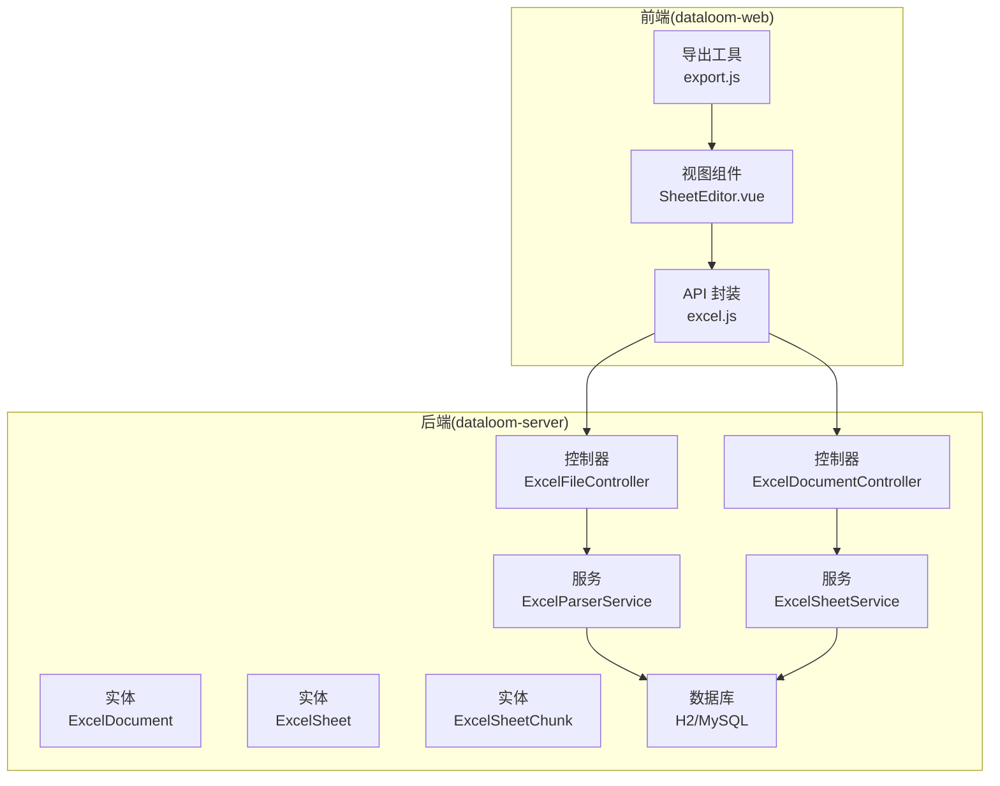
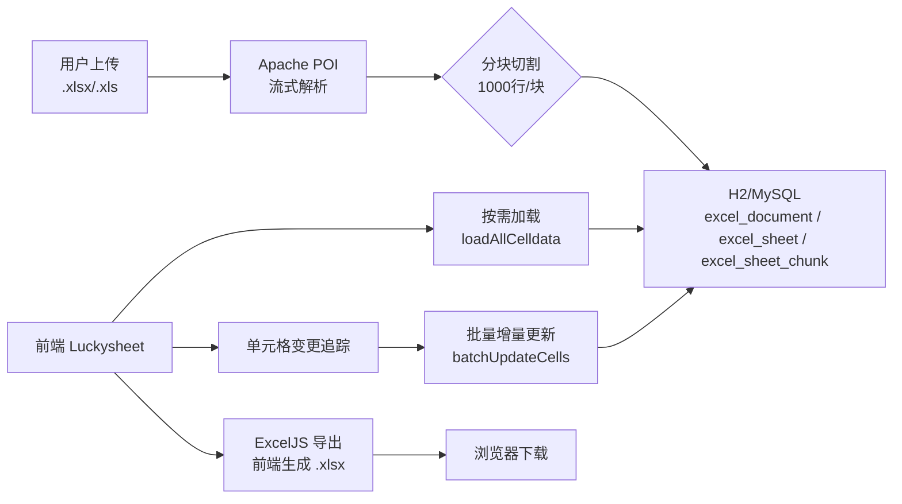
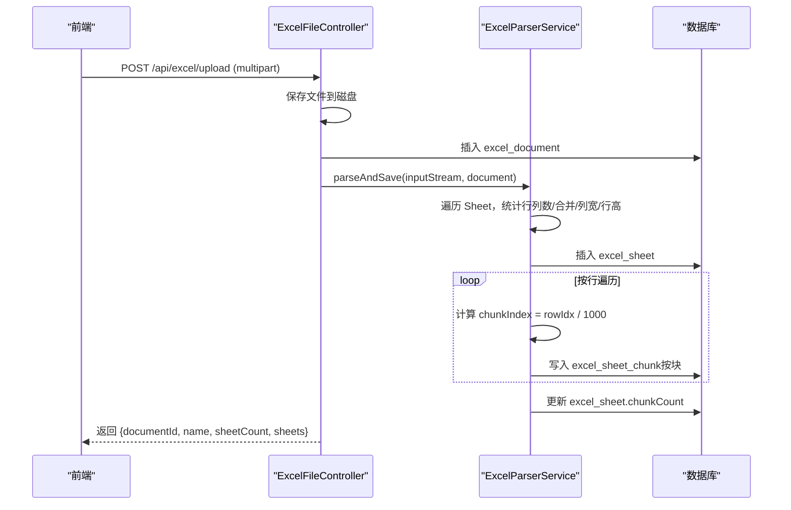
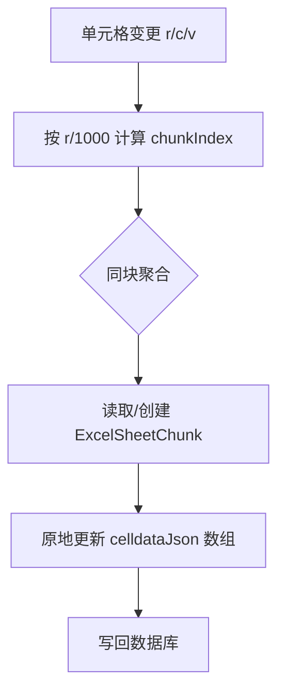
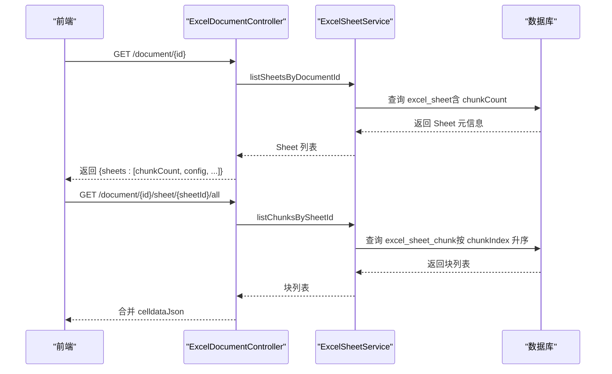
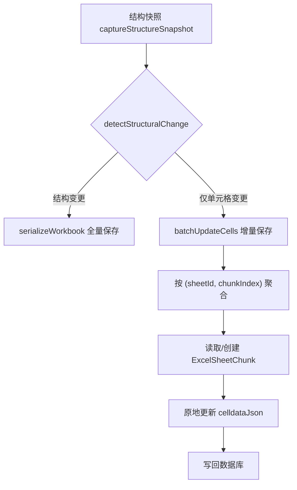
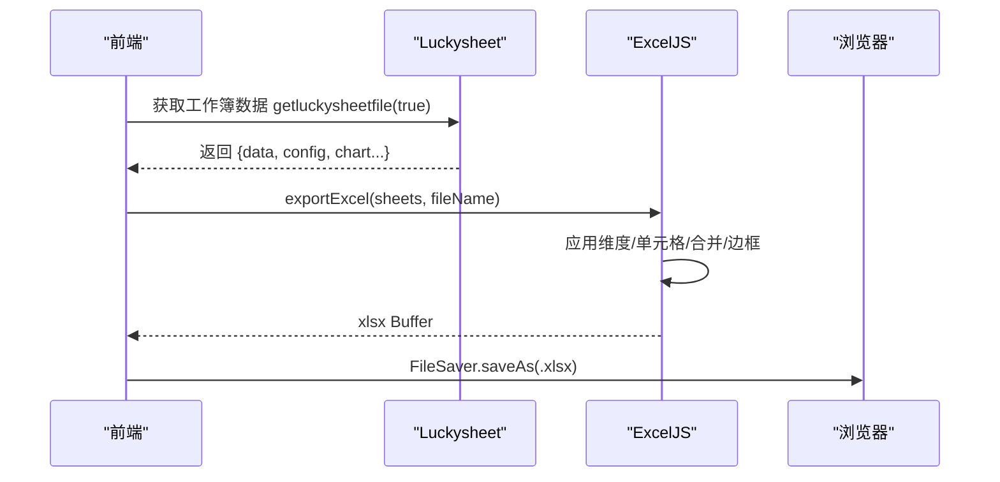
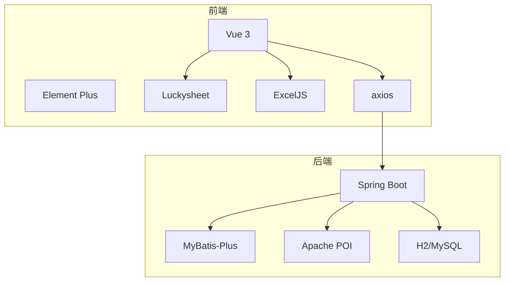

# 数据流设计

<cite>
**本文引用的文件**
- [ExcelFileController.java](file://dataloom-server/src/main/java/com/demo/excel/controller/ExcelFileController.java)
- [ExcelDocumentController.java](file://dataloom-server/src/main/java/com/demo/excel/controller/ExcelDocumentController.java)
- [ExcelParserService.java](file://dataloom-server/src/main/java/com/demo/excel/service/ExcelParserService.java)
- [ExcelSheetService.java](file://dataloom-server/src/main/java/com/demo/excel/service/ExcelSheetService.java)
- [ExcelDocument.java](file://dataloom-server/src/main/java/com/demo/excel/entity/ExcelDocument.java)
- [ExcelSheet.java](file://dataloom-server/src/main/java/com/demo/excel/entity/ExcelSheet.java)
- [ExcelSheetChunk.java](file://dataloom-server/src/main/java/com/demo/excel/entity/ExcelSheetChunk.java)
- [SheetEditor.vue](file://dataloom-web/src/views/SheetEditor.vue)
- [excel.js](file://dataloom-web/src/api/excel.js)
- [export.js](file://dataloom-web/src/utils/export.js)
- [application.yml](file://dataloom-server/src/main/resources/application.yml)
- [schema.sql](file://dataloom-server/src/main/resources/schema.sql)
- [README.md](file://README.md)
</cite>

## 目录
1. [简介](#简介)
2. [项目结构](#项目结构)
3. [核心组件](#核心组件)
4. [架构总览](#架构总览)
5. [详细组件分析](#详细组件分析)
6. [依赖分析](#依赖分析)
7. [性能考量](#性能考量)
8. [故障排查指南](#故障排查指南)
9. [结论](#结论)
10. [附录](#附录)

## 简介
本设计文档围绕 DataLoom 的数据流进行系统化梳理，覆盖从“文件上传”到“在线编辑”，再到“前端导出”的完整链路。重点阐述：
- Apache POI 流式解析的工作原理与性能优势，并与传统整表解析进行对比；
- 分块存储（1000 行/块）的数据流向与收益；
- 懒加载机制在前后端的协同策略；
- 单元格增量更新的脏数据追踪与冲突处理；
- 关键节点的处理逻辑与数据流向图。

## 项目结构
DataLoom 采用前后端分离架构：
- 后端（Spring Boot + MyBatis-Plus）负责文件上传、POI 流式解析、分块存储、单元格增量更新与全量快照保存；
- 前端（Vue 3 + Luckysheet）负责在线编辑、脏数据追踪、结构快照与前端导出。

图表来源
- [ExcelFileController.java:70-116](file://dataloom-server/src/main/java/com/demo/excel/controller/ExcelFileController.java#L70-L116)
- [ExcelDocumentController.java:139-161](file://dataloom-server/src/main/java/com/demo/excel/controller/ExcelDocumentController.java#L139-L161)
- [ExcelParserService.java:66-87](file://dataloom-server/src/main/java/com/demo/excel/service/ExcelParserService.java#L66-L87)
- [ExcelSheetService.java:103-212](file://dataloom-server/src/main/java/com/demo/excel/service/ExcelSheetService.java#L103-L212)
- [ExcelDocument.java:15-55](file://dataloom-server/src/main/java/com/demo/excel/entity/ExcelDocument.java#L15-L55)
- [ExcelSheet.java:14-77](file://dataloom-server/src/main/java/com/demo/excel/entity/ExcelSheet.java#L14-L77)
- [ExcelSheetChunk.java:18-53](file://dataloom-server/src/main/java/com/demo/excel/entity/ExcelSheetChunk.java#L18-L53)

章节来源
- [README.md:217-242](file://README.md#L217-L242)
- [application.yml:1-51](file://dataloom-server/src/main/resources/application.yml#L1-L51)
- [schema.sql:1-124](file://dataloom-server/src/main/resources/schema.sql#L1-L124)

## 核心组件
- 上传与解析：后端接收 Excel 文件，使用 Apache POI 流式解析，按 1000 行/块写入数据库，同时返回文档与 Sheet 元信息。
- 分块存储：将 Sheet 的 celldata 按行范围切分为多个块，每块独立存储，便于按需加载与增量更新。
- 在线编辑：前端 Luckysheet 读取 Sheet 元信息与分块数据，按需加载，追踪单元格变更。
- 增量更新：后端按块聚合更新，原地修改块内 JSON 数组，避免全量重建。
- 全量快照：当结构/图片/图表/超链接/条件格式发生变更时，走全量替换流程。
- 前端导出：使用 ExcelJS 将编辑器状态转换为 .xlsx，保证样式零丢失。

章节来源
- [ExcelFileController.java:57-116](file://dataloom-server/src/main/java/com/demo/excel/controller/ExcelFileController.java#L57-L116)
- [ExcelParserService.java:43-44](file://dataloom-server/src/main/java/com/demo/excel/service/ExcelParserService.java#L43-L44)
- [ExcelSheetService.java:94-212](file://dataloom-server/src/main/java/com/demo/excel/service/ExcelSheetService.java#L94-L212)
- [SheetEditor.vue:547-631](file://dataloom-web/src/views/SheetEditor.vue#L547-L631)

## 架构总览
DataLoom 的数据流以“分块存储 + 懒加载 + 增量更新”为核心，结合前端 Luckysheet 的编辑体验与 ExcelJS 的导出能力，形成完整的在线 Excel 工作流。

图表来源
- [README.md:92-106](file://README.md#L92-L106)
- [ExcelFileController.java:57-116](file://dataloom-server/src/main/java/com/demo/excel/controller/ExcelFileController.java#L57-L116)
- [ExcelParserService.java:142-200](file://dataloom-server/src/main/java/com/demo/excel/service/ExcelParserService.java#L142-L200)
- [ExcelSheetService.java:103-212](file://dataloom-server/src/main/java/com/demo/excel/service/ExcelSheetService.java#L103-L212)
- [SheetEditor.vue:547-631](file://dataloom-web/src/views/SheetEditor.vue#L547-L631)
- [export.js:4-28](file://dataloom-web/src/utils/export.js#L4-L28)

## 详细组件分析

### 1) 文件上传与流式解析
- 后端接收文件，保存至本地磁盘作为备份与后续导出依据；
- 使用 Apache POI 流式解析，逐 Sheet 读取，统计行列数与合并区域、列宽、行高等配置；
- 按 1000 行/块构建 celldata JSON，写入 excel_sheet_chunk；
- 更新 excel_sheet 的 chunkCount，并返回文档 ID 与 Sheet 元信息（不含 celldata）。

图表来源
- [ExcelFileController.java:70-116](file://dataloom-server/src/main/java/com/demo/excel/controller/ExcelFileController.java#L70-L116)
- [ExcelParserService.java:66-87](file://dataloom-server/src/main/java/com/demo/excel/service/ExcelParserService.java#L66-L87)
- [ExcelParserService.java:142-200](file://dataloom-server/src/main/java/com/demo/excel/service/ExcelParserService.java#L142-L200)

章节来源
- [ExcelFileController.java:57-116](file://dataloom-server/src/main/java/com/demo/excel/controller/ExcelFileController.java#L57-L116)
- [ExcelParserService.java:25-37](file://dataloom-server/src/main/java/com/demo/excel/service/ExcelParserService.java#L25-L37)
- [ExcelParserService.java:43-44](file://dataloom-server/src/main/java/com/demo/excel/service/ExcelParserService.java#L43-L44)

### 2) 分块存储与查询
- 分块策略：chunkIndex = floor(row / 1000)，保证与增量更新时的定位逻辑一致；
- 每块记录 rowStart / rowEnd，celldataJson 为 Luckysheet 兼容格式；
- 前端按需加载：通过 “/document/{id}/sheet/{sheetId}/all” 合并所有块返回 celldata；
- 后端按块聚合更新：将同一块内的变更一次性写回，避免重复 I/O。

图表来源
- [ExcelSheetService.java:103-212](file://dataloom-server/src/main/java/com/demo/excel/service/ExcelSheetService.java#L103-L212)
- [ExcelParserService.java:142-200](file://dataloom-server/src/main/java/com/demo/excel/service/ExcelParserService.java#L142-L200)

章节来源
- [ExcelSheetChunk.java:18-53](file://dataloom-server/src/main/java/com/demo/excel/entity/ExcelSheetChunk.java#L18-L53)
- [ExcelSheetService.java:94-212](file://dataloom-server/src/main/java/com/demo/excel/service/ExcelSheetService.java#L94-L212)

### 3) 懒加载机制（前端按需加载 + 后端分块查询）
- 前端打开文档时，先调用 “/document/{id}” 获取 Sheet 列表与 chunkCount；
- 按需加载：当前端切换 Sheet 或滚动到可视区域时，再请求对应块；
- 后端查询：按 sheetId + chunkIndex 升序返回块列表，前端合并 celldata；
- 优点：避免一次性拉取几十 MB 的整表数据，显著降低首屏等待与内存占用。

图表来源
- [ExcelDocumentController.java:77-131](file://dataloom-server/src/main/java/com/demo/excel/controller/ExcelDocumentController.java#L77-L131)
- [ExcelDocumentController.java:139-161](file://dataloom-server/src/main/java/com/demo/excel/controller/ExcelDocumentController.java#L139-L161)
- [ExcelSheetService.java:46-72](file://dataloom-server/src/main/java/com/demo/excel/service/ExcelSheetService.java#L46-L72)

章节来源
- [SheetEditor.vue:134-173](file://dataloom-web/src/views/SheetEditor.vue#L134-L173)
- [SheetEditor.vue:216-234](file://dataloom-web/src/views/SheetEditor.vue#L216-L234)
- [excel.js:38-50](file://dataloom-web/src/api/excel.js#L38-L50)

### 4) 单元格增量更新与冲突处理
- 脏数据追踪：前端 Luckysheet 监听 cellUpdated 事件，将 r/c/v 写入本地缓存；
- 结构快照：保存初始工作簿结构（不含 celldata），用于对比是否需要全量保存；
- 冲突处理：
  - 若检测到结构变更（Sheet 名称/顺序/激活状态、config、图片、图表、超链接、条件格式），走全量快照保存；
  - 否则仅发送增量更新，后端按块聚合写回；
- 后端写回：按 sheetId + chunkIndex 聚合，原地更新 celldataJson 数组，支持新增/更新/删除（延迟删除，倒序清理）。

图表来源
- [SheetEditor.vue:486-531](file://dataloom-web/src/views/SheetEditor.vue#L486-L531)
- [SheetEditor.vue:547-631](file://dataloom-web/src/views/SheetEditor.vue#L547-L631)
- [ExcelSheetService.java:103-212](file://dataloom-server/src/main/java/com/demo/excel/service/ExcelSheetService.java#L103-L212)

章节来源
- [SheetEditor.vue:439-480](file://dataloom-web/src/views/SheetEditor.vue#L439-L480)
- [SheetEditor.vue:547-631](file://dataloom-web/src/views/SheetEditor.vue#L547-L631)
- [ExcelSheetService.java:94-212](file://dataloom-server/src/main/java/com/demo/excel/service/ExcelSheetService.java#L94-L212)

### 5) 前端导出（ExcelJS）
- 导出入口：前端 Luckysheet 编辑完成后，调用 ExcelJS 将 data（二维数组）与 config（合并/列宽/行高/边框等）转换为 .xlsx；
- 样式还原：ExcelJS 严格还原字体、颜色、边框、数字格式等，确保与编辑器一致；
- 下载：使用 FileSaver 保存到本地。

图表来源
- [SheetEditor.vue:633-783](file://dataloom-web/src/views/SheetEditor.vue#L633-L783)
- [export.js:4-28](file://dataloom-web/src/utils/export.js#L4-L28)

章节来源
- [export.js:1-239](file://dataloom-web/src/utils/export.js#L1-L239)
- [README.md:213-213](file://README.md#L213-L213)

## 依赖分析
- 后端依赖
  - Spring Boot + MyBatis-Plus：REST 控制器、实体与 Mapper；
  - Apache POI：流式解析 Excel；
  - H2（默认）：嵌入式数据库，支持切换 MySQL；
- 前端依赖
  - Vue 3 + Element Plus：界面与交互；
  - Luckysheet：在线编辑器；
  - ExcelJS：前端导出；
  - axios：API 调用封装。

图表来源
- [application.yml:4-41](file://dataloom-server/src/main/resources/application.yml#L4-L41)
- [schema.sql:1-124](file://dataloom-server/src/main/resources/schema.sql#L1-L124)
- [README.md:73-84](file://README.md#L73-L84)

章节来源
- [application.yml:1-51](file://dataloom-server/src/main/resources/application.yml#L1-L51)
- [schema.sql:1-124](file://dataloom-server/src/main/resources/schema.sql#L1-L124)
- [README.md:73-84](file://README.md#L73-L84)

## 性能考量
- Apache POI 流式解析的优势
  - 逐行读取，避免整表 JSON 导致的内存峰值与序列化成本；
  - 与分块存储天然契合，降低数据库单行字段膨胀风险。
- 分块存储收益
  - 查询：单次仅拉取几百 KB，而非几十 MB；
  - 更新：仅写入受影响的块，避免全量重建；
  - 并发：块级隔离，降低锁竞争。
- 前端懒加载
  - 首屏仅加载必要的块，滚动/切换时按需加载，显著降低内存占用与渲染压力。
- 增量更新优化
  - 后端按块聚合，减少数据库往返；
  - 前端延迟删除（倒序清理）避免索引重建与下标错位。

章节来源
- [ExcelParserService.java:25-37](file://dataloom-server/src/main/java/com/demo/excel/service/ExcelParserService.java#L25-L37)
- [ExcelParserService.java:142-200](file://dataloom-server/src/main/java/com/demo/excel/service/ExcelParserService.java#L142-L200)
- [ExcelSheetService.java:94-212](file://dataloom-server/src/main/java/com/demo/excel/service/ExcelSheetService.java#L94-L212)
- [README.md:108-129](file://README.md#L108-L129)

## 故障排查指南
- 上传失败
  - 检查文件大小限制与磁盘权限；
  - 查看后端日志，确认 POI 解析是否抛出异常。
- 单元格更新无效
  - 确认前端是否正确触发 cellUpdated；
  - 检查后端 batchUpdateCells 的块聚合逻辑与 chunkIndex 计算是否一致。
- 导出样式缺失
  - 确保调用 getluckysheetfile(true) 获取 chartOptions；
  - 检查 ExcelJS 转换函数（applyDimensions/applyCells/applyMerges/applyBorders）是否正确应用。
- 数据库性能问题
  - 确认索引是否存在（sheet_id、document_id、chunk_index）；
  - 如需迁移至 MySQL，参考 schema.sql 中的注释建表语句。

章节来源
- [ExcelFileController.java:112-116](file://dataloom-server/src/main/java/com/demo/excel/controller/ExcelFileController.java#L112-L116)
- [SheetEditor.vue:547-631](file://dataloom-web/src/views/SheetEditor.vue#L547-L631)
- [export.js:30-98](file://dataloom-web/src/utils/export.js#L30-L98)
- [schema.sql:69-123](file://dataloom-server/src/main/resources/schema.sql#L69-L123)

## 结论
DataLoom 通过“流式解析 + 分块存储 + 懒加载 + 增量更新”的组合拳，实现了十万级数据规模下的稳定在线编辑体验。后端以 POI 与分块策略保障解析与存储效率，前端以 Luckysheet 与 ExcelJS 提供类 Excel 的编辑与导出能力。该设计在性能、可维护性与扩展性之间取得良好平衡，适合中小团队的本地化在线 Excel 场景。

## 附录
- API 路径与用途概览
  - 上传：POST /api/excel/upload（multipart/form-data）
  - 文档列表：GET /api/excel/document/list
  - 文档详情：GET /api/excel/document/{id}
  - 加载全量 celldata：GET /api/excel/document/{id}/sheet/{sheetId}/all
  - 批量增量更新：PUT /api/excel/document/{id}/cells/batch
  - 全量快照保存：PUT /api/excel/document/{id}/workbook
  - 重命名：PUT /api/excel/document/{id}/name
  - 删除：DELETE /api/excel/document/{id}

章节来源
- [README.md:190-215](file://README.md#L190-L215)
- [excel.js:12-79](file://dataloom-web/src/api/excel.js#L12-L79)