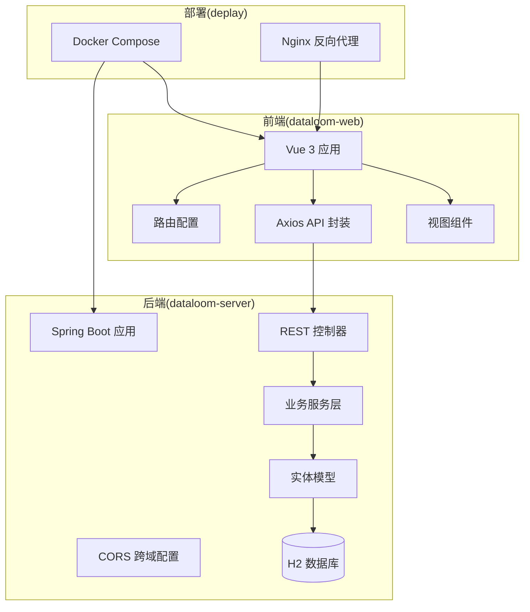
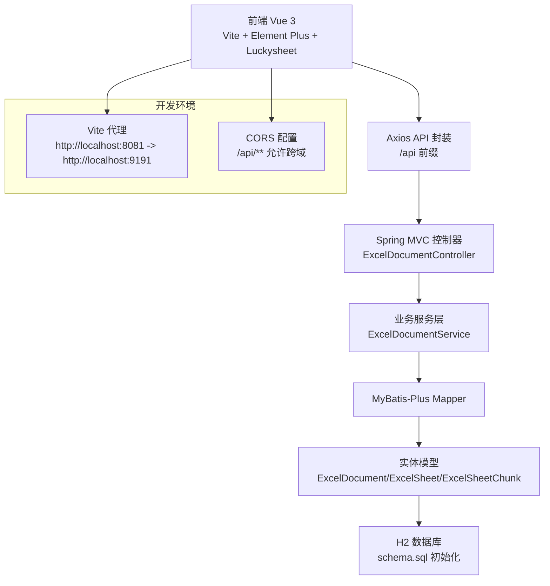
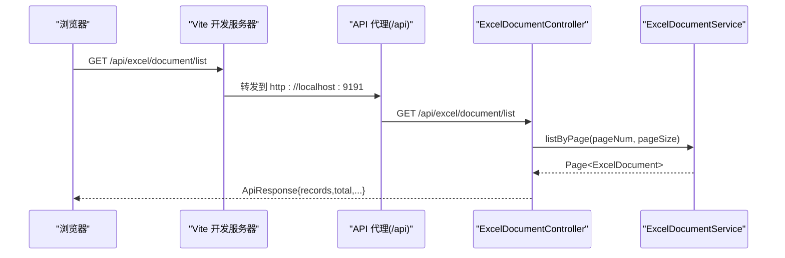
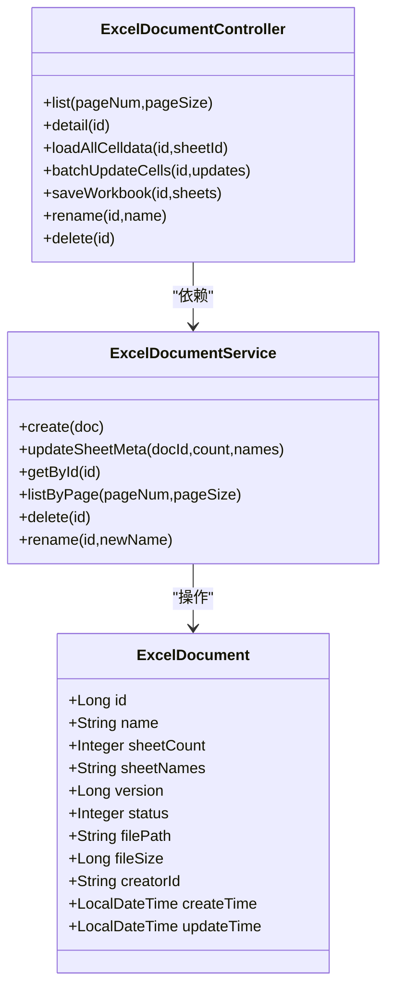
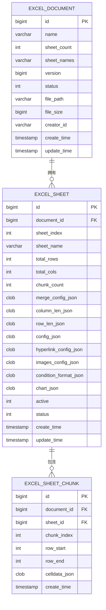
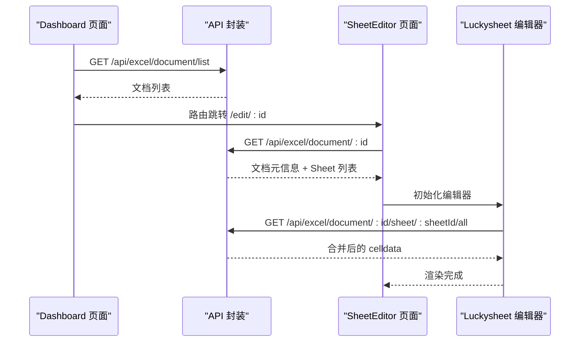
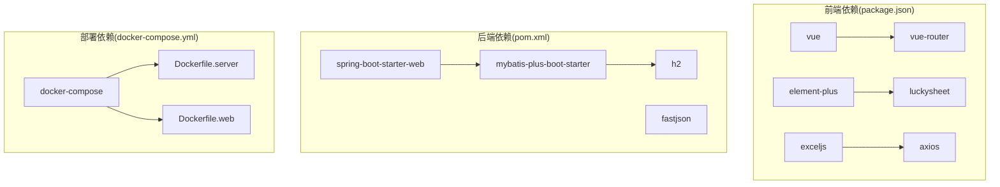

# 整体架构概览

<cite>
**本文引用的文件**
- [ExcelServiceApplication.java](file://dataloom-server/src/main/java/com/demo/excel/ExcelServiceApplication.java)
- [CorsConfig.java](file://dataloom-server/src/main/java/com/demo/excel/config/CorsConfig.java)
- [ExcelDocumentController.java](file://dataloom-server/src/main/java/com/demo/excel/controller/ExcelDocumentController.java)
- [ExcelDocumentService.java](file://dataloom-server/src/main/java/com/demo/excel/service/ExcelDocumentService.java)
- [ExcelDocument.java](file://dataloom-server/src/main/java/com/demo/excel/entity/ExcelDocument.java)
- [application.yml](file://dataloom-server/src/main/resources/application.yml)
- [schema.sql](file://dataloom-server/src/main/resources/schema.sql)
- [package.json](file://dataloom-web/package.json)
- [vite.config.js](file://dataloom-web/vite.config.js)
- [index.js](file://dataloom-web/src/router/index.js)
- [excel.js](file://dataloom-web/src/api/excel.js)
- [ExcelDashboard.vue](file://dataloom-web/src/views/ExcelDashboard.vue)
- [SheetEditor.vue](file://dataloom-web/src/views/SheetEditor.vue)
- [docker-compose.yml](file://deplay/docker-compose.yml)
- [README.md](file://README.md)
</cite>

## 目录
1. [简介](#简介)
2. [项目结构](#项目结构)
3. [核心组件](#核心组件)
4. [架构总览](#架构总览)
5. [详细组件分析](#详细组件分析)
6. [依赖关系分析](#依赖关系分析)
7. [性能考量](#性能考量)
8. [故障排查指南](#故障排查指南)
9. [结论](#结论)
10. [附录](#附录)

## 简介
DataLoom 是一个前后端分离的在线 Excel 协作编辑系统，采用三层架构设计：
- 前端 Vue 3 应用：基于 Vite 构建，使用 Element Plus 和 Luckysheet 提供类 Excel 的在线编辑体验。
- 后端 Spring Boot 服务：提供 REST API，负责 Excel 文件解析、分块存储、单元格增量更新与全量快照保存。
- 数据库层：H2 内存数据库（演示环境），按文档、工作表、分块三级结构存储，支持百万级数据的高效读写。

系统通过 API 代理、跨域配置与 MVC 设计模式实现清晰的职责划分与模块化组织，便于扩展与维护。

## 项目结构
项目采用“前后端分离 + 容器化部署”的组织方式，主要目录如下：
- dataloom-server：Spring Boot 后端，包含控制器、服务、数据访问层与配置资源。
- dataloom-web：Vue 3 前端，包含路由、API 封装、视图组件与构建配置。
- deplay：Docker 化部署配置，包含前后端镜像构建与编排文件。
- docs：文档资源（本仓库未包含具体内容）。
- 根目录 README.md：项目介绍、架构说明、API 参考与部署指南。

**图表来源**
- [ExcelServiceApplication.java:13-20](file://dataloom-server/src/main/java/com/demo/excel/ExcelServiceApplication.java#L13-L20)
- [CorsConfig.java:11-21](file://dataloom-server/src/main/java/com/demo/excel/config/CorsConfig.java#L11-L21)
- [ExcelDocumentController.java:22-24](file://dataloom-server/src/main/java/com/demo/excel/controller/ExcelDocumentController.java#L22-L24)
- [application.yml:1-51](file://dataloom-server/src/main/resources/application.yml#L1-L51)
- [docker-compose.yml:1-34](file://deplay/docker-compose.yml#L1-L34)

**章节来源**
- [README.md:217-242](file://README.md#L217-L242)

## 核心组件
- 启动类与配置
  - 后端启动类启用 Spring Boot 并扫描 Mapper 接口，统一入口管理应用生命周期。
  - 应用配置文件定义端口、数据源（H2）、文件上传大小、MyBatis-Plus 全局配置与自定义配置。
- 控制器层
  - REST 控制器提供文档 CRUD、工作簿全量保存、单元格批量更新、分块数据加载等接口。
- 服务层
  - 文档服务负责分页查询、软删除、重命名与元数据更新；结合实体与 Mapper 实现数据持久化。
- 数据模型
  - 文档实体仅存储元数据，工作表与分块实体分别承载结构配置与单元格数据，实现数据解耦。
- 前端组件
  - 路由配置与 API 封装，Dashboard 页面展示文档列表与上传入口，编辑器页面集成 Luckysheet 实现实时编辑与导出。

**章节来源**
- [ExcelServiceApplication.java:13-20](file://dataloom-server/src/main/java/com/demo/excel/ExcelServiceApplication.java#L13-L20)
- [application.yml:1-51](file://dataloom-server/src/main/resources/application.yml#L1-L51)
- [ExcelDocumentController.java:22-24](file://dataloom-server/src/main/java/com/demo/excel/controller/ExcelDocumentController.java#L22-L24)
- [ExcelDocumentService.java:19-23](file://dataloom-server/src/main/java/com/demo/excel/service/ExcelDocumentService.java#L19-L23)
- [ExcelDocument.java:15-17](file://dataloom-server/src/main/java/com/demo/excel/entity/ExcelDocument.java#L15-L17)
- [index.js:1-21](file://dataloom-web/src/router/index.js#L1-L21)
- [excel.js:1-79](file://dataloom-web/src/api/excel.js#L1-L79)
- [ExcelDashboard.vue:1-386](file://dataloom-web/src/views/ExcelDashboard.vue#L1-L386)
- [SheetEditor.vue:1-970](file://dataloom-web/src/views/SheetEditor.vue#L1-L970)

## 架构总览
DataLoom 采用典型的三层架构与 MVC 设计模式：
- 表现层（前端 Vue 3）
  - 使用 Vue Router 管理页面导航，Axios 封装 API 请求，组件负责渲染与用户交互。
  - Vite 开发服务器通过代理将 /api 前缀请求转发至后端 9191 端口，避免跨域问题。
- 控制层（后端 Spring MVC）
  - 控制器接收前端请求，进行参数校验与业务编排，返回统一封装的响应对象。
  - CORS 配置允许来自前端开发环境的跨域访问，简化联调。
- 业务层（服务层）
  - 服务层封装核心业务逻辑，协调实体与数据访问层完成数据持久化。
- 数据访问层（MyBatis-Plus）
  - Mapper 接口与实体映射实现数据库操作，配合全局配置提升开发效率。
- 数据库层（H2）
  - 通过初始化 SQL 脚本创建三张核心表：文档、工作表与分块，支持百万级数据的分块读写。

**图表来源**
- [vite.config.js:12-21](file://dataloom-web/vite.config.js#L12-L21)
- [CorsConfig.java:11-21](file://dataloom-server/src/main/java/com/demo/excel/config/CorsConfig.java#L11-L21)
- [ExcelDocumentController.java:22-24](file://dataloom-server/src/main/java/com/demo/excel/controller/ExcelDocumentController.java#L22-L24)
- [ExcelDocumentService.java:19-23](file://dataloom-server/src/main/java/com/demo/excel/service/ExcelDocumentService.java#L19-L23)
- [schema.sql:1-124](file://dataloom-server/src/main/resources/schema.sql#L1-L124)

**章节来源**
- [README.md:88-130](file://README.md#L88-L130)

## 详细组件分析

### 前后端分离与 API 代理
- 前端开发服务器通过 Vite 配置将 /api 前缀的请求代理到后端 9191 端口，避免跨域问题，提升开发体验。
- 后端通过 CORS 配置对 /api/** 路径开放跨域，允许前端在本地开发环境下直接调用接口。
- 生产部署可通过 Nginx 进行反向代理，统一暴露服务端口。

**图表来源**
- [vite.config.js:12-21](file://dataloom-web/vite.config.js#L12-L21)
- [CorsConfig.java:11-21](file://dataloom-server/src/main/java/com/demo/excel/config/CorsConfig.java#L11-L21)
- [ExcelDocumentController.java:44-69](file://dataloom-server/src/main/java/com/demo/excel/controller/ExcelDocumentController.java#L44-L69)
- [ExcelDocumentService.java:72-78](file://dataloom-server/src/main/java/com/demo/excel/service/ExcelDocumentService.java#L72-L78)

**章节来源**
- [vite.config.js:12-21](file://dataloom-web/vite.config.js#L12-L21)
- [CorsConfig.java:11-21](file://dataloom-server/src/main/java/com/demo/excel/config/CorsConfig.java#L11-L21)

### MVC 设计模式的应用
- 控制器层：集中处理 HTTP 请求，进行参数解析与错误处理，调用服务层完成业务操作。
- 服务层：封装业务规则与流程控制，协调数据访问与外部依赖。
- 数据访问层：通过 MyBatis-Plus 简化数据库操作，减少样板代码。
- 视图层：Vue 组件负责渲染与交互，通过 API 封装与后端解耦。

**图表来源**
- [ExcelDocumentController.java:22-24](file://dataloom-server/src/main/java/com/demo/excel/controller/ExcelDocumentController.java#L22-L24)
- [ExcelDocumentService.java:19-23](file://dataloom-server/src/main/java/com/demo/excel/service/ExcelDocumentService.java#L19-L23)
- [ExcelDocument.java:15-17](file://dataloom-server/src/main/java/com/demo/excel/entity/ExcelDocument.java#L15-L17)

**章节来源**
- [ExcelDocumentController.java:22-24](file://dataloom-server/src/main/java/com/demo/excel/controller/ExcelDocumentController.java#L22-L24)
- [ExcelDocumentService.java:19-23](file://dataloom-server/src/main/java/com/demo/excel/service/ExcelDocumentService.java#L19-L23)
- [ExcelDocument.java:15-17](file://dataloom-server/src/main/java/com/demo/excel/entity/ExcelDocument.java#L15-L17)

### 数据模型与分块存储
- 文档表仅存储元数据，工作表表存储结构配置与统计信息，分块表按 1000 行一组存储单元格数据，实现百万级数据的高效读写。
- 初始化 SQL 脚本定义三张表结构，生产环境可无缝切换至 MySQL。

**图表来源**
- [schema.sql:8-66](file://dataloom-server/src/main/resources/schema.sql#L8-L66)

**章节来源**
- [schema.sql:1-124](file://dataloom-server/src/main/resources/schema.sql#L1-L124)

### 前端组件与交互流程
- 路由配置：首页与编辑器页面通过 Hash History 导航，支持直接访问编辑器。
- Dashboard：展示文档列表、上传入口与分页控件，调用 API 获取数据并处理错误。
- 编辑器：集成 Luckysheet，在打开文档时加载工作表元信息与分块数据，支持增量保存与全量快照保存。

**图表来源**
- [index.js:1-21](file://dataloom-web/src/router/index.js#L1-L21)
- [ExcelDashboard.vue:122-140](file://dataloom-web/src/views/ExcelDashboard.vue#L122-L140)
- [SheetEditor.vue:134-173](file://dataloom-web/src/views/SheetEditor.vue#L134-L173)
- [excel.js:32-41](file://dataloom-web/src/api/excel.js#L32-L41)
- [excel.js:47-50](file://dataloom-web/src/api/excel.js#L47-L50)

**章节来源**
- [index.js:1-21](file://dataloom-web/src/router/index.js#L1-L21)
- [ExcelDashboard.vue:122-140](file://dataloom-web/src/views/ExcelDashboard.vue#L122-L140)
- [SheetEditor.vue:134-173](file://dataloom-web/src/views/SheetEditor.vue#L134-L173)
- [excel.js:32-50](file://dataloom-web/src/api/excel.js#L32-L50)

## 依赖关系分析
- 前端依赖
  - Vue 3、Element Plus、Luckysheet、ExcelJS、Vue Router、Axios 等，构成现代化前端开发栈。
- 后端依赖
  - Spring Boot、MyBatis-Plus、H2、FastJSON 等，支撑 REST 服务与 ORM 能力。
- 部署依赖
  - Docker Compose 将前后端服务容器化，挂载数据卷，统一端口暴露。

**图表来源**
- [package.json:12-25](file://dataloom-web/package.json#L12-L25)
- [docker-compose.yml:1-34](file://deplay/docker-compose.yml#L1-L34)

**章节来源**
- [package.json:12-25](file://dataloom-web/package.json#L12-L25)
- [docker-compose.yml:1-34](file://deplay/docker-compose.yml#L1-L34)

## 性能考量
- 分块存储策略：将每 1000 行作为一个数据块，按需加载，显著降低单次传输与解析成本，适合百万级数据规模。
- 增量更新机制：仅对受影响的数据块进行写入，避免全量重建，提升写入性能与并发友好性。
- 懒加载与缓存：前端按需加载分块数据，后端提供分块范围查询接口，减少不必要的数据传输。
- 数据库优化：采用普通表结构与标准索引，避免大字段导致的索引失效问题。

**章节来源**
- [README.md:108-129](file://README.md#L108-L129)
- [schema.sql:55-66](file://dataloom-server/src/main/resources/schema.sql#L55-L66)
- [ExcelDocumentController.java:139-161](file://dataloom-server/src/main/java/com/demo/excel/controller/ExcelDocumentController.java#L139-L161)

## 故障排查指南
- 跨域问题
  - 确认前端 Vite 代理配置与后端 CORS 配置均正确，代理路径与后端端口一致。
- 数据库连接
  - 检查 application.yml 中的 H2 数据源配置与初始化脚本路径，确认数据库文件存在且可读写。
- 文件上传
  - 确认 multipart 大小限制与后端解析逻辑，避免大文件上传失败。
- 前端路由
  - 检查 Vue Router 的 Hash History 配置，确保页面可正常跳转与刷新。

**章节来源**
- [vite.config.js:12-21](file://dataloom-web/vite.config.js#L12-L21)
- [CorsConfig.java:11-21](file://dataloom-server/src/main/java/com/demo/excel/config/CorsConfig.java#L11-L21)
- [application.yml:9-23](file://dataloom-server/src/main/resources/application.yml#L9-L23)
- [index.js:17-20](file://dataloom-web/src/router/index.js#L17-L20)

## 结论
DataLoom 通过前后端分离与三层架构实现了清晰的职责划分与良好的扩展性。前端以 Vue 3 为核心，后端以 Spring Boot + MyBatis-Plus 提供稳定的服务能力，数据库采用分块存储策略应对大规模数据场景。配合 API 代理与 CORS 配置，系统在开发与生产环境中均具备优秀的可用性与可维护性。

## 附录
- 系统边界与外部集成点
  - 外部依赖：Apache POI（服务端解析 Excel）、Luckysheet（前端编辑器）、ExcelJS（前端导出）。
  - 外部接口：H2 数据库（演示环境），生产可替换为 MySQL/PostgreSQL。
  - 部署边界：Docker Compose 容器化部署，支持独立运行与扩展。

**章节来源**
- [README.md:73-84](file://README.md#L73-L84)
- [schema.sql:72-123](file://dataloom-server/src/main/resources/schema.sql#L72-L123)
- [docker-compose.yml:1-34](file://deplay/docker-compose.yml#L1-L34)