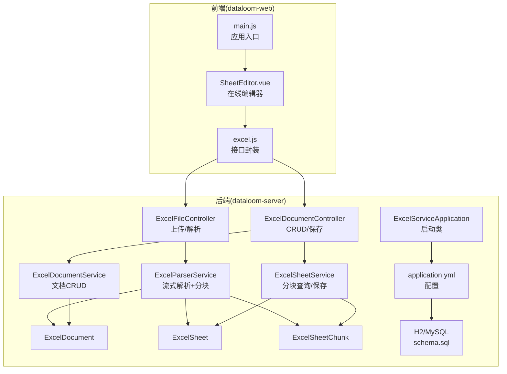
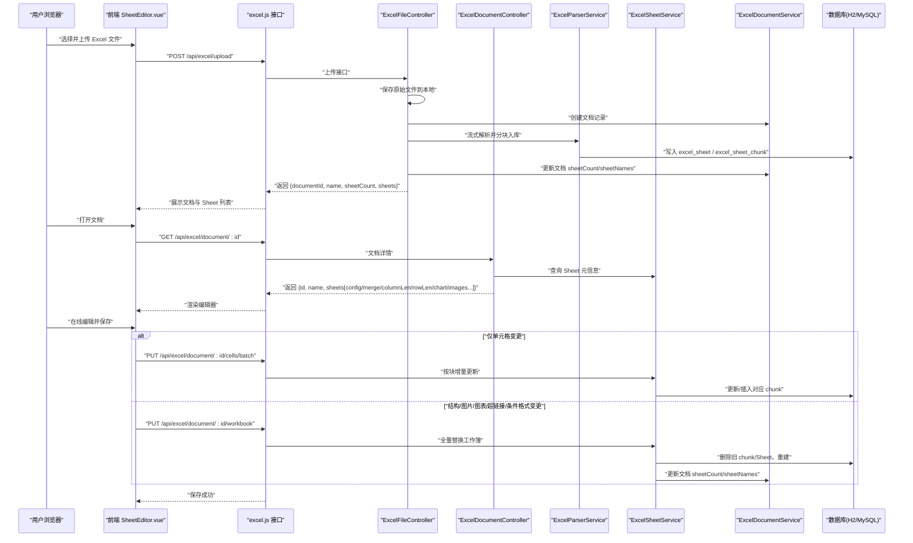
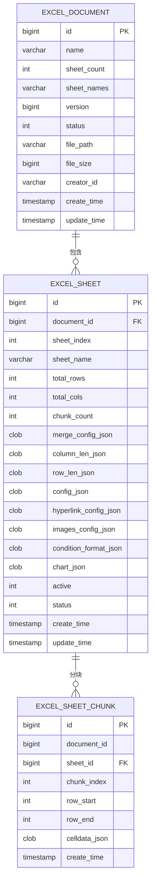
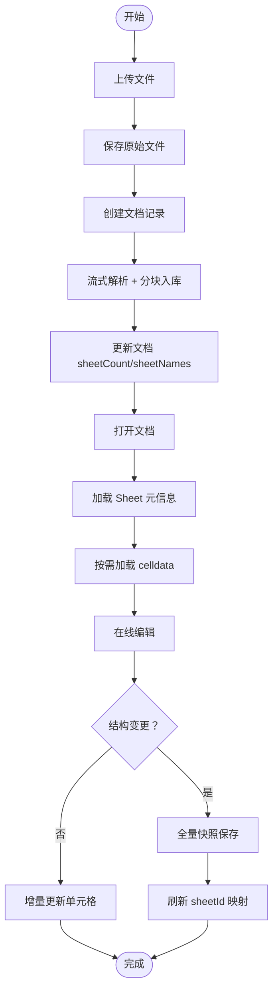
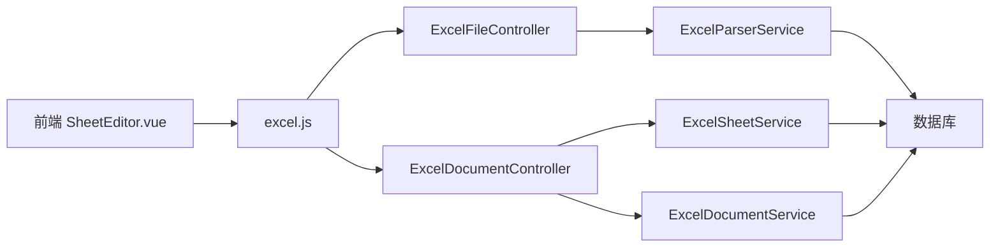

# 系统架构设计

<cite>
**本文引用的文件**
- [ExcelServiceApplication.java](file://dataloom-server/src/main/java/com/demo/excel/ExcelServiceApplication.java)
- [application.yml](file://dataloom-server/src/main/resources/application.yml)
- [ExcelFileController.java](file://dataloom-server/src/main/java/com/demo/excel/controller/ExcelFileController.java)
- [ExcelDocumentController.java](file://dataloom-server/src/main/java/com/demo/excel/controller/ExcelDocumentController.java)
- [ExcelDocumentService.java](file://dataloom-server/src/main/java/com/demo/excel/service/ExcelDocumentService.java)
- [ExcelParserService.java](file://dataloom-server/src/main/java/com/demo/excel/service/ExcelParserService.java)
- [ExcelSheetService.java](file://dataloom-server/src/main/java/com/demo/excel/service/ExcelSheetService.java)
- [ExcelDocument.java](file://dataloom-server/src/main/java/com/demo/excel/entity/ExcelDocument.java)
- [ExcelSheet.java](file://dataloom-server/src/main/java/com/demo/excel/entity/ExcelSheet.java)
- [ExcelSheetChunk.java](file://dataloom-server/src/main/java/com/demo/excel/entity/ExcelSheetChunk.java)
- [schema.sql](file://dataloom-server/src/main/resources/schema.sql)
- [package.json](file://dataloom-web/package.json)
- [main.js](file://dataloom-web/src/main.js)
- [SheetEditor.vue](file://dataloom-web/src/views/SheetEditor.vue)
- [excel.js](file://dataloom-web/src/api/excel.js)
</cite>

## 目录
1. [简介](#简介)
2. [项目结构](#项目结构)
3. [核心组件](#核心组件)
4. [架构总览](#架构总览)
5. [详细组件分析](#详细组件分析)
6. [依赖分析](#依赖分析)
7. [性能考量](#性能考量)
8. [故障排查指南](#故障排查指南)
9. [结论](#结论)
10. [附录](#附录)

## 简介
本项目 DataLoom 是一个前后端分离的在线 Excel 编辑系统，采用 Spring Boot（后端）+ Vue 3（前端）技术栈，结合 Apache POI 进行流式解析、Luckysheet 提供在线编辑体验，并以“分块存储”替代传统整表存储，实现对十万级数据的高效处理与在线协作编辑。

## 项目结构
- 后端（Spring Boot）
  - 控制器层：负责 HTTP 接口编排与参数校验
  - 服务层：封装业务逻辑（解析、分块写入、增量/全量保存）
  - 实体与映射：文档、Sheet、分块三张表，按职责拆分
  - 配置：数据库连接、MyBatis-Plus、文件上传大小限制、H2 控制台
- 前端（Vue 3 + Element Plus + Luckysheet）
  - 页面：仪表盘与在线编辑器
  - API 层：统一封装后端接口
  - 编辑器：Luckysheet 在线表格，支持图表、图片、超链接、条件格式等

**图表来源**
- [main.js:1-19](file://dataloom-web/src/main.js#L1-L19)
- [SheetEditor.vue:1-120](file://dataloom-web/src/views/SheetEditor.vue#L1-L120)
- [excel.js:1-79](file://dataloom-web/src/api/excel.js#L1-L79)
- [ExcelServiceApplication.java:1-21](file://dataloom-server/src/main/java/com/demo/excel/ExcelServiceApplication.java#L1-L21)
- [application.yml:1-51](file://dataloom-server/src/main/resources/application.yml#L1-L51)
- [ExcelFileController.java:1-141](file://dataloom-server/src/main/java/com/demo/excel/controller/ExcelFileController.java#L1-L141)
- [ExcelDocumentController.java:1-296](file://dataloom-server/src/main/java/com/demo/excel/controller/ExcelDocumentController.java#L1-L296)
- [ExcelParserService.java:1-348](file://dataloom-server/src/main/java/com/demo/excel/service/ExcelParserService.java#L1-L348)
- [ExcelDocumentService.java:1-119](file://dataloom-server/src/main/java/com/demo/excel/service/ExcelDocumentService.java#L1-L119)
- [ExcelSheetService.java:1-443](file://dataloom-server/src/main/java/com/demo/excel/service/ExcelSheetService.java#L1-L443)
- [ExcelDocument.java:1-55](file://dataloom-server/src/main/java/com/demo/excel/entity/ExcelDocument.java#L1-L55)
- [ExcelSheet.java:1-77](file://dataloom-server/src/main/java/com/demo/excel/entity/ExcelSheet.java#L1-L77)
- [ExcelSheetChunk.java:1-53](file://dataloom-server/src/main/java/com/demo/excel/entity/ExcelSheetChunk.java#L1-L53)
- [schema.sql:1-124](file://dataloom-server/src/main/resources/schema.sql#L1-L124)

**章节来源**
- [package.json:1-27](file://dataloom-web/package.json#L1-L27)
- [main.js:1-19](file://dataloom-web/src/main.js#L1-L19)
- [application.yml:1-51](file://dataloom-server/src/main/resources/application.yml#L1-L51)

## 核心组件
- 后端控制器
  - ExcelFileController：接收文件上传，保存原始文件，调用解析服务进行流式解析与分块入库，返回文档与 Sheet 元信息
  - ExcelDocumentController：提供文档列表、详情、全量保存、增量保存、重命名、删除等接口
- 服务层
  - ExcelParserService：基于 Apache POI 流式读取 Excel，按固定行数分块生成 celldata JSON 并写入数据库
  - ExcelSheetService：提供分块查询、按块增量更新、全量替换工作簿等能力
  - ExcelDocumentService：文档主表 CRUD、分页查询、软删除并清理原始文件
- 实体与映射
  - ExcelDocument：仅存元数据（名称、Sheet 数量/名称、版本、状态、文件路径/大小、创建者）
  - ExcelSheet：存 Sheet 元信息与少量配置（合并、列宽、行高、超链接、图片、条件格式、图表等）
  - ExcelSheetChunk：按行范围切片存储 celldata JSON，支持按需加载与增量更新
- 前端
  - SheetEditor.vue：Luckysheet 在线编辑器，负责结构快照、增量/全量保存策略、图表兼容处理
  - excel.js：Axios 封装，统一后端接口调用

**章节来源**
- [ExcelFileController.java:1-141](file://dataloom-server/src/main/java/com/demo/excel/controller/ExcelFileController.java#L1-L141)
- [ExcelDocumentController.java:1-296](file://dataloom-server/src/main/java/com/demo/excel/controller/ExcelDocumentController.java#L1-L296)
- [ExcelParserService.java:1-348](file://dataloom-server/src/main/java/com/demo/excel/service/ExcelParserService.java#L1-L348)
- [ExcelSheetService.java:1-443](file://dataloom-server/src/main/java/com/demo/excel/service/ExcelSheetService.java#L1-L443)
- [ExcelDocumentService.java:1-119](file://dataloom-server/src/main/java/com/demo/excel/service/ExcelDocumentService.java#L1-L119)
- [ExcelDocument.java:1-55](file://dataloom-server/src/main/java/com/demo/excel/entity/ExcelDocument.java#L1-L55)
- [ExcelSheet.java:1-77](file://dataloom-server/src/main/java/com/demo/excel/entity/ExcelSheet.java#L1-L77)
- [ExcelSheetChunk.java:1-53](file://dataloom-server/src/main/java/com/demo/excel/entity/ExcelSheetChunk.java#L1-L53)
- [SheetEditor.vue:1-200](file://dataloom-web/src/views/SheetEditor.vue#L1-L200)
- [excel.js:1-79](file://dataloom-web/src/api/excel.js#L1-L79)

## 架构总览
系统采用前后端分离架构，MVC 模式清晰：
- 视图层（V）：前端 Vue 组件（SheetEditor.vue）
- 控制器层（C）：后端 REST 控制器（ExcelFileController、ExcelDocumentController）
- 服务层（S）：业务服务（ExcelParserService、ExcelSheetService、ExcelDocumentService）
- 模型层（M）：实体与数据库（ExcelDocument、ExcelSheet、ExcelSheetChunk）

数据流从“文件上传”到“解析存储”，再到“在线编辑”的完整链路如下：

**图表来源**
- [SheetEditor.vue:547-631](file://dataloom-web/src/views/SheetEditor.vue#L547-L631)
- [excel.js:11-79](file://dataloom-web/src/api/excel.js#L11-L79)
- [ExcelFileController.java:70-116](file://dataloom-server/src/main/java/com/demo/excel/controller/ExcelFileController.java#L70-L116)
- [ExcelDocumentController.java:77-226](file://dataloom-server/src/main/java/com/demo/excel/controller/ExcelDocumentController.java#L77-L226)
- [ExcelParserService.java:66-87](file://dataloom-server/src/main/java/com/demo/excel/service/ExcelParserService.java#L66-L87)
- [ExcelSheetService.java:103-212](file://dataloom-server/src/main/java/com/demo/excel/service/ExcelSheetService.java#L103-L212)
- [ExcelDocumentService.java:31-53](file://dataloom-server/src/main/java/com/demo/excel/service/ExcelDocumentService.java#L31-L53)

## 详细组件分析

### 分块存储架构设计
- 设计动机
  - 传统整表存储在十万级数据时会出现单行数据量过大、HTTP 响应体膨胀、内存溢出等问题
  - 通过将 Sheet 的 celldata 按固定行数切分为多个小块，每块 JSON 控制在几百 KB 以内，便于按需加载与增量更新
- 关键参数
  - 分块大小：每块约 1000 行（可按数据密度调整）
  - 分块索引：chunkIndex = row / CHUNK_SIZE，确保与增量更新定位逻辑一致
- 数据模型

**图表来源**
- [ExcelDocument.java:1-55](file://dataloom-server/src/main/java/com/demo/excel/entity/ExcelDocument.java#L1-L55)
- [ExcelSheet.java:1-77](file://dataloom-server/src/main/java/com/demo/excel/entity/ExcelSheet.java#L1-L77)
- [ExcelSheetChunk.java:1-53](file://dataloom-server/src/main/java/com/demo/excel/entity/ExcelSheetChunk.java#L1-L53)
- [schema.sql:8-66](file://dataloom-server/src/main/resources/schema.sql#L8-L66)

- 与传统整表存储的对比
  - 整表存储：单行 CLOB/TEXT 可达数十 MB，读写性能差、内存压力大
  - 分块存储：单块 JSON 通常数百 KB，支持按需加载、增量更新、事务内局部回写，显著提升性能与稳定性

**章节来源**
- [ExcelParserService.java:43-44](file://dataloom-server/src/main/java/com/demo/excel/service/ExcelParserService.java#L43-L44)
- [ExcelSheetService.java:107-112](file://dataloom-server/src/main/java/com/demo/excel/service/ExcelSheetService.java#L107-L112)
- [ExcelSheetChunk.java:10-17](file://dataloom-server/src/main/java/com/demo/excel/entity/ExcelSheetChunk.java#L10-L17)

### MVC 设计模式应用
- 视图层（SheetEditor.vue）
  - 负责渲染 Luckysheet 编辑器、处理用户交互、维护结构快照与脏标记
- 控制器层（ExcelFileController / ExcelDocumentController）
  - 统一处理请求参数、调用服务层、组装响应数据
- 服务层（ExcelParserService / ExcelSheetService / ExcelDocumentService）
  - 封装业务规则：流式解析、分块写入、增量/全量保存、软删除与文件清理
- 模型层（实体 + SQL）
  - 明确职责划分：文档仅存元数据，Sheet 存配置，Chunk 存单元格数据

**章节来源**
- [SheetEditor.vue:247-416](file://dataloom-web/src/views/SheetEditor.vue#L247-L416)
- [ExcelFileController.java:35-116](file://dataloom-server/src/main/java/com/demo/excel/controller/ExcelFileController.java#L35-L116)
- [ExcelDocumentController.java:22-226](file://dataloom-server/src/main/java/com/demo/excel/controller/ExcelDocumentController.java#L22-L226)
- [ExcelParserService.java:38-87](file://dataloom-server/src/main/java/com/demo/excel/service/ExcelParserService.java#L38-L87)
- [ExcelSheetService.java:33-91](file://dataloom-server/src/main/java/com/demo/excel/service/ExcelSheetService.java#L33-L91)
- [ExcelDocumentService.java:19-37](file://dataloom-server/src/main/java/com/demo/excel/service/ExcelDocumentService.java#L19-L37)

### 技术选型与权衡
- 后端框架：Spring Boot
  - 快速搭建、自动配置、生态完善；结合 MyBatis-Plus 简化 CRUD
- 数据库：H2（演示）/ MySQL（生产）
  - H2 内存数据库便于演示，启动即建表；切换至 MySQL 仅需修改配置
- 解析引擎：Apache POI
  - 流式读取避免整体加载入内存，配合分块策略支撑大规模数据
- 在线编辑：Luckysheet
  - 与前端 Vue 集成良好，支持图表、图片、超链接、条件格式等复杂配置
- 前端：Vue 3 + Element Plus
  - 组件化开发、路由管理、UI 丰富，适配在线编辑器场景
- 导出：ExcelJS（前端）
  - 保证样式零丢失，后端不再提供导出接口，降低耦合

**章节来源**
- [application.yml:8-29](file://dataloom-server/src/main/resources/application.yml#L8-L29)
- [package.json:12-21](file://dataloom-web/package.json#L12-L21)
- [excel.js:31-39](file://dataloom-web/src/api/excel.js#L31-L39)

### 数据流向与处理流程
- 文件上传与解析
  - 保存原始文件 → 创建文档记录 → 流式解析 Excel → 按行分块写入 excel_sheet_chunk → 更新文档 sheet 元信息
- 在线编辑与保存
  - 打开文档 → 读取 Sheet 元信息 → 拉取 celldata（按需加载）→ Luckysheet 渲染
  - 保存策略：检测结构变更 → 若仅单元格变更走增量更新 → 否则全量快照保存并返回新的 sheetId 映射
- 删除与清理
  - 软删除文档主记录 → 软删除 Sheet → 物理删除 Chunk → 删除磁盘原始文件

**图表来源**
- [ExcelFileController.java:70-116](file://dataloom-server/src/main/java/com/demo/excel/controller/ExcelFileController.java#L70-L116)
- [ExcelDocumentController.java:139-226](file://dataloom-server/src/main/java/com/demo/excel/controller/ExcelDocumentController.java#L139-L226)
- [SheetEditor.vue:547-631](file://dataloom-web/src/views/SheetEditor.vue#L547-L631)

**章节来源**
- [ExcelFileController.java:57-116](file://dataloom-server/src/main/java/com/demo/excel/controller/ExcelFileController.java#L57-L116)
- [ExcelDocumentController.java:139-226](file://dataloom-server/src/main/java/com/demo/excel/controller/ExcelDocumentController.java#L139-L226)
- [ExcelParserService.java:66-87](file://dataloom-server/src/main/java/com/demo/excel/service/ExcelParserService.java#L66-L87)
- [ExcelSheetService.java:103-212](file://dataloom-server/src/main/java/com/demo/excel/service/ExcelSheetService.java#L103-L212)
- [ExcelDocumentService.java:86-103](file://dataloom-server/src/main/java/com/demo/excel/service/ExcelDocumentService.java#L86-L103)

## 依赖分析
- 组件耦合
  - 控制器依赖服务层；服务层依赖 Mapper/实体；解析服务与保存服务紧密协作
- 外部依赖
  - Apache POI（解析）、Luckysheet（编辑）、Element Plus（UI）、Axios（HTTP）
- 数据库依赖
  - H2/MySQL，MyBatis-Plus 自动建表（schema.sql），事务保障分块写入一致性

**图表来源**
- [SheetEditor.vue:1-120](file://dataloom-web/src/views/SheetEditor.vue#L1-L120)
- [excel.js:1-79](file://dataloom-web/src/api/excel.js#L1-L79)
- [ExcelFileController.java:1-141](file://dataloom-server/src/main/java/com/demo/excel/controller/ExcelFileController.java#L1-L141)
- [ExcelDocumentController.java:1-296](file://dataloom-server/src/main/java/com/demo/excel/controller/ExcelDocumentController.java#L1-L296)
- [ExcelParserService.java:1-348](file://dataloom-server/src/main/java/com/demo/excel/service/ExcelParserService.java#L1-L348)
- [ExcelSheetService.java:1-443](file://dataloom-server/src/main/java/com/demo/excel/service/ExcelSheetService.java#L1-L443)
- [ExcelDocumentService.java:1-119](file://dataloom-server/src/main/java/com/demo/excel/service/ExcelDocumentService.java#L1-L119)

**章节来源**
- [package.json:12-21](file://dataloom-web/package.json#L12-L21)
- [application.yml:31-41](file://dataloom-server/src/main/resources/application.yml#L31-L41)
- [schema.sql:1-124](file://dataloom-server/src/main/resources/schema.sql#L1-L124)

## 性能考量
- 流式解析与分块存储
  - 使用 Apache POI 流式读取，避免内存峰值；分块大小固定，便于按需加载与增量更新
- 增量更新优化
  - 按 (sheetId_chunkIndex) 分组，减少数据库 I/O；原地更新/延迟删除，降低数组重建成本
- 前端渲染优化
  - Luckysheet 按需注入 celldata，避免一次性渲染超大数据集
- 数据库层面
  - 合理索引（如 sheet_id、document_id、chunk_index）提升查询效率
- 文件上传与导出
  - 上传大小限制（application.yml），前端使用 ExcelJS 导出，后端不再承担导出压力

**章节来源**
- [ExcelParserService.java:142-200](file://dataloom-server/src/main/java/com/demo/excel/service/ExcelParserService.java#L142-L200)
- [ExcelSheetService.java:103-212](file://dataloom-server/src/main/java/com/demo/excel/service/ExcelSheetService.java#L103-L212)
- [application.yml:19-23](file://dataloom-server/src/main/resources/application.yml#L19-L23)

## 故障排查指南
- 上传失败
  - 检查文件大小限制、磁盘空间、权限；查看后端日志
- 解析异常
  - 某些单元格解析失败会跳过，不影响整体解析；可在日志中定位具体行
- 保存失败
  - 增量保存：确认 chunk 边界与 sheetId 映射；全量保存：检查结构变更检测逻辑
- 删除异常
  - 确认软删除与物理删除流程；检查原始文件是否被占用

**章节来源**
- [ExcelFileController.java:112-116](file://dataloom-server/src/main/java/com/demo/excel/controller/ExcelFileController.java#L112-L116)
- [ExcelParserService.java:274-277](file://dataloom-server/src/main/java/com/demo/excel/service/ExcelParserService.java#L274-L277)
- [ExcelDocumentController.java:186-190](file://dataloom-server/src/main/java/com/demo/excel/controller/ExcelDocumentController.java#L186-L190)
- [ExcelDocumentService.java:86-103](file://dataloom-server/src/main/java/com/demo/excel/service/ExcelDocumentService.java#L86-L103)

## 结论
DataLoom 通过前后端分离与 MVC 模式，结合 Apache POI 流式解析与 Luckysheet 在线编辑，采用分块存储架构有效解决了十万级数据的存储与编辑难题。系统具备良好的可扩展性与性能表现，适合进一步引入分布式缓存、分库分表与消息队列等能力以支撑更大规模场景。

## 附录
- 启动与访问
  - 后端：Spring Boot 应用，端口 9191（application.yml）
  - 前端：Vite 开发服务器，端口 8081（package.json scripts）
  - H2 控制台：/h2-console（application.yml）
- 数据库初始化
  - 启动时自动执行 schema.sql 建表（application.yml 中 sql.init 配置）

**章节来源**
- [application.yml:1-51](file://dataloom-server/src/main/resources/application.yml#L1-L51)
- [schema.sql:1-124](file://dataloom-server/src/main/resources/schema.sql#L1-L124)
- [package.json:7-11](file://dataloom-web/package.json#L7-L11)