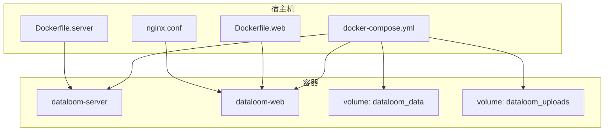
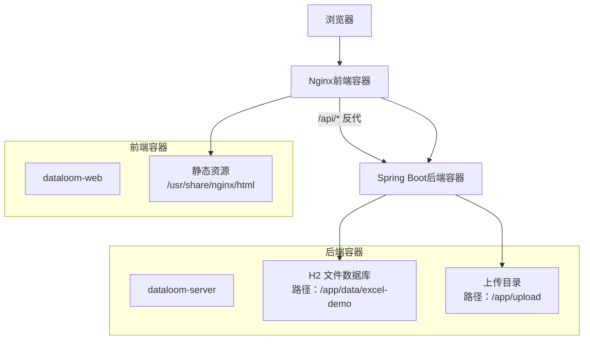
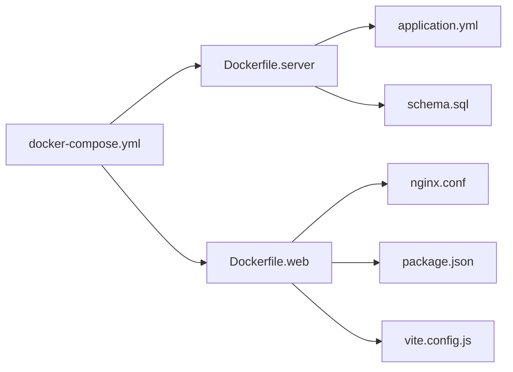

# Docker 容器化部署

<cite>
**本文引用的文件**
- [docker-compose.yml](file://deplay/docker-compose.yml)
- [Dockerfile.server](file://deplay/Dockerfile.server)
- [Dockerfile.web](file://deplay/Dockerfile.web)
- [nginx.conf](file://deplay/nginx.conf)
- [README.md（部署说明）](file://deplay/README.md)
- [application.yml](file://dataloom-server/src/main/resources/application.yml)
- [pom.xml](file://dataloom-server/pom.xml)
- [package.json](file://dataloom-web/package.json)
- [vite.config.js](file://dataloom-web/vite.config.js)
- [schema.sql](file://dataloom-server/src/main/resources/schema.sql)
- [README.md（项目总览）](file://README.md)
</cite>

## 目录
1. [简介](#简介)
2. [项目结构](#项目结构)
3. [核心组件](#核心组件)
4. [架构总览](#架构总览)
5. [详细组件分析](#详细组件分析)
6. [依赖关系分析](#依赖关系分析)
7. [性能与资源规划](#性能与资源规划)
8. [故障排查指南](#故障排查指南)
9. [结论](#结论)
10. [附录：部署与验证步骤](#附录：部署与验证步骤)

## 简介
本文件面向希望使用 Docker Compose 快速部署 DataLoom 的用户，系统性讲解：
- docker-compose.yml 的服务编排结构与启动顺序
- dataloom-server 与 dataloom-web 两服务的镜像构建流程
- 环境变量、数据卷、端口映射与网络配置
- 健康检查与重启策略建议
- 完整的部署命令与验证步骤

## 项目结构
DataLoom 的容器化部署位于 deplay 目录，包含：
- docker-compose.yml：服务编排与运行时配置
- Dockerfile.server：后端服务镜像构建
- Dockerfile.web：前端服务镜像构建
- nginx.conf：Nginx 反向代理配置
- README.md（部署说明）：部署指引与常用命令



图表来源
- [docker-compose.yml:1-34](file://deplay/docker-compose.yml#L1-L34)
- [Dockerfile.server:1-23](file://deplay/Dockerfile.server#L1-L23)
- [Dockerfile.web:1-18](file://deplay/Dockerfile.web#L1-L18)
- [nginx.conf:1-24](file://deplay/nginx.conf#L1-L24)

章节来源
- [docker-compose.yml:1-34](file://deplay/docker-compose.yml#L1-L34)
- [Dockerfile.server:1-23](file://deplay/Dockerfile.server#L1-L23)
- [Dockerfile.web:1-18](file://deplay/Dockerfile.web#L1-L18)
- [nginx.conf:1-24](file://deplay/nginx.conf#L1-L24)

## 核心组件
- dataloom-server：Spring Boot 后端，提供 Excel 文档与单元格数据的 REST API，内置 H2 文件数据库，支持文件上传与初始化建表。
- dataloom-web：Vue 3 前端，通过 Vite 开发服务器托管，生产环境由 Nginx 提供静态资源与反向代理，将 /api 请求转发至后端。
- Nginx：作为前端容器内的 Web 服务器，负责静态资源分发与 API 反代。

章节来源
- [application.yml:1-51](file://dataloom-server/src/main/resources/application.yml#L1-L51)
- [pom.xml:1-127](file://dataloom-server/pom.xml#L1-L127)
- [package.json:1-27](file://dataloom-web/package.json#L1-L27)
- [vite.config.js:1-26](file://dataloom-web/vite.config.js#L1-L26)
- [schema.sql:1-124](file://dataloom-server/src/main/resources/schema.sql#L1-L124)

## 架构总览
下图展示容器间交互与数据流向：



图表来源
- [docker-compose.yml:1-34](file://deplay/docker-compose.yml#L1-L34)
- [nginx.conf:1-24](file://deplay/nginx.conf#L1-L24)
- [application.yml:1-51](file://dataloom-server/src/main/resources/application.yml#L1-L51)

## 详细组件分析

### dataloom-server 服务
- 镜像构建
  - 使用 Maven 构建阶段获取依赖并打包，最终在最小 JRE 基础镜像上运行。
  - 暴露端口 9191，入口通过 JAVA_OPTS 注入 JVM 参数。
- 环境变量
  - JAVA_OPTS：用于设置 JVM 堆内存等参数。
  - SPRING_APPLICATION_NAME：应用名。
  - SPRING_DATASOURCE_URL：H2 文件数据库连接串（文件模式）。
  - EXCEL_UPLOAD_PATH：上传文件保存目录。
- 数据卷
  - /app/data：持久化 H2 数据库文件。
  - /app/upload：持久化上传的 Excel 文件。
- 端口映射
  - 9191:9191（容器内对外暴露）
- 依赖与启动顺序
  - 未显式声明健康检查，但通过 depends_on 保证 dataloom-web 在 dataloom-server 启动后再启动。
- 网络
  - 默认使用 Docker bridge 网络，容器间可通过服务名通信（如 Nginx 反代使用 dataloom-server）。

章节来源
- [Dockerfile.server:1-23](file://deplay/Dockerfile.server#L1-L23)
- [docker-compose.yml:1-34](file://deplay/docker-compose.yml#L1-L34)
- [application.yml:1-51](file://dataloom-server/src/main/resources/application.yml#L1-L51)

### dataloom-web 服务
- 镜像构建
  - Node.js 构建阶段安装依赖并打包，Nginx 基础镜像提供静态托管。
  - 将构建产物复制到 /usr/share/nginx/html，Nginx 监听 80 端口。
- 环境变量
  - 未设置额外环境变量。
- 端口映射
  - 8081:80（宿主 8081 映射到容器 80）
- 依赖与启动顺序
  - 通过 depends_on 依赖 dataloom-server，确保 API 可用。
- 网络
  - 通过 Nginx 的反向代理访问后端服务。

章节来源
- [Dockerfile.web:1-18](file://deplay/Dockerfile.web#L1-L18)
- [docker-compose.yml:1-34](file://deplay/docker-compose.yml#L1-L34)
- [nginx.conf:1-24](file://deplay/nginx.conf#L1-L24)

### Nginx 配置
- 监听 80 端口，根目录指向 /usr/share/nginx/html。
- 对 /api/ 请求进行反向代理，目标为 http://dataloom-server:9191/api/。
- 设置上传文件大小上限为 100MB。
- 采用 try_files $uri $uri/ /index.html，适配前端路由。

章节来源
- [nginx.conf:1-24](file://deplay/nginx.conf#L1-L24)

### 数据卷与持久化
- dataloom_data：持久化 H2 数据库文件，避免容器删除导致数据丢失。
- dataloom_uploads：持久化上传的 Excel 文件，便于后续处理与备份。
- Compose 文件中直接声明 volume，无需额外挂载参数。

章节来源
- [docker-compose.yml:30-32](file://deplay/docker-compose.yml#L30-L32)

### 端口与网络
- dataloom-server：容器 9191 暴露，宿主未显式映射（可按需添加）。
- dataloom-web：容器 80 暴露，宿主映射 8081:80。
- 容器间通信：Nginx 通过服务名 dataloom-server 访问后端。

章节来源
- [docker-compose.yml:16-28](file://deplay/docker-compose.yml#L16-L28)
- [nginx.conf:14-21](file://deplay/nginx.conf#L14-L21)

### 重启策略与运行时配置
- restart: unless-stopped：容器异常退出时自动重启，除非手动停止。
- 未配置健康检查（healthcheck），可结合实际需求增加探针。

章节来源
- [docker-compose.yml:7-26](file://deplay/docker-compose.yml#L7-L26)

## 依赖关系分析



图表来源
- [docker-compose.yml:1-34](file://deplay/docker-compose.yml#L1-L34)
- [Dockerfile.server:1-23](file://deplay/Dockerfile.server#L1-L23)
- [Dockerfile.web:1-18](file://deplay/Dockerfile.web#L1-L18)
- [nginx.conf:1-24](file://deplay/nginx.conf#L1-L24)
- [application.yml:1-51](file://dataloom-server/src/main/resources/application.yml#L1-L51)
- [schema.sql:1-124](file://dataloom-server/src/main/resources/schema.sql#L1-L124)
- [package.json:1-27](file://dataloom-web/package.json#L1-L27)
- [vite.config.js:1-26](file://dataloom-web/vite.config.js#L1-L26)

## 性能与资源规划
- JVM 内存：通过 JAVA_OPTS 调整堆内存，建议根据并发与文件规模评估。
- 上传容量：后端与 Nginx 均限制为 100MB，超出将被拒绝。
- 数据库：H2 文件模式适合 Demo，生产建议迁移到 MySQL/PG 并调整连接串。
- 并发与分块：后端按 1000 行分块存储，前端按需加载，降低数据库压力。

章节来源
- [application.yml:19-23](file://dataloom-server/src/main/resources/application.yml#L19-L23)
- [nginx.conf:8-8](file://deplay/nginx.conf#L8-L8)
- [schema.sql:1-124](file://dataloom-server/src/main/resources/schema.sql#L1-L124)

## 故障排查指南
- 无法访问前端页面
  - 检查 dataloom-web 是否成功启动且端口 8081 可达。
  - 查看 Nginx 配置是否正确反代 /api 到后端。
- API 返回 502/504
  - 确认 dataloom-server 已就绪，Nginx 代理目标可达。
  - 检查后端日志与数据库初始化情况。
- 上传失败或 413
  - 检查 Nginx 与后端对上传大小的限制。
- 数据丢失
  - 确认 dataloom_data 与 dataloom_uploads 卷存在且未被误删。
- 日志查看
  - 使用 Compose 日志命令实时跟踪容器输出。

章节来源
- [README.md（部署说明）:48-64](file://deplay/README.md#L48-L64)
- [nginx.conf:8-21](file://deplay/nginx.conf#L8-L21)
- [application.yml:19-23](file://dataloom-server/src/main/resources/application.yml#L19-L23)

## 结论
该部署方案通过 Docker Compose 将前后端与数据库解耦，借助 Nginx 实现静态资源与 API 反代，配合数据卷实现持久化。整体结构清晰、易于扩展，适合本地开发与演示环境。生产环境建议补充健康检查、安全加固与数据库迁移。

## 附录：部署与验证步骤

### 一键启动
在仓库根目录执行：
```bash
docker compose -f deplay/docker-compose.yml up -d --build
```

章节来源
- [README.md（部署说明）:13-19](file://deplay/README.md#L13-L19)

### 访问地址
- 前端页面：http://localhost:8081
- 后端接口：http://localhost:9191/api/excel
- H2 控制台：http://localhost:9191/h2-console

章节来源
- [README.md（部署说明）:21-25](file://deplay/README.md#L21-L25)

### 数据持久化
- Compose 会创建两个 Docker volume：dataloom_data 与 dataloom_uploads。
- 停止服务不会删除数据：
  ```bash
  docker compose -f deplay/docker-compose.yml down
  ```
- 如需彻底清空数据：
  ```bash
  docker compose -f deplay/docker-compose.yml down -v
  ```

章节来源
- [README.md（部署说明）:27-44](file://deplay/README.md#L27-L44)

### 常用命令
- 查看日志：
  ```bash
  docker compose -f deplay/docker-compose.yml logs -f
  ```
- 只重启后端：
  ```bash
  docker compose -f deplay/docker-compose.yml restart dataloom-server
  ```
- 重新构建并启动：
  ```bash
  docker compose -f deplay/docker-compose.yml up -d --build
  ```

章节来源
- [README.md（部署说明）:46-64](file://deplay/README.md#L46-L64)

### 服务说明
- 前端容器使用 Nginx 托管 Vite 构建产物，并将 /api/ 请求反向代理到后端容器。
- 后端容器使用 H2 文件数据库，默认数据库路径为 /app/data/excel-demo。
- 上传文件默认保存到 /app/upload。
- 以上路径均已挂载到 Docker volume。

章节来源
- [README.md（部署说明）:66-89](file://deplay/README.md#L66-L89)