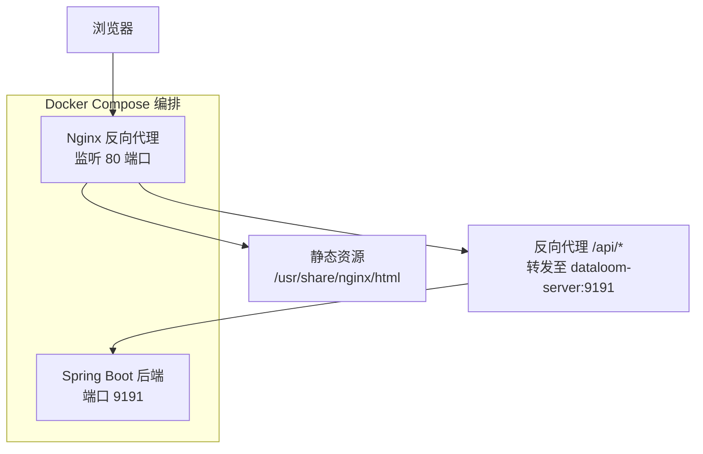
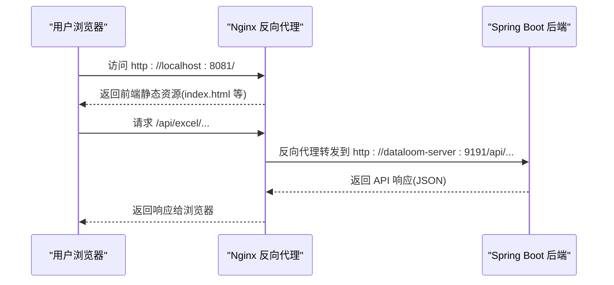

# Nginx 反向代理配置

<cite>
**本文引用的文件**
- [nginx.conf](file://deplay/nginx.conf)
- [docker-compose.yml](file://deplay/docker-compose.yml)
- [Dockerfile.web](file://deplay/Dockerfile.web)
- [Dockerfile.server](file://deplay/Dockerfile.server)
- [application.yml](file://dataloom-server/src/main/resources/application.yml)
- [vite.config.js](file://dataloom-web/vite.config.js)
- [README.md](file://README.md)
- [部署说明](file://deplay/README.md)
</cite>

## 目录
1. [简介](#简介)
2. [项目结构](#项目结构)
3. [核心组件](#核心组件)
4. [架构总览](#架构总览)
5. [详细组件分析](#详细组件分析)
6. [依赖关系分析](#依赖关系分析)
7. [性能考量](#性能考量)
8. [故障排除指南](#故障排除指南)
9. [结论](#结论)
10. [附录](#附录)

## 简介
本文件面向 DataLoom 项目的 Nginx 反向代理配置，系统性说明其在整体架构中的作用、部署位置、配置要点与工作原理。重点涵盖：
- Nginx 在 DataLoom 中作为前端静态资源服务器与 API 反向代理的作用定位
- nginx.conf 的关键配置项：上游服务器、负载均衡策略、静态资源处理
- 反向代理工作机制与请求转发流程
- SSL/TLS 证书与 HTTPS 重定向的建议配置
- 缓存与压缩策略对性能的影响
- 不同部署场景（开发/测试/生产）的差异化配置示例
- 性能调优参数与安全加固措施
- 配置验证与故障排除方法

## 项目结构
DataLoom 采用前后端分离架构，前端通过 Nginx 提供静态资源与 API 反向代理，后端以 Spring Boot 提供 REST API。部署通过 Docker Compose 编排，Nginx 容器负责对外暴露前端页面与 API。

图表来源
- [nginx.conf:1-24](file://deplay/nginx.conf#L1-L24)
- [docker-compose.yml:1-34](file://deplay/docker-compose.yml#L1-L34)

章节来源
- [nginx.conf:1-24](file://deplay/nginx.conf#L1-L24)
- [docker-compose.yml:1-34](file://deplay/docker-compose.yml#L1-L34)
- [Dockerfile.web:1-18](file://deplay/Dockerfile.web#L1-L18)
- [Dockerfile.server:1-23](file://deplay/Dockerfile.server#L1-L23)

## 核心组件
- Nginx 配置文件：定义监听端口、静态资源根目录、API 反向代理规则与请求头传递策略
- Docker Compose：编排前端 Nginx 与后端 Spring Boot 服务，映射端口与数据卷
- 前端构建产物：由 Vite 构建后复制到 Nginx 静态目录
- 后端应用配置：限制文件上传大小、启用 H2 控制台、MyBatis-Plus 配置等

章节来源
- [nginx.conf:1-24](file://deplay/nginx.conf#L1-L24)
- [docker-compose.yml:1-34](file://deplay/docker-compose.yml#L1-L34)
- [Dockerfile.web:1-18](file://deplay/Dockerfile.web#L1-L18)
- [application.yml:1-51](file://dataloom-server/src/main/resources/application.yml#L1-L51)

## 架构总览
下图展示浏览器访问到后端 API 的完整链路，以及 Nginx 在其中承担的角色。

图表来源
- [nginx.conf:10-21](file://deplay/nginx.conf#L10-L21)
- [docker-compose.yml:19-28](file://deplay/docker-compose.yml#L19-L28)

章节来源
- [nginx.conf:10-21](file://deplay/nginx.conf#L10-L21)
- [docker-compose.yml:19-28](file://deplay/docker-compose.yml#L19-L28)

## 详细组件分析

### Nginx 配置文件（nginx.conf）
- 监听与站点基础
  - 监听 80 端口，server_name 未指定具体域名，匹配任意主机名
  - 设置静态资源根目录与首页索引
- 上传大小限制
  - 通过 client_max_body_size 限制上传文件大小，与后端配置保持一致
- 静态资源路由
  - location / 使用 try_files 将请求回退到 index.html，支持前端单页应用路由
- API 反向代理
  - location /api/ 将请求转发至 dataloom-server:9191 的 /api/ 路径
  - 采用 HTTP/1.1，传递 Host、X-Real-IP、X-Forwarded-For、X-Forwarded-Proto 等头部，便于后端识别真实来源与协议

章节来源
- [nginx.conf:1-24](file://deplay/nginx.conf#L1-L24)

### Docker Compose 编排
- 服务定义
  - dataloom-server：后端服务，暴露 9191 端口，挂载数据与上传目录
  - dataloom-web：前端服务，基于 Nginx，映射 8081:80 对外提供服务
- 依赖关系
  - dataloom-web 依赖 dataloom-server，确保后端可用后再启动前端
- 端口映射
  - 前端容器映射 8081:80，浏览器访问 http://localhost:8081

章节来源
- [docker-compose.yml:1-34](file://deplay/docker-compose.yml#L1-L34)

### 前端构建与 Nginx 镜像
- 构建阶段
  - 使用 Node.js 20 Alpine 构建前端产物
- 运行阶段
  - 基于 nginx:1.27-alpine，复制构建产物到 /usr/share/nginx/html
  - 将 deplay/nginx.conf 复制到 /etc/nginx/conf.d/default.conf
  - 暴露 80 端口

章节来源
- [Dockerfile.web:1-18](file://deplay/Dockerfile.web#L1-L18)

### 后端应用配置
- 端口与数据库
  - 后端监听 9191 端口，使用 H2 文件模式数据库，开启 H2 控制台
- 文件上传
  - 限制单文件与请求总大小为 100MB，与 Nginx 限制保持一致
- MyBatis-Plus
  - 下划线转驼峰、日志输出、逻辑删除字段配置

章节来源
- [application.yml:1-51](file://dataloom-server/src/main/resources/application.yml#L1-L51)

### 开发环境 API 代理（Vite）
- 开发服务器通过 Vite 的 proxy 将 /api 请求代理到 http://localhost:9191
- 与生产环境 Nginx 反向代理形成一致的 API 前缀

章节来源
- [vite.config.js:12-21](file://dataloom-web/vite.config.js#L12-L21)

## 依赖关系分析
- Nginx 依赖后端服务名称（dataloom-server）进行内部网络转发
- 前端构建产物必须先于 Nginx 启动完成，否则静态资源不可用
- 上传大小限制在 Nginx 与后端均需一致，避免请求被拒绝或截断

图表来源
- [Dockerfile.web:13-14](file://deplay/Dockerfile.web#L13-L14)
- [nginx.conf:14-21](file://deplay/nginx.conf#L14-L21)

章节来源
- [Dockerfile.web:11-17](file://deplay/Dockerfile.web#L11-L17)
- [nginx.conf:14-21](file://deplay/nginx.conf#L14-L21)

## 性能考量
- 静态资源优化
  - Nginx 默认提供高效静态文件服务，结合前端构建产物可获得最佳性能
- 上传与请求大小
  - Nginx 与后端均限制为 100MB，避免过大请求导致内存压力
- 反向代理头部传递
  - 传递 X-Forwarded-Proto 有助于后端正确识别 HTTPS 场景（若启用 TLS）
- 压缩与缓存
  - 当前配置未启用 gzip 压缩与静态缓存，可在生产环境按需开启以提升传输效率与首屏速度

[本节为通用性能建议，不直接分析特定文件]

## 故障排除指南
- 访问 404 或路由异常
  - 检查 Nginx 是否正确复制前端构建产物到 /usr/share/nginx/html
  - 确认 location / 的 try_files 回退到 index.html
- API 请求失败
  - 确认 dataloom-server 服务已启动且可达
  - 检查 /api/ 反向代理目标地址是否正确
- 上传失败或被拒绝
  - 确认 Nginx 与后端的 client_max_body_size 一致
  - 查看后端日志确认是否达到上传上限
- 日志与调试
  - 使用 docker compose logs -f 查看容器日志
  - 前端开发环境可通过 Vite 的代理确认 /api 请求是否转发到后端

章节来源
- [nginx.conf:8-12](file://deplay/nginx.conf#L8-L12)
- [application.yml:19-23](file://dataloom-server/src/main/resources/application.yml#L19-L23)
- [部署说明:48-64](file://deplay/README.md#L48-L64)

## 结论
DataLoom 的 Nginx 反向代理配置简洁明确，承担了静态资源托管与 API 反向代理的核心职责。通过 Docker Compose 编排，实现了前后端服务的一键启动与稳定运行。生产环境中建议补充 TLS、压缩与缓存策略，并根据业务规模考虑负载均衡与健康检查等高级特性。

[本节为总结性内容，不直接分析特定文件]

## 附录

### 反向代理工作原理与请求转发机制
- 静态资源：Nginx 直接提供 /usr/share/nginx/html 下的文件
- 单页路由：location / 使用 try_files 回退到 index.html，保证前端路由正常
- API 转发：location /api/ 将请求转发到 dataloom-server:9191/api/，并传递必要的请求头

章节来源
- [nginx.conf:5-21](file://deplay/nginx.conf#L5-L21)

### SSL/TLS 证书配置与 HTTPS 重定向建议
- 证书与密钥
  - 在 Nginx 配置中添加 ssl_certificate 与 ssl_certificate_key
  - 设置 ssl_protocols 与 ssl_ciphers 提升安全性
- HTTPS 重定向
  - 可新增一个 80 端口 server，将所有请求重定向到 443
  - 注意传递 X-Forwarded-Proto 以便后端识别 HTTPS

[本小节为概念性建议，不直接分析特定文件]

### 缓存策略与压缩配置对性能的影响
- 压缩（gzip）
  - 启用 gzip 压缩可显著降低文本类资源体积，建议对 HTML、CSS、JS、JSON 启用
- 静态缓存
  - 为静态资源设置合理的缓存头，减少重复请求
- 动态缓存
  - 对 API 响应可按需设置缓存策略，平衡实时性与性能

[本小节为通用性能建议，不直接分析特定文件]

### 不同部署场景下的 Nginx 配置示例
- 开发环境
  - 保持当前配置，便于本地联调
  - 前端通过 Vite 代理 /api 至后端 9191
- 测试环境
  - 与开发类似，但可启用基本压缩与缓存
- 生产环境
  - 引入 TLS、HTTPS 重定向、访问日志、错误日志
  - 配置健康检查与超时参数，必要时引入负载均衡

[本小节为通用场景建议，不直接分析特定文件]

### 性能调优参数与安全加固措施
- 性能调优
  - worker_processes、worker_connections、keepalive_timeout
  - gzip、gzip_types、expires
- 安全加固
  - 移除不必要的 HTTP 方法与头部
  - 限制请求大小与超时
  - 启用 HTTPS 并配置强加密套件

[本小节为通用建议，不直接分析特定文件]

### 配置验证与故障排除方法
- 配置验证
  - 使用 nginx -t 检查语法
  - 通过 curl 或浏览器访问静态资源与 API 接口
- 常见问题排查
  - 端口冲突、容器间网络不通、静态资源未复制、上传大小不一致

[本小节为通用方法建议，不直接分析特定文件]