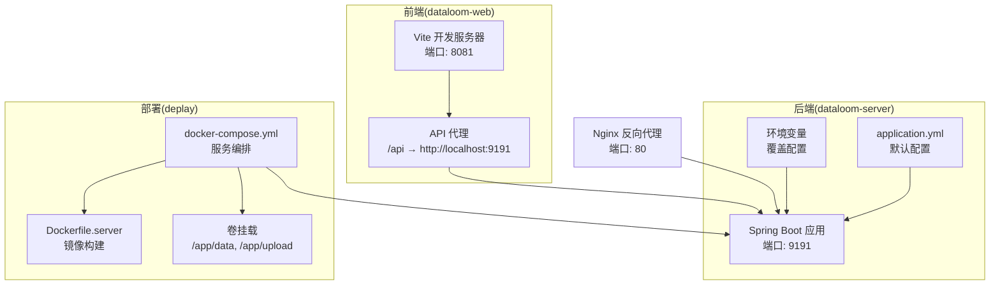
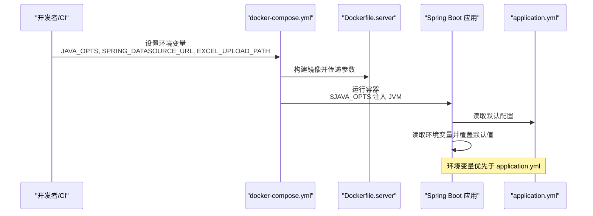
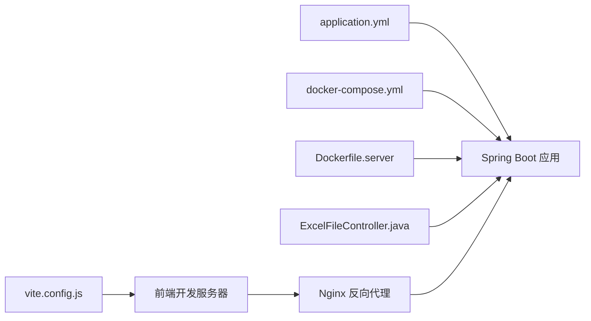

# 环境变量配置

<cite>
**本文引用的文件**
- [application.yml](file://dataloom-server/src/main/resources/application.yml)
- [docker-compose.yml](file://deplay/docker-compose.yml)
- [Dockerfile.server](file://deplay/Dockerfile.server)
- [ExcelFileController.java](file://dataloom-server/src/main/java/com/demo/excel/controller/ExcelFileController.java)
- [vite.config.js](file://dataloom-web/vite.config.js)
- [schema.sql](file://dataloom-server/src/main/resources/schema.sql)
- [README.md](file://README.md)
</cite>

## 目录
1. [简介](#简介)
2. [项目结构](#项目结构)
3. [核心组件](#核心组件)
4. [架构总览](#架构总览)
5. [详细组件分析](#详细组件分析)
6. [依赖分析](#依赖分析)
7. [性能考虑](#性能考虑)
8. [故障排查指南](#故障排查指南)
9. [结论](#结论)
10. [附录](#附录)

## 简介
本文件面向 DataLoom 的运维与开发团队，提供环境变量配置的权威指南。内容涵盖：
- 关键环境变量的含义、默认值与配置方式
- 不同环境（开发、测试、生产）下的差异化设置策略
- 敏感信息的安全管理（数据库密码、API 密钥等）
- 环境变量的优先级与覆盖规则
- 最佳实践与安全建议
- 常见配置错误的排查与修复
- 完整的环境配置清单与示例模板

## 项目结构
DataLoom 采用前后端分离架构，后端通过 Spring Boot 提供 REST API，前端通过 Vite 开发服务器提供静态资源与代理。部署层使用 Docker Compose 编排，容器内通过环境变量注入配置。

图表来源
- [docker-compose.yml:1-34](file://deplay/docker-compose.yml#L1-L34)
- [Dockerfile.server:1-23](file://deplay/Dockerfile.server#L1-L23)
- [vite.config.js:12-21](file://dataloom-web/vite.config.js#L12-L21)
- [application.yml:1-51](file://dataloom-server/src/main/resources/application.yml#L1-L51)

章节来源
- [docker-compose.yml:1-34](file://deplay/docker-compose.yml#L1-L34)
- [Dockerfile.server:1-23](file://deplay/Dockerfile.server#L1-L23)
- [vite.config.js:1-26](file://dataloom-web/vite.config.js#L1-L26)
- [application.yml:1-51](file://dataloom-server/src/main/resources/application.yml#L1-L51)

## 核心组件
- 应用端口与服务器配置：后端默认监听 9191 端口；前端开发服务器默认监听 8081 端口，并将 /api 前缀代理至后端 9191 端口。
- 数据库配置：默认使用 H2 文件模式（开发演示），可通过环境变量覆盖 JDBC URL；生产环境可切换至 MySQL。
- 文件上传路径：通过自定义配置项控制上传目录，默认位于应用工作目录下的相对路径。
- JVM 参数：通过 JAVA_OPTS 注入 JVM 启动参数，用于内存与 GC 等调优。

章节来源
- [application.yml:1-51](file://dataloom-server/src/main/resources/application.yml#L1-L51)
- [docker-compose.yml:8-17](file://deplay/docker-compose.yml#L8-L17)
- [Dockerfile.server:15-21](file://deplay/Dockerfile.server#L15-L21)
- [vite.config.js:12-21](file://dataloom-web/vite.config.js#L12-L21)

## 架构总览
下图展示了环境变量在启动与运行期的注入与覆盖关系，帮助理解配置优先级与生效顺序。

图表来源
- [docker-compose.yml:8-12](file://deplay/docker-compose.yml#L8-L12)
- [Dockerfile.server:15-21](file://deplay/Dockerfile.server#L15-L21)
- [application.yml:1-51](file://dataloom-server/src/main/resources/application.yml#L1-L51)

## 详细组件分析

### 数据库连接配置
- 关键变量
  - SPRING_DATASOURCE_URL：数据库 JDBC URL，用于指定驱动、主机、端口、数据库名与连接参数
- 默认行为
  - 开发阶段使用 H2 文件模式，JDBC URL 指向本地文件数据库
- 生产迁移
  - 切换至 MySQL 时，仅需替换 JDBC URL（以及相应的用户名/密码），无需更改代码
- 安全建议
  - 生产环境务必通过环境变量注入数据库凭据，避免硬编码
  - 使用只读账户执行只读查询，最小权限原则
- 配置要点
  - H2 文件模式：适合本地开发与演示，无需额外数据库安装
  - MySQL 切换：参考建表脚本中的兼容性提示，调整 application.yml 中的 datasource 配置

章节来源
- [docker-compose.yml:11-11](file://deplay/docker-compose.yml#L11-L11)
- [application.yml:9-13](file://dataloom-server/src/main/resources/application.yml#L9-L13)
- [schema.sql:1-4](file://dataloom-server/src/main/resources/schema.sql#L1-L4)

### 应用端口配置
- 关键变量
  - 容器映射：9191:9191（宿主:容器）
  - 前端开发端口：8081（Vite 开发服务器）
- 默认行为
  - 后端默认监听 9191；前端开发服务器默认监听 8081，并将 /api 代理至后端 9191
- 调整建议
  - 如需更改后端端口，请同时更新 application.yml 与 docker-compose.yml 的端口映射
  - 如需更改前端端口，请同步修改 vite.config.js 的 server.port

章节来源
- [application.yml:1-2](file://dataloom-server/src/main/resources/application.yml#L1-L2)
- [docker-compose.yml:16-17](file://deplay/docker-compose.yml#L16-L17)
- [vite.config.js:13-13](file://dataloom-web/vite.config.js#L13-L13)

### 上传路径配置
- 关键变量
  - EXCEL_UPLOAD_PATH：上传目录绝对或相对路径
- 默认行为
  - application.yml 中定义默认上传目录为 ./upload
  - 控制器通过 @Value 读取该配置，若未设置则使用默认值
- 生产建议
  - 建议使用绝对路径并挂载到持久化卷，避免容器重启导致数据丢失
  - 与 docker-compose.yml 中的卷挂载配合使用，确保数据持久化

章节来源
- [docker-compose.yml:12-15](file://deplay/docker-compose.yml#L12-L15)
- [application.yml:43-45](file://dataloom-server/src/main/resources/application.yml#L43-L45)
- [ExcelFileController.java:50-51](file://dataloom-server/src/main/java/com/demo/excel/controller/ExcelFileController.java#L50-L51)

### JVM 参数配置
- 关键变量
  - JAVA_OPTS：传入 JVM 的启动参数（如堆大小、GC 参数等）
- 默认行为
  - Dockerfile 中定义默认为空字符串，可在 docker-compose.yml 中覆盖
- 调优建议
  - 生产环境建议设置合理的 -Xms/-Xmx，结合业务并发与数据规模评估
  - 结合容器编排平台的资源限制，避免 OOM

章节来源
- [Dockerfile.server:15-15](file://deplay/Dockerfile.server#L15-L15)
- [docker-compose.yml:9-9](file://deplay/docker-compose.yml#L9-L9)

### 文件上传大小限制
- 关键配置
  - multipart.max-file-size 与 multipart.max-request-size：限制单文件与请求总大小
- 默认行为
  - 默认均为 100MB
- 调整建议
  - 根据业务场景适当提高或降低，注意与 Nginx 的 client_max_body_size 保持一致

章节来源
- [application.yml:19-23](file://dataloom-server/src/main/resources/application.yml#L19-L23)
- [nginx.conf:8-8](file://deplay/nginx.conf#L8-L8)

### 日志与调试
- 关键配置
  - logging.level.com.demo.excel：设置包级别日志输出
- 建议
  - 开发环境可设为 DEBUG，生产环境建议设为 INFO 或 WARN，避免日志风暴

章节来源
- [application.yml:48-50](file://dataloom-server/src/main/resources/application.yml#L48-L50)

## 依赖分析
- 配置耦合关系
  - application.yml 提供默认配置，docker-compose.yml 通过环境变量覆盖默认值
  - 控制器读取自定义配置项，实现上传路径的动态化
- 外部依赖
  - Nginx 作为反向代理，需与后端端口与上传大小限制保持一致

图表来源
- [application.yml:1-51](file://dataloom-server/src/main/resources/application.yml#L1-L51)
- [docker-compose.yml:8-17](file://deplay/docker-compose.yml#L8-L17)
- [Dockerfile.server:15-21](file://deplay/Dockerfile.server#L15-L21)
- [ExcelFileController.java:50-51](file://dataloom-server/src/main/java/com/demo/excel/controller/ExcelFileController.java#L50-L51)
- [vite.config.js:12-21](file://dataloom-web/vite.config.js#L12-L21)

章节来源
- [application.yml:1-51](file://dataloom-server/src/main/resources/application.yml#L1-L51)
- [docker-compose.yml:1-34](file://deplay/docker-compose.yml#L1-L34)
- [Dockerfile.server:1-23](file://deplay/Dockerfile.server#L1-L23)
- [ExcelFileController.java:50-51](file://dataloom-server/src/main/java/com/demo/excel/controller/ExcelFileController.java#L50-L51)
- [vite.config.js:1-26](file://dataloom-web/vite.config.js#L1-L26)

## 性能考虑
- JVM 参数
  - 通过 JAVA_OPTS 调整堆大小与 GC 策略，结合业务峰值并发与数据规模进行压测优化
- 上传与存储
  - 合理设置上传大小限制，避免超大文件导致内存压力
  - 使用持久化卷与合适的文件系统，减少 IO 延迟
- 端口与网络
  - 后端与 Nginx 的端口映射与代理需保持一致，避免额外转发损耗

## 故障排查指南
- 端口冲突
  - 现象：容器启动失败或端口占用
  - 排查：检查 docker-compose.yml 的端口映射与宿主机占用情况
- 上传失败或权限不足
  - 现象：上传报错或无法写入
  - 排查：确认 EXCEL_UPLOAD_PATH 是否存在且具备写权限；检查卷挂载路径是否正确
- 数据库连接异常
  - 现象：启动时报数据库连接错误
  - 排查：核对 SPRING_DATASOURCE_URL、用户名与密码；确认目标数据库可达
- 代理不通
  - 现象：前端无法访问 /api
  - 排查：确认 vite.config.js 的代理目标与后端端口一致；检查 Nginx 的 proxy_pass 配置

章节来源
- [docker-compose.yml:16-17](file://deplay/docker-compose.yml#L16-L17)
- [vite.config.js:15-20](file://dataloom-web/vite.config.js#L15-L20)
- [ExcelFileController.java:76-79](file://dataloom-server/src/main/java/com/demo/excel/controller/ExcelFileController.java#L76-L79)

## 结论
通过环境变量与配置文件的组合，DataLoom 实现了灵活的多环境部署与运行时覆盖。遵循本文的配置清单、优先级规则与安全建议，可在开发、测试与生产环境中稳定运行，并平滑迁移到生产数据库与反向代理。

## 附录

### 环境变量优先级与覆盖规则
- 优先级（从高到低）
  1) 容器环境变量（docker-compose.yml 中的 environment）
  2) JVM 启动参数（JAVA_OPTS）
  3) application.yml 默认值
- 覆盖范围
  - 数据库连接：通过 SPRING_DATASOURCE_URL 完全覆盖默认 H2 配置
  - 上传路径：通过 EXCEL_UPLOAD_PATH 覆盖 application.yml 中的默认值
  - JVM 参数：通过 JAVA_OPTS 影响应用运行时内存与性能

章节来源
- [docker-compose.yml:8-12](file://deplay/docker-compose.yml#L8-L12)
- [Dockerfile.server:15-21](file://deplay/Dockerfile.server#L15-L21)
- [application.yml:1-51](file://dataloom-server/src/main/resources/application.yml#L1-L51)

### 不同环境下的差异化设置
- 开发环境
  - 使用 H2 文件模式，便于本地快速启动
  - 前端开发服务器端口 8081，后端 9191
  - 日志级别可设为 DEBUG
- 测试环境
  - 使用与生产一致的数据库类型与连接参数
  - 上传路径使用绝对路径并挂载持久化卷
- 生产环境
  - 切换至 MySQL，严格最小权限与只读账户
  - 通过 Nginx 反向代理，统一入口与 TLS 终止
  - 合理设置 JVM 参数与资源限制

章节来源
- [application.yml:9-13](file://dataloom-server/src/main/resources/application.yml#L9-L13)
- [docker-compose.yml:11-12](file://deplay/docker-compose.yml#L11-L12)
- [nginx.conf:1-24](file://deplay/nginx.conf#L1-L24)

### 敏感信息安全管理
- 数据库凭据
  - 通过环境变量注入，避免提交到版本库
  - 生产环境使用只读账户执行只读查询
- API 密钥与第三方集成
  - 通过环境变量注入，定期轮换
- 存储与传输
  - 使用 HTTPS 与 TLS 终止
  - 限制日志输出敏感字段

章节来源
- [docker-compose.yml:8-12](file://deplay/docker-compose.yml#L8-L12)
- [schema.sql:1-4](file://dataloom-server/src/main/resources/schema.sql#L1-L4)

### 环境变量配置清单与示例模板
- 必填项
  - SPRING_APPLICATION_NAME：应用名称（建议与项目一致）
  - SPRING_DATASOURCE_URL：数据库 JDBC URL（生产环境指向 MySQL）
  - EXCEL_UPLOAD_PATH：上传目录绝对路径（建议挂载持久化卷）
- 可选项
  - JAVA_OPTS：JVM 启动参数（如内存与 GC）
  - server.port：后端端口（如需变更）
  - multipart.*：上传大小限制（如需变更）
- 示例模板（docker-compose.yml 片段）
  - 环境变量示例：见 [docker-compose.yml:8-12](file://deplay/docker-compose.yml#L8-L12)
  - JVM 参数示例：见 [Dockerfile.server:15-15](file://deplay/Dockerfile.server#L15-L15)
  - 上传路径与卷挂载：见 [docker-compose.yml:12-15](file://deplay/docker-compose.yml#L12-L15)

章节来源
- [docker-compose.yml:8-15](file://deplay/docker-compose.yml#L8-L15)
- [Dockerfile.server:15-15](file://deplay/Dockerfile.server#L15-L15)
- [application.yml:1-51](file://dataloom-server/src/main/resources/application.yml#L1-L51)