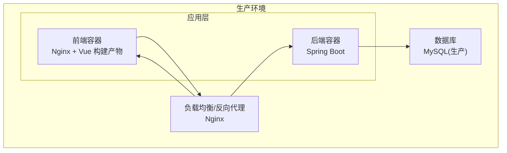
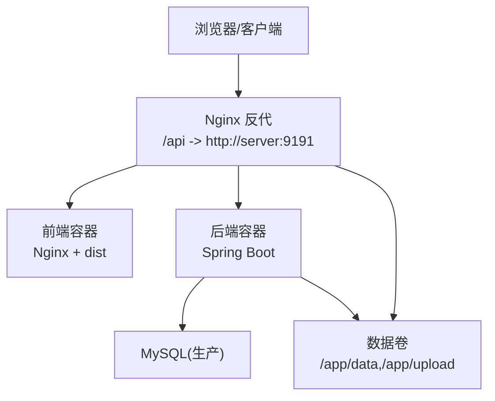
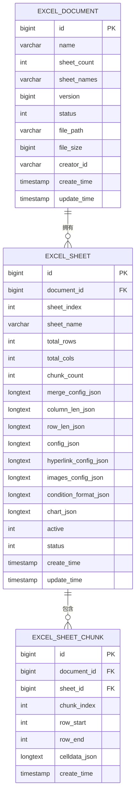
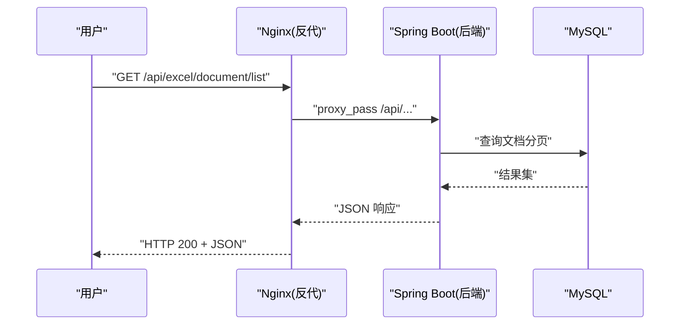
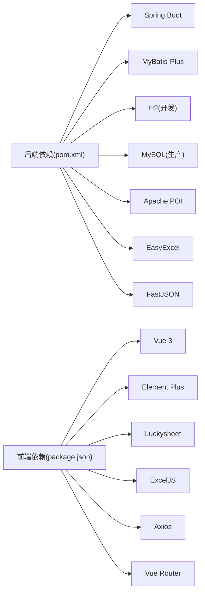

# 生产环境部署

<cite>
**本文引用的文件**
- [application.yml](file://dataloom-server/src/main/resources/application.yml)
- [schema.sql](file://dataloom-server/src/main/resources/schema.sql)
- [pom.xml](file://dataloom-server/pom.xml)
- [ExcelServiceApplication.java](file://dataloom-server/src/main/java/com/demo/excel/ExcelServiceApplication.java)
- [CorsConfig.java](file://dataloom-server/src/main/java/com/demo/excel/config/CorsConfig.java)
- [ApiResponse.java](file://dataloom-server/src/main/java/com/demo/excel/common/ApiResponse.java)
- [ExcelFileController.java](file://dataloom-server/src/main/java/com/demo/excel/controller/ExcelFileController.java)
- [ExcelDocumentController.java](file://dataloom-server/src/main/java/com/demo/excel/controller/ExcelDocumentController.java)
- [docker-compose.yml](file://deplay/docker-compose.yml)
- [Dockerfile.server](file://deplay/Dockerfile.server)
- [Dockerfile.web](file://deplay/Dockerfile.web)
- [nginx.conf](file://deplay/nginx.conf)
- [vite.config.js](file://dataloom-web/vite.config.js)
- [package.json](file://dataloom-web/package.json)
- [README.md](file://README.md)
</cite>

## 目录
1. [简介](#简介)
2. [项目结构](#项目结构)
3. [核心组件](#核心组件)
4. [架构总览](#架构总览)
5. [详细组件分析](#详细组件分析)
6. [依赖关系分析](#依赖关系分析)
7. [性能考量](#性能考量)
8. [故障排查指南](#故障排查指南)
9. [结论](#结论)
10. [附录](#附录)

## 简介
本指南面向 DataLoom 在生产环境的落地部署，目标是帮助运维与平台工程团队完成从单机到可扩展、可高可用、可监控、可回滚的生产级上线。当前仓库提供了基于 Spring Boot + Vue 的最小可行 Demo，采用 H2 嵌入式数据库以降低初始门槛；生产环境需替换为 MySQL，并配套容器编排、反向代理、安全加固、监控与备份策略。

## 项目结构
- 后端服务：Spring Boot 应用，提供 Excel 上传、解析、分块存储、单元格读写等接口。
- 前端应用：Vue 3 + Vite 构建，通过 Nginx 提供静态资源与反向代理。
- 部署编排：docker-compose 将后端、前端与数据卷统一编排，便于生产迁移。
- 数据模型：采用“文档-工作表-分块”三层结构，每块约 1000 行，兼顾大表性能与并发编辑。

**章节来源**
- [docker-compose.yml:1-34](file://deplay/docker-compose.yml#L1-L34)
- [Dockerfile.web:1-18](file://deplay/Dockerfile.web#L1-L18)
- [Dockerfile.server:1-23](file://deplay/Dockerfile.server#L1-L23)
- [nginx.conf:1-24](file://deplay/nginx.conf#L1-L24)

## 核心组件
- 应用入口与扫描
  - 启动类负责组件扫描与启动，位于后端模块根包下。
- 配置中心
  - application.yml 提供端口、数据源、文件上传大小、MyBatis-Plus、自定义 excel.upload.path、日志级别等。
- 数据模型与初始化
  - schema.sql 定义三张核心表，包含文档、工作表与分块；同时提供 MySQL 版建表参考。
- 控制器层
  - ExcelFileController：文件上传、保存原始文件、流式解析与分块入库。
  - ExcelDocumentController：文档列表、详情、全量/增量单元格更新、重命名与软删除。
- CORS 与统一返回
  - CorsConfig：开发阶段允许跨域，生产需收紧。
  - ApiResponse：统一封装返回体，便于前端消费与监控埋点。

**章节来源**
- [ExcelServiceApplication.java:1-21](file://dataloom-server/src/main/java/com/demo/excel/ExcelServiceApplication.java#L1-L21)
- [application.yml:1-51](file://dataloom-server/src/main/resources/application.yml#L1-L51)
- [schema.sql:1-124](file://dataloom-server/src/main/resources/schema.sql#L1-L124)
- [ExcelFileController.java:1-141](file://dataloom-server/src/main/java/com/demo/excel/controller/ExcelFileController.java#L1-L141)
- [ExcelDocumentController.java:1-296](file://dataloom-server/src/main/java/com/demo/excel/controller/ExcelDocumentController.java#L1-L296)
- [CorsConfig.java:1-22](file://dataloom-server/src/main/java/com/demo/excel/config/CorsConfig.java#L1-L22)
- [ApiResponse.java:1-52](file://dataloom-server/src/main/java/com/demo/excel/common/ApiResponse.java#L1-L52)

## 架构总览
DataLoom 的生产部署建议采用“Nginx 反向代理 + 后端容器 + MySQL + 数据卷”的组合。前端静态资源由 Nginx 提供，/api 前缀转发至后端容器；后端通过 JDBC 访问 MySQL，H2 仅用于 Demo。

**图表来源**
- [nginx.conf:14-21](file://deplay/nginx.conf#L14-L21)
- [docker-compose.yml:19-28](file://deplay/docker-compose.yml#L19-L28)
- [docker-compose.yml:8-15](file://deplay/docker-compose.yml#L8-L15)

**章节来源**
- [nginx.conf:1-24](file://deplay/nginx.conf#L1-L24)
- [docker-compose.yml:1-34](file://deplay/docker-compose.yml#L1-L34)

## 详细组件分析

### 数据库生产化改造
- 数据源切换
  - 将 application.yml 中的数据源从 H2 切换为 MySQL，并在 pom.xml 注释掉 H2 依赖、启用 MySQL Connector。
- 初始化脚本
  - schema.sql 提供 H2 建表；MySQL 建表参考位于同一文件末尾，可直接迁移。
- 连接池与参数
  - 建议在生产配置连接池（如 HikariCP）参数，包括最小/最大连接数、空闲超时、连接生命周期、获取超时等，以适配高并发与长事务场景。
- 逻辑删除与索引
  - 项目已内置逻辑删除字段，建议在 MySQL 上为常用查询字段建立合适索引，避免全表扫描。

**图表来源**
- [schema.sql:8-66](file://dataloom-server/src/main/resources/schema.sql#L8-L66)

**章节来源**
- [application.yml:9-13](file://dataloom-server/src/main/resources/application.yml#L9-L13)
- [pom.xml:46-59](file://dataloom-server/pom.xml#L46-L59)
- [schema.sql:69-123](file://dataloom-server/src/main/resources/schema.sql#L69-L123)

### 部署架构与高可用
- 单实例起步
  - 使用 docker-compose 启动后端与前端，映射端口与数据卷，适合小规模或测试环境。
- 高可用演进
  - 前端：多副本 Nginx，结合负载均衡器（如 HAProxy 或云 LB）。
  - 后端：多副本容器，配合外部 MySQL 主从或托管服务，使用健康检查与自动重启策略。
  - 存储：将 /app/data 与 /app/upload 挂载到持久化卷或对象存储，确保数据持久与可备份。
- 反向代理
  - nginx.conf 已配置 /api 前缀转发与客户端上传大小限制，生产可增加 gzip、缓存头、安全头等。

**图表来源**
- [nginx.conf:14-21](file://deplay/nginx.conf#L14-L21)
- [ExcelDocumentController.java:44-69](file://dataloom-server/src/main/java/com/demo/excel/controller/ExcelDocumentController.java#L44-L69)

**章节来源**
- [docker-compose.yml:1-34](file://deplay/docker-compose.yml#L1-L34)
- [nginx.conf:1-24](file://deplay/nginx.conf#L1-L24)

### 安全加固
- CORS 收敛
  - 当前开发配置允许任意来源，生产必须限定可信域名与方法。
- 访问控制
  - 建议在 Nginx 层加入基础认证或 WAF 规则；后端可引入 Spring Security/JWT 实现鉴权与授权。
- 传输安全
  - 生产务必启用 HTTPS，配置强密码套件与 TLS 版本；证书可通过自动化 ACME 或企业 CA 颁发。
- 文件上传安全
  - 限制文件类型、大小与白名单；对上传目录进行权限隔离与只读挂载（除写入卷外）。

**章节来源**
- [CorsConfig.java:14-20](file://dataloom-server/src/main/java/com/demo/excel/config/CorsConfig.java#L14-L20)
- [ExcelFileController.java:50-51](file://dataloom-server/src/main/java/com/demo/excel/controller/ExcelFileController.java#L50-L51)
- [nginx.conf:8](file://deplay/nginx.conf#L8)

### 监控与日志
- 应用监控
  - 后端可集成 Actuator/Micrometer，暴露健康检查、指标与 JVM/业务指标。
- 性能指标
  - 关注数据库连接池使用率、慢查询、接口耗时分布、分块读写延迟。
- 日志聚合
  - 前端 Nginx 访问日志与后端 stdout/stderr 输出统一采集，结合 ELK/EFK 或云日志服务。
- 告警策略
  - 基于错误率、P95/P99 延迟、连接池饱和度、磁盘空间与备份失败事件触发告警。

**章节来源**
- [application.yml:48-51](file://dataloom-server/src/main/resources/application.yml#L48-L51)
- [docker-compose.yml:13-15](file://deplay/docker-compose.yml#L13-L15)

### 滚动更新与回滚
- 滚动更新
  - 使用容器编排的滚动升级策略，逐步替换容器，保持对外服务可用。
- 回滚策略
  - 记录镜像版本与配置哈希；回滚时恢复上一个稳定版本与配置。
- 健康检查
  - 配置 readiness/liveness 探针，确保新版本就绪后再切流量。

**章节来源**
- [docker-compose.yml:7](file://deplay/docker-compose.yml#L7)

### 灾难恢复与备份
- 数据备份
  - MySQL 定期全量 + 增量备份，结合 binlog 归档；H2 Demo 场景下为文件级备份。
- 存储与恢复
  - 将 /app/data 与 /app/upload 挂载到持久卷；定期快照或归档到对象存储。
- RTO/RPO
  - 明确恢复目标（RTO/RPO），验证备份可恢复性与恢复时间。

**章节来源**
- [docker-compose.yml:13-15](file://deplay/docker-compose.yml#L13-L15)
- [schema.sql:69-123](file://dataloom-server/src/main/resources/schema.sql#L69-L123)

## 依赖关系分析
- 后端依赖
  - Spring Boot Web、MyBatis-Plus、H2（Demo）或 MySQL Connector、Apache POI、EasyExcel、FastJSON、Lombok、commons-fileupload。
- 前端依赖
  - Vue 3、Element Plus、Luckysheet、ExcelJS、Axios、Vue Router。
- 构建与运行
  - 后端使用 Maven 打包，JRE 8 运行；前端使用 Node 20 构建，Nginx 提供静态服务。

**图表来源**
- [pom.xml:32-106](file://dataloom-server/pom.xml#L32-L106)
- [package.json:12-26](file://dataloom-web/package.json#L12-L26)

**章节来源**
- [pom.xml:1-127](file://dataloom-server/pom.xml#L1-L127)
- [package.json:1-27](file://dataloom-web/package.json#L1-L27)

## 性能考量
- 数据库层面
  - 为常用查询字段建立索引；合理设置分页大小与排序字段；避免一次性拉取超大响应体。
- 接口层面
  - 分块加载与懒加载策略有效降低单次 IO；批量更新接口减少写放大。
- 容器与网络
  - 合理设置 JVM 堆大小与 GC 参数；Nginx 启用压缩与缓存；CDN 加速静态资源。

**章节来源**
- [schema.sql:84-85](file://dataloom-server/src/main/resources/schema.sql#L84-L85)
- [ExcelDocumentController.java:139-161](file://dataloom-server/src/main/java/com/demo/excel/controller/ExcelDocumentController.java#L139-L161)
- [ExcelDocumentController.java:176-190](file://dataloom-server/src/main/java/com/demo/excel/controller/ExcelDocumentController.java#L176-L190)

## 故障排查指南
- 常见问题定位
  - 上传失败：检查上传目录权限、磁盘空间、文件大小限制与 Nginx 代理配置。
  - 接口 500：查看后端日志与异常堆栈，关注解析/分块写入过程中的异常。
  - CORS 报错：确认生产 CORS 白名单与预检请求处理。
- 建议流程
  - 采集前后端日志与数据库慢查询；核对容器健康状态与资源使用；验证 Nginx 访问日志与后端接口耗时。

**章节来源**
- [ExcelFileController.java:112-115](file://dataloom-server/src/main/java/com/demo/excel/controller/ExcelFileController.java#L112-L115)
- [ExcelDocumentController.java:186-189](file://dataloom-server/src/main/java/com/demo/excel/controller/ExcelDocumentController.java#L186-L189)
- [application.yml:48-51](file://dataloom-server/src/main/resources/application.yml#L48-L51)

## 结论
本指南基于现有仓库给出了从配置、架构、安全、监控到灾备与运维的完整落地思路。生产化的关键在于：替换数据源为 MySQL、收紧 CORS、启用 HTTPS、完善监控与备份、制定滚动更新与回滚策略，并持续优化数据库与接口性能。

## 附录

### 生产环境清单与要点
- 硬件与系统
  - CPU/内存：根据并发与数据规模评估；建议预留 20% 资源余量。
  - 存储：SSD 优先；为 /app/data 与 /app/upload 配置独立挂载与快照策略。
  - 操作系统：稳定 LTS 版本，内核与容器运行时保持兼容。
- 系统依赖
  - 后端：JRE 8（或升级至更高版本）、MySQL 8+。
  - 前端：Nginx 1.27+、Node 20+（构建）。
- 网络与安全
  - 防火墙：仅开放 80/443（前端）、9191（后端内部）、SSH 端口。
  - SSL：启用 HTTPS，强制 HSTS 与现代密码套件。
  - 访问控制：Nginx 层限流与 WAF；后端鉴权与接口幂等。
- 部署与编排
  - 使用 docker-compose 或 Kubernetes；配置健康检查与自动重启。
  - 将敏感配置放入环境变量或密钥管理服务。
- 监控与日志
  - 指标：QPS、错误率、P95/P99、数据库连接池、GC、JVM 堆。
  - 日志：结构化输出、集中采集、分级留存。
- 备份与恢复
  - MySQL：全量 + 增量 + binlog；定期校验恢复演练。
  - 文件：上传目录与数据库文件定期备份与归档。

**章节来源**
- [docker-compose.yml:8-15](file://deplay/docker-compose.yml#L8-L15)
- [Dockerfile.server:15-21](file://deplay/Dockerfile.server#L15-L21)
- [Dockerfile.web:11-17](file://deplay/Dockerfile.web#L11-L17)
- [nginx.conf:14-21](file://deplay/nginx.conf#L14-L21)
- [pom.xml:46-59](file://dataloom-server/pom.xml#L46-L59)