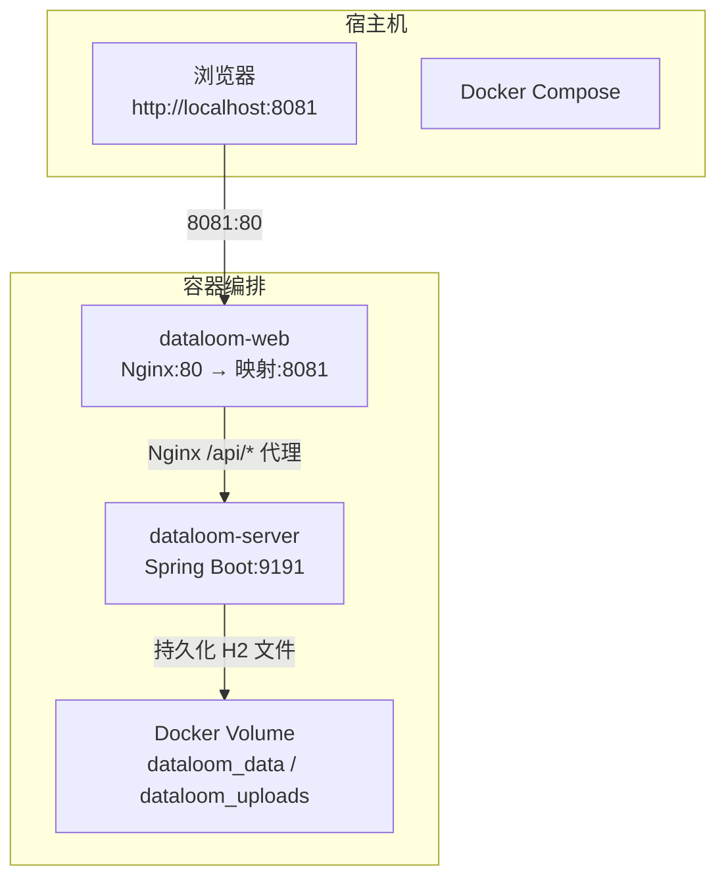
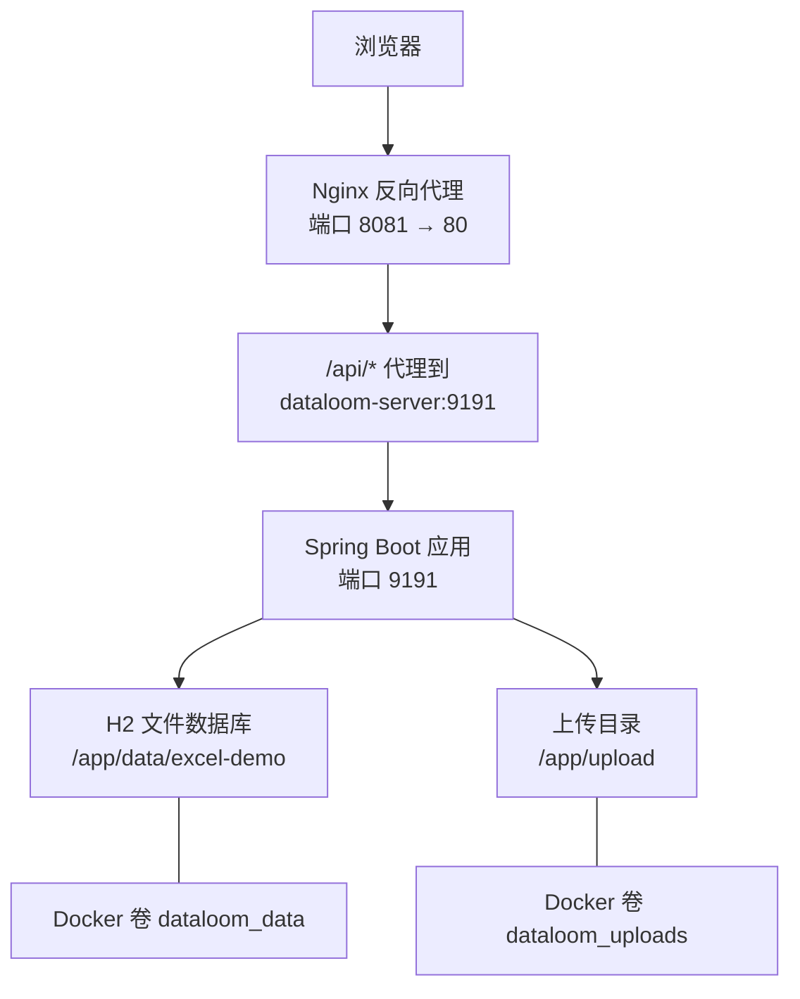
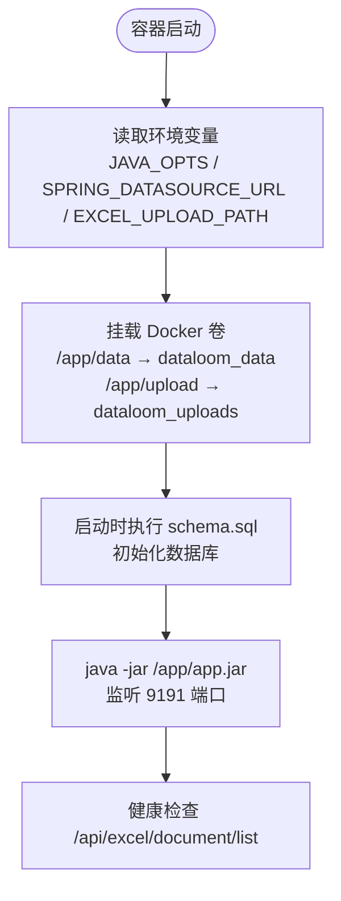
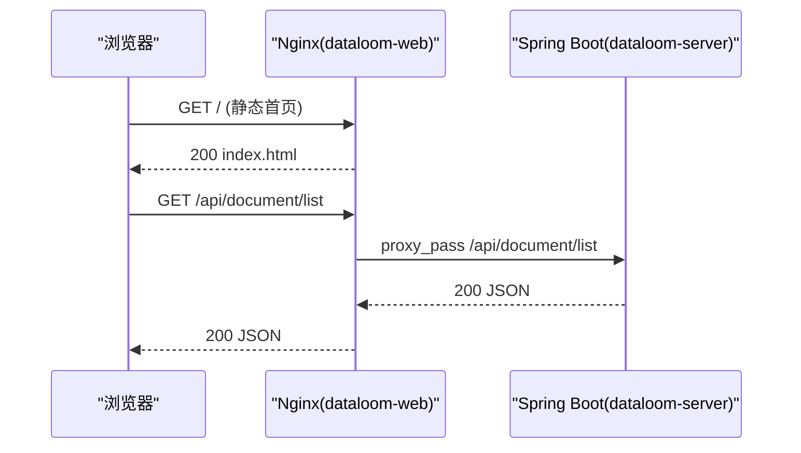
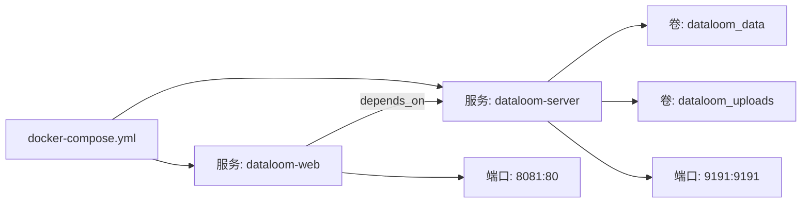
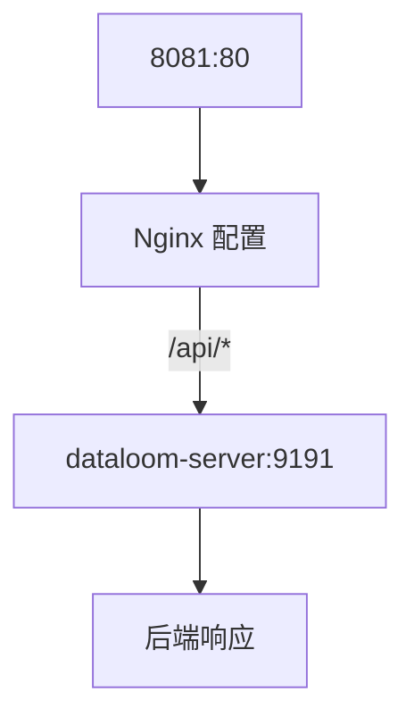
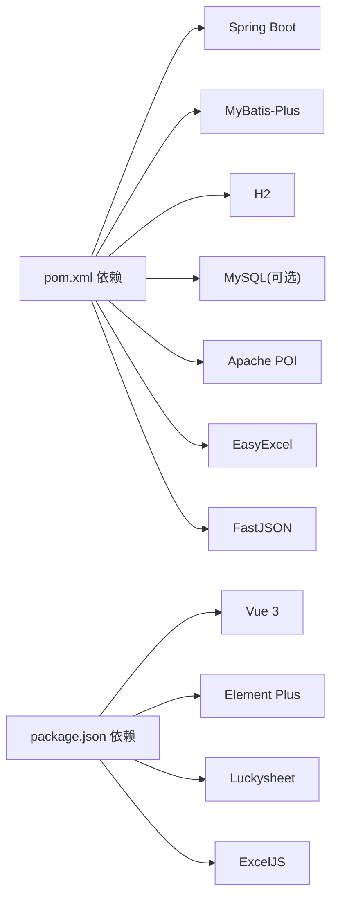

# 部署指南

<cite>
**本文引用的文件**
- [docker-compose.yml](file://deplay/docker-compose.yml)
- [Dockerfile.server](file://deplay/Dockerfile.server)
- [Dockerfile.web](file://deplay/Dockerfile.web)
- [nginx.conf](file://deplay/nginx.conf)
- [README.md（部署说明）](file://deplay/README.md)
- [application.yml](file://dataloom-server/src/main/resources/application.yml)
- [pom.xml](file://dataloom-server/pom.xml)
- [package.json](file://dataloom-web/package.json)
- [vite.config.js](file://dataloom-web/vite.config.js)
- [ExcelServiceApplication.java](file://dataloom-server/src/main/java/com/demo/excel/ExcelServiceApplication.java)
- [schema.sql](file://dataloom-server/src/main/resources/schema.sql)
- [README.md（项目总览）](file://README.md)
- [从零构建在线Excel.md](file://从零构建在线Excel.md)
- [DataLoom-系统架构与技术实践.md](file://docs/DataLoom-系统架构与技术实践.md)
</cite>

## 目录
1. [简介](#简介)
2. [项目结构](#项目结构)
3. [核心组件](#核心组件)
4. [架构总览](#架构总览)
5. [详细组件分析](#详细组件分析)
6. [依赖分析](#依赖分析)
7. [性能考虑](#性能考虑)
8. [故障排查指南](#故障排查指南)
9. [结论](#结论)
10. [附录](#附录)

## 简介
本指南面向运维与开发者，提供 DataLoom 的完整生产级部署方案。内容涵盖：
- Docker 容器化部署：后端服务容器与前端应用容器的镜像构建与运行参数
- Docker Compose 编排：服务定义、依赖关系、卷与端口映射
- Nginx 反向代理：静态资源托管与 /api/ 路由转发策略
- 生产环境配置：环境变量、数据库连接、文件上传与日志级别
- 多环境差异：开发、测试、生产三类环境的差异化配置要点
- 自动化与运维：部署脚本、日志采集、备份与监控建议
- 故障排查：常见问题定位与处理步骤

## 项目结构
DataLoom 采用前后端分离架构，部署层通过 Docker Compose 编排两个服务：
- dataloom-server：Spring Boot 后端，提供 REST API 与 H2 文件数据库
- dataloom-web：Vue 3 前端，使用 Nginx 托管静态资源并通过 /api/ 反代到后端

**图表来源**
- [docker-compose.yml:1-34](file://deplay/docker-compose.yml#L1-L34)
- [Dockerfile.web:1-18](file://deplay/Dockerfile.web#L1-L18)
- [nginx.conf:1-24](file://deplay/nginx.conf#L1-L24)

**章节来源**
- [docker-compose.yml:1-34](file://deplay/docker-compose.yml#L1-L34)
- [README.md（部署说明）:1-89](file://deplay/README.md#L1-L89)

## 核心组件
- 后端服务容器
  - 基于 Eclipse Temurin 8 JRE 运行，监听 9191 端口
  - 默认使用 H2 文件数据库（文件位于 /app/data/excel-demo）
  - 上传目录默认为 /app/upload，挂载至 Docker volume
  - JVM 参数可通过 JAVA_OPTS 注入
- 前端应用容器
  - 基于 Node 20 Alpine 构建，使用 Vite 构建产物
  - 使用 Nginx 1.27 Alpine 提供静态资源服务，监听 80 端口
  - 通过 /api/ 反向代理到 dataloom-server:9191
- Compose 编排
  - dataloom-web 依赖 dataloom-server，确保后端先启动
  - 定义两个命名卷：dataloom_data、dataloom_uploads
  - 端口映射：8081:80（前端）与 9191:9191（后端）

**章节来源**
- [docker-compose.yml:1-34](file://deplay/docker-compose.yml#L1-L34)
- [Dockerfile.server:1-23](file://deplay/Dockerfile.server#L1-L23)
- [Dockerfile.web:1-18](file://deplay/Dockerfile.web#L1-L18)
- [nginx.conf:1-24](file://deplay/nginx.conf#L1-L24)

## 架构总览
下图展示了浏览器、Nginx、后端服务与持久化卷之间的交互关系。

**图表来源**
- [docker-compose.yml:1-34](file://deplay/docker-compose.yml#L1-L34)
- [nginx.conf:14-21](file://deplay/nginx.conf#L14-L21)
- [application.yml:11](file://dataloom-server/src/main/resources/application.yml#L11)

**章节来源**
- [docker-compose.yml:1-34](file://deplay/docker-compose.yml#L1-L34)
- [nginx.conf:1-24](file://deplay/nginx.conf#L1-L24)
- [application.yml:11](file://dataloom-server/src/main/resources/application.yml#L11)

## 详细组件分析

### 后端服务容器（Spring Boot）
- 镜像构建
  - 多阶段构建：Maven 构建产物 → JRE 运行时
  - 运行时工作目录 /app，暴露 9191 端口
  - 通过 JAVA_OPTS 注入 JVM 参数
- 运行参数与环境变量
  - SPRING_DATASOURCE_URL：H2 文件数据库连接串（文件模式）
  - EXCEL_UPLOAD_PATH：上传目录路径
  - JAVA_OPTS：JVM 启动参数（示例：内存上限等）
- 数据持久化
  - 通过 dataloom_data 卷挂载 /app/data，确保数据库文件持久化
  - 通过 dataloom_uploads 卷挂载 /app/upload，确保上传文件持久化
- 日志与健康检查
  - 默认日志级别为 DEBUG（便于排障）
  - 建议生产环境降低日志级别，减少 IO

**图表来源**
- [Dockerfile.server:1-23](file://deplay/Dockerfile.server#L1-L23)
- [docker-compose.yml:8-15](file://deplay/docker-compose.yml#L8-L15)
- [application.yml:25-29](file://dataloom-server/src/main/resources/application.yml#L25-L29)

**章节来源**
- [Dockerfile.server:1-23](file://deplay/Dockerfile.server#L1-L23)
- [docker-compose.yml:8-15](file://deplay/docker-compose.yml#L8-L15)
- [application.yml:11-17](file://dataloom-server/src/main/resources/application.yml#L11-L17)
- [application.yml:48-51](file://dataloom-server/src/main/resources/application.yml#L48-L51)

### 前端应用容器（Nginx + Vue 3）
- 镜像构建
  - Node 20 Alpine 构建前端产物
  - Nginx 1.27 Alpine 提供静态资源服务
- Nginx 配置
  - 监听 80 端口，root 指向 /usr/share/nginx/html
  - /api/ 请求转发至 dataloom-server:9191
  - 上传文件大小限制 100MB
- 开发代理
  - Vite 开发服务器将 /api 代理到 http://localhost:9191（用于本地开发）

**图表来源**
- [Dockerfile.web:1-18](file://deplay/Dockerfile.web#L1-L18)
- [nginx.conf:10-21](file://deplay/nginx.conf#L10-L21)
- [vite.config.js:15-20](file://dataloom-web/vite.config.js#L15-L20)

**章节来源**
- [Dockerfile.web:1-18](file://deplay/Dockerfile.web#L1-L18)
- [nginx.conf:1-24](file://deplay/nginx.conf#L1-L24)
- [vite.config.js:12-21](file://dataloom-web/vite.config.js#L12-L21)

### Docker Compose 编排
- 服务定义
  - dataloom-server：构建上下文指向仓库根目录，使用 deplay/Dockerfile.server
  - dataloom-web：构建上下文指向仓库根目录，使用 deplay/Dockerfile.web
- 依赖关系
  - dataloom-web 依赖 dataloom-server（depends_on）
- 卷与端口
  - dataloom_data、dataloom_uploads 两个命名卷
  - dataloom-web 暴露 8081:80，dataloom-server 暴露 9191:9191
- 环境变量
  - dataloom-server 设置 JAVA_OPTS、SPRING_APPLICATION_NAME、SPRING_DATASOURCE_URL、EXCEL_UPLOAD_PATH

**图表来源**
- [docker-compose.yml:1-34](file://deplay/docker-compose.yml#L1-L34)

**章节来源**
- [docker-compose.yml:1-34](file://deplay/docker-compose.yml#L1-L34)

### Nginx 反向代理与负载均衡
- 反向代理
  - /api/ 前缀转发至 dataloom-server:9191
  - 保持 Host、X-Real-IP、X-Forwarded-For、X-Forwarded-Proto 请求头
- 负载均衡
  - 当前 Compose 仅运行单实例，未启用多实例负载均衡
  - 如需横向扩展，可在上游接入 Nginx/Traefik/HAProxy 实现多实例均衡

**图表来源**
- [nginx.conf:14-21](file://deplay/nginx.conf#L14-L21)

**章节来源**
- [nginx.conf:1-24](file://deplay/nginx.conf#L1-L24)

### 生产环境配置与数据库连接
- 数据库
  - 默认使用 H2 文件数据库（零依赖，适合演示）
  - 生产建议替换为 MySQL/PG，修改 application.yml 中的 datasource 配置
- 文件上传
  - 上传大小限制 100MB，路径通过 EXCEL_UPLOAD_PATH 指定
- 日志
  - 默认 DEBUG，生产建议调整为 INFO/WARN/ERROR
- JVM
  - 通过 JAVA_OPTS 调整堆大小与 GC 参数

**章节来源**
- [application.yml:8-23](file://dataloom-server/src/main/resources/application.yml#L8-L23)
- [docker-compose.yml:11-12](file://deplay/docker-compose.yml#L11-L12)
- [docker-compose.yml:16](file://deplay/docker-compose.yml#L16)
- [application.yml:48-51](file://dataloom-server/src/main/resources/application.yml#L48-L51)

### 多环境差异化配置
- 开发环境
  - 本地开发使用 Vite 代理（/api → 9191），无需 Nginx
  - 日志级别可保持 DEBUG
- 测试环境
  - 使用 Compose 启动，建议开启健康检查与日志聚合
  - 数据库可使用 H2 或轻量级 MySQL
- 生产环境
  - 使用 Nginx 反代，暴露 80/443
  - 数据库使用 MySQL/PG，启用连接池与只读副本
  - 调整 JVM 参数与日志级别，开启监控与告警

**章节来源**
- [vite.config.js:15-20](file://dataloom-web/vite.config.js#L15-L20)
- [README.md（部署说明）:13-26](file://deplay/README.md#L13-L26)
- [application.yml:48-51](file://dataloom-server/src/main/resources/application.yml#L48-L51)

### 自动化部署与最佳实践
- 一键启动
  - 在仓库根目录执行 Compose 命令，支持 --build 重新构建
- 停止与清空数据
  - down 停止服务；down -v 同时删除卷
- 常用命令
  - 查看日志、重启后端、重新构建并启动
- 最佳实践
  - 使用 Docker Swarm/K8s 管理多实例与滚动升级
  - 配置健康检查与自动重启策略
  - 使用外部 Nginx/Traefik 实现 TLS 与多实例负载均衡
  - 将敏感配置放入环境变量或密钥管理服务

**章节来源**
- [README.md（部署说明）:13-64](file://deplay/README.md#L13-L64)

## 依赖分析
- 后端依赖
  - Spring Boot 2.1 + MyBatis-Plus 3.3
  - H2（演示）或 MySQL（生产）
  - Apache POI、EasyExcel、FastJSON、Lombok
- 前端依赖
  - Vue 3 + Vite + Element Plus
  - Luckysheet + ExcelJS
- 运行时
  - JDK 8（后端）、Node.js 18+（开发）

**图表来源**
- [pom.xml:32-106](file://dataloom-server/pom.xml#L32-L106)
- [package.json:12-26](file://dataloom-web/package.json#L12-L26)

**章节来源**
- [pom.xml:15-106](file://dataloom-server/pom.xml#L15-L106)
- [package.json:12-26](file://dataloom-web/package.json#L12-L26)

## 性能考虑
- 数据库
  - H2 文件模式适合演示；生产建议 MySQL/PG，启用索引与连接池
  - schema.sql 中包含常用索引建议，迁移时可参考
- 上传与导出
  - 上传大小限制 100MB；前端导出由 ExcelJS 完成，避免后端样式重建开销
- JVM 与容器
  - 通过 JAVA_OPTS 调整堆大小与 GC 参数
  - 建议为容器设置 CPU/内存限制与重启策略
- 反向代理
  - Nginx 作为边缘代理，建议开启 gzip、缓存静态资源

**章节来源**
- [application.yml:19-23](file://dataloom-server/src/main/resources/application.yml#L19-L23)
- [schema.sql:1-124](file://dataloom-server/src/main/resources/schema.sql#L1-L124)
- [DataLoom-系统架构与技术实践.md:341-362](file://docs/DataLoom-系统架构与技术实践.md#L341-L362)

## 故障排查指南
- 无法访问前端页面
  - 检查 dataloom-web 是否启动并监听 80 端口
  - 确认宿主机 8081:80 映射是否生效
- /api/ 请求失败
  - 检查 dataloom-server 是否启动并监听 9191
  - 确认 Nginx /api/ 代理配置是否正确
- 数据库文件未持久化
  - 检查 dataloom_data 与 dataloom_uploads 卷是否存在
  - 停止后删除卷会导致数据丢失
- 日志定位
  - 使用 docker compose logs -f 查看实时日志
  - 后端默认 DEBUG 级别，生产建议调整

**章节来源**
- [README.md（部署说明）:48-64](file://deplay/README.md#L48-L64)
- [docker-compose.yml:25-26](file://deplay/docker-compose.yml#L25-L26)
- [nginx.conf:14-21](file://deplay/nginx.conf#L14-L21)

## 结论
本指南提供了 DataLoom 的端到端部署方案，涵盖容器化、编排、反向代理、生产配置与运维实践。建议在生产环境中：
- 使用 Nginx/Traefik 作为边缘代理与 TLS 终端
- 将数据库替换为 MySQL/PG 并启用连接池与只读副本
- 通过 Compose/K8s 实现多实例与滚动升级
- 建立日志聚合、监控与告警体系，保障稳定性与可维护性

## 附录
- 快速启动命令
  - docker compose -f deplay/docker-compose.yml up -d --build
- 停止与清空数据
  - docker compose -f deplay/docker-compose.yml down
  - docker compose -f deplay/docker-compose.yml down -v
- 常用运维命令
  - 查看日志：docker compose logs -f
  - 重启后端：docker compose restart dataloom-server
  - 重新构建并启动：docker compose up -d --build

**章节来源**
- [README.md（部署说明）:13-64](file://deplay/README.md#L13-L64)