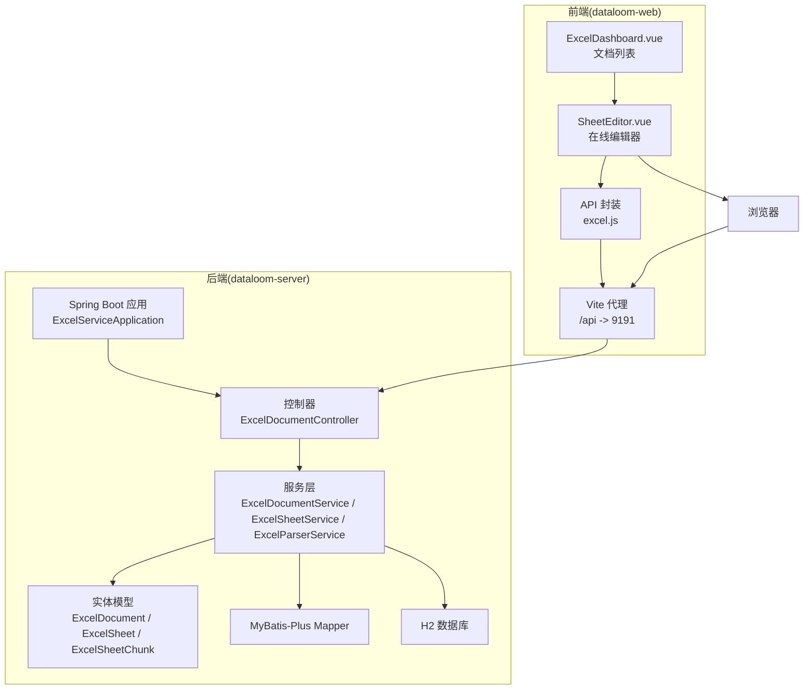
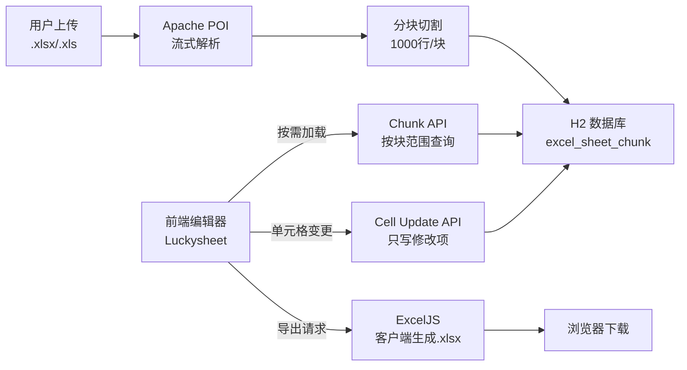
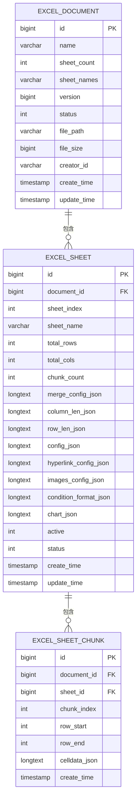
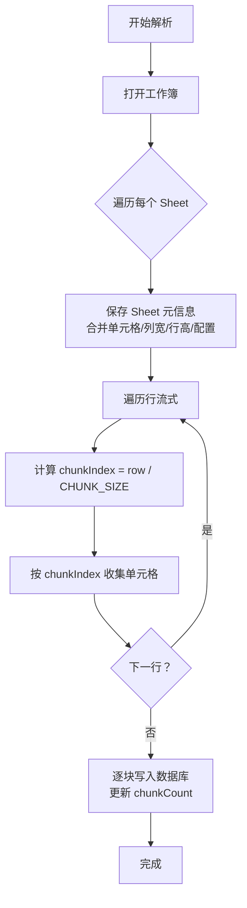
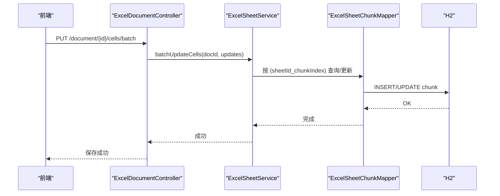
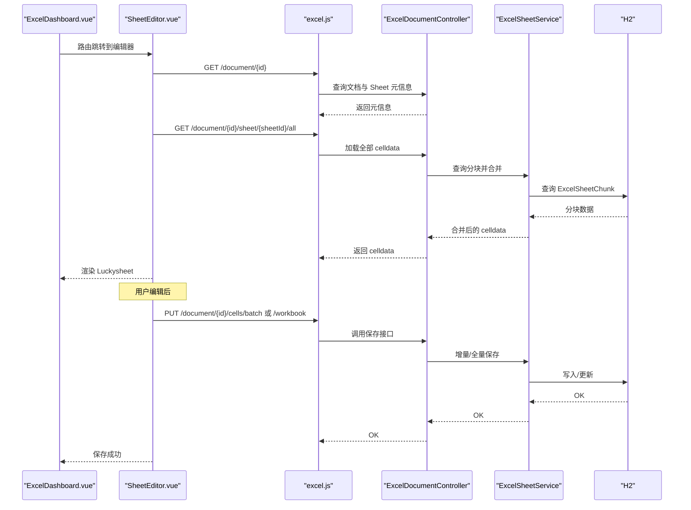
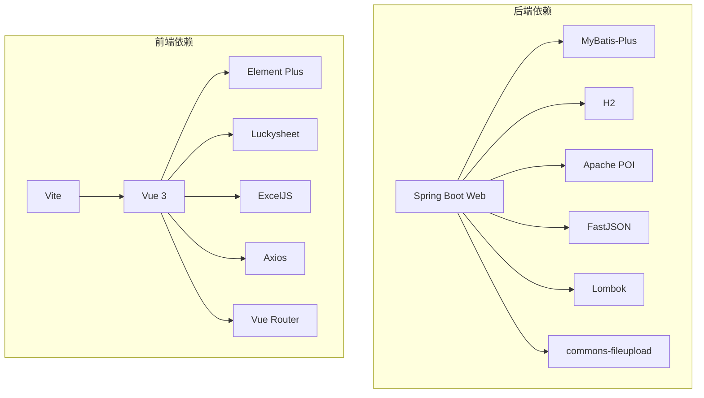

# 项目概述

<cite>
**本文引用的文件**
- [README.md](file://README.md)
- [ExcelServiceApplication.java](file://dataloom-server/src/main/java/com/demo/excel/ExcelServiceApplication.java)
- [application.yml](file://dataloom-server/src/main/resources/application.yml)
- [pom.xml](file://dataloom-server/pom.xml)
- [ExcelDocument.java](file://dataloom-server/src/main/java/com/demo/excel/entity/ExcelDocument.java)
- [ExcelSheet.java](file://dataloom-server/src/main/java/com/demo/excel/entity/ExcelSheet.java)
- [ExcelSheetChunk.java](file://dataloom-server/src/main/java/com/demo/excel/entity/ExcelSheetChunk.java)
- [schema.sql](file://dataloom-server/src/main/resources/schema.sql)
- [ExcelDocumentController.java](file://dataloom-server/src/main/java/com/demo/excel/controller/ExcelDocumentController.java)
- [ExcelDocumentService.java](file://dataloom-server/src/main/java/com/demo/excel/service/ExcelDocumentService.java)
- [ExcelParserService.java](file://dataloom-server/src/main/java/com/demo/excel/service/ExcelParserService.java)
- [ExcelSheetService.java](file://dataloom-server/src/main/java/com/demo/excel/service/ExcelSheetService.java)
- [package.json](file://dataloom-web/package.json)
- [vite.config.js](file://dataloom-web/vite.config.js)
- [ExcelDashboard.vue](file://dataloom-web/src/views/ExcelDashboard.vue)
- [SheetEditor.vue](file://dataloom-web/src/views/SheetEditor.vue)
- [excel.js](file://dataloom-web/src/api/excel.js)
</cite>

## 目录
1. [简介](#简介)
2. [项目结构](#项目结构)
3. [核心组件](#核心组件)
4. [架构总览](#架构总览)
5. [详细组件分析](#详细组件分析)
6. [依赖分析](#依赖分析)
7. [性能考量](#性能考量)
8. [故障排查指南](#故障排查指南)
9. [结论](#结论)
10. [附录](#附录)

## 简介
DataLoom 是一个从零构建的在线 Excel 协作系统，旨在解决传统 Excel 协作中的痛点：版本混乱、数据安全性受限、大文件性能瓶颈以及样式丢失等问题。项目采用“分块存储 + 懒加载”的核心架构，结合 Luckysheet 在线编辑器与前后端分离技术栈，实现上传、编辑、导出全流程的高效协作体验。

- 核心目标
  - 上传即用：支持 .xlsx/.xls 文件上传，自动解析多 Sheet、公式、合并单元格、列宽等。
  - 分块存储：每 1000 行为一个数据块，编辑时只更新相关块，显著降低数据库压力与网络传输。
  - 懒加载：前端按需加载数据块，打开大文件几乎无等待。
  - 类 Excel 编辑：基于 Luckysheet，支持公式计算、合并单元格、格式刷、筛选排序等。
  - 前端导出：使用 ExcelJS 直接从编辑器状态导出，字体、颜色、边框等样式零丢失。
  - 零配置数据库：H2 嵌入式数据库，启动即用，无需额外安装。
  - 脏数据追踪：仅保存实际修改过的单元格，避免全量覆盖。

- 价值主张
  - 轻量级：无需复杂部署，适合中小团队与内网使用。
  - 安全可控：数据保留在本地，满足合规要求。
  - 高性能：分块 + 懒加载，百万级数据也能流畅操作。
  - 易扩展：模块化设计，便于后续多人协作、权限管理、实时同步等功能演进。

**章节来源**
- [README.md:38-71](file://README.md#L38-L71)

## 项目结构
项目采用前后端分离架构，后端基于 Spring Boot，前端基于 Vue 3 + Vite，数据库采用 H2（开发环境）。

- 后端（Spring Boot）
  - 控制器：处理上传、文档 CRUD、单元格读写等接口。
  - 服务层：封装解析、分块存储、单元格更新、工作簿快照保存等业务逻辑。
  - 实体与映射：ExcelDocument、ExcelSheet、ExcelSheetChunk 三大核心实体及 MyBatis-Plus Mapper。
  - 配置：application.yml 指定端口、H2 数据源、文件上传大小限制、MyBatis-Plus 全局配置等。
  - 依赖：Spring Web、MyBatis-Plus、H2、Apache POI、FastJSON、Lombok、文件上传等。

- 前端（Vue 3 + Vite）
  - 页面：ExcelDashboard（文档列表）与 SheetEditor（在线编辑器）。
  - API：统一封装 /api/excel 前缀的 REST 接口。
  - 配置：vite.config.js 提供 API 代理至后端 9191 端口，开发环境友好。
  - 依赖：Element Plus、Luckysheet、ExcelJS、Axios、Vue Router 等。

**图表来源**
- [ExcelServiceApplication.java:13-19](file://dataloom-server/src/main/java/com/demo/excel/ExcelServiceApplication.java#L13-L19)
- [ExcelDocumentController.java:22-24](file://dataloom-server/src/main/java/com/demo/excel/controller/ExcelDocumentController.java#L22-L24)
- [ExcelDocumentService.java:19-23](file://dataloom-server/src/main/java/com/demo/excel/service/ExcelDocumentService.java#L19-L23)
- [ExcelSheetService.java:33-43](file://dataloom-server/src/main/java/com/demo/excel/service/ExcelSheetService.java#L33-L43)
- [ExcelParserService.java:38-44](file://dataloom-server/src/main/java/com/demo/excel/service/ExcelParserService.java#L38-L44)
- [ExcelDocument.java:15-21](file://dataloom-server/src/main/java/com/demo/excel/entity/ExcelDocument.java#L15-L21)
- [ExcelSheet.java:14-20](file://dataloom-server/src/main/java/com/demo/excel/entity/ExcelSheet.java#L14-L20)
- [ExcelSheetChunk.java:18-24](file://dataloom-server/src/main/java/com/demo/excel/entity/ExcelSheetChunk.java#L18-L24)
- [application.yml:1-51](file://dataloom-server/src/main/resources/application.yml#L1-L51)
- [pom.xml:32-107](file://dataloom-server/pom.xml#L32-L107)
- [ExcelDashboard.vue:1-386](file://dataloom-web/src/views/ExcelDashboard.vue#L1-L386)
- [SheetEditor.vue:1-800](file://dataloom-web/src/views/SheetEditor.vue#L1-L800)
- [excel.js:1-79](file://dataloom-web/src/api/excel.js#L1-L79)
- [vite.config.js:1-26](file://dataloom-web/vite.config.js#L1-L26)

**章节来源**
- [README.md:217-242](file://README.md#L217-L242)
- [application.yml:1-51](file://dataloom-server/src/main/resources/application.yml#L1-L51)
- [pom.xml:15-29](file://dataloom-server/pom.xml#L15-L29)
- [package.json:12-26](file://dataloom-web/package.json#L12-L26)

## 核心组件
- 后端核心组件
  - ExcelServiceApplication：Spring Boot 启动入口，扫描 Mapper。
  - ExcelDocumentController：提供文档列表、详情、全量/增量保存、重命名、删除等接口。
  - ExcelDocumentService：文档主表 CRUD，分页查询、软删除（含物理文件清理）。
  - ExcelSheetService：Sheet 元信息查询、分块列表、批量增量更新、全量快照保存。
  - ExcelParserService：基于 Apache POI 的流式解析与分块持久化，支持公式、日期、布尔等类型。
  - 实体模型：ExcelDocument（元数据）、ExcelSheet（Sheet 元信息与配置）、ExcelSheetChunk（分块数据）。
  - 配置：application.yml（端口、H2、文件上传、MyBatis-Plus）、schema.sql（建表）。

- 前端核心组件
  - ExcelDashboard.vue：文档列表展示、上传、重命名、删除、分页。
  - SheetEditor.vue：Luckysheet 在线编辑器集成、脏数据追踪、增量/全量保存、导出。
  - excel.js：Axios 封装，统一 /api/excel 前缀，支持进度回调与错误提示。
  - vite.config.js：开发代理、别名、构建配置。

**章节来源**
- [ExcelServiceApplication.java:13-19](file://dataloom-server/src/main/java/com/demo/excel/ExcelServiceApplication.java#L13-L19)
- [ExcelDocumentController.java:22-24](file://dataloom-server/src/main/java/com/demo/excel/controller/ExcelDocumentController.java#L22-L24)
- [ExcelDocumentService.java:19-23](file://dataloom-server/src/main/java/com/demo/excel/service/ExcelDocumentService.java#L19-L23)
- [ExcelSheetService.java:33-43](file://dataloom-server/src/main/java/com/demo/excel/service/ExcelSheetService.java#L33-L43)
- [ExcelParserService.java:38-44](file://dataloom-server/src/main/java/com/demo/excel/service/ExcelParserService.java#L38-L44)
- [ExcelDocument.java:15-21](file://dataloom-server/src/main/java/com/demo/excel/entity/ExcelDocument.java#L15-L21)
- [ExcelSheet.java:14-20](file://dataloom-server/src/main/java/com/demo/excel/entity/ExcelSheet.java#L14-L20)
- [ExcelSheetChunk.java:18-24](file://dataloom-server/src/main/java/com/demo/excel/entity/ExcelSheetChunk.java#L18-L24)
- [ExcelDashboard.vue:106-140](file://dataloom-web/src/views/ExcelDashboard.vue#L106-L140)
- [SheetEditor.vue:48-132](file://dataloom-web/src/views/SheetEditor.vue#L48-L132)
- [excel.js:1-79](file://dataloom-web/src/api/excel.js#L1-L79)
- [vite.config.js:5-25](file://dataloom-web/vite.config.js#L5-L25)

## 架构总览
DataLoom 的整体架构围绕“分块存储 + 懒加载”展开，后端负责解析与持久化，前端负责交互与导出。核心数据流如下：

**图表来源**
- [README.md:92-106](file://README.md#L92-L106)
- [ExcelParserService.java:66-87](file://dataloom-server/src/main/java/com/demo/excel/service/ExcelParserService.java#L66-L87)
- [ExcelSheetService.java:103-212](file://dataloom-server/src/main/java/com/demo/excel/service/ExcelSheetService.java#L103-L212)
- [ExcelDocumentController.java:139-161](file://dataloom-server/src/main/java/com/demo/excel/controller/ExcelDocumentController.java#L139-L161)
- [SheetEditor.vue:547-631](file://dataloom-web/src/views/SheetEditor.vue#L547-L631)

## 详细组件分析

### 数据模型与分块策略
- ExcelDocument：仅存储文档元数据（名称、Sheet 数量、文件大小、创建者等），避免整表 JSON 带来的性能问题。
- ExcelSheet：存储 Sheet 元信息与配置（合并单元格、列宽、行高、Luckysheet 完整 config、超链接、图片、条件格式、图表等），不直接存储单元格数据。
- ExcelSheetChunk：按行范围切片存储 celldata JSON，每块约 1000 行，与前端增量更新逻辑保持一致。

**图表来源**
- [ExcelDocument.java:17-54](file://dataloom-server/src/main/java/com/demo/excel/entity/ExcelDocument.java#L17-L54)
- [ExcelSheet.java:16-76](file://dataloom-server/src/main/java/com/demo/excel/entity/ExcelSheet.java#L16-L76)
- [ExcelSheetChunk.java:20-52](file://dataloom-server/src/main/java/com/demo/excel/entity/ExcelSheetChunk.java#L20-L52)
- [schema.sql:8-66](file://dataloom-server/src/main/resources/schema.sql#L8-L66)

**章节来源**
- [ExcelDocument.java:8-14](file://dataloom-server/src/main/java/com/demo/excel/entity/ExcelDocument.java#L8-L14)
- [ExcelSheet.java:8-13](file://dataloom-server/src/main/java/com/demo/excel/entity/ExcelSheet.java#L8-L13)
- [ExcelSheetChunk.java:9-17](file://dataloom-server/src/main/java/com/demo/excel/entity/ExcelSheetChunk.java#L9-L17)
- [schema.sql:1-124](file://dataloom-server/src/main/resources/schema.sql#L1-L124)

### 解析与分块存储（ExcelParserService）
- 流式解析：使用 Apache POI WorkbookFactory 逐行读取，避免将整表加载到内存。
- 分块策略：按行号直接计算 chunkIndex = rowIdx / CHUNK_SIZE，保证与前端增量更新定位一致。
- 配置持久化：合并单元格、列宽、行高等小型配置直接存入 ExcelSheet，celldata 以 JSON 数组形式分块存入 ExcelSheetChunk。
- 公式与类型：支持字符串、数值（含日期）、布尔、公式（失败时降级为字符串），并生成 Luckysheet 兼容的 v/ct 结构。

**图表来源**
- [ExcelParserService.java:66-87](file://dataloom-server/src/main/java/com/demo/excel/service/ExcelParserService.java#L66-L87)
- [ExcelParserService.java:142-200](file://dataloom-server/src/main/java/com/demo/excel/service/ExcelParserService.java#L142-L200)
- [ExcelParserService.java:205-281](file://dataloom-server/src/main/java/com/demo/excel/service/ExcelParserService.java#L205-L281)

**章节来源**
- [ExcelParserService.java:25-37](file://dataloom-server/src/main/java/com/demo/excel/service/ExcelParserService.java#L25-L37)
- [ExcelParserService.java:43-44](file://dataloom-server/src/main/java/com/demo/excel/service/ExcelParserService.java#L43-L44)
- [ExcelParserService.java:135-200](file://dataloom-server/src/main/java/com/demo/excel/service/ExcelParserService.java#L135-L200)

### 增量与全量保存（ExcelSheetService）
- 增量保存：batchUpdateCells 按 (sheetId_chunkIndex) 分组，逐块读取/更新 celldata，避免全量重建。
- 全量保存：replaceWorkbook 删除旧数据后重建，适用于结构/图片/图表/超链接/条件格式变更。
- 脏数据追踪：前端通过 Luckysheet 钩子记录单元格变更，后端仅写入修改项，提升性能与一致性。

**图表来源**
- [ExcelDocumentController.java:176-190](file://dataloom-server/src/main/java/com/demo/excel/controller/ExcelDocumentController.java#L176-L190)
- [ExcelSheetService.java:103-212](file://dataloom-server/src/main/java/com/demo/excel/service/ExcelSheetService.java#L103-L212)

**章节来源**
- [ExcelSheetService.java:93-212](file://dataloom-server/src/main/java/com/demo/excel/service/ExcelSheetService.java#L93-L212)
- [ExcelDocumentController.java:167-190](file://dataloom-server/src/main/java/com/demo/excel/controller/ExcelDocumentController.java#L167-L190)

### 前端编辑与导出（SheetEditor.vue + excel.js）
- 编辑器集成：Luckysheet 创建、钩子监听、图片/图表/超链接等配置注入。
- 脏数据追踪：基于单元格选区与编辑事件，维护 dirtyCells 映射，区分增量/全量保存。
- 导出策略：前端使用 ExcelJS 从 Luckysheet 状态生成 .xlsx，确保样式零丢失。

**图表来源**
- [ExcelDashboard.vue:122-140](file://dataloom-web/src/views/ExcelDashboard.vue#L122-L140)
- [SheetEditor.vue:134-173](file://dataloom-web/src/views/SheetEditor.vue#L134-L173)
- [SheetEditor.vue:216-234](file://dataloom-web/src/views/SheetEditor.vue#L216-L234)
- [SheetEditor.vue:547-631](file://dataloom-web/src/views/SheetEditor.vue#L547-L631)
- [excel.js:31-64](file://dataloom-web/src/api/excel.js#L31-L64)
- [ExcelDocumentController.java:77-131](file://dataloom-server/src/main/java/com/demo/excel/controller/ExcelDocumentController.java#L77-L131)
- [ExcelDocumentController.java:139-161](file://dataloom-server/src/main/java/com/demo/excel/controller/ExcelDocumentController.java#L139-L161)

**章节来源**
- [SheetEditor.vue:48-132](file://dataloom-web/src/views/SheetEditor.vue#L48-L132)
- [excel.js:1-79](file://dataloom-web/src/api/excel.js#L1-L79)

## 依赖分析
- 后端依赖
  - Spring Boot Web：提供 REST 接口能力。
  - MyBatis-Plus：简化 ORM，提供逻辑删除、全局配置等。
  - H2：开发环境嵌入式数据库，零配置。
  - Apache POI：Excel 解析与公式求值。
  - FastJSON：高性能 JSON 处理。
  - Lombok：减少样板代码。
  - 文件上传：commons-fileupload。

- 前端依赖
  - Vue 3 + Vite：组合式 API 与 ESM。
  - Element Plus：UI 组件库。
  - Luckysheet：类 Excel 在线编辑器。
  - ExcelJS：前端导出。
  - Axios：HTTP 客户端。
  - Vue Router：路由管理。

**图表来源**
- [pom.xml:32-107](file://dataloom-server/pom.xml#L32-L107)
- [package.json:12-26](file://dataloom-web/package.json#L12-L26)

**章节来源**
- [pom.xml:15-29](file://dataloom-server/pom.xml#L15-L29)
- [package.json:12-26](file://dataloom-web/package.json#L12-L26)

## 性能考量
- 分块存储的优势
  - 读写分离：查询时仅拉取所需块，减少 HTTP 响应体与内存占用。
  - 并发友好：块级更新互不干扰，降低锁竞争。
  - 存储友好：普通表结构配合索引，避免大字段导致的索引失效。
- 懒加载策略
  - 前端仅在可视区域或滚动到相应位置时请求对应块，极大缩短首屏等待。
- 增量更新
  - 仅写入变更单元格，避免全量重建，显著降低数据库 I/O。
- 导出性能
  - 前端导出避免后端序列化整表，减少 CPU 与带宽消耗。

**章节来源**
- [README.md:108-130](file://README.md#L108-L130)
- [ExcelParserService.java:43-44](file://dataloom-server/src/main/java/com/demo/excel/service/ExcelParserService.java#L43-L44)
- [ExcelSheetService.java:93-102](file://dataloom-server/src/main/java/com/demo/excel/service/ExcelSheetService.java#L93-L102)

## 故障排查指南
- 启动与连接
  - 后端默认端口 9191，H2 控制台可通过 /h2-console 访问。
  - 若数据库文件损坏，可删除 ./data/excel-demo 文件后重启自动重建。
- 上传与解析
  - 确认文件类型为 .xlsx/.xls，文件大小不超过 100MB。
  - 解析异常时检查日志，关注单元格类型与公式求值失败情况。
- 编辑与保存
  - 若保存失败，检查前端是否有未捕获的 Luckysheet 钩子异常。
  - 全量保存适用于结构/图片/图表变更，增量保存适用于纯数据修改。
- 导出问题
  - 若样式丢失，确认前端导出流程是否正确触发，确保 Luckysheet 状态完整。

**章节来源**
- [application.yml:1-51](file://dataloom-server/src/main/resources/application.yml#L1-L51)
- [ExcelDocumentController.java:270-294](file://dataloom-server/src/main/java/com/demo/excel/controller/ExcelDocumentController.java#L270-L294)
- [SheetEditor.vue:547-631](file://dataloom-web/src/views/SheetEditor.vue#L547-L631)

## 结论
DataLoom 通过“分块存储 + 懒加载”的架构设计，有效解决了传统 Excel 协作中的版本混乱、数据安全与性能瓶颈问题。后端采用 Spring Boot + MyBatis-Plus + H2，前端采用 Vue 3 + Luckysheet + ExcelJS，形成轻量、易用、高性能的在线协作方案。对于初学者，项目提供了清晰的启动流程与最小可用功能；对于有经验的开发者，其模块化设计与分块策略为后续扩展（多人协作、权限管理、实时同步等）奠定了坚实基础。

## 附录
- 快速开始
  - 后端：cd dataloom-server && mvn spring-boot:run（端口 9191）
  - 前端：cd dataloom-web && npm install && npm run dev（端口 8081，自动代理 /api）
- API 参考
  - 文档管理：上传、列表、详情、重命名、删除
  - 数据读写：按块加载、全量加载、批量增量更新、全量快照保存
- 技术栈
  - 后端：Spring Boot 2.1 + MyBatis-Plus 3.3 + H2 + Apache POI
  - 前端：Vue 3.5 + Vite 6 + Element Plus 2 + Luckysheet 2.1 + ExcelJS 4.4

**章节来源**
- [README.md:132-188](file://README.md#L132-L188)
- [README.md:190-215](file://README.md#L190-L215)
- [README.md:73-85](file://README.md#L73-L85)