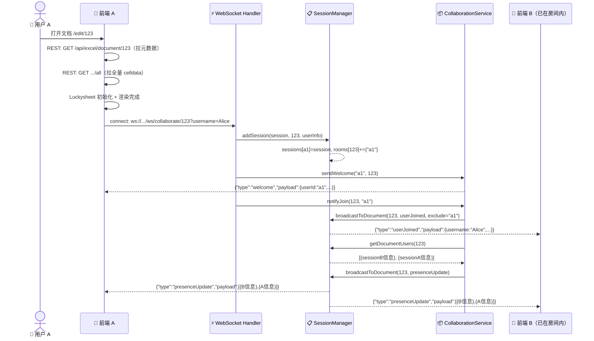
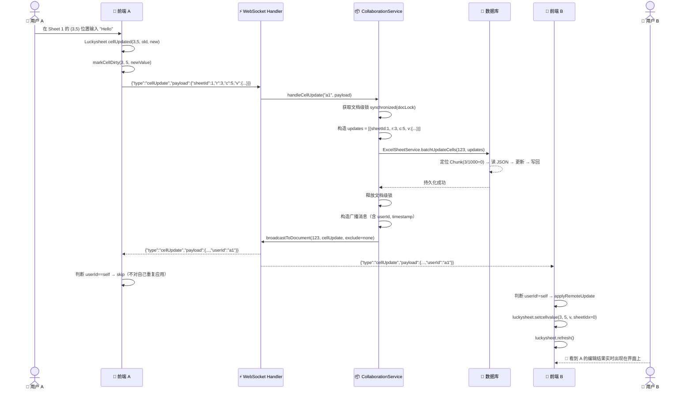

# DataLoom Phase 2 — 实时协作技术方案

> 状态：设计文档 | 对应路线图：Phase 2（WebSocket 服务搭建 / LWW 冲突解决 / 在线用户列表 / 编辑广播同步）

---

## 目录

1. [设计目标与约束](#1-设计目标与约束)
2. [系统架构设计](#2-系统架构设计)
3. [通信协议格式](#3-通信协议格式)
4. [核心业务流程](#4-核心业务流程)
5. [数据流程详解](#5-数据流程详解)
6. [与现有系统的集成点](#6-与现有系统的集成点)
7. [安全与容错设计](#7-安全与容错设计)
8. [演进路线](#8-演进路线)

---

## 1. 设计目标与约束

### 1.1 功能目标

| 子任务 | 说明 |
|--------|------|
| **WebSocket 服务搭建** | 在现有 Spring Boot 2.1 上扩展 WebSocket 端点，长连接管理多个协作者 |
| **LWW 冲突解决** | 同一单元格被多人同时编辑时，按"最后到达服务端者获胜"规则仲裁 |
| **在线用户列表** | 每个文档页面实时展示当前有哪些用户在编辑、各自在哪个 Sheet 的哪个位置 |
| **编辑广播同步** | 用户 A 的单元格变更实时推送给同文档的其他用户 B/C/D，B/C/D 的表格自动刷新 |

### 1.2 技术约束

| 约束项 | 值 | 影响 |
|--------|-----|------|
| 后端框架 | Spring Boot 2.1.15（内置 `spring-boot-starter-websocket`） | 使用 `javax.websocket` API，非 Jakarta |
| Java 版本 | JDK 8 | 无法使用 `var`、`record`、`switch` 表达式等新特性 |
| 数据库 | H2 文件模式（开发）→ MySQL（生产） | SQL 语法需保持兼容，建表语句需双版本 |
| 表格引擎 | Luckysheet 2.1.13 | 前端已有 `cellUpdated` 钩子和 `setcellvalue` API，协作层需与之配合 |
| 分块粒度 | 1000 行/块，`celldataJson` 存于 CLOB | 协作编辑走 Chunk 粒度的读写，Chunk 级锁 + 结构变更时文档级锁兜底 |

### 1.3 不做的事情（留到 Phase 3/4）

- ❌ OT/CRDT 算法——Phase 2 只用 LWW
- ❌ 操作历史 / 撤销重做跨会话
- ❌ 权限控制（OWNER/EDITOR/VIEWER）
- ❌ Redis 缓存加速
- ❌ 消息持久化（WebSocket 消息不落盘，只持久化最终的单元格状态）

---

## 2. 系统架构设计

### 2.1 整体拓扑

```
┌──────────────────────────────────────────────────────┐
│                    Vue 3 前端 (8081)                   │
│                                                       │
│   SheetEditor.vue                                     │
│   ┌─────────────┐  ┌──────────────────┐              │
│   │ Luckysheet   │  │ OnlineUsersPanel │              │
│   │ cellUpdated  │  │ 头像 + 光标位置  │              │
│   │ → 脏数据追踪 │  └────────┬─────────┘              │
│   │ → WS 广播    │           │                        │
│   └──────┬───────┘           │                        │
│          │                   │                        │
│   ┌──────┴───────────────────┴────────┐              │
│   │     useCollaboration (Composable)  │              │
│   │  · WS 连接生命周期                 │              │
│   │  · 消息收发路由                    │              │
│   │  · 断线重连 / 心跳                 │              │
│   │  · 远端更新 → luckysheet.setcellvalue │          │
│   └──────────────┬────────────────────┘              │
│                  │                                    │
└──────────────────┼────────────────────────────────────┘
                   │  REST (已有)    WebSocket (新增)
┌──────────────────┼────────────────────────────────────┐
│   Spring Boot 后端 (9191)                              │
│                  │                                    │
│   ┌──────────────┴──────────────┐                    │
│   │  REST Controller (已有)      │                    │
│   │  /api/excel/**               │                    │
│   └──────────────┬──────────────┘                    │
│                  │                                    │
│   ┌──────────────┴──────────────────────────────┐    │
│   │  CollaborationWebSocketHandler (新增)         │    │
│   │  /ws/collaborate/{documentId}                 │    │
│   │  · afterConnectionEstablished                 │    │
│   │  · handleTextMessage                          │    │
│   │  · afterConnectionClosed                      │    │
│   └──────────────┬──────────────────────────────┘    │
│                  │                                    │
│   ┌──────────────┴──────────────┐                    │
│   │  SessionManager (新增)       │                    │
│   │  · WebSocketSession 注册表   │                    │
│   │  · 房间（documentId）管理     │                    │
│   │  · broadcastToDocument()     │                    │
│   └──────────────┬──────────────┘                    │
│                  │                                    │
│   ┌──────────────┴──────────────────────────────┐    │
│   │  CollaborationService (新增)                  │    │
│   │  · LWW 冲突仲裁                                │    │
│   │  · 文档级锁                                    │    │
│   │  · 用户加入/离开通知                           │    │
│   │  · 光标位置广播                                │    │
│   └──────────────┬──────────────────────────────┘    │
│                  │                                    │
│   ┌──────────────┴──────────────┐                    │
│   │  ExcelSheetService (已有)    │                    │
│   │  · batchUpdateCells()        │                    │
│   └──────────────┬──────────────┘                    │
│                  │                                    │
└──────────────────┼────────────────────────────────────┘
                   │
┌──────────────────┴────────────────────────────────────┐
│               H2 / MySQL 数据库                        │
│   excel_document | excel_sheet | excel_sheet_chunk     │
└───────────────────────────────────────────────────────┘
```

### 2.2 模块职责

#### 2.2.1 REST 层（已有，不变）

- 文档 CRUD、Sheet 元数据查询、全量/增量数据加载——全部走 REST 不变
- 用户打开文档时依然先通过 `GET /api/excel/document/{id}` 拉元数据，`GET .../all` 拉完整 celldata
- Phase 2 **不修改**任何已有 REST 接口

#### 2.2.2 WebSocket 端点：`/ws/collaborate/{documentId}`

- 一个文档一个"房间"：路径参数 `{documentId}` 天然隔离不同文档的协作者
- 连接参数（Query String）：`?username=Alice`，用于身份标识（Demo 阶段无认证）
- 生命周期：
  - **建立** → `afterConnectionEstablished`：注册 session，通知房间内其他人"有人来了"
  - **消息** → `handleTextMessage`：解析 JSON，按 `type` 字段路由到不同处理逻辑
  - **关闭** → `afterConnectionClosed`：注销 session，广播"有人走了"

#### 2.2.3 SessionManager：房间与会话管理

```
数据结构：
  sessions:      Map<sessionId, WebSocketSession>          — 所有活跃连接
  userInfo:      Map<sessionId, CollaboratorInfo>           — 用户元信息
  documentRooms: Map<documentId, Set<sessionId>>            — 房间 ↔ 成员映射
```

核心操作：
- `addSession(session, documentId, userInfo)` — 注册连接 + 加入房间
- `removeSession(sessionId)` — 注销连接 + 退出房间，若房间为空则销毁
- `getDocumentUsers(documentId)` — 获取房间内所有用户
- `broadcastToDocument(documentId, message, excludeSessionId)` — 广播消息（可排除某用户）
- `sendToSession(sessionId, message)` — 点对点发送

并发安全：全部使用 `ConcurrentHashMap`，无需额外加锁。

#### 2.2.4 CollaborationService：业务逻辑

核心职责：

| 方法 | 触发时机 | 逻辑 |
|------|---------|------|
| `handleCellUpdate(sessionId, payload)` | 客户端发送 `cellUpdate` 消息 | 获取文档级锁 → 调用 `batchUpdateCells` 持久化 → 广播给所有协作者 |
| `handleCursorMove(sessionId, payload)` | 客户端发送 `cursorMove` 消息 | 更新协作者光标位置 → 广播给除发送者外的所有人 |
| `notifyJoin(documentId, sessionId)` | WebSocket 连接建立后 | 广播 `userJoined` → 刷新在线用户列表 |
| `notifyLeave(sessionId, documentId, username)` | WebSocket 连接断开后 | 广播 `userLeft` → 刷新在线用户列表 |
| `sendWelcome(sessionId, documentId)` | 用户加入后 | 给新用户返回自己的 `userId` 和元信息 |

#### 2.2.5 前端 Composable：`useCollaboration`

```
状态：
  connected:      ref(false)      — WS 连接状态
  currentUser:    ref(null)       — 当前用户信息（userId、username、color）
  onlineUsers:    ref([])         — 同文档所有在线用户
  remoteUpdates:  ref([])         — 其他用户的编辑操作队列

方法：
  connect()            — 建立 WebSocket 连接，绑定 onmessage/onclose/onerror
  disconnect()         — 主动断开连接并清理资源
  sendCellUpdate(sheetId, r, c, v)  — 发送单元格编辑
  sendCursorMove(sheetIndex, r, c)   — 发送光标位置（带 100ms 节流）
  clearRemoteUpdates() — 消费完远端更新后清空队列

内部机制：
  - 30s 心跳 ping（服务端可据此清理掉死连接）
  - 断线自动重连，指数退避（1s → 1.5s → 2.25s → ...），最多 10 次
  - onBeforeUnmount 时自动 disconnect
```

### 2.3 并发控制架构

```
协作编辑并发写入的冲突域分析：

┌──────────────────────────────────────────────────────┐
│                    同一文档 (documentId)               │
│                                                       │
│  Sheet A (sheetId=1)          Sheet B (sheetId=2)     │
│  ┌──────────┐                 ┌──────────┐           │
│  │ Chunk 0  │                 │ Chunk 0  │           │
│  │ Chunk 1  │ ← 用户A编辑     │ Chunk 1  │           │
│  │ Chunk 2  │ ← 用户B编辑     │ ...      │           │
│  └──────────┘                 └──────────┘           │
│                                                       │
│  并发修改同一文档时，整个文档加 synchronized 锁         │
│  （Demo 阶段足够，生产可升级为 Chunk 级锁）             │
└──────────────────────────────────────────────────────┘
```

**选择文档级锁而非 Chunk 级锁的理由**：

- 当前 `batchUpdateCells` 按 chunk 分组处理后逐块写库，单次调用可能涉及多个 Chunk
- 文档级锁保证了整个"读 Chunk → 修改 → 写回"过程的原子性
- Demo 阶段并发量有限（通常 <10 人同时编辑），文档级锁的性能开销可忽略
- 后续可用 `ConcurrentHashMap<Long, ReentrantLock>` 替代 `synchronized`，或直接用数据库行锁

---

## 3. 通信协议格式

### 3.1 连接建立

```
客户端 → 服务端：
  ws://host:9191/ws/collaborate/{documentId}?username=Alice

路径参数：documentId = 123
查询参数：username（必需，用户显示名）

服务端响应（连接成功后发送第一条消息）：
  { "type": "welcome", "payload": {"userId":"a1b2c3d4", "username":"Alice", "color":"#3498DB", "documentId":123} }
```

### 3.2 消息通用格式

所有消息均为单行 JSON 文本（WebSocket TextMessage）：

```jsonc
{
  "type": "消息类型（见下表）",
  "payload": { /* 消息载荷，各类型不同 */ }
}
```

### 3.3 消息类型定义

#### 客户端 → 服务端（上行）

| type | 触发场景 | payload | 说明 |
|------|---------|---------|------|
| `cellUpdate` | 用户编辑单元格内容 | `{"sheetId":1,"r":3,"c":5,"v":{"v":"hello","m":"hello","ct":{"fa":"General","t":"s"}}}` | `v` 结构与 Luckysheet celldata 的 `v` 字段一致 |
| `cursorMove` | 用户移动选中单元格（带 100ms 节流） | `{"sheetIndex":0,"r":10,"c":4}` | 用于在其他协作者界面显示对方光标位置 |
| `ping` | 定时心跳（30s 一次） | `{"timestamp":1718000000000}` | 服务端可用于清理僵尸连接 |

#### 服务端 → 客户端（下行）

| type | 触发场景 | payload | 说明 |
|------|---------|---------|------|
| `welcome` | 连接成功后首个消息 | `{"userId":"a1b2c3","username":"Alice","color":"#3498DB","documentId":123}` | 告知用户自己的 ID 和颜色 |
| `cellUpdate` | 有人编辑单元格（广播给所有人，包括发送者） | `{"sheetId":1,"r":3,"c":5,"v":{...},"userId":"a1b2c3","username":"Alice","timestamp":1718000000000}` | 发送者通过 `userId` 判断要不要应用到自己的 Luckysheet |
| `userJoined` | 新用户进入房间 | `{"userId":"a1b2c3","username":"Alice","color":"#3498DB"}` | 其他协作者更新在线列表 |
| `userLeft` | 用户离开房间 | `{"username":"Alice"}` | 其他协作者更新在线列表 |
| `presenceUpdate` | 每次人员变更后 | `[{"userId":"..","username":"..","color":"..","sheetIndex":0,"r":3,"c":5}, ...]` | 全量在线用户快照，便于新加入者和断线重连后同步 |
| `cursorUpdate` | 有人移动光标（广播给除发送者外的人） | `{"userId":"a1b2c3","username":"Alice","color":"#3498DB","sheetIndex":0,"r":10,"c":4}` | 在其他客户端显示远程光标 |

### 3.4 `cellUpdate` 的 `v` 字段格式说明

与 Luckysheet 的 celldata 中的 `v` 对象完全一致：

```jsonc
// 字符串类型
{"v":"Hello","m":"Hello","ct":{"fa":"General","t":"s"}}

// 数字类型
{"v":8848,"m":"8848","ct":{"fa":"General","t":"n"}}

// 日期类型
{"v":"2024-06-15","m":"2024-06-15","ct":{"fa":"yyyy-MM-dd","t":"d"}}

// 公式类型（含公式文本）
{"v":150,"m":"150","f":"=A1+B1","ct":{"fa":"General","t":"n"}}

// 删除单元格 → v 为 null 或空
null / {}
```

> ⚠️ 注意：服务端**不做** v 格式校验和转换，只做透传。格式的正确性由前端 Luckysheet 的 `cellUpdated` 钩子保证。

### 3.5 消息大小估算

| 场景 | 单条消息大小 |
|------|------------|
| 普通文本单元格编辑 | ~200 字节 |
| 长文本单元格（100 字） | ~400 字节 |
| 光标移动 | ~150 字节 |
| presenceUpdate（10 人在线） | ~800 字节 |
| 批量编辑（500 个单元格） | ~100 KB（不推荐；应拆分为多条 cellUpdate） |

> ⚠️ 限制：当前设计为**逐单元格广播**，避免单条消息过大。不推荐在 WebSocket 上传输大批量编辑操作。

---

## 4. 核心业务流程

### 4.1 用户进入协作房间



**关键点**：
1. 文档数据（celldata）仍通过 REST 加载——WebSocket 只负责协作实时通信
2. `welcome` 只发给新用户自身，告知其 `userId`（后续用于判断消息是否为自己发送）
3. `userJoined` 只发给**已有用户**（排除新用户自己）
4. `presenceUpdate` 发全量用户列表给**所有人**（含新用户）

### 4.2 实时编辑同步（核心流程）



**关键设计决策**：

1. **广播包含发送者**：简化协议，发送方通过 `userId == currentUser.userId` 判断是否需要应用
2. **先持久化后广播**：保证广播出去的数据必定已落库。代价是增加了几毫秒延迟（单次 Chunk 写 ~10ms），但换来了数据可靠性
3. **文档级锁的持有时间**：锁仅覆盖 `batchUpdateCells` 调用，不覆盖广播阶段

### 4.3 LWW 冲突解决

```
场景：用户 A 和 用户 B 几乎同时编辑了同一个单元格 (3,5)

时间线：
  T1: A 在浏览器输入 "Hello"，前端立即显示
  T2: B 在浏览器输入 "World"，前端立即显示
  T3: A 的 cellUpdate 到达服务端 → 持久化 "Hello" → 广播
  T4: B 的 cellUpdate 到达服务端 → 持久化 "World"（覆盖） → 广播

结果：
  - 数据库最终值： "World"（B 的值）
  - A 的界面：先保持 "Hello"（本地乐观），收到广播后变成 "World"
  - B 的界面：先保持 "World"（本地乐观），T3 时短暂变 "Hello" 又立刻在 T4 变回 "World"
```

```
┌──────────────────────────────────────────────────────┐
│              LWW 决策矩阵                              │
│                                                       │
│           │  A 先到达      │  B 先到达                 │
│  ─────────┼───────────────┼─────────────────────     │
│  同一时刻  │ A 胜出（先写） │ B 胜出（先写）            │
│  有先后   │ 后到达者覆盖   │ 后到达者覆盖              │
│                                                       │
│  本质上：谁的消息最后被服务端处理，谁的值就是最终值      │
└──────────────────────────────────────────────────────┘
```

**交互层面的"闪烁"问题**：

T4 时刻 A 看到自己的输入被 B 覆盖，体验不好。在 Phase 2 中不做特殊处理（LWW 本质就是"后写赢"），Phase 3 可通过以下方式改善：

- 在 `cellUpdate` 广播中加入 `conflictWinner` 标记
- 前端显示"冲突提示"（单元格高亮 + tooltip 显示"你的编辑被覆盖了"）
- 或升级为 OT/CRDT，让两个编辑合并而非覆盖

### 4.4 在线用户管理

```
用户状态生命周期：

  ┌──────────┐    connect    ┌──────────┐   disconnect   ┌──────────┐
  │  离线     │ ──────────→  │  在线     │ ───────────→  │  离线     │
  └──────────┘              └──────────┘               └──────────┘
                                  │
                                  │ 定时心跳（30s）
                                  │ cursorMove（100ms 节流）
                                  ▼
                            ┌──────────┐
                            │  活跃     │
                            │  记录了   │
                            │  Sheet +  │
                            │  光标位置  │
                            └──────────┘
```

**在线用户信息更新频率**：

| 事件 | 更新频率 | 说明 |
|------|---------|------|
| 人员变更（加入/离开） | 立即 `presenceUpdate` | 全量推送 |
| 光标移动 | 100ms 节流 `cursorUpdate` | 只推送给其他人 |
| 心跳超时（>60s无消息） | 服务端清理 + `presenceUpdate` | 清理僵尸连接 |

**前端展示（OnlineUsersPanel）**：

- 缩略模式（默认）：头像叠加 + "N 人在线"
- 展开模式（点击）：完整列表，显示用户名、颜色标记、当前所在 Sheet 和单元格位置、"我"标识

### 4.5 断线重连

```
客户端：
  1. WebSocket onclose 触发（非主动断开）
  2. 等待 1s → 重连
  3. 若失败，等待 1.5s → 重连
  4. 若失败，等待 2.25s → 重连
  5. ...（最多 10 次）
  6. 重连成功后：
     - 收到 welcome（新的 userId）
     - 收到 presenceUpdate（当前在线列表）
     - 不会重新加载文档数据（数据已在前端内存中）

服务端：
  - old session 的 onclose 触发 → removeSession → 广播 userLeft
  - new session 的 onopen 触发 → addSession → 广播 userJoined + presenceUpdate
  - 旧 session 和新 session 被视为两个不同用户（userId 不同）
```

> ⚠️ 断线期间其他用户的编辑不会推送到重连的客户端，因为 WebSocket 不回溯历史消息。这是一个已知限制，Phase 3 可通过操作日志回放来解决。

---

## 5. 数据流程详解

### 5.1 编辑操作的端到端数据流

```
用户 A 编辑单元格 (3,5) 的完整数据流：

  [浏览器 A]                                 [服务端]                         [浏览器 B]
      │                                         │                                │
  ① cellUpdated 触发                            │                                │
      │                                         │                                │
  ② markCellDirty(3,5,newVal)                   │                                │
     → dirtyCells["1_3_5"] = {sheetId:1,r:3,c:5,v:{...}}                       │
      │                                         │                                │
  ③ 构造 WebSocket 消息                          │                                │
     {type:"cellUpdate",                        │                                │
      payload:{sheetId:1,r:3,c:5,               │                                │
               v:{v:"hello",m:"hello",          │                                │
                  ct:{fa:"General",t:"s"}}}}     │                                │
      │                                         │                                │
  ④ ws.send(message) ─────────────────────────→ │                                │
      │                                         │                                │
      │                              ⑤ CollaborationService.handleCellUpdate    │
      │                                 · 获取文档锁                             │
      │                                 · 定位 Chunk: r/1000 = 0              │
      │                                 · 读 Chunk JSON → 构建 HashMap 索引     │
      │                                 · 查找/更新/新增单元格                   │
      │                                 · 写回 Chunk JSON                       │
      │                                         │                                │
      │                              ⑥ 构造广播消息                              │
      │                              {type:"cellUpdate",                         │
      │                               payload:{...,                             │
      │                                 userId:"a1",                            │
      │                                 timestamp:1718000000000}}               │
      │                                         │                                │
  ⑧ ←──────────────────────────── broadcast ──→ ⑦ ──────────────────────────→ ⑨
      │                                         │                                │
  ⑧ userId=="a1"===self → skip                 │              ⑨ userId!="b2" → apply
      │                                         │                                │
      │                                         │              ⑩ luckysheet.setcellvalue(3,5,v,0)
      │                                         │                                │
      │                                         │              ⑪ luckysheet.refresh()
      │                                         │                                │
      │                                         │              ⑫ ✅ 界面实时刷新
```

### 5.2 持久化时机与策略

```
策略对比：

┌─────────────────────┬───────────────────┬──────────────────────┐
│       策略           │   触发时机         │        权衡           │
├─────────────────────┼───────────────────┼──────────────────────┤
│ Phase 2 采用：      │ 收到每条 cellUpdate│ · 数据实时落库       │
│ 实时逐条持久化       │ 消息时立即写库     │ · 广播出去的数据可靠  │
│                     │                   │ · 单次 Chunk 写 ~10ms │
│                     │                   │ · 不适合高频批量编辑  │
├─────────────────────┼───────────────────┼──────────────────────┤
│ 备选方案（未采用）： │ 定时批量（如1s）  │ · 减少写库次数        │
│ 批量延迟持久化       │ 或积攒N条         │ · 但广播和写库分离    │
│                     │                   │ · 崩溃可能丢 1s 数据  │
├─────────────────────┼───────────────────┼──────────────────────┤
│ 备选方案（未采用）： │ 不持久化，纯内存   │ · 性能最优            │
│ 手动保存             │ 用户点保存才落库   │ · 断线全丢            │
└─────────────────────┴───────────────────┴──────────────────────┘
```

**选择"实时逐条持久化"的理由**：

1. 单次 Chunk 写操作经过 HashMap 索引优化后只需 ~10ms，延迟可接受
2. 数据可靠性优先：广播出去的数据必定已落库，任何时候 crash 都不会丢数据
3. 保持与现有架构一致：Phase 1 已经有 `batchUpdateCells`，直接复用

**对高频编辑的优化预留**：

Phase 4 可以引入以下优化：
- 前端本地合并：用户连续输入（200ms 内）合并为一次 `cellUpdate`
- 服务端缓冲窗口：短时间内同一单元格的连续写入只保留最后一次
- Chunk 级内存缓存：频繁读写的热门 Chunk 在内存中保持一份副本

### 5.3 并发编辑场景下的数据一致性

#### 场景 1：两人编辑不同 Chunk（无冲突）

```
A 编辑 (500, 3)  → Chunk 0
B 编辑 (1500, 5) → Chunk 1

两个操作互不影响：
  1. 服务端按到达顺序依次持有文档锁
  2. 锁内各自读取自己的 Chunk、修改、写回
  3. 两个操作分别广播

⚠️ 文档级锁的代价：B 需要等 A 的写操作完成后才能开始写，
   即使它们操作的是不同 Chunk。
   Demo 阶段可接受，生产可升级为 Chunk 级锁。
```

#### 场景 2：两人编辑同一 Chunk 的不同单元格（无冲突）

```
A 编辑 (100, 3) → Chunk 0
B 编辑 (200, 5) → Chunk 0

同一 Chunk，不同单元格：
  1. A 先到：读 Chunk 0 JSON → 更新 (100,3) → 写回
  2. B 后到：读 Chunk 0 JSON（已包含 A 的修改）→ 更新 (200,5) → 写回
  3. 两者都正确保留，因为操作的是不同的 "r_c" key

✅ HashMap 索引保证了 O(1) 定位 + O(1) 更新，两次操作互不干扰
```

#### 场景 3：两人编辑同一单元格（冲突，LWW）

```
A 编辑 (100, 3) = "Hello"
B 编辑 (100, 3) = "World"

消息到达顺序：A 先 → B 后（相差 50ms）

  1. A 的 cellUpdate 到达 → 持久化 (100,3)="Hello" → 广播
  2. B 的 cellUpdate 到达 → 持久化 (100,3)="World"（覆盖） → 广播

结果：
  数据库：(100,3) = "World"（B 胜出）
  A 前端：(100,3) 先 "Hello" → 收到广播后刷成 "World"
  B 前端：(100,3) 先 "World" → 收到 A 广播时短暂闪 "Hello" → 立即收到自己广播又变 "World"

❌ 存在短暂的 "闪烁" 问题，Phase 3 需改进
```

#### 场景 4：A 新增行 + B 同时编辑该区域（边界冲突）

```
A 在浏览器中插入 100 行 → 触发 saveWorkbook（全量保存）
B 在浏览器中编辑 (500, 3) → 触发 cellUpdate

时间线：
  T1: B 发送 cellUpdate {r:500, c:3, v:...}
  T2: A 发送 saveWorkbook（全量重建所有 Chunk）
  T3: 两个请求到达服务端

问题：T2 重建 Chunk 后，B 的 r=500 可能已偏移（因为 A 插入了行）

Phase 2 处理：
  - 两个操作被文档级锁串行化
  - 先到者执行完毕后，后到者的行号可能已不准确
  - LWW 策略：后者覆盖前者，但不会检测"行号失效"

建议：
  - 用户插入行/列时，前端应提示"正在同步，请稍后"
  - 或者 saveWorkbook 时暂时广播"系统维护中"，禁止其他用户编辑
```

---

## 6. 与现有系统的集成点

### 6.1 需要新增的文件

| 文件路径 | 职责 |
|---------|------|
| `dataloom-server/src/main/java/com/demo/excel/config/WebSocketConfig.java` | 注册 `/ws/collaborate/{documentId}` 端点 |
| `dataloom-server/src/main/java/com/demo/excel/websocket/CollaborationWebSocketHandler.java` | WebSocket 连接生命周期管理 + 消息路由 |
| `dataloom-server/src/main/java/com/demo/excel/websocket/CollaboratorInfo.java` | 协作者信息 POJO |
| `dataloom-server/src/main/java/com/demo/excel/websocket/SessionManager.java` | 会话注册表 + 房间管理 + 广播 |
| `dataloom-server/src/main/java/com/demo/excel/service/CollaborationService.java` | 协作业务逻辑 + LWW |
| `dataloom-web/src/composables/useCollaboration.js` | Vue 3 Composable：WS 客户端封装 |
| `dataloom-web/src/components/OnlineUsersPanel.vue` | 在线用户面板组件 |

### 6.2 需要修改的现有文件

| 文件路径 | 改动内容 | 影响范围 |
|---------|---------|---------|
| `dataloom-server/pom.xml` | 添加 `spring-boot-starter-websocket` 依赖 | 新增依赖，不影响现有功能 |
| `dataloom-web/src/views/SheetEditor.vue` | ① 引入 `useCollaboration` ② `cellUpdated` 中增加 WS 广播 ③ 增加远端更新应用逻辑（`ignoreRemoteUpdate` 标志） ④ 引入 `OnlineUsersPanel` ⑤ `onBeforeUnmount` 中断开 WS | 编辑保存流程新增一条"实时广播"支线 |
| `dataloom-web/vite.config.js` | 添加 `/ws` 代理转发 | 开发环境 WebSocket 代理 |

### 6.3 不影响的部分

以下现有模块**完全不需要修改**：

- 所有的 REST Controller（`ExcelFileController`、`ExcelDocumentController`）
- `ExcelParserService`（上传解析）
- `ExcelSheetService`（批量更新、全量替换）——WebSocket 直接复用 `batchUpdateCells`
- `ExcelDocumentService`
- 所有 Entity 和 Mapper
- 所有前端 API 封装（`api/excel.js`）
- `router/index.js`
- `ExcelDashboard.vue`

### 6.4 数据库变更

**无需新增表**。现有的三张表（`excel_document`、`excel_sheet`、`excel_sheet_chunk`）已满足 Phase 2 需求。

可选（Phase 3 时添加）：
- `excel_collaborator` 表：记录协作者历史（用于权限和审计）
- `excel_operation_log` 表：记录操作历史（用于撤销重做跨会话）

---

## 7. 安全与容错设计

### 7.1 身份认证（Demo 阶段简化方案）

```
当前方案（Phase 2 Demo）：
  - WebSocket 连接时通过 query param 传递 username
  - 服务端不做认证校验，默认信任
  - 用户断开重连后 userId 会变化（视为新用户）

生产环境建议（Phase 3）：
  - WebSocket 握手时校验 token（放在 query param 或首条消息中）
  - 与现有认证系统（OAuth/JWT）打通
  - 持久化 userId → 断线重连后身份不变
```

### 7.2 消息大小限制

| 层级 | 限制 | 说明 |
|------|------|------|
| 前端发送 | 单条 cellUpdate 只包含一个单元格 | 设计约束，避免单消息过大 |
| WebSocket 帧 | Spring 默认 TextMessage 无硬限制 | 传输层安全 |
| 应用层 | 不做校验，透传 | 信任 Luckysheet 生成的数据格式 |

### 7.3 异常场景处理

| 异常 | 现象 | 处理 |
|------|------|------|
| 网络瞬断 | WS onclose 触发 | 前端指数退避重连 |
| 服务端崩溃 | 所有 WS 连接断开 | ① 前端重连 ② 数据库数据不丢（实时持久化） |
| 消息解析失败 | `JSON.parse` 抛出异常 | 服务端 catch + log + 忽略该条消息 |
| 持久化失败 | `batchUpdateCells` 抛出异常 | ① catch + log ② 不广播该消息 ③ 发送者可重试 |
| 僵尸连接 | 客户端崩溃未发 close 帧 | 服务端心跳超时（>60s 无消息）主动 close |
| 单文档协作者过多 | >100 人同时编辑 | ① 文档级锁成为瓶颈 ② 广播消息数 O(n²) ③ 需升级为分段广播 |

### 7.4 资源清理

```
服务端清理时机：
  1. WebSocket Session 正常关闭 → afterConnectionClosed → removeSession
  2. 心跳超时（连续 60s 无消息） → 定时任务 close 死连接
  3. Spring 容器关闭 → @PreDestroy 关闭所有 session

客户端清理时机：
  1. 用户关闭页面 → onBeforeUnmount → disconnect()
  2. 用户切换到其他路由 → 同上
  3. 浏览器崩溃 → 服务端心跳超时兜底
```

---

## 8. 演进路线

### Phase 2 完成后的状态

```
Phase 1 ✅                    Phase 2 🎯                    Phase 3 ⬜
─────────────────────────────────────────────────────────────────────
文件上传解析                   WebSocket 服务搭建              操作日志系统
Luckysheet 集成                LWW 冲突解决                   撤销重做跨会话
分块存储 + 懒加载              在线用户列表展示                分享链接
脏数据追踪 + 手动保存          编辑广播同步                   三档权限控制
前端 ExcelJS 导出                                             定时快照
```

### 从 LWW 到 OT/CRDT 的升级路径

```
Phase 2（LWW）                 Phase 3+（OT/CRDT）
─────────────────────────────────────────────────────
LWW: 后写覆盖                   OT: 操作变换（Operational Transform）
· 实现简单                       · 需要操作历史和版本向量
· 覆盖场景会丢数据               · 两个编辑可同时保留
· 适合低频冲突场景               · 适合高频协作场景
                                 
                                 CRDT: 无冲突数据类型
                                 · 无需中央服务器仲裁
                                 · 适合离线优先场景
                                 · 实现复杂度最高
```

### Phase 3 协作增强（基于 Phase 2 的基础设施）

1. **操作日志**：在 `handleCellUpdate` 中增加操作记录（操作人、旧值、新值、时间戳），写入 `excel_operation_log` 表
2. **冲突提示**：当同一单元格短时间内被多人编辑，前端显示冲突警告
3. **WebSocket 消息回放**：新用户加入时，回放最近 N 条操作（基于操作日志）
4. **权限校验**：在 WebSocket Handler 中增加 `OWNER/EDITOR/VIEWER` 角色检查

---

## 附录：技术选型依据

### 为什么用 Spring 原生 WebSocket 而非 Netty？

| 对比维度 | Spring WebSocket | Netty |
|---------|-----------------|-------|
| 集成成本 | 零——Spring Boot 2.1 内置 | 需额外引入 netty-all，手动管理生命周期 |
| 学习成本 | 低——标准 WebSocketHandler 接口 | 中——需理解 Channel Pipeline |
| 性能 | 适合 <1000 并发连接 | 适合 >10000 并发连接 |
| DataLoom 场景 | Demo 阶段并发 <50 | 不需要 |

Phase 2 选择 Spring 原生 WebSocket，足够覆盖 Demo 场景。如果未来需要支撑万级并发，可以迁移到 Netty 或直接使用 Spring WebFlux + Reactive WebSocket。

### 为什么用 WebSocket 而非 SSE / 轮询？

| 方案 | 双向通信 | 消息开销 | DataLoom 适用性 |
|------|---------|---------|----------------|
| WebSocket | ✅ 全双工 | 低（长连接） | ✅ 编辑器双向实时通信 |
| SSE | ❌ 仅服务端→客户端 | 低（长连接） | ❌ 客户端编辑需另走 REST |
| HTTP 轮询 | ✅（模拟） | 高（重复建连） | ❌ 延迟高、带宽浪费 |

---

> 📅 文档版本：v1.0 | 日期：2025-06 | 作者：DataLoom 团队
> 
> 本设计文档基于 DataLoom Phase 1 现有架构（分块存储 + 脏数据追踪 + 前端导出），
> 所有设计决策均保持与现有系统的无缝兼容，不影响 Phase 1 的任何已有功能。
