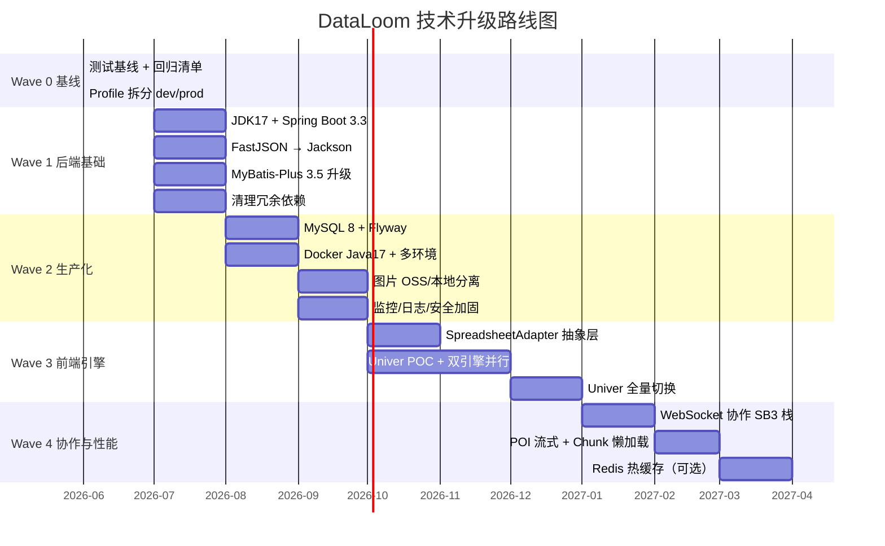

# DataLoom 技术组件升级方案

> 状态：实施蓝图 | 版本：v1.0 | 最后更新：2026-06  
> 适用范围：`dataloom-server` / `dataloom-web` / `deplay`  
> 关联文档：[DataLoom-系统架构与技术实践.md](./DataLoom-系统架构与技术实践.md) · [Phase2-实时协作技术方案.md](./Phase2-实时协作技术方案.md)

---

## 目录

1. [升级目标与原则](#1-升级目标与原则)
2. [现状盘点](#2-现状盘点)
3. [升级路线图（4 个 Wave）](#3-升级路线图4-个-wave)
4. [Wave 0 — 基线与防护](#4-wave-0--基线与防护)
5. [Wave 1 — 后端基础栈升级](#5-wave-1--后端基础栈升级)
6. [Wave 2 — 生产 MySQL 与运维升级](#6-wave-2--生产-mysql-与运维升级)
7. [Wave 3 — Luckysheet → Univer 迁移](#7-wave-3--luckysheet--univer-迁移)
8. [Wave 4 — 协作、性能与 Phase 2/3/4 对齐](#8-wave-4--协作性能与-phase-234-对齐)
9. [完整目标版本清单](#9-完整目标版本清单)
10. [实施优先级与回滚策略](#10-实施优先级与回滚策略)
11. [验收标准汇总](#11-验收标准汇总)
12. [附录：关键文件改动索引](#12-附录关键文件改动索引)

---

## 1. 升级目标与原则

### 1.1 总目标

| 维度 | 现状 | 目标 |
|------|------|------|
| 后端运行时 | Spring Boot 2.1.15 + JDK 8 | **Spring Boot 3.3.x + JDK 17** |
| JSON 处理 | FastJSON 1.2.68（有安全风险） | **Jackson（Spring 默认）** |
| 数据库 | H2 文件模式（Demo） | **MySQL 8 生产 + H2 保留开发** |
| 表格引擎 | Luckysheet 2.1.13（UMD + patch） | **Univer ~0.25.x（npm 官方集成）** |
| 部署 | Docker + Java 8 JRE | **Docker + Java 17 JRE + 多 Profile** |
| 协作能力 | Phase 2 设计文档 | **在升级后的 SB3 WebSocket 栈上落地** |

### 1.2 必须保留的核心资产

以下设计已在 Phase 1 验证有效，升级过程中**不得破坏**：

- 三层数据模型：`excel_document` / `excel_sheet` / `excel_sheet_chunk`
- **1000 行/块**分块存储策略
- **混合保存**：增量 `PUT /cells/batch` + 全量 `PUT /workbook`
- **前端 ExcelJS 导出**（样式零丢失）
- REST API 契约（`/api/excel/**` 路径与语义不变）

### 1.3 升级原则

1. **分波次交付**：先后端基础栈 → 生产 MySQL → 前端 Univer → 协作/性能
2. **双轨运行**：Luckysheet 与 Univer 可并行一段过渡期
3. **适配层隔离**：业务代码不直接依赖 `window.luckysheet` 或 Univer API
4. **每个 Wave 可独立验收、可回滚**

---

## 2. 现状盘点

### 2.1 后端依赖（`dataloom-server/pom.xml`）

| 组件 | 当前版本 | 问题 |
|------|----------|------|
| Spring Boot | 2.1.15 | 已 EOL，无安全补丁 |
| JDK | 8 | Spring Boot 3 不支持 |
| MyBatis-Plus | 3.3.2 | 与 SB3 不兼容 |
| FastJSON | 1.2.68 | 已知 CVE，应移除 |
| Apache POI | 4.1.2 | 可升级；大文件需流式读写 |
| EasyExcel | 2.2.11 | **仅 import，未实际使用** |
| commons-fileupload | 1.4 | Spring Boot 已内置 multipart，冗余 |
| H2 | runtime | 适合 Demo，不适合生产 |

**FastJSON 使用面（需迁移）：**

| 文件 | 改造优先级 |
|------|-----------|
| `ExcelSheetService.java` | P0（最重） |
| `ExcelParserService.java` | P0 |
| `ExcelDocumentController.java` | P0 |
| `ExcelFileController.java` | P1 |
| `ExcelSheetServiceTest.java` | P2 |

### 2.2 前端（`dataloom-web`）

| 组件 | 当前 | 问题 |
|------|------|------|
| Vue / Vite | 3.5 / 6 | 合理，保留 |
| Element Plus | 2.10 | 合理，保留 |
| Luckysheet | 2.1.13（CDN + 本地 patch） | 停更、双 Vue、jQuery、chartmix 脆弱 |
| ExcelJS | 4.4 | 保留，Univer 导出可复用逻辑 |
| `SheetEditor.vue` | ~970 行，深度耦合 Luckysheet | 需适配层解耦 |

**Luckysheet 集成债务：**

- `index.html`：Vue 2 / Vuex / Element UI / ECharts / jQuery CDN 链
- `public/lib/luckysheet.umd.js`：3MB 本地修补版
- `public/plugins/chart/chartmix.umd.js`：图表插件
- `utils/chartmixDefaultOption.js`：chartmix 兜底配置

### 2.3 部署（`deplay/`）

| 项 | 现状 | 问题 |
|----|------|------|
| `docker-compose.yml` | 生产仍用 H2 | 不适合生产持久化与并发 |
| `Dockerfile.server` | Java 8 JRE | 与 SB3/JDK17 目标不符 |
| `nginx.conf` | 仅 `/api` 代理 | Phase 2/4 需 `/ws` WebSocket 代理 |
| `application.yml` | `sql.init.mode: always` | 生产不应每次启动执行建表 |

---

## 3. 升级路线图（4 个 Wave）



**依赖关系：**

```
Wave 0 → Wave 1 → Wave 2 → Wave 3 → Wave 4
                ↘ Phase 2 WebSocket 建议在 Wave 1+2 完成后启动
```

---

## 4. Wave 0 — 基线与防护

> 目标：在改任何依赖前，建立可回归、可对比的基线。

### 4.1 Golden Path 回归清单

| # | 场景 | 验收标准 |
|---|------|----------|
| 1 | 上传 50 行 xlsx | 解析成功，Sheet 数正确 |
| 2 | 上传含公式/日期/合并单元格 | 值与格式正确 |
| 3 | 编辑 1 个单元格 → 增量保存 | DB 仅对应 Chunk 变化 |
| 4 | 插入图片/图表 → 保存 | 重开可还原 |
| 5 | 导出 xlsx | 样式与编辑器一致 |
| 6 | 10 万行文件打开 | 记录基线耗时（后续对比） |

### 4.2 Profile 化配置

**目标目录结构：**

```
dataloom-server/src/main/resources/
├── application.yml           # 公共配置
├── application-dev.yml       # H2 + DEBUG + H2 Console
└── application-prod.yml      # MySQL + 生产日志
```

**关键变更：**

- 开发：`spring.profiles.active=dev`，保留 H2
- 生产：`spring.profiles.active=prod`，`sql.init.mode=never`
- 引入 **Flyway** 管理 schema（替代 `schema.sql` 的 `mode: always`）

### 4.3 前端 SpreadsheetAdapter 抽象层

在 Wave 0 引入适配层接口，Wave 3 再实现 Univer 版本：

```
dataloom-web/src/adapters/
├── spreadsheet/types.js              # 接口定义
├── luckysheet/LuckysheetAdapter.js   # Wave 0 实现
└── univer/UniverAdapter.js           # Wave 3 实现
```

**接口契约：**

```javascript
export const SpreadsheetAdapter = {
  init(container, workbookData),
  destroy(),
  getWorkbookSnapshot(),
  setCellValue(sheetId, r, c, value),
  onCellChange(callback),
  onStructureChange(callback),
  getSheetDataForExport()
}
```

`SheetEditor.vue` 只调用 Adapter，禁止直接访问 `window.luckysheet`。

### 4.4 Wave 0 交付物

- [ ] Golden Path 手动/自动化回归脚本
- [ ] `application-dev.yml` / `application-prod.yml` 骨架
- [ ] `SpreadsheetAdapter` 接口 + `LuckysheetAdapter` 骨架
- [ ] Git tag：`baseline-v2.0.0-pre-upgrade`

---

## 5. Wave 1 — 后端基础栈升级

> 目标：JDK 17 + Spring Boot 3.3 + Jackson，移除 FastJSON 与冗余依赖。  
> 说明：后端仅 16 个 Java 源文件，建议**直接跳 SB3**，不必经 2.7 中间态。

### 5.1 目标版本

| 组件 | 目标版本 |
|------|----------|
| JDK | **17 LTS**（Temurin / Corretto） |
| Spring Boot | **3.3.x**（取当前最新 patch） |
| MyBatis-Plus | **3.5.9+** |
| Apache POI | **5.2.5** |
| Jackson | Spring Boot BOM 管理 |
| spring-boot-starter-validation | 新增 |
| spring-boot-starter-actuator | 新增 |

**移除：**

- `com.alibaba:fastjson`
- `com.alibaba:easyexcel`（未使用）
- `commons-fileupload`

### 5.2 Spring Boot 2.1 → 3.3 迁移清单

| 变更项 | 影响范围 | 操作 |
|--------|----------|------|
| `javax.*` → `jakarta.*` | 全部 Java 源文件 | 全局替换 import |
| CORS 配置 | `CorsConfig.java` | 按 SB3 API 调整 |
| MyBatis 日志 | `application.yml` | 生产改用 `Slf4jImpl` |
| 单元测试 | `src/test/**` | JUnit 4 → JUnit 5 |
| Docker 基础镜像 | `deplay/Dockerfile.server` | Java 8 → **Java 17** |

**Dockerfile.server 目标：**

```dockerfile
FROM maven:3.9-eclipse-temurin-17 AS build
...
FROM eclipse-temurin:17-jre
```

### 5.3 FastJSON → Jackson 迁移

#### 5.3.1 引入 JsonHelper 统一封装

```java
// dataloom-server/src/main/java/com/demo/excel/common/JsonHelper.java
@Component
public class JsonHelper {
    private final ObjectMapper mapper;

    public JsonNode parseObject(String json) { ... }
    public ArrayNode parseArray(String json) { ... }
    public String toJson(Object obj) { ... }
    public Map<String, Object> toMap(Object obj) { ... }
    public <T> T convert(Object from, Class<T> type) { ... }

    /** null / 空串 / 解析异常 → 空 ObjectNode */
    public ObjectNode parseObjectOrEmpty(String json) { ... }
    /** null / 空串 / 解析异常 → 空 ArrayNode */
    public ArrayNode parseArrayOrEmpty(String json) { ... }
}
```

#### 5.3.2 改造顺序

| 步骤 | 文件 | 说明 |
|------|------|------|
| 1 | 新增 `JsonHelper.java` | 统一入口 |
| 2 | `ExcelDocumentController.java` | 替换 `parseObjectOrEmpty` / `parseArrayOrEmpty` |
| 3 | `ExcelParserService.java` | `ObjectNode` / `ArrayNode` 构建 celldata |
| 4 | `ExcelSheetService.java` | 分批替换，保持行为一致 |
| 5 | `ExcelFileController.java` | 移除 FastJSON + EasyExcel dead import |
| 6 | `ExcelSheetServiceTest.java` | 测试断言改用 Jackson |

#### 5.3.3 行为对齐表

| FastJSON | Jackson 对齐 |
|----------|-------------|
| `JSONObject.parseObject(json)` | `mapper.readTree(json)` → `ObjectNode` |
| `JSONArray.parseArray(json)` | `mapper.readTree(json)` → `ArrayNode` |
| `JSONObject.toJSONString(obj)` | `mapper.writeValueAsString(obj)` |
| `parseObject(null)` → `{}` | `parseObjectOrEmpty` 自定义 |
| 动态 `getJSONObject(i)` | `arrayNode.get(i)` 或 `List<Map<String,Object>>` |

### 5.4 Apache POI 4.1 → 5.2

| 项 | 说明 |
|----|------|
| API 兼容性 | `WorkbookFactory`、`FormulaEvaluator` 基本不变 |
| 测试重点 | 日期单元格、公式求值、合并区域 |
| Phase 4 预留 | `XSSFReader`（流式读）、`SXSSFWorkbook`（流式写） |

### 5.5 Wave 1 验收标准

- [ ] `mvn clean test` 全绿
- [ ] Golden Path 6 项回归通过
- [ ] 依赖树无 FastJSON
- [ ] Docker 镜像 Java 17 可启动，端口 9191 正常
- [ ] `javax.*` 零残留

---

## 6. Wave 2 — 生产 MySQL 与运维升级

> 目标：生产环境 MySQL 8 + Flyway + Docker 多 Profile + 图片存储分离。

### 6.1 数据库架构

```
开发：H2 文件模式（application-dev.yml，零配置）
生产：MySQL 8.0（application-prod.yml）
迁移：Flyway（db/migration/V*.sql）
连接池：HikariCP（调优）
```

### 6.2 Flyway 迁移脚本

**从 `schema.sql` 提取并拆分：**

```
dataloom-server/src/main/resources/db/migration/
├── V1__init_tables.sql          # 三张核心表
├── V2__add_indexes.sql          # 生产必需索引
└── V3__add_engine_type.sql      # Wave 3 预留：engine_type / format_version
```

**V2 必需索引：**

```sql
CREATE INDEX idx_document_status ON excel_document(status);
CREATE INDEX idx_document_creator ON excel_document(creator_id);
CREATE INDEX idx_sheet_document ON excel_sheet(document_id, status);
CREATE UNIQUE INDEX uk_chunk_sheet_index ON excel_sheet_chunk(sheet_id, chunk_index);
CREATE INDEX idx_chunk_document ON excel_sheet_chunk(document_id);
```

**字段类型（MySQL）：**

| H2 | MySQL 生产 |
|----|-----------|
| CLOB | LONGTEXT |
| TIMESTAMP | DATETIME + ON UPDATE CURRENT_TIMESTAMP |
| INT (status) | TINYINT |

### 6.3 application-prod.yml 骨架

```yaml
spring:
  profiles:
    active: prod
  datasource:
    driver-class-name: com.mysql.cj.jdbc.Driver
    url: jdbc:mysql://${DB_HOST:mysql}:3306/dataloom?useUnicode=true&characterEncoding=utf8mb4&serverTimezone=Asia/Shanghai
    username: ${DB_USER:dataloom}
    password: ${DB_PASSWORD}
    hikari:
      maximum-pool-size: 20
      minimum-idle: 5
      connection-timeout: 30000
  flyway:
    enabled: true
    baseline-on-migrate: true
  sql:
    init:
      mode: never

mybatis-plus:
  configuration:
    log-impl: org.apache.ibatis.logging.slf4j.Slf4jImpl

excel:
  upload:
    path: /app/upload
```

### 6.4 Docker Compose 生产化

**`deplay/docker-compose.yml` 目标结构：**

```yaml
services:
  mysql:
    image: mysql:8.0
    environment:
      MYSQL_DATABASE: dataloom
      MYSQL_USER: dataloom
      MYSQL_PASSWORD: ${DB_PASSWORD}
    volumes:
      - mysql_data:/var/lib/mysql

  dataloom-server:
    environment:
      SPRING_PROFILES_ACTIVE: prod
      DB_HOST: mysql
      DB_USER: dataloom
      DB_PASSWORD: ${DB_PASSWORD}
      EXCEL_UPLOAD_PATH: /app/upload
    depends_on:
      - mysql

  dataloom-web:
    depends_on:
      - dataloom-server

volumes:
  mysql_data:
  dataloom_uploads:
```

**H2 → MySQL 历史数据迁移（可选）：**

1. H2 导出：`SCRIPT TO 'backup.sql'`
2. 语法转换（CLOB→LONGTEXT 等）
3. 导入 MySQL 并校验行数

### 6.5 图片/附件存储分离

参考 [DataLoom-系统架构与技术实践.md](./DataLoom-系统架构与技术实践.md) 第十章。

| 阶段 | 方案 |
|------|------|
| Wave 2 最小 | 本地磁盘 `/app/upload/images/{docId}/{uuid}.png`，JSON 只存 URL |
| Wave 2+ | MinIO / 阿里云 OSS（内网可自建 MinIO） |

**新增接口：**

```
POST /api/excel/document/{id}/image
→ { url, width, height }
```

### 6.6 安全与可观测性

| 项 | 建议 |
|----|------|
| Actuator | `/actuator/health`（生产关闭 sensitive 端点） |
| 日志 | Logback + MDC（documentId / sheetId） |
| CORS | 生产白名单域名 |
| 文件上传 | MIME + 扩展名双检 |
| 依赖扫描 | CI 集成 OWASP Dependency-Check 或 Dependabot |
| API 文档 | 可选 SpringDoc OpenAPI 3 |

### 6.7 Wave 2 验收标准

- [ ] `SPRING_PROFILES_ACTIVE=prod` 连 MySQL 正常
- [ ] Flyway 迁移可重复执行（idempotent）
- [ ] `docker compose -f deplay/docker-compose.yml up -d --build` 一键启动
- [ ] 10 万行文档 CRUD 性能不低于 H2 基线
- [ ] 图片上传后 DB 无 Base64 大块

---

## 7. Wave 3 — Luckysheet → Univer 迁移

> 目标：替换停更的 Luckysheet，消除 UMD/patch/双 Vue 技术债。  
> 原则：**后端 Chunk 模型保留**，主要改前端适配层 + POI 输出格式映射 + 导出逻辑。

### 7.1 选型依据

| 对比 | Luckysheet 2.1 | Univer ~0.25.x |
|------|----------------|----------------|
| 维护 | 实质停更 | dream-num 官方活跃维护 |
| 集成 | UMD + CDN + 本地 patch | npm + Vue 3 官方文档 |
| 协作 | 无原生支持 | 内置协作方向 / Facade API |
| 图表 | chartmix + Vue 2 双栈 | 官方插件体系 |
| 许可 | MIT | Apache-2.0 |

### 7.2 目标前端依赖

```json
{
  "@univerjs/presets": "0.25.x",
  "@univerjs/preset-sheets-core": "0.25.x"
}
```

**要求：** 所有 `@univerjs/*` 锁同一 minor 版本（官方要求）。

**建议：** 适配层使用 TypeScript（`.ts`），与现有 Vue 3 JS 混用。

**Wave 3 完成后删除：**

- `luckysheet` npm 包
- `index.html` 中 Vue2 / jQuery / Luckysheet CDN 链
- `public/lib/luckysheet.umd.js`
- `public/plugins/chart/chartmix.umd.js`
- `utils/chartmixDefaultOption.js`

### 7.3 数据模型映射

#### Luckysheet celldata（当前后端格式）

```json
{
  "r": 0,
  "c": 1,
  "v": {
    "v": 8848,
    "m": "8848",
    "ct": { "fa": "General", "t": "n" }
  }
}
```

#### Univer ICellData（目标格式）

```json
{
  "v": 8848,
  "s": { "ff": "Arial", "fs": 11 }
}
```

#### 双格式过渡方案

**Flyway V3 预留字段：**

```sql
ALTER TABLE excel_sheet_chunk ADD COLUMN format_version TINYINT DEFAULT 1;
-- 1 = luckysheet_celldata, 2 = univer_cell_data

ALTER TABLE excel_sheet ADD COLUMN engine_type VARCHAR(20) DEFAULT 'luckysheet';
-- luckysheet | univer
```

**后端转换模块：**

```
dataloom-server/src/main/java/com/demo/excel/converter/
├── CellFormatConverter.java       # 接口
├── LuckysheetCellConverter.java   # 现有逻辑封装
└── UniverCellConverter.java       # 新格式
```

**前端转换模块：**

```
dataloom-web/src/adapters/converter/
├── luckysheetToUniver.js
└── univerToLuckysheet.js          # 回滚用
```

### 7.4 SheetEditor 重构目标

```
SheetEditor.vue（薄壳，~200 行）
├── useSpreadsheetAdapter.js       # 工厂：按 engine_type 选引擎
├── useDirtyTracker.js             # 脏数据（引擎无关）
├── useStructureSnapshot.js        # 结构快照（引擎无关）
├── useSaveStrategy.js             # 增量/全量决策（引擎无关）
└── components/
    ├── SpreadsheetContainer.vue
    └── OnlineUsersPanel.vue       # Wave 4
```

### 7.5 导出层改造

| 阶段 | 方案 |
|------|------|
| 短期 | `export.js` 增加 `exportFromUniver(univerAPI)` |
| 中期 | 统一从 Adapter `getSheetDataForExport()` 取数，ExcelJS 逻辑复用 |
| 样式 | Univer `ICellData.s` → ExcelJS cell style 映射表 |

### 7.6 三步迁移计划


| 步骤 | 内容 | 验收 |
|------|------|------|
| **Step 1 POC** | UniverAdapter + POI 输出 Univer 格式 | 上传→编辑→保存→导出闭环 |
| **Step 2 双引擎** | Feature Flag / `engine_type` 字段 | 新文档 Univer，旧文档 Luckysheet |
| **Step 3 切换** | 批量迁移脚本 + 删除 Luckysheet | 默认引擎 Univer |

**Step 1 POC 验收清单：**

- [ ] Univer init/dispose 无内存泄漏
- [ ] 上传 xlsx → 渲染 → 编辑 1 格 → 增量保存 → 重开一致
- [ ] 导出 xlsx 样式可接受（允许与 Luckysheet 有 documented 差异）
- [ ] 公式回归：SUM、VLOOKUP、跨 Sheet 引用

### 7.7 风险与对策

| 风险 | 对策 |
|------|------|
| Univer 0.x API 变更 | 锁版本 + 适配层隔离；只升 patch |
| 公式兼容性 | 建立公式回归用例集 |
| 图表/图片格式不同 | Wave 3 先保单元格+样式，图表后续补齐 |
| 包体积增大 | Vite `manualChunks` 拆分 Univer preset |
| peerDependencies | npm≥7 或 pnpm≥8，按官方文档安装 |

---

## 8. Wave 4 — 协作、性能与 Phase 2/3/4 对齐

> 前置条件：Wave 1（SB3）+ Wave 2（MySQL）+ Wave 3（Univer 至少 POC 通过）。

### 8.1 WebSocket 协作（Phase 2）

**新增依赖：**

```xml
<dependency>
    <groupId>org.springframework.boot</groupId>
    <artifactId>spring-boot-starter-websocket</artifactId>
</dependency>
```

**新增模块（详见 [Phase2-实时协作技术方案.md](./Phase2-实时协作技术方案.md)）：**

```
dataloom-server/src/main/java/com/demo/excel/
├── config/WebSocketConfig.java
├── websocket/CollaborationWebSocketHandler.java
├── websocket/SessionManager.java
└── service/CollaborationService.java

dataloom-web/src/
├── composables/useCollaboration.js
└── components/OnlineUsersPanel.vue
```

**nginx WebSocket 代理（`deplay/nginx.conf`）：**

```nginx
location /ws/ {
    proxy_pass http://dataloom-server:9191/ws/;
    proxy_http_version 1.1;
    proxy_set_header Upgrade $http_upgrade;
    proxy_set_header Connection "upgrade";
    proxy_read_timeout 3600s;
}
```

**vite dev proxy（`vite.config.js`）：**

```javascript
proxy: {
  '/api': { target: 'http://localhost:9191', changeOrigin: true },
  '/ws': { target: 'http://localhost:9191', ws: true }
}
```

### 8.2 性能优化

| 项 | 当前 | 目标 |
|----|------|------|
| 前端加载 | `GET .../all` 全量 | **按 Chunk 懒加载** |
| POI 解析 | `WorkbookFactory` 全量读 | **`XSSFReader` 流式读** |
| 热 Chunk | 直打 MySQL | **Redis 缓存**（key: `chunk:{sheetId}:{index}`） |
| 连接池 | 默认 | Hikari 调优 + 慢查询日志 |
| 前端构建 | 无 split | Univer / ExcelJS / ElementPlus 分包 |

### 8.3 其他升级项

| 组件 | 建议 |
|------|------|
| Vue Router | Hash → History（Nginx 已支持 `try_files`） |
| Axios | 请求 ID、401 统一处理、上传重试 |
| 国际化 | Univer + Element Plus 统一 zh-CN |
| 测试 | 后端 Testcontainers(MySQL)；前端 Vitest |
| CI/CD | GitHub Actions：build → test → docker push |

---

## 9. 完整目标版本清单

| 层级 | 组件 | 当前 | 目标 |
|------|------|------|------|
| 运行时 | JDK | 8 | **17** |
| 后端框架 | Spring Boot | 2.1.15 | **3.3.x** |
| ORM | MyBatis-Plus | 3.3.2 | **3.5.9+** |
| JSON | FastJSON | 1.2.68 | **Jackson（移除 FastJSON）** |
| DB Demo | H2 | file mode | **保留（dev profile）** |
| DB Prod | — | — | **MySQL 8.0 + Flyway** |
| Excel 解析 | Apache POI | 4.1.2 | **5.2.5** |
| Excel 导出后端 | EasyExcel | 2.2.11（未用） | **移除** |
| 文件上传 | commons-fileupload | 1.4 | **移除** |
| 表格引擎 | Luckysheet | 2.1.13 | **Univer 0.25.x** |
| 前端框架 | Vue | 3.5.13 | **3.5.x** |
| 构建 | Vite | 6.0.7 | **6.x** |
| UI | Element Plus | 2.10.7 | **2.x** |
| 导出 | ExcelJS | 4.4.0 | **4.4.x** |
| 容器 JRE | Java | 8 | **17** |
| 反向代理 | Nginx | 静态 + /api | **+ /ws** |
| 对象存储 | Base64 in DB | 现状 | **本地/OSS 分离** |
| 协作 | 无 | — | **Spring WebSocket + LWW** |
| 缓存 | 无 | — | **Redis（可选）** |

---

## 10. 实施优先级与回滚策略

### 10.1 推荐实施顺序

```
Wave 0（1 周）
  ↓
Wave 1：SB3 + Jackson + JDK17（2～3 周）
  ↓
Wave 2：MySQL + Docker + 图片分离（2～3 周）
  ↓
Wave 3：Univer 迁移（6～8 周）
  ↓
Wave 4：WebSocket + 性能（3～4 周）
```

### 10.2 人力分工

| 角色 | Wave 1 | Wave 2 | Wave 3 | Wave 4 |
|------|--------|--------|--------|--------|
| 后端 | SB3/Jackson/POI | MySQL/Flyway/OSS | CellConverter | WebSocket/Redis |
| 前端 | Adapter 抽象 | — | Univer/导出 | 协作 UI/懒加载 |
| 运维 | — | Docker/MySQL/Nginx | — | 监控/压测 |

### 10.3 回滚策略

| Wave | 回滚方式 |
|------|----------|
| Wave 1 | Git tag + Docker 旧镜像（Java 8 + SB2） |
| Wave 2 | `SPRING_PROFILES_ACTIVE=dev` 切回 H2 |
| Wave 3 | Feature Flag / `engine_type=luckysheet` |
| Wave 4 | 关闭 WebSocket 端点，纯 REST 模式 |

---

## 11. 验收标准汇总

| Wave | 核心验收 |
|------|----------|
| **Wave 0** | Golden Path 基线记录 + Adapter 接口 + Profile 骨架 |
| **Wave 1** | `mvn test` 全绿 + 无 FastJSON + Java 17 Docker 可运行 |
| **Wave 2** | MySQL 生产 Compose 一键启动 + Flyway 正常 + 图片 URL 化 |
| **Wave 3** | Univer 默认引擎 + Luckysheet 代码删除 + 导出/保存闭环 |
| **Wave 4** | 双人协作 cellUpdate 实时同步 + 10 万行懒加载 |

---

## 12. 附录：关键文件改动索引

### 12.1 后端

| 文件 | Wave | 改动 |
|------|------|------|
| `pom.xml` | 1 | SB3/JDK17/POI5/移除 FastJSON |
| `ExcelSheetService.java` | 1 | Jackson 迁移（最重） |
| `ExcelParserService.java` | 1, 3 | Jackson + Univer 格式输出 |
| `ExcelDocumentController.java` | 1 | Jackson |
| `ExcelFileController.java` | 1 | 清理 dead import |
| `application.yml` | 0, 2 | Profile 拆分 |
| `application-dev.yml` | 0 | 新增 |
| `application-prod.yml` | 2 | 新增 |
| `db/migration/V*.sql` | 2, 3 | Flyway 脚本 |
| `deplay/Dockerfile.server` | 1 | Java 17 |
| `deplay/docker-compose.yml` | 2 | MySQL 服务 |
| `config/WebSocketConfig.java` | 4 | 新增 |
| `converter/*.java` | 3 | 新增 |

### 12.2 前端

| 文件 | Wave | 改动 |
|------|------|------|
| `index.html` | 3 | 移除 Luckysheet CDN 链 |
| `SheetEditor.vue` | 0, 3 | Adapter 解耦 + 瘦身 |
| `adapters/luckysheet/*` | 0 | 新增 |
| `adapters/univer/*` | 3 | 新增 |
| `utils/export.js` | 3 | Univer 导出分支 |
| `vite.config.js` | 4 | `/ws` 代理 + manualChunks |
| `package.json` | 3 | 移除 luckysheet，添加 @univerjs/* |

### 12.3 部署

| 文件 | Wave | 改动 |
|------|------|------|
| `deplay/nginx.conf` | 4 | `/ws` WebSocket 代理 |
| `deplay/README.md` | 2 | MySQL 环境变量说明 |

---

## 变更记录

| 版本 | 日期 | 说明 |
|------|------|------|
| v1.0 | 2026-06 | 初版：覆盖 Wave 0～4 完整升级路径 |

---

*本文档为 DataLoom 技术组件升级的正式实施蓝图。后续每个 Wave 开始实施时，应在本目录补充对应的「Wave N 实施记录」子文档，并在主文档变更记录中引用。*
